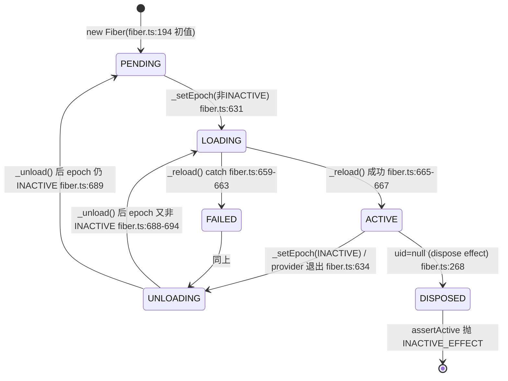

# 01 · Cordis 运行时内部实现(函数级走查)

> 分析对象:[innokria/deepseek-harness](https://github.com/innokria/deepseek-harness) @ `dbbaa4a37`
> 源码面:`vendor/cordis/src/{context,reflect,service,fiber,registry,events,utils}.ts`
> 前置:[第一章第二节](../01-architecture-overview.md)给概念总览,[第十二章第一节](../12-architecture-highlights.md)给 effect 与事件的模式级结论;本篇只做实现级展开。

---

## 第〇节 一句话结论

运行时行为收敛在四个对象上:`Context`(代理 + 作用域)、`Fiber`(插件实例的状态与 effect 集合)、`ReflectService`(服务仓库 + 解析算法)、`EventsService`(监听器表 + 五种派发)。耦合方式是:**`Context` 的属性读被代理截获去查 `Fiber.store`;`Fiber.store` 由 `ReflectService.provide()` 写入并靠 `notify()` 级联唤醒;一切写入都是 `fiber.effect()` 注册的可逆项,卸载时按逆序回放。**

---

## 第一节 Context:代理与三个 trap

### 1.1 构造顺序:代理先于一切

```typescript
// vendor/cordis/src/context.ts:71-84
constructor() {
  this[symbols.isolate] = Object.create(null)
  this[symbols.intercept] = Object.create(null)
  const self = new Proxy<this>(this, ReflectService.handler)
  this.root = self
  this.baseUrl = undefined
  this.fiber = new Fiber(self, {}, Object.create(null), null, () => [])
  this.reflect = new ReflectService(self)
  this.registry = new RegistryService(self)
  this.events = new EventsService(self)
  this.logger = new LoggerService(self)
  this.fiber._disposables.clear()
  return self
}
```

四个可观察事实:`ReflectService.handler`(`reflect.ts:135`)是**静态**的,状态在 `target.reflect.store` / `props`(`reflect.ts:209-211`);根 fiber 以 `runtime = null` 构造(`context.ts:77`),因此属性读走"无 runtime 旁路"、`dispose` 变成 `restart`(`fiber.ts:331`);根 fiber 的 `_disposables` 在末尾清空(`context.ts:82`),根 context 不为自身保留 effect 记录;`Context` 不持有服务实现,`ctx.llm` 这类键不是字段而是代理的解析结果。

### 1.2 作用域三原语

| 原语 | 定义 | 数据结构 | 语义 |
|---|---|---|---|
| `extend(meta)` | `context.ts:99-107` | `Object.create(getTraceable(this, this))` + 逐键 `defineProperty` | 子 context 原型继承父的全部属性;`meta` 作 own property 遮蔽;父带 `symbols.shadow` 时再套一层 |
| `isolate(name, label?)` | `context.ts:121-125` | `Object.create(this[symbols.isolate])` 上写 `shadow[name] = label ?? Symbol(name)` | `name` 在该子树解析到新 label;同 label 两次调用共享作用域 |
| `intercept(name, config)` | `context.ts:139-145` | `Object.create(this[symbols.intercept])` 上写 `intercept[name] = config` | 子树下所有插件的该服务配置合并这份 intercept |

isolate 的真实消费者是 Loader:`loader/src/config/isolate.ts:71-173` 用 `entry.ctx[Context.isolate]` 做 prototype 链 + `swap()` 重写(见 [02](./02-loader-and-composition.md)第四节)。

### 1.3 get trap:服务解析算法本体

```typescript
// vendor/cordis/src/reflect.ts:136-167(节选)
get: (target, prop, ctx: Context) => {
  if (isSpecialProperty(prop)) return Reflect.get(target, prop, ctx)   // ① 白名单直通
  if (Reflect.has(target, prop)) return getTraceable(ctx, Reflect.get(target, prop, ctx))  // ② 自有属性
  const error = new Error(`cannot get property "${prop}" without inject`)
  try {
    const def = target.reflect.props[prop]
    if (def?.type === 'accessor') return def.get.call(ctx, ctx[symbols.receiver], error)  // ③a
    if (!ctx.fiber.runtime) return ctx.reflect.get(prop, false)        // ③b 无 fiber:全局 store 直查
    return ctx.events.waterfall('internal/get', ctx, prop, error, () => {
      const key = target[symbols.isolate][prop]
      let fiber = (ctx[symbols.shadow] as Context ?? ctx).fiber
      while (true) {
        const impl = fiber.store?.[prop]
        if (impl) return getTraceable(ctx, impl.value)
        if (prop in fiber.inject) { error.message = `cannot get required service "${prop}" in inactive context`; throw error }
        if (!fiber.runtime || fiber.parent[symbols.isolate][prop] !== key) throw error
        fiber = fiber.parent.fiber                                     // ← 只向上,不看兄弟
      }
    })
  } catch (e: any) { throw e === error ? enhanceError(e) : e }
}
```

- **`isSpecialProperty`(`reflect.ts:86-91`)是不解析的白名单**:symbol 键、`prototype`、`then`、形如 `0/1/2` 的字符串、`_` 前缀。所以 `ctx[symbols.isolate]` 与 `ctx._x` 永远是普通属性。
- **上溯是 ancestor-only**(`:155-166`):只走 `fiber.parent.fiber`,**不看兄弟分支**——这是 `docs/postmortem/0001` 里 Bug #2 的机制根源(见 [05](./05-plugin-authoring-guide.md)第四节)。
- **`ctx.get(name)` 是另一条路径**:`reflect.get` → `_getImpl`(`:233-243`),按 isolate 符号查全局 store,`strict` 默认 true,即要求 `impl.fiber.state === FiberState.ACTIVE`,否则返回 `undefined` 而不是把一个正在拆卸的服务交回来。
- **两种错误话术对应两种状态**:`without inject` = 该名字不在任何祖先 fiber 的 inject 里(或已走到根);`inactive context` = 声明了 inject 但 provider 尚未 ACTIVE(`:159-162`)。排障时这两句话指向不同结论。
- **整段解析被 `internal/get` waterfall 包住**(`:153`),框架级插件可以劫持服务读取。

### 1.4 set / has 与 mixin

`set`(`:173-197`):特殊属性直通;名字**从未声明为属性**且当前有 runtime → 抛 `cannot set property "x" without provide`;accessor 走自定义 setter(返回 `false` 拒写);否则经 `internal/set` waterfall 转 `reflect.set`。`reflect.set`(`:254-265`)补两条所有权约束:名字未 provide → 抛;provider fiber 不是当前 fiber → 抛 `cannot set property "x" in multiple fibers`。`has`(`:199-205`)只回答"是否已声明",不触发解析。

`ReflectService` 构造末尾做四组 mixin(`reflect.ts:219-222`):`reflect`(get/set/provide/accessor/mixin)、`fiber`(runtime/effect)、`registry`(inject/plugin)、`events`(on/once/parallel/emit/serial/bail/waterfall)。这是 `ctx.on`/`ctx.plugin`/`ctx.effect` 能直接用的原因:`mixin`(`:364-390`)为每个键注册 accessor,get 里 `Reflect.get(service, key, mixin)` 后 `bind`(`:378-380`)。所以 `ctx.on(...)` ≡ `ctx.events.on(...)`——**不是语法糖转发,而是经 accessor 表注册的可撤销属性**,随 fiber 卸载消失。

---

## 第二节 Service:构造即注册

```typescript
// vendor/cordis/src/service.ts:42-59(节选)
constructor(protected ctx: Context, name: string) {
  name ??= this.constructor['provide'] as string
  let self = this
  const tracker: Tracker = { associate: name, property: 'ctx' }
  if (self[symbols.invoke]) self = createCallable(name, joinPrototype(Object.getPrototypeOf(this), Function.prototype), tracker)
  self.ctx = ctx
  self.name = name
  defineProperty(self, symbols.tracker, tracker)
  self.ctx.reflect.provide(name, self, this[symbols.check])
  return self
}
```

四点:**注册发生在构造里**(构造返回即可解析,前提是 fiber ACTIVE);**`check` 是可选可用性谓词**,经 `Service.check`(`service.ts:15`)落到 `Impl.check`(`reflect.ts:124`)并由 `Fiber._checkImpl` 调用(`fiber.ts:601`)——这是"已注册但还不能用"的表达方式,`Loader` 正是这么用的(见 [02](./02-loader-and-composition.md)第四节);**`[Service.invoke]` 让服务可调用**(`ctx.logger('name')` 形态);**必须 `return self`**(`:58`),因为 `new` 的结果可能是 `createCallable` 的可调用包装。

`provide` 本体是一个 effect(`reflect.ts:277-305`):

```typescript
// vendor/cordis/src/reflect.ts:286-303(节选)
this.ctx.root[symbols.isolate][name] ??= Symbol(name)       // 全进程同名服务共享 key
const key = this.ctx[symbols.isolate][name]
const impl: Impl = { name, value, fiber: this.ctx.fiber, check }
if (this.store[key]) throw new Error(`service "${name}" has been registered at <${this.store[key].fiber.name}>`)
this.store[key] = impl
this.ctx.fiber.store![name] = impl
if (this.ctx.fiber.state === FiberState.ACTIVE) this.notify([name])
return async () => {
  delete this.store[key]
  const fibers = this.notify([name])
  await Promise.allSettled(fibers.map(fiber => fiber.await()))
  delete this.ctx.fiber.store![name]      // ensure self access before dependencies cleanup
}
```

- **isolate key 首次在 root 上分配**(`:286`),同名服务默认共享 key,除非被 `isolate()` 改写。
- **重复注册是同 scope 内的硬错误**(`:289-291`),消息点名先占者——"同层挂两个 provider 在加载期失败"的机制。
- **注销顺序不可换**(`:297-303`):先摘全局 store → `notify` 让依赖者 `_refresh`、因缺依赖 `_unload` → **await 它们全部 settle** → 最后删自己的 `fiber.store[name]`,保证依赖者退场时仍能访问自己。

---

## 第三节 Fiber 状态机

### 3.1 状态定义与一处源码细节

```typescript
// vendor/cordis/src/fiber.ts:147-154
export const enum FiberState {
  PENDING,
  LOADING,
  ACTIVE,
  FAILED,
  DISPOSED,
  UNLOADING,
}
```

它是 `const enum`,**没有运行时对象**(打印只见数字);数值顺序是 `PENDING=0 … DISPOSED=4, UNLOADING=5`,与上方 JSDoc(`:139-146`,顺序为 …FAILED → UNLOADING → DISPOSED)不一致。任何 `>=`/`<` 比较状态的代码都是错的,框架自己全部用 `===`。

`_getState()`(`fiber.ts:574-579`)定义"由字段推出的状态",优先级固定:**DISPOSED(`uid === null`)> FAILED(`_error`)> ACTIVE(`_runner.epoch !== INACTIVE`)> PENDING**。`LOADING`/`UNLOADING` 不在这里——它们只能由 `_updateState(() => FiberState.XXX)` 显式给出。

### 3.2 状态转换图


<details><summary>Mermaid 源码</summary>



</details>

### 3.3 依赖齐备判定:`_checkImpl` → `_refresh` → `_setEpoch`

```typescript
// vendor/cordis/src/fiber.ts:597-609
_checkImpl(name: string) {
  const impl = this.ctx.reflect._getImpl(name, true)
  if (!impl) return delete this._store[name]
  try {
    if (impl.check && !impl.check.call(getTraceable(this.ctx, impl.value))) return delete this._store[name]
  } catch (error) { impl.fiber.ctx.logger.error(error); return delete this._store[name] }
  this._store[name] = impl
}
```

`impl.check` 抛错被**收容**并计为"不可用"(`:604-607`),provider 的检查逻辑因此可以放心写断言。

```typescript
// vendor/cordis/src/fiber.ts:611-639
_refresh() {
  let epoch: string | boolean = false
  epoch = ''
  for (const name of Object.keys(this.inject)) {
    const impl = this._store[name]
    if (!impl) { epoch = INACTIVE; break }
    epoch += ':' + impl.fiber.uid
  }
  this._setEpoch(epoch)
}

private _setEpoch(epoch: string) {
  const oldEpoch = this._runner.epoch
  if (epoch === oldEpoch) return
  this._runner.epoch = epoch
  if (this.inertia) return                       // 有在途转换:只记 epoch,不动状态
  this._updateState(() => {
    if (epoch !== INACTIVE && oldEpoch === INACTIVE) { this.inertia = this._reload(); return FiberState.LOADING }
    else { this.inertia = this._unload(); return FiberState.UNLOADING }
  })
}
```

1. **epoch 是"每个依赖的 provider uid"拼接串**:换 provider(uid 变)也算 epoch 变化 → `_unload()` + `_reload()`,依赖的实现被换掉时插件真的重装。
2. **任一 inject 键缺席即 `INACTIVE`**(`:616-619`)——"行序无加载语义"(`packages/bundle/base/cordis.patch.yml:12`)的实现基础。
3. **`if (this.inertia) return`(`:629`)是重入保护**:转换进行中的 fiber 只更新 epoch,由在途转换收尾(`:665-672` / `:688-695`)再决定继续 LOADING 还是转 UNLOADING(vendored 加固之一)。
4. **状态变化会广播**:`_updateState`(`:581-595`)状态真变时 `emit('internal/status', this, oldState)`(`:586`);且只在**跨越 ACTIVE 边界**时(`:589`)找出本 fiber 提供的服务逐个 `notify([name])`(`:590-594`)。

### 3.4 `_reload` / `_unload`

```typescript
// vendor/cordis/src/fiber.ts:646-673(节选)
private async _reload() {
  this.store = { ...this._store }                 // 依赖快照对外可见
  const oldEpoch = this._runner.epoch
  try {
    await Promise.resolve()                       // 微任务检查点:排队中的 disposer 可让本代失效
    if (this._runner.epoch === oldEpoch) {
      this.config = this._resolveConfig(this._config)
      await this._execute(this._runner)
      this._error = undefined
    }
  } catch (reason) { this.ctx.logger.error(reason); this._error = reason; this._runner.epoch = INACTIVE }
  this._updateState(() => {
    if (this._runner.epoch === oldEpoch) { this.inertia = undefined }
    else { this.inertia = this._unload(); return FiberState.UNLOADING }
  })
}
```
- **`await Promise.resolve()`(`:650`)是刻意的检查点**:在此之前排队的一个 disposer 可能已让本代失效,此时不得再执行插件代码。
- **配置解析在依赖就绪之后**(`:655`):`_resolveConfig`(`:641-644`)= `waterfall('internal/config')` + `resolveConfig(runtime, config)`(`:50-62`,Standard Schema 校验)。这是 `!!js` 能"在条目自己的 fiber 里、依赖可用后"求值的机制(见 [02](./02-loader-and-composition.md)第三节)。
- **启动失败不抛出**:落 `_error` 并回到 INACTIVE(`:659-663`),由 `await()`(`:704-710`)重抛——这就是 `ctx.plugin(...)` 的返回值带 `then` 的原因(`registry.ts:331-335`),也是 Loader 的 `Entry._await()`(`loader/src/config/entry.ts:269-275`)能拿到真实激活错误的路径。
- **`_unload`(`:675-696`)** 用 `_disposables.clear()`(返回 **reverse 后的数组**,`utils.ts:27-31`)并发 await,所以发起顺序是逆序。

---

## 第四节 effect 树:注册与逆序回收

### 4.1 形状契约与逆序回收

`_execute`(`:356-400`)接受五种返回值:函数 → 单个 disposer(`:367-368`);`null`/`undefined` → 无 disposer(`:369-370`);thenable → `effect.then(safeCollect)`(`:373-374`);同步 iterable → 逐个 collect(`:375-382`);异步 iterable → await 逐个 collect 且**每轮检查 epoch**(`:390`);其他 → 抛 `TypeError('Invalid effect')`。两个重载(`:415-417`)让返回值既是函数又可 await(`wrapper.then` 在 `:555-559`)。

```typescript
// vendor/cordis/src/fiber.ts:427-442(节选)
const dispose = () => {
  if (disposing) return disposalTask                    // 幂等:第二次调用返回同一 task
  disposing = true
  let task!: void | Promise<void>
  for (const disposable of disposables.splice(0).reverse()) {
    if (task) task = task.then(() => runDisposable(disposable))
    else { const result = runDisposable(disposable); if (isObject(result) && 'then' in result) task = result as any }
  }
  return disposalTask = task
}
```

**fiber 级**(`:676-686`):`this._disposables.clear()` 返回逆序数组 → 逆序发起、`Promise.all` 并发等待、单个失败只 `logger.error` 不阻断其他。于是"插件的生命周期 = 其全部注册的反向回放"落到确切语义:**effect 内部严格逆序串行,effect 之间逆序发起 + 并发等待 + 逐个收容**。

### 4.3 三个加固点与失败路径

1. **UNLOADING 期拒绝新 effect**(`:419-422`):`assertActive()` 后立刻检查 `state === FiberState.UNLOADING`,是则抛 `CordisError('INACTIVE_EFFECT')`,防止清理期注册逃逸出卸载快照。
2. **wrapper 在 `execute` 之前就可见**(`:520` 及注释):重入的 owner 卸载能在插件代码跑起来之前捕获它。
3. **`effectInertia` 弱表**(`:112-117`、`:515`):`runDisposable` 额外 await 该 disposer 的 in-flight 清理,使外层 effect 能加入另一调用者已开始的清理而不重复执行。

`_execute` 同步抛错时,`effect()` 的 catch(`:523-537`)标记 `setupFailed`、置 `runner.epoch = false`、立即 `finalizeDisposal(dispose)` 回收已收集的部分 disposer、`rejectSetup(reason)` 后重抛——半途失败的 effect 不留无人回收的贡献。异步失败由 `task?.catch(...)`(`:545-548`)先尝试 dispose 再 logger 兜底,避免 unhandled rejection。

---

## 第五节 注册表与 reflect

### 5.1 两张表与 `plugin()`

| 对象 | 表 | 键 | 职责 |
|---|---|---|---|
| `RegistryService`(`registry.ts:195`) | `_internal: Map<Function, Plugin.Runtime>`(`:197`) | 插件回调函数 | 哪些插件被挂过、各有几棵 fiber |
| `ReflectService`(`reflect.ts:133`) | `store: Dict<Impl, symbol>`(`:209`) | isolate 符号 | 某服务名当前由哪棵 fiber 提供、值是什么 |

`Plugin.Runtime`(`registry.ts:136-145`)= `{ name, callback, fibers: DisposableList<Fiber>, Config }`——**同一插件回调的所有 fiber 共享**;`ctx.plugin(samePlugin)` 两次 = 两个 fiber、一个 runtime。

```typescript
// vendor/cordis/src/registry.ts:316-336(节选)
plugin(plugin: Plugin, config?: any, getOuterStack = buildOuterStack()) {
  const callback = this.resolve(plugin)
  if (!callback) throw new Error('invalid plugin, expect function or object with an "apply" method, received ' + typeof plugin)
  this.ctx.fiber.assertActive()
  let runtime = this._internal.get(callback)
  if (!runtime) {
    let name = plugin.name
    if (name === 'apply') name = undefined                       // 对象插件:apply 的函数名不算插件名
    runtime = { name, callback, fibers: new DisposableList(), Config: plugin.Config }
    this._internal.set(callback, runtime)
  }
  const fiber = new Fiber(this.ctx, config, Inject.resolve(plugin.inject), runtime, getOuterStack)
  const wrapped = Object.create(fiber) as Fiber & PromiseLike<Fiber>
  wrapped.then = (onFulfilled, onRejected) => fiber.await().then(onFulfilled, onRejected)
  return wrapped
}
```

`resolve()`(`:222-228`)只认**函数**或**带 `apply` 方法的对象**,并用 `try/catch` 包住 `plugin.apply` 的读取(`:224`),getter 抛错时返回 `undefined` 而不是崩。

### 5.2 `notify()`:服务变动如何级联

```typescript
// vendor/cordis/src/reflect.ts:314-336(节选)
notify(names: string[], filter = (ctx, name) => ctx[symbols.isolate][name] === this.ctx[symbols.isolate][name]) {
  const fibers: Fiber[] = []
  for (const runtime of this.ctx.registry.values()) {
    for (const fiber of runtime.fibers) {
      let hasUpdate = false
      for (const name of names) {
        if (!(name in fiber.inject)) continue
        if (!filter(fiber.ctx, name)) continue
        hasUpdate = true
        fiber._checkImpl(name)
      }
      if (!hasUpdate) continue
      fiber._refresh()
      fibers.push(fiber)
    }
  }
  for (const name of names) {                       // per-name 过滤载体:监听器只见自己 scope
    const self: Context = Object.create(this.ctx)
    self[symbols.filter] = (target: Context) => filter(target, name)
    this.ctx.events.emit(self, 'internal/service', name, this._getImpl(name, false)?.value)
  }
  return fibers
}
```

- **遍历 registry 的 runtime,不是"所有 ctx"**:fiber 是 registry 唯一登记的插件实例来源;**根 fiber 不属于任何 runtime,不会被 notify 命中**——所以根 context 上直接 `provide` 的服务(`boot()` 里的 `dshHomePath`,`packages/boot/app-boot/src/index.ts:800`)不参与依赖唤醒。
- **只对声明了该服务的 fiber 做 `_checkImpl` + `_refresh`**(`:320-326`),没声明的跳过——inject 声明同时是一次性能剪枝。
- **`internal/service` 带 per-name 过滤载体**(`:330-334`):临时 `Object.create(this.ctx)` 挂 `symbols.filter`,监听器只收到自己 scope 的变动;消费者是 `agent-presets` 与 `gateway`(`docs/event-producer-consumer.md:85`)。

### 5.3 fiber 构造的发布顺序

`fiber.ts:222-333` 的次序是刻意的:先 `uid` 与 `ctx = parent.extend({ fiber: this })`(`:235-236`)→ inject 覆写 `ctx[Context.intercept]`(`:238-245`)→ `_runner`(`:247-263`)→ `dispose = parent.fiber.effect(...)`(`:265-297`)→ **`emit('internal/plugin', this)`(`:302`)**→ 逐个 `_checkImpl` + `_refresh()`(`:314-319`)。

`:300-301` 的注释给出理由:"Publish only after the parent owns a fully assigned disposer. A synchronous observer may dispose either this fiber or its parent." 并且 **`internal/plugin` 的监听者看到 PENDING 视图、且可以修改 `fiber.inject`**——Loader 正是这么做的(`loader/src/index.ts:122`),所以依赖判定必须在发布之后。

---

## 第六节 五种事件分发

### 6.1 公共骨架

```typescript
// vendor/cordis/src/events.ts:165-175
dispatch(type: string, args: any[]) {
  const thisArg = typeof args[0] === 'object' || typeof args[0] === 'function' ? args.shift() : null
  const name: string = args.shift()
  if (!name.startsWith('internal/')) this.emit('internal/dispatch', type, name, args, thisArg)
  const filter = thisArg?.[Context.filter]
  return (this._hooks[name] || [])
    .filter(hook => hook.global || !filter || filter.call(thisArg, hook.ctx))
    .map(hook => hook.callback.bind(thisArg))
}
```

`args` 被就地 `shift` 两次(thisArg + name),返回的已是纯载荷;**`internal/` 前缀事件不广播 `internal/dispatch`**(`:168-170`)以免诊断事件自递归;scope 过滤靠 `thisArg[Context.filter]`(`:171-173`),`hook.global` 为真则跳过。

### 6.2 五种模式的实现与语义差异

```typescript
// vendor/cordis/src/events.ts:183-243(节选)
async parallel(...args: any[]) {
  const results = await Promise.allSettled(this.dispatch('emit', args).map(async cb => cb(...args)))
  const errors = results.filter((r): r is PromiseRejectedResult => r.status === 'rejected')
  if (errors.length) throw new AggregateError(errors.map(error => error.reason))
}
emit(...args: any[]) { this.dispatch('emit', args).map(cb => cb(...args)) }
waterfall(...args: any[]) {
  const cbs = this.dispatch('waterfall', args)
  const inner = args.pop()
  const next = () => { const cb = cbs.shift() ?? inner; return cb(...args) }
  args.push(next)
  return next()
}
```

`serial`(`:204-209`)与 `bail`(`:217-222`)是同构的 `for` 循环,区别只在 `await cb(...args)` 与 `cb(...args)`,两者都在 `isBailed(result)` 时 `return result`。

| 模式 | 等待 | 短路 | 返回值 | 抛错行为 | 内核典型用法 |
|---|---|---|---|---|---|
| `emit` | **不等待**(Promise 被丢弃) | 无 | `void` | 同步抛错冒泡给派发方;异步 rejection 无人接管 | `session/event`、`tools/result` |
| `parallel` | `allSettled` 全部 | 无 | `Promise<void>` | **任一 rejected 即抛 `AggregateError`**(`:186`),其余仍跑完 | `session/flush`、`hmr/config-update-failed` |
| `serial` | 逐个 `await` | 首个 bail 值 | 首个 bail 值 | 抛错即中止后续 | `agent/turn-stopping` |
| `bail` | **完全同步** | 首个 bail 值 | 首个 bail 值 | 抛错即中止 | `internal/listener` |
| `waterfall` | 由监听器决定 | 不调 `next()` 即中断**含内建行为的整条链** | 最外层监听器返回值 | 抛错即中止 | `llm/stream`、`agent/pre-step`、`tools/pre-execute` |

四个易忽略点:**`isBailed`(`:13-15`)** 判据是 `value !== null && value !== false && value !== undefined`——返回 `0` 或 `''` **算 bail**;**`parallel` 内部调用 `dispatch('emit', ...)`**(`:184`),所以 `internal/dispatch` 里 parallel 的 mode 是 `'emit'`;**`waterfall` 的 `next()` 可被多次调用**(`:237-240`),第二次时 `cbs` 已空会直接执行 `inner`,即内建行为跑两遍;**监听器顺序 = `_hooks[name]` 数组顺序**,`register()`(`:254-260`)按 `prepend ? 'unshift' : 'push'` 插入,`prepend: true` 者在外层。

### 6.3 注册、处置与 `internal/listener` 挂载点

`register()`(`events.ts:254-260`)把监听器注册成一个 effect:`hooks[options.prepend ? 'unshift' : 'push']({ ctx: this.ctx, callback, ...options })`,disposer 是 `() => this.unregister(hooks, callback)`,label 形如 `ctx.on("session/event")`(`:300`)。`unregister`(`:269-275`)按 **callback 引用相等**删除;`once()`(`:312-318`)包一层 wrapper 并在首次调用时 dispose 自己。`on()` 里 `listener = this.ctx.reflect.bind(listener)`(`:295`);`bail(this.ctx, 'internal/listener', ...)`(`:296`)允许 `internal/listener` 返回非空以**替换注册行为本身**——框架用它实现 `internal/update` 的私有链:

```typescript
// vendor/cordis/src/events.ts:140-146
this.on('internal/listener', function (this: Context, name, listener, options: EventOptions) {
  if (name === 'internal/update' && !options.global) {
    const hooks = this.fiber._hooks['internal/update'] ??= new DisposableList()
    return hooks[options.prepend ? 'unshift' : 'push'](listener)   // 返回 disposer ⇒ on() 短路返回它
  }
})
```

它由 `:148-155` 的全局监听器串进公共 waterfall。**效果**:`ctx.on('internal/update', ...)` 只在本 fiber 的 `fiber.update()` 时触发;要观察所有 fiber 必须 `{ global: true }`。

### 6.4 九个内建事件

| 事件 | 模式 | 生产者 | 主要消费者 |
|---|---|---|---|
| `internal/plugin` | emit | `fiber.ts:302`(创建)、`:269`(处置) | Loader(`loader/src/index.ts:117`)、`inspector`、`modules`、`lsp-stdio` |
| `internal/status` | emit | `fiber.ts:586` | `agent`、`inspector` |
| `internal/config` | waterfall | `fiber.ts:642` | Loader 的 `!!js` 插值(`loader/src/index.ts:92`) |
| `internal/update` | waterfall | `fiber.ts:748` | Loader 配置写回(`loader/src/index.ts:103,111`)、Group、Include |
| `internal/get` / `internal/set` | waterfall | `reflect.ts:153`、`:191` | 无内建消费者,留作框架级扩展 |
| `internal/service` / `internal/dispatch` | emit | `reflect.ts:333`、`events.ts:169` | `agent-presets`、`gateway`;各包 invariant(25 处,`docs/event-producer-consumer.md:83`) |
| `internal/listener` | bail | `events.ts:296` | `EventsService` 自身(`:140`) |

---

## 关键文件/符号索引表

| 符号 | 位置 | 职责 |
|---|---|---|
| `Context` 类 / 构造 / `extend` / `isolate` / `intercept` | `vendor/cordis/src/context.ts:42`、`:71-84`、`:99-107`、`:121-125`、`:139-145` | 代理容器;代理创建(`:74`)、根 fiber(`:77`)、清空根 disposables(`:82`);作用域三原语 |
| `handler.get` / `set` / `has` | `reflect.ts:136-171`、`:173-197`、`:199-205` | 三个 trap;祖先上溯在 `:155-166`;解析错误话术 `:144`/`:160` |
| `store` / `props` / mixin 构造 / `get` / `_getImpl` | `reflect.ts:209-223`、`:233-243` | 服务实现表 / 属性表 / `ctx.on` 等转发属性 / `ctx.get(name)` 路径 |
| `provide` / `notify` / `accessor` / `mixin` | `reflect.ts:277-305`、`:314-336`、`:345-390` | 服务注册 effect 与注销顺序;依赖级联唤醒;计算属性与 mixin |
| `Service` 类 / 构造 / `resolveConfig` | `service.ts:11`、`:42-59`、`:86-102` | 构造即注册(`:57`)、callable(`:51`)、返回 self(`:58`);intercept 合并 |
| `Inject` / `Plugin.Base` / `Plugin.Runtime` / `RegistryService.plugin` / `delete` / `inject` | `registry.ts:19`、`:71-88`、`:100-111`、`:136-145`、`:316-336`、`:258-267`、`:300-302` | 依赖声明归一化;插件元数据;共享运行时记录;fiber 创建入口;插件级处置;`ctx.inject` 落点 |
| `FiberState` / `Fiber` 字段 / 构造 | `fiber.ts:147-154`、`:184-210`、`:222-333` | 六状态;字段;发布顺序与依赖判定时机 |
| `Fiber._execute` / `effect` | `fiber.ts:356-400`、`:415-561` | effect 五种返回值;逆序 dispose(`:431`)、UNLOADING 拒注册(`:420`)、wrapper/inertia |
| `_getState` / `_updateState` / `_checkImpl` / `_refresh` / `_setEpoch` | `fiber.ts:574-639` | 状态推导优先级;`internal/status` + ACTIVE 边界 notify;依赖判定与转换触发 |
| `_reload` / `_unload` / `await` / `restart` | `fiber.ts:646-710`、`:718-723` | 两个异步转换、错误重抛、重启 |
| `resolveConfig` / `ValidationError` / `DisposableList.clear` | `fiber.ts:19-62`、`vendor/cordis/src/utils.ts:27-31` | Standard Schema 校验落点;逆序 clear 实现 |
| `EventsService.dispatch` / 五种模式 / `isBailed` | `vendor/cordis/src/events.ts:165-175`、`:183-243`、`:13-15` | 监听器解析 + scope 过滤;五种分发;bail 判据 |
| `on` / `once` / `register` / `Events` 接口 | `events.ts:254-318`、`:329-352` | 监听器即 effect;九个 `internal/*` 内建事件契约;`internal/*` 消费者清单见 `docs/event-producer-consumer.md:83-86` |

---

> 下一篇:[02 · Loader、Include 与组合层](./02-loader-and-composition.md)——本篇的 fiber/epoch 机制在 Loader 的条目树上如何被驱动。
