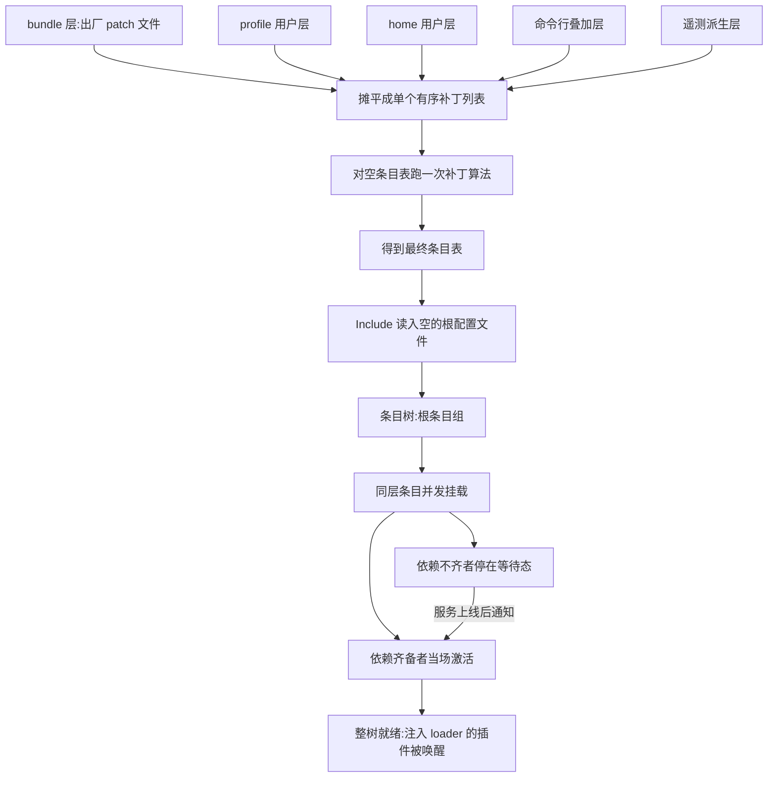
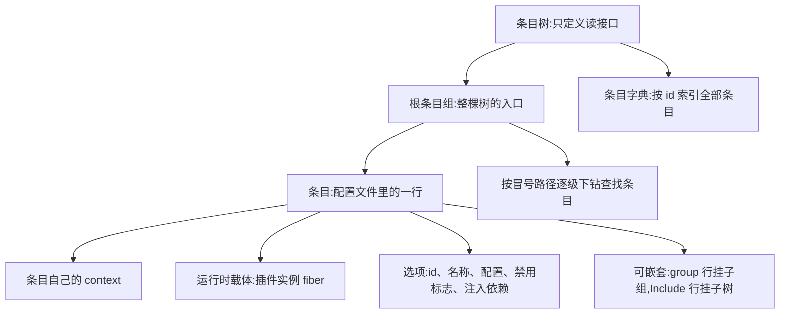
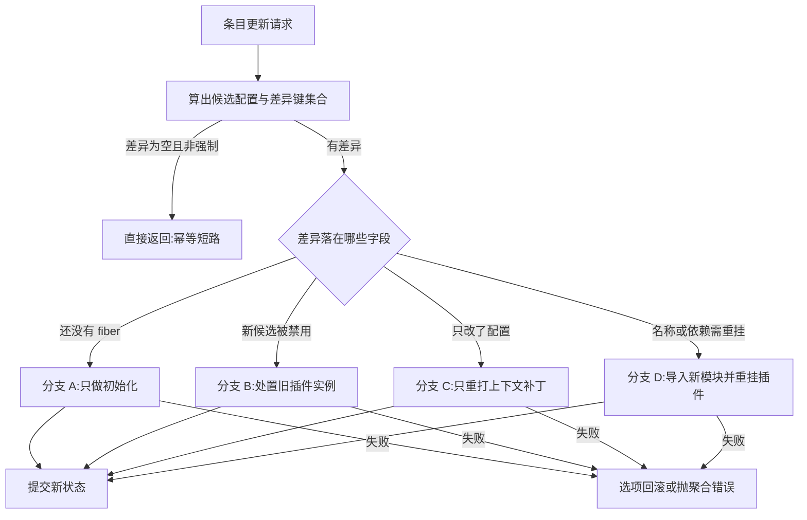
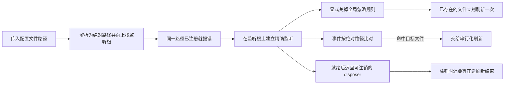
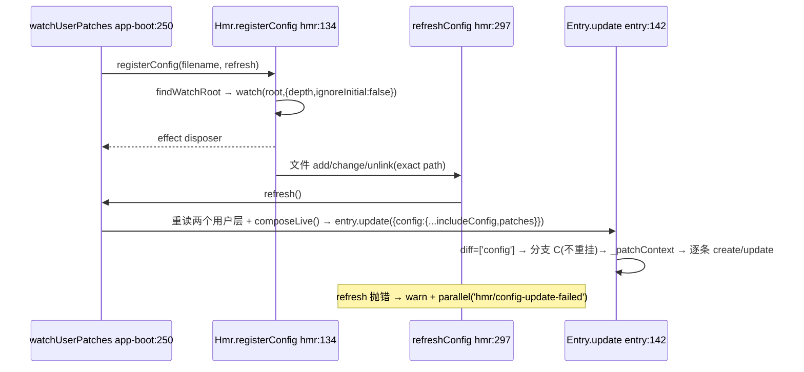
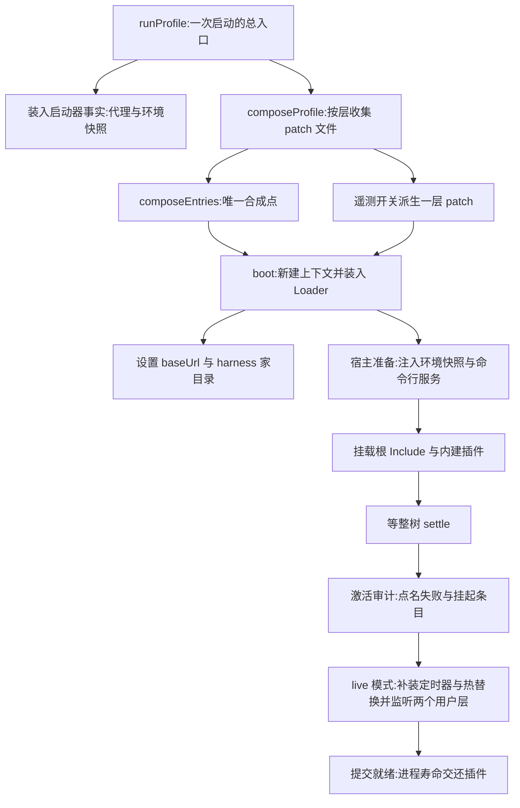

# 02 · Loader、Include 与组合层

> 分析对象:[innokria/deepseek-harness](https://github.com/innokria/deepseek-harness) @ `dbbaa4a37`
> 源码面:`vendor/loader/src/**`、`vendor/include/src/index.ts`、`vendor/hmr/src/index.ts`、`packages/boot/app-boot/src/{index,profile}.ts`、`apps/cli/src/profile-boot.ts`、`packages/bundle/*/cordis.patch.yml`
> 前置:[第一章第三节](../01-architecture-overview.md)给启动链全貌;[01](./01-cordis-runtime-internals.md)的 fiber/epoch 机制是本篇的运行时底座。

---

## 第〇节 一句话结论

组合层由三件事构成,彼此解耦:

1. **合成是纯数据操作**:三层 patch 被 `flat()` 成一个列表,对**空条目表**做一次 `applyEntryPatches`(`packages/boot/app-boot/src/profile.ts:841-848`)——没有代码执行,没有产物固化。
2. **挂载是并发且由依赖驱动的**:`EntryGroup.update` 对同层所有条目 `Promise.allSettled(config.map(create))`(`vendor/loader/src/config/group.ts:71`);`inject` 不齐者停 PENDING,由 `ReflectService.notify` 级联唤醒。**行序不产生加载语义**。
3. **改动是事务性的**:条目级、组级、文件级、模块级各有一层回滚;失败一律 fail-loud,绝不静默降级。

读之前先对齐六个词,后面反复用到。**Cordis** 是 dsh 底下那套插件框架(被源码级 vendor 进仓库);**fiber** 是一个插件实例的运行时载体,拥有自己的 context 与状态机;**effect** 是一次可逆注册,卸载时按逆序自动回收;**epoch** 是 fiber 用来判断"我依赖的服务这一代是否齐备"的标记,少一个就置为 INACTIVE;**HMR** 是模块热替换,改文件不重启就换掉插件实现;**patch 层叠** 指 bundle、profile、home、命令行各写一层配置,按顺序叠成一棵条目树的组合方式。

这条链路是本篇的总纲,先看清"谁在什么时候动了什么",再往下读细节。前半段是**纯数据合成**:五个来源的 patch 被摊平成一个有序列表,对一张空条目表跑一次补丁算法,全程不执行任何用户代码,也不把结果固化到磁盘;后半段才是**把数据变成活插件**:同层条目一起发起,服务依赖先齐备的当场激活,不齐的停在等待态,等某个 provider 上线时被级联唤醒。也就是说,行序在这里不产生加载语义;任何一步失败都整层回滚并带栈报错,不会留下一棵半挂的树。


<details><summary>Mermaid 源码</summary>



</details>

| 阶段 | 做了什么 | 关键调用(文件:行) |
|---|---|---|
| 收集 bundle 层 | 从 bundle 包声明的 patch 文件读出补丁行 | `packages/boot/app-boot/src/profile.ts:787-797` |
| 收集 home 层与叠加层 | home 级 patch、命令行 `--patch` 依次入列,遥测开关再派生一层追加在后 | `apps/cli/src/profile-boot.ts:231-242` |
| 摊平 | 五层补丁被 `flat()` 成一个有序列表,列表顺序就是层叠顺序 | `packages/boot/app-boot/src/profile.ts:841-848` |
| 合成 | 对空条目表 `[]` 跑补丁算法;先 `structuredClone` 脱离调用方缓存,再顺序应用每个 patch | `packages/boot/app-boot/src/profile.ts:841-848`、`vendor/include/src/index.ts:58-128` |
| 产出 | 得到 `EntryOptions[]`——纯数据,没有任何代码被执行 | `vendor/include/src/index.ts:110-124` |
| 锚定 | Include 读入始终为空的根 `cordis.yml`,它只用于提供 `baseUrl` 这个真实文件锚点 | `apps/cli/src/profile-boot.ts:83-91`、`packages/boot/app-boot/src/index.ts:799` |
| 建树 | Include 把补丁列表应用到根条目组,得到 `EntryTree.root` | `vendor/include/src/index.ts:174-214`、`:316` |
| 并发挂载 | 同层所有条目一起 `create()`,用 `Promise.allSettled` 收齐结果 | `vendor/loader/src/config/group.ts:71` |
| 条目启动 | 每个条目导入插件模块、按差异打上下文补丁、注册插件、建立 fiber | `vendor/loader/src/config/entry.ts:291-302` |
| 依赖判定 | 注入服务不齐的 fiber 停在 PENDING,且不阻塞同层其他条目 | `vendor/cordis/src/fiber.ts:611-623` |
| 级联唤醒 | 服务上线触发 `notify`,等待中的 fiber 重算 epoch 并激活 | `vendor/loader/src/config/group.ts:71-84` |
| 整树收敛 | 等全部条目任务与 fiber settle,再唤醒注入 `loader` 的插件 | `vendor/loader/src/config/tree.ts:46-64` |
| 失败回滚 | 新增行逆序移除、原有行按原序重建;启动期失败先处置半成品上下文再抛错 | `vendor/loader/src/config/group.ts:85-105`、`packages/boot/app-boot/src/index.ts:816-833` |

<details><summary>原图</summary>

```text
 bundle 层  profile 层  home 层  --patch 层  telemetry 派生层
     └──────────┴─────────┴─────────┴─────────────┘  flat()
                          ▼
   applyEntryPatches([], patches, warn)  ← 唯一合成点(纯函数,从 structuredClone 开始)
                          ▼ EntryOptions[]
   Include(空根 cordis.yml) ──► EntryTree.root : EntryGroup
                          ▼ Promise.allSettled(层内所有 entry.create())
   每个 Entry: import → _patchContext → registry.plugin → fiber.await
                          ▼ fiber PENDING ──(服务就绪 notify)──► ACTIVE
```

</details>

---

## 第一节 三层职责与空根

| 层 | 载体 | 解析代码 |
|---|---|---|
| bundle 层 | `packages/bundle/*/cordis.patch.yml`,由 bundle 的 `package.json` 里 `dsh.bundle.patch` 声明 | `packages/boot/app-boot/src/profile.ts:787-792` |
| profile 用户层 | `$DSH_HOME/profiles/<name>/cordis.patch.yml`(`PROFILE_PATCH_FILENAME`,`profile.ts:45`) | `profile.ts:794-797` |
| home 用户层 | `$DSH_HOME/cordis.patch.yml`(`homePatchPath()`,`apps/cli/src/profile-boot.ts:73`) | `profile-boot.ts:233` |
| `--patch` 叠加层 | 任意路径,argv 顺序;遥测派生 patch 追加在其后(`:240-242`) | `profile-boot.ts:234` |

**根 `cordis.yml` 是空的,且每次启动重写**(`profile-boot.ts:83-91` 定义 `PROFILE_ROOT_CONFIG`,`:190` 无条件写出)。它存在只是给 Loader 一个真实文件锚定 `baseUrl`(`boot()` 里 `ctx.baseUrl = pathToFileURL(dirname(absoluteConfigPath)).href + '/'`,`packages/boot/app-boot/src/index.ts:799`)。把组合结果固化进该文件是不允许的:整个组合都是 patch 层,根文件必须保持空,否则 Loader 的树写回会把某一代合成结果变成下一代的"默认值"。

profile 清单决定 bundle 列表与重载模式(`profile.ts:776-793`):`dsh.profile.patchReload` 只接受 `'live' | 'startup'`;被 `bundles` 列名却没有 `dsh.bundle` 字段的包**启动即失败**——"naming a bundle-less package as a layer is a misconfiguration, not 'no patches'";每个 bundle 的 patch 路径由 `join(packageDir, declared)` 拼出并当场 `loadOverlayPatches` 解析。

---

## 第二节 合成算法:一次 `applyEntryPatches`

```typescript
// packages/boot/app-boot/src/profile.ts:841-848
export function composeEntries(
  layers: readonly PatchOptions[][], warn: (message: string) => void = () => {},
): EntryOptions[] {
  return applyEntryPatches([], structuredClone(layers.flat()), (message: string, ...args: unknown[]) => {
    let index = 0
    warn(message.replace(/%C/g, () => JSON.stringify(args[index++])))
  })
}
```

**起点是 `[]`**:所有层被 `flat()` 成一个 patch 列表,所以"bundle 层"在数据上只是一批 `insert` 行(见 `packages/bundle/base/cordis.patch.yml:15` 的顶层 `- insert:`)。这里的 `structuredClone` 保护调用方缓存,`applyEntryPatches` 内部还会再 clone 一次(`vendor/include/src/index.ts:63`);原因写在 `apps/cli/src/profile-boot.ts:323-327`:

> Fresh clones per generation: the include pushes `insert` rows into the mounted tree BY REFERENCE and later id-targeted patches mutate those objects in place. Reusing one parsed patch object across applications would bake a user override into the bundle's in-memory insert row, so removing the override could never revert the row to the bundle default.

算法本体(`vendor/include/src/index.ts:58-128`)的四个关键行:

```typescript
// vendor/include/src/index.ts:63,71,82-101,110-124(摘句)
data = structuredClone(data)                                  // 永不变更输入,且总是脱离输入
if (entry.group && Array.isArray(entry.config)) buildMap(entry.config)   // 递归索引 group 的行
if (insert) {
  if (id) {
    const target = entryMap.get(id)
    if (!target) { warn('patch insert: entry %C not found', id); continue }
    if (!target.group) { warn('patch insert: entry %C is not a group', id); continue }
    target.config.push(...insert)
  } else { data.push(...insert) }                             // 无 id:追加顶层
  buildMap(insert)                                            // 本 patch 插入的行立即入索引
  continue
}
if (!id) { warn('patch: id is required for non-insert patches'); continue }
const target = entryMap.get(id)
if (!target) { warn('patch: entry %C not found', id); continue }
if (name && name !== target.name) { warn('patch: name mismatch ...'); continue }
for (const [key, value] of Object.entries(overrides)) { if (key === 'id') continue; target[key] = value }
```

四条会被踩到的语义:

1. **`insert` 无 id ⇒ 追加顶层;有 id ⇒ 目标必须是 group**(`:82-92`),否则告警跳过。
2. **插入的行立即入索引**(`:101`),所以同一列表里靠后的 patch 能配置/禁用靠前 patch 刚插入的行——层与层因此可以互相引用。
3. **非 insert patch 是整字段替换,不是深合并**(`:121-124`)。`packages/bundle/base/cordis.patch.yml:6-10` 明说:"A patch replaces the targeted row's whole `config` rather than merging into it, so a row whose value differs by mode does NOT live here"。
4. **命不中只告警并跳过**(`:83-85`、`:110-114`),告警走 `ctx.root.logger?.('loader').warn`(`include/src/index.ts:268-271`)。

合成与真正挂载用**同一个函数**(`Include._apply` → `applyPatches` → `applyEntryPatches`,`include/src/index.ts:316`),所以 `dsh --profile web --dump-config` 与实际挂载不会漂移。

---

## 第三节 Include 与 `!!js` 求值边界

### 3.1 文件型条目树

`Include` 继承 `EntryTree`,只注入 `loader` 一个服务(vendor/include/src/index.ts:174-175)。它的构造函数做四件事(:194-214):先把 `config.path` 相对 `ctx.baseUrl` 解析成绝对 `filename`;再校验扩展名属于 `.json/.yaml/.yml`,不属于就抛 `extension "<ext>" not supported`;然后把 `this.ctx.baseUrl` **切到配置文件所在目录**(`new URL('.', pathToFileURL(this.filename)).href`),让子树里的相对 specifier 相对配置文件解析;最后注册 `internal/update` 监听,经 `enqueue` 串行地把新 patches 重应用到 `root`。

`[Service.init]`(`:273-289`)是激活过程:**先读文件,ENOENT 且有 `initial` 就写初值再读**(`:275-285`),然后 `yield () => this.stop()`(`:287`,登记卸载),最后 `await this.apply(candidate)`(`:288`)。

### 3.2 `!!js` 的成立范围

方言在 `entryListSchema`(`include/src/index.ts:9-23`)里定义:`!!js` 标量**往返为表达式节点** `{ __jsExpr: string }`。求值由 Loader 的 `internal/config` 监听器统一驱动(`vendor/loader/src/index.ts:92-101`):先 `next()` 拿配置,若该 fiber 不属于任何 entry 或是"树载体"(Group/Include,由 `plugin?.[EntryGroup.key]` 判定)**原样返回**,否则 `return interpolate(this.ctx, config)`(`:100`)。求值器是 `with` 包一层的 `new Function`(`vendor/loader/src/config/utils.ts:5-9`)。于是边界非常明确:

| 位置 | 是否求值 | 证据 |
|---|---|---|
| 行 `config` 内的标量 | ✅ 作用域是该条目自己的 `ctx` | `loader/src/index.ts:100` |
| 行 `disabled` | ✅ 但走另一条路径:`Entry.disabledOf` 在**每次挂载判定**时求值 | `loader/src/config/entry.ts:104-108` |
| `group` 行(或 Include)的 `config` | ❌ 保持字面量 | `loader/src/index.ts:96-99`;`include/src/index.ts:178-182` |
| `name`/`id`/`inject`/`isolate` 等元数据 | ❌ 保持字面量 | `docs/cordis-tutorial/05-config.md:80` |

`disabledOf`(`entry.ts:100-108`)的 JSDoc 点出关键:"The raw node stays in the options, so write-back keeps the form." **原始表达式节点保留在 options 里**,所以 `tree.write()` 不会把求值结果固化——这是 patch 层的可逆性前提。

### 3.3 写回与 apply 串行化

`Include.write()`(`:371-374`)先 `emit('loader/config-update')` 再调度 `writeFile`(`:344-350`,`setTimeout(...,0)` 合并同轮多次写);`_writeFile`(`:323-342`)写 `filename + '.tmp'` 后 `rename`,对 `EACCES`/`EBUSY`/`EPERM` 最多重试 10 次(`WRITE_RETRY_LIMIT = 10`、`WRITE_RETRY_DELAY_MS = 50`,`:35-41`)。apply 侧必须串行,原因在 `enqueue` 的注释里(`:216-224`):

> The group's transactional `update` is not reentrant: two concurrent applies (the init apply racing an HMR-triggered refresh from the watcher's initial scan) interleave create and rollback on the same entries and strand the include fiber without settling, so every apply path funnels through this queue.

```typescript
// vendor/include/src/index.ts:225-229
private enqueue<T>(task: () => Promise<T>): Promise<T> {
  const run = this.applyQueue.then(task, task)
  this.applyQueue = run.then(() => {}, () => {})
  return run
}
```

`refresh()`(`:301-309`)**把读也放进队列**("Read inside the queue so the changed-content check compares against the predecessor's committed state, not a mid-apply snapshot")。

---

## 第四节 条目树与依赖序并发激活

### 4.1 树结构

条目树就是"配置文件里那些行"在内存里的样子:树本身只定义读的接口(枚举、按 id 查找),真正的落盘写回交给子类(CLI 场景下是 Include)。每个条目是一个独立单元,拥有自己的 context 和可选的三样东西——运行时载体 fiber、嵌套子组、嵌套子树,所以同一棵树可以同时容纳 group 行与"另一个配置文件"构成的子树。


<details><summary>Mermaid 源码</summary>



</details>

| 阶段 | 做了什么 | 关键调用(文件:行) |
|---|---|---|
| 抽象基类 | 条目树只声明接口,持久化与写回由子类提供 | `vendor/loader/src/config/tree.ts:7` |
| 层级分隔符 | 固定用 `:` 表示条目 id 的层级 | `tree.ts:8` |
| 继承 context | 树把 `baseUrl` 扩展进自己的 context,让相对 specifier 可解析 | `tree.ts:16` |
| 根节点 | 根条目组是整棵树的入口,所有顶层行挂在它下面 | `tree.ts:17` |
| 条目存储 | 以 id 为键的条目字典,供快速定位 | `tree.ts:13` |
| 条目身份 | 条目 id 可含 `:`,写成从根出发的路径 | `entry.ts:52`、`:75-81` |
| 条目 context | 每个条目扩展出自己的 context,并把 `Entry.key` 指回条目自身 | `entry.ts:67` |
| 运行时载体 | 条目持有一个 fiber,即它的插件实例 | `entry.ts:56` |
| 嵌套形态 | group 行持子条目组,Include 行持子树 | `entry.ts:60-61` |
| 路径解析 | 按 `:` 拆分 id,沿子树逐级下钻 | `tree.ts:76-87` |

<details><summary>原图</summary>

```text
EntryTree(抽象,write() 由子类提供)   tree.ts:7
├─ ctx = ctx.extend({ baseUrl }) :16   ├─ root: EntryGroup :17   └─ store: Dict<Entry> :13
   Entry(entry.ts:52;id 可含 ':' 路径 :75-81)
   ├─ parent: EntryGroup   ├─ options: {id,name,config,group,disabled,inject}
   ├─ fiber? :56   ├─ subgroup?(group 行) :60   └─ subtree?(Include 行) :61
```

</details>

`Entry.ctx = loader.ctx.extend({ [Entry.key]: this })`(`entry.ts:67`)——**每个条目有自己的 context**;`EntryTree.sep = ':'`(`tree.ts:8`),`Entry.id` 会拼上祖先 id(`entry.ts:75-81`),`resolve(id)` 按 `:` 拆分沿 `subtree` 下钻(`tree.ts:76-87`)。

### 4.2 并发挂载与依赖序

`EntryGroup.update`(`group.ts:59-106`)先做两件事:对每条目 `ensureId` 并在挂载前拒绝**重复 id**(`:62-66`),再用 `oldMap`/`newMap` 记录新旧条目集。随后:

```typescript
// vendor/loader/src/config/group.ts:71-84(节选)
const outcomes = await Promise.allSettled(config.map(options => this.create(options)))
// Disposal owns termination: sibling starts can still be settling after
// the containing tree has gone away, but their failures no longer
// describe a live update to roll back.
if (this.ctx.fiber.uid === null) return
const failures = outcomes.filter(...rejected).map(o => o.reason)
if (failures.length === 1) throw failures[0]
if (failures.length > 1) throw new AggregateError(failures, 'loader entries failed to apply')
for (const id of Object.keys(oldMap)) { if (!newMap[id]) await this.remove(id, true) }
this.data = config
```

**"依赖序激活"不是这里排序排出来的**。同层条目确实是一起发起的:`config.map(create)` 对每个条目并行调用,而每个条目的挂载都是一次 `create` 触发的 `entry.update(options, true, true)`(group.ts:30),它走无 fiber 分支(entry.ts:168-179)依次做 `init()` 与 `_start()`,后者调用 `ctx.registry.plugin(...)` 并 `await fiber.await()`(entry.ts:291-302)。关键在 `fiber.await()` 等的是 `inertia` 清空,而**依赖不齐的 fiber 根本没进入 `_reload`,`inertia` 是 `undefined`,`await()` 立即返回**,于是它停在 PENDING,却不拖住同层其他人。于是结果分成两类:依赖已满足的当场进入 ACTIVE;依赖未满足的停在 PENDING,并让 `init()` 就此返回;等后续 provider 上线,一次 `notify` 会沿着 `_refresh` → `_setEpoch` → `_reload` 把它推到 ACTIVE。

整树就绪由 `EntryTree.await()`(`tree.ts:46-64`)收敛:循环条件是 `getTasks()`(收集 `entry._initTask || entry.fiber?.inertia`,`:36-40`)为空且所有 `entry._await()` 成功;`_await()`(`entry.ts:269-275`)把 fiber 错误包成 `failed to apply loader entry <id> (<name>)`;多个失败合成 `AggregateError(failures, 'loader fibers failed')`。循环尾部那句 `this.ctx.reflect.notify(['loader'])`(`:61`)是**关键一步**:它重新唤醒所有 inject 了 `loader` 的 fiber——那是"等整棵树就绪"的插件的挂载信号。

### 4.3 依赖门:Loader 自己的 `check`

```typescript
// vendor/loader/src/index.ts:166-170
[Service.check]() {
  const config: Loader.Intercept = Service.prototype[Service.resolveConfig].call(this)
  if (config.await && this.getTasks().length) return false
  return true
}
```

用法是条目上写 `inject: { loader: { await: true } }`。`Service.check` 是**可用性谓词**(见 [01](./01-cordis-runtime-internals.md)第二节),返回 `false` 时 `Fiber._checkImpl` 不把 `loader` 记入 `_store`(`fiber.ts:601-603`),该 fiber 保持 PENDING——这是"服务已注册但尚不可用"的表达范式。

### 4.4 `internal/plugin` 上的七个 case

Loader 用 `internal/plugin` 把 fiber 生死接到条目树上(`loader/src/index.ts:117-157`):

| case | 条件 | 处理 |
|---|---|---|
| 1 | `fiber.uid` 为真(= 创建) | `fiber.entry = parent[Entry.key]`,并把 `entry.options.inject` 合并进 `fiber.inject`(`:119-123`) |
| 2-7 | 无 entry / 是条目的子插件 / 插件已删(HMR)/ 树在卸载 / `entry._disposing` / `entry.disabled` | 全部忽略(`:131-153`) |

走到最后的唯一情形是"**插件自己 `ctx.fiber.dispose()` 了,Loader 并不知情**";此时 Loader 把该行写成 `disabled: true` 并落盘(`:155-156`)。**这是 `disabled` 的第二重语义**:不只是手写开关,也是"运行期自处置"的持久化记录。

---

## 第五节 失败回滚:四层事务

### 5.1 条目级:`Entry.update` 的分支

一次条目更新走的是"先算差异、再按差异选分支"的事务:算完候选配置与差异键集合后,如果什么都没变就直接返回(幂等);否则看差异落在哪些字段上,分成四类处理——没有运行时载体的只做初始化,被禁用的处置旧实例,只改了配置的重打上下文补丁,动了名称或依赖的必须重挂模块。每个分支都自带回滚:能退的退回去,退不动的抛聚合错误,并且原始错误永远排第一项,不掩盖根因。


<details><summary>Mermaid 源码</summary>



</details>

| 阶段 | 做了什么 | 关键调用(文件:行) |
|---|---|---|
| 候选生成 | 创建语义下直接用新选项;否则逐键合并,`null` 值视为删除,并对键排序 | `entry.ts:145-155` |
| 幂等短路 | 与旧状态比对得到差异键集合;为空且非强制则直接返回 | `entry.ts:157-160` |
| 分支 A | 条目还没有 fiber:只做初始化;失败则把选项回滚 | `entry.ts:168-179` |
| 分支 B | 新候选被禁用:处置旧实例;失败记为 `dispose` 阶段 | `entry.ts:181-192` |
| 分支 C | 差异不含重挂字段,等于只是配置变了:重打上下文补丁;失败先回滚选项,再补打旧上下文,补偿也失败则抛 `rollback` 聚合错误 | `entry.ts:194-212` |
| 分支 D | 差异含重挂字段:导入新模块、处置旧实例、启动新插件 | `entry.ts:214-246` |
| 分支 D 的失败链 | 导入失败记为 `import`,处置失败记为 `dispose`,启动失败则回滚选项并重启旧插件,回滚也失败抛 `rollback` 聚合错误 | `entry.ts:214-246` |
| 提交 | 全部成功后才 `commit()`,把新状态落为当前代 | `entry.ts:246` |
| 错误分级 | 失败阶段只有四个取值:`import`、`dispose`、`apply`、`rollback` | `entry.ts:24-27` |
| 用户可见诊断 | 报错消息形如 `failed to apply loader entry <id> (<name>)`,启动失败的诊断链从这里开始拼 | `entry.ts:24-27` |

<details><summary>原图</summary>

```text
update(options, create, force)                                   entry.ts:142
├─ candidate:create ? options : 逐键合并(null 值视为删除);sortKeys  :145-155
├─ diff = 与 legacy 不同的键集合;空且非 force → 直接返回(幂等)     :157-160
├─ A 无 fiber:try init();失败 → options 回滚                       :168-179
├─ B candidate 被 disabled:dispose(previous);失败 → 'dispose'      :181-192
├─ C diff 不含 name/inject/group(= 只是 config 变了)               :194-212
│   _patchContext(diff);失败 → options 回滚 + 再 _patchContext 补偿;
│   补偿也失败 → 'rollback'(AggregateError)
└─ D diff 含 name/inject/group(= 需重挂)                           :214-246
    import 新模块(失败 → 'import')→ dispose(previous)(失败 → 'dispose')
    → _start(plugin)(失败 → options 回滚 + _start(previousPlugin);
      回滚也失败 → 'rollback'/AggregateError)→ commit()
```

</details>

`updateError` 的 stage 是固定四值 `'import' | 'dispose' | 'apply' | 'rollback'`(`entry.ts:24-27`),消息形如 `failed to apply loader entry <id> (<name>): <detail>`——启动失败时用户看到的诊断链从这里开始拼。

### 5.2 组级:反向回滚

`group.ts:85-105` 的 catch 分两步:**新增的行按 `Object.keys(newMap).reverse()` 逆序移除**(跳过 `oldMap` 里已有的),**原有的行按 `oldConfig` 原序重建**,然后 `this.data = oldConfig`。回滚本身出错时把错误收集进 `rollbackErrors`,最后抛 `AggregateError([error, ...rollbackErrors], 'loader entry rollback failed')`——**原始错误永远排第一项**,不掩盖根因。

### 5.3 移动级与启动级

移动(换 group/位置)的 `EntryTree.update`(`tree.ts:114-142`)先 unlink 再插入,失败时反向 unlink 并按 `sourceIndex` 插回,再 `entry.update({}, false, true)` 把状态刷回(`:127-139`);补偿也失败则抛 `failed to roll back loader entry move <id>` 的 `AggregateError`。

根挂载失败由 `boot()` 统一收尾(`packages/boot/app-boot/src/index.ts:816-833`):`await ctx.fiber.dispose()` 处置半成品上下文 → 挖出最深 cause(`while (deepest instanceof Error && deepest.cause !== undefined)`)→ `AggregateError` 时逐项 `formatActivationError` → 抛 `` `${binName}: ${stage}: ${detail}${stack}` ``。`stage` 只有两个取值(`:797`、`:803`):`host preparation failed`(在 `prepare` 阶段,任何条目都还没挂)与 `plugin tree failed to load`(挂载之后)。

---

## 第六节 HMR:精确配置监听与模块热替换

### 6.1 `registerConfig`:一个路径一个 watcher

`Hmr` 是服务插件(`static inject = ['loader', 'timer']`,`hmr/src/index.ts:87`),构造要求 `ctx.loader.internal` 存在(`:120-122`,即需 `--expose-internals`)。`registerConfig`(`:134-187`)的要点:

`registerConfig` 要解决的问题很具体:用户改的是某一个文件,而监听整个目录会带来大量无关事件,所以这里做的是"一个路径一个 watcher"的精确监听。整段注册是一条直路——解析路径、上溯找到真实的监听根、拒绝重复注册、在监听根上建立监听,并**显式关掉全局 ignore 规则**,否则精确监听会被通用忽略规则吃掉。返回的 disposer 挂在当前 fiber 上,注销时不但关闭 watcher,还会等在途刷新跑完,因此调用方完全不需要自己管理 watcher 的生命周期。


<details><summary>Mermaid 源码</summary>



</details>

| 阶段 | 做了什么 | 关键调用(文件:行) |
|---|---|---|
| 解析路径 | `filename` 先相对 `baseDir` 解析成绝对路径 | `vendor/hmr/src/index.ts:136` |
| 上溯监听根 | 向上找第一个存在且可 `realpath` 的目录,得到规范化路径、监听根与深度 | `hmr/src/index.ts:137-138`、`:64-84` |
| 拒绝重复 | 同一路径已注册就直接抛 `config path already registered` | `hmr/src/index.ts:139` |
| 建立精确监听 | 在监听根上 `watch`,并把 `cwd` 与 `ignored` 显式置空以绕过全局 ignore 规则 | `hmr/src/index.ts:142-148` |
| 首次即刷新 | `ignoreInitial: false` 让注册时对已存在文件立刻刷新一次(与主 watcher 相反) | `hmr/src/index.ts:147`、`:239` |
| 事件过滤 | `add`、`change`、`unlink` 三类事件统一做绝对路径比对,只认目标文件 | `hmr/src/index.ts:151-158` |
| 触发刷新 | 命中后交给 `refreshConfig`,由它负责串行化与脏标记 | `hmr/src/index.ts:154`、`:297-324` |
| 等就绪 | 监听器 `ready` 之后才返回;就绪前报错则注册失败而非静默 | `hmr/src/index.ts:160-173` |
| 返回 disposer | 返回挂在当前 fiber 上的 effect disposer:注销登记并关闭 watcher | `hmr/src/index.ts:177-181` |
| 收尾等待 | disposer 还会 `await` 该注册正在跑的刷新,调用方无需自行管理 | `hmr/src/index.ts:180` |
| 启动失败 | 就绪前出错时先撤销登记、关闭 watcher,再把错误抛出去 | `hmr/src/index.ts:182-186` |

<details><summary>原图</summary>

```text
1. filename 相对 baseDir 解析 → findWatchRoot(filename)(:64-84)
   向上找第一个存在且可 realpath 的目录,返回 { filename(规范化绝对路径), root, depth }
2. 同一 watchFilename 已注册 → 抛 config path already registered
3. watch(root, { ...this.config, cwd: undefined, depth, ignored: undefined, ignoreInitial: false })
   —— 精确监听必须绕过全局 ignore 规则
4. onChange 对 add/change/unlink 一律做绝对路径比对(observed === filename || observed === watchFilename)
   命中才 refreshConfig(registration, filename, refresh)
5. ready 后返回 this.ctx.effect(() => async () => { 注销 registration;await watcher.close();
   await this.configRefreshes.get(registration)?.running }, 'hmr.registerConfig()')
```

</details>

`ignoreInitial: false`(`:147`)保证注册时对已存在文件触发一次刷新(用户层可能早已写好);这与主 watcher 的 `ignoreInitial: true`(`:239`)相反,后者有注释解释原因:启动扫描重播的文件会与初次 apply 竞争,造成 teardown 死锁("a teardown deadlock that strands boot without a diagnostic",`:232-238`)。返回的 disposer 挂在当前 fiber 上,还会 await 在途刷新——调用方无需自行管理 watcher 生命周期。

### 6.2 `refreshConfig`:脏标记 + 单飞行任务

`refreshConfig`(`:297-324`)的算法:`state.dirty = true`;若已有 `state.running` 则直接返回(**只置脏**);否则起一个任务,`do { state.dirty = false; try { await refresh() } catch { warn + ctx.parallel('hmr/config-update-failed', filename, error) } } while (state.dirty)`——**刷新期间来的变更不会丢**,且 `@mode parallel` 的失败广播声明在 `:23-29`。失败**不抛出**:一次坏的配置编辑不该杀掉进程,旧树继续服务。

### 6.3 live patch 的端到端路径

只有 `patchReload: 'live'` 的 profile 装 watcher(`apps/cli/src/profile-boot.ts:355-385`):


<details><summary>Mermaid 源码</summary>



</details>

`watchUserPatches`(`app-boot/src/index.ts:250-282`)的回调显式丢弃旧 patches 并重读两个用户文件(`:262-270`),`compose` 即 `composeLive`(`profile-boot.ts:328-333`):bundle 层放下面、overlays 放上面,使"用户编辑永远无法顶掉 bundle 与 `--patch`";两个 watcher(profile 层与 home 层)共享同一个 `composeLive`。它还容忍一种特殊失败(`:274-280`):注册时抛 `INACTIVE_EFFECT`(整棵树在 watcher 打开期间被处置)则返回空 disposer 而非崩溃。

### 6.4 模块热替换:`partialReload`

分类算法是**依赖图上的定点迭代**(`hmr/src/index.ts:345-398`):`accepted` 初始为直接改动文件(stashed),`declined` 初始为 externals(`:348-349`);反复扫描 `pending` 直到不再有新结论;规则与注释一致(`:338-343`):**直接改动者 accepted;任一依赖者 accepted 则 accepted;所有依赖者 declined 或属 external 则 declined**;无法判定的保守归入 declined(`:395-397`)。

`partialReload()`(`:400-549`)执行序:

1. 从 loader 条目表收集"插件入口文件 URL"(`nameMap`,`:408-411`),用 `_resolve` 解析并对齐 `loadCache`(`:414-428`)——**插件入口文件是原子重载单元**。
2. 每个候选插件取其依赖闭包,**闭包里有一个 accepted 文件就重载它**(`:431-443`)。
3. **备份并清空两套模块缓存**:ESM 的 `internal.loadCache` 用 `Map.prototype.delete.call`(规避 Node 24 的 `LoadCache.delete` 只把类型槽置 undefined),CJS 的 `require.cache` 用 `fileURLToPath` 转换后删(`:461-480`,注释在 `:445-460`)。
4. 重新 `import`;**任一失败 → `handleError` + `rollback()` 恢复两套缓存并返回**(`:492-500`)。
5. 逐个 `registry.delete(旧 plugin)` → `reload(新 plugin, runtime)`(`:502-509`):**按旧 fiber 逐个重建**,并把新 fiber 重新绑回同一个 entry(`fiber.entry = oldFiber.entry; if (fiber.entry) fiber.entry.fiber = fiber`)——条目树的位置、id、配置不变,只有模块实现换代。
6. 任一步失败 → 回滚缓存并重新挂回旧 plugin(`:532-545`);全部成功 → `emit('hmr/reload', reloads)` 并清空 `stashed`(`:547-548`)。

热替换为何安全,[01](./01-cordis-runtime-internals.md)第四节给了机制答案:旧 fiber 的 `_disposables` 被逆序回收,新 fiber 从空注册表重建。

---

## 第七节 一次启动的完整数据流

一次完整启动的顺序是"先备好环境、再合成配置、然后建上下文装 Loader、最后等树就绪"。值得注意的是合成发生在建上下文之前(纯数据阶段),而 `boot()` 里的每一步都是"失败就整体退出":宿主准备阶段出错与插件树挂载阶段出错分别对应两段不同的启动阶段名,用户看到的报错能立刻区分是环境问题还是配置问题。live 模式还会在树就绪后补装两个文件监听,把后续的用户改动变成对根 Include 的事务化更新。


<details><summary>Mermaid 源码</summary>



</details>

| 阶段 | 做了什么 | 关键调用(文件:行) |
|---|---|---|
| 启动入口 | 按冻结的环境快照装入 HTTP 代理,必须在任何请求发出前完成 | `apps/cli/src/profile-boot.ts:282`、`:287-290` |
| 环境快照 | 继承环境 > 调用目录 `.env` > harness home `.env`,两份文件先各自解析校验再应用 | `packages/boot/app-boot/src/index.ts:195-216` |
| 层叠收集 | 按 bundle 序取层,再依次并入 profile 层、home 层、命令行叠加层 | `apps/cli/src/profile-boot.ts:226-244` |
| 唯一合成点 | 四层一次 `flat()` 后对空条目表应用,得到最终条目行 | `apps/cli/src/profile-boot.ts:237`、`packages/boot/app-boot/src/profile.ts:841-848` |
| 遥测派生层 | 遥测开关非空即追加一层 patch,把遥测行置为禁用 | `apps/cli/src/profile-boot.ts:241-242` |
| 建上下文 | `boot()` 新建 Context,把 `baseUrl` 指向 profile 目录,并提供 harness 家目录路径 | `packages/boot/app-boot/src/index.ts:794-800` |
| 装入 Loader | `ctx.plugin(Loader)` 注册加载器服务 | `packages/boot/app-boot/src/index.ts:801` |
| 宿主准备 | `prepare` 回调在任何条目挂载前注入环境快照与命令行服务 | `packages/boot/app-boot/src/index.ts:802`、`apps/cli/src/profile-boot.ts:336-348` |
| 挂载根 Include | 注册内建 include/group,以固定 id `include` 建根条目并一次带入全部 patch | `packages/boot/app-boot/src/index.ts:804`、`:516-559` |
| 等整树就绪 | `loader.await()` 收敛全部条目任务,随后做激活审计 | `packages/boot/app-boot/src/index.ts:812`、`:814` |
| live 监听 | live profile 补装 timer/hmr,并对 profile 层与 home 层各装一个监听 | `apps/cli/src/profile-boot.ts:355-381` |
| 交还控制 | `appReady.commit()` 宣布应用就绪,进程寿命交给插件 | `apps/cli/src/profile-boot.ts:389` |

<details><summary>原图</summary>

```text
runProfile(options)                                      profile-boot.ts:282
├─ installProxyFromEnvironment(env 快照)                 :287-290
├─ composeProfile(name, patchFiles)                      :292 → :226
│   layers(bundle) :231 | homePatches :233 | overlays :234
│   rows = composeEntries([bundle, profile, home, overlays]) :237  ← 唯一合成点
│   telemetryPatch(DSH_TELEMETRY_DISABLED) → overlays.push :241-242
├─ boot(NAME, rootConfig, structuredClone(allPatches), prepare) :336 → app-boot:787
│   new Context(); ctx.baseUrl = <profile 目录>/ :794-799;ctx.provide('dshHomePath') :800
│   await ctx.plugin(Loader) :801;prepare(ctx) 注入环境快照与 cmdline :802(回调 :336-348)
│   mountRootInclude :804 → :516:builtins.include/group :522-540,根条目 id='include' :548-553
│   await ctx.get('loader')?.await() :812;assertEntriesActivated :814
├─ live profile → 补 timer/hmr → watchUserPatches × 2       :355-381
└─ appReady.commit()                                       :389
```

</details>

三层 patch 与最终条目树的关系可以这样记:**patch 列表是有序的"写入日志",条目表是它作用在空表上的结果**;bundle 层决定"存在哪些行",profile/home/overlay 层决定"这些行长什么样",而"哪些行真的跑起来"由 inject 依赖图与 `disabled` 求值决定。

---

## 关键文件/符号索引表

| 符号 | 位置 | 职责 |
|---|---|---|
| `Loader` 类 / 构造 | `vendor/loader/src/index.ts:65`、`:77-160` | 条目树 + 模块导入;`provide('loader')`(`:90`)、`internal/config` 插值(`:92-101`)、配置写回(`:103-109`)、`internal/plugin` 七 case(`:117-157`) |
| `Loader[Service.check]` / `unwrapExports` | `loader/src/index.ts:166-170`、`:192-199` | `inject: { loader: { await: true } }` 依赖门;ESM/CJS/default 归一化(事故点) |
| `EntryOptions` / `Entry.update` / `_patchContext` / `_start` / `disabledOf` | `vendor/loader/src/config/entry.ts:9-22`、`:142-246`、`:114-122`、`:291-302`、`:104-108` | 行数据结构;六分支事务化更新;`waterfall('loader/patch-context')`;建 fiber 并等 settle;`!!js` 门控 |
| `Entry.init` / `_await` | `entry.ts:259-267`、`:269-275` | `_initTask ??=` 去重;fiber 错误包装 |
| `EntryGroup.update` / `create` / `remove` | `vendor/loader/src/config/group.ts:59-106`、`:20-40`、`:48-57` | 并发挂载 + 反向回滚;条目增删与 `loader/partial-dispose` |
| `EntryTree.await` / `getTasks` / `import` / `update` / `resolve` | `vendor/loader/src/config/tree.ts:46-64`、`:36-40`、`:145-162`、`:114-142`、`:76-87` | 收敛循环 + `notify(['loader'])`;`cordis:` builtin;移动级回滚;`:` 路径解析 |
| `evaluate` / `interpolate` / `isJsExpr` / `isolate` 插件 | `vendor/loader/src/config/utils.ts:5-9`、`:12-22`、`:25-27`;`isolate.ts:71-173` | `!!js` 求值器;递归插值;isolate/intercept realm |
| `entryListSchema` / `applyEntryPatches` | `vendor/include/src/index.ts:23`、`:58-128` | YAML 方言;唯一 patch 算法 |
| `Include` 构造 / `enqueue` / `[Service.init]` / `refresh` / `_writeFile` / `write` | `include/src/index.ts:194-214`、`:225-229`、`:273-289`、`:301-309`、`:323-342`、`:371-374` | 文件名与 baseUrl;apply 串行化;初读与写入初值;tmp+rename 重试;`loader/config-update` |
| `Hmr.registerConfig` / `findWatchRoot` / `refreshConfig` | `vendor/hmr/src/index.ts:134-187`、`:64-84`、`:297-324` | 精确路径监听 + effect disposer;上溯 depth;脏标记与失败广播 |
| `analyzeChanges` / `partialReload` / `Hmr` 主 watcher | `hmr/src/index.ts:345-398`、`:400-549`、`:199-295` | accepted/declined 定点分类;双缓存备份 + dispose→reload + 回滚;配置/外部/loadCache 三分支(`:248-270`) |
| `boot` / `mountRootInclude` / `watchUserPatches` | `packages/boot/app-boot/src/index.ts:787-834`、`:516-559`、`:250-282` | Loader 装配与 fail-loud;builtins 与根条目;live 层监听 |
| `loadOptionalPatches` / `loadOverlayPatches` | `app-boot/src/index.ts:295`、`:315` | patch 文件解析(缺失 = 无层;存在但坏 = fail loud) |
| `composeEntries` / `loadProfileDirectory` / `PROFILE_TEMPLATES` | `app-boot/src/profile.ts:841-848`、`:769-799`、`:105` | 层叠 → 条目表;bundle 解析与 `patchReload` 校验;出厂模板 |
| `composeProfile` / `composeLive` / `PROFILE_ROOT_CONFIG` | `apps/cli/src/profile-boot.ts:226-244`、`:328-333`、`:84` | 层叠与 live 重算;空根文件内容 |
| `packages/bundle/base/cordis.patch.yml` | `:1-14` 头注释、`:15` 顶层 `insert` | bundle 层真实形态与"行序无加载语义"自述 |

---

> 下一篇:[03 · 能力缝三角色的函数级解剖](./03-capability-seam-anatomy.md)——本篇挂载的条目树里,那些 Service Definition / Provider / Consumer 各自长什么样。
