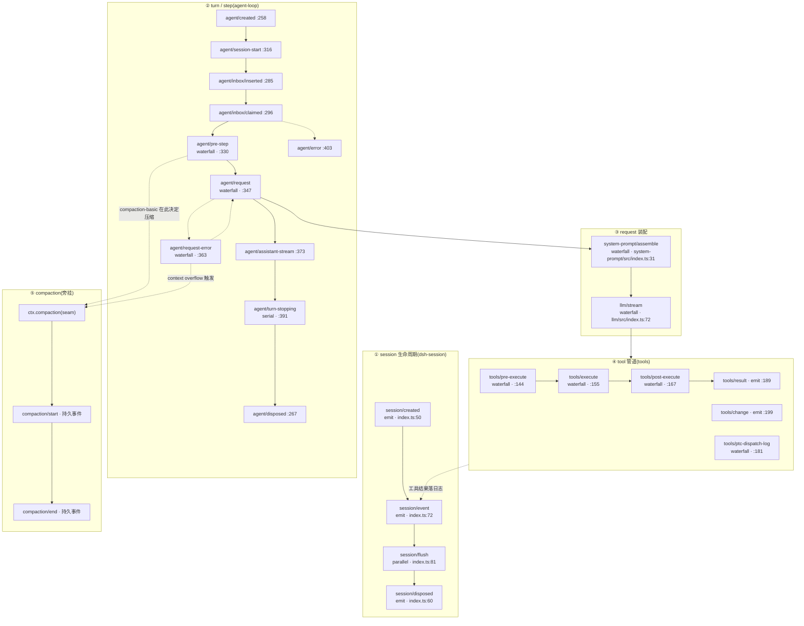

# 04 · 全仓扩展点目录(按内核阶段分类)

> 分析对象:[innokria/deepseek-harness](https://github.com/innokria/deepseek-harness) @ `dbbaa4a37`
> 数据底座:生成物 `docs/event-producer-consumer.md`(生产者/消费者矩阵)
> 前置:[第十二章第一节](../12-architecture-highlights.md)给出声明合并与五种派发语义;[01](./01-cordis-runtime-internals.md)第六节给出五种分发的实现。

---

## 第〇节 三种挂钩子方式

新增行为只有三种入口,选择错误会导致"改了主循环才能加功能"的反模式:

| 方式 | 适用 | 例子 | 代价 |
|---|---|---|---|
| **注册到已有服务** | 新增一个实现(provider / tool / 命令 / 后端) | `ctx.tools.register(...)`、`ctx.llm.registerAdapter(...)`、`ctx.subagents.registerProvider(...)` | 需要选对缝(见 [03](./03-capability-seam-anatomy.md)) |
| **监听事件 / 瀑布** | 在既有流程的固定点插入观察或改写 | `ctx.on('agent/pre-step', ...)`、`ctx.waterfall('llm/stream', ...)` | 必须遵守该模式的契约(waterfall 必须 `next()`) |
| **组合层加一行** | 换掉整车行为、按平台门控 | `cordis.patch.yml` 的 `insert`/整行替换、`disabled: !!js ...` | 需要理解层叠语义(见 [02](./02-loader-and-composition.md)) |

选择判据:能被**两个以上消费者**用到、且有独立变化速率 → 第一种;只在既有流程里加一段逻辑 → 第二种;改变"跑哪些插件" → 第三种。

---

## 第一节 内核阶段总图


<details><summary>Mermaid 源码</summary>



</details>

**读图要点**:只有 ① 与 ② 的 `session/event`、`turn/*`、`step/*`、`tool/*` 等是**持久会话事件**(模型可见性来源);其余都是进程内扩展点。哪些是持久的,由 `docs/architecture.md:105` 明确列出。

---

## 第二节 ① session 生命周期

| 扩展点 | 模式 | 声明 | 发起 | 消费者(真实例子) |
|---|---|---|---|---|
| `session/created` | `emit` | `packages/core/session/src/index.ts:50` | `session`(`events.dispatch`) | `compaction`、`goal`、`hook-protocol`、`llm-retry`、`permission-presets`、`plan-mode`、`schedule`、`session-persistence-jsonl`、`session-projection`、`session-title`、`session-telemetry`、`time-context`、`tool-todo`、`tool-workflow`、`tools`、`user-approval`(`docs/event-producer-consumer.md:51`) |
| `session/event` | `emit` | `session/src/index.ts:72` | 同上 | 全仓最热事件:23 个消费者(`docs/event-producer-consumer.md:53`),含 `session-persistence-jsonl`、`session-telemetry-otel`、`token-meter`、`tools`、`agent-loop` |
| `session/flush` | `parallel` | `session/src/index.ts:81` | 同上 | `session-persistence-jsonl`、`session-telemetry`(`:54`) |
| `session/disposed` | `emit` | `session/src/index.ts:60` | 同上 | `agent-loop`、`session-persistence-jsonl`、`session-projection-cache`、`session-title`、`session-telemetry`、`file-upload`(`:52`) |

表里各行事件的声明原文(这里取三条,`session/disposed` 与它们同形;`@mode` 标签就写在每个事件自己的 JSDoc 里,`session/flush` 的那一行是 `parallel`):

```typescript
// packages/core/session/src/index.ts:39-81(节选)
    /**
     * Creation announcement during session publication. A synchronous throw vetoes and rolls
     * back with a paired disposal; detach requested during dispatch is deferred.
     * @mode emit
     */
    'session/created'(this: Scoped<Session>, session: Session): void
    // ...(略)
    'session/event'(this: Scoped<Session>, session: Session, event: SessionEvent): void
    // ...(略)
    'session/flush'(this: Scoped<Session>, session: Session): Promise<void> | void
```

### 关键实现:`session/event` 不走 `ctx.emit`

```typescript
// packages/core/session/src/index.ts:395-420
type SessionCallback = (...args: unknown[]) => unknown

/** Resolve one listener snapshot, including Cordis's internal dispatch checks. */
function collectSessionCallbacks(ctx: Context, args: unknown[]): SessionCallback[] {
  return [...ctx.events.dispatch('emit', args)] as SessionCallback[]
}

/** Invoke one resolved observe-only listener snapshot with per-listener containment. */
function invokeContainedSessionObservers(
  ctx: Context, name: 'session/event' | 'session/disposed', id: SessionId,
  args: unknown[], callbacks: SessionCallback[],
): void {
  for (const callback of callbacks) {
    try {
      const returned: unknown = callback(...args)
      void Promise.resolve(returned).catch((error: unknown) => {
        ctx.logger.warn(`session "${id}": ${name} listener rejected: ${String(error)}`)
      })
    } catch (error: unknown) {
      ctx.logger.warn(`session "${id}": ${name} listener threw: ${String(error)}`)
    }
  }
}
```

它**刻意绕过 `ctx.emit`**,自己取监听器快照并对每个监听器收容异常——理由写在 `:1137` 的注释里("one owner")。调用点的顺序同样是契约的一部分:

```typescript
// packages/core/session/src/index.ts:742-760(节选)
if (entry !== undefined) entry.appending = true
try {
  let callbacks: SessionCallback[] | undefined
  const callbackArgs: unknown[] = [this, event]
  if (entry !== undefined) {
    callbacks = collectSessionCallbacks(entry.emitCtx, [entry.carrier, 'session/event', ...callbackArgs])
  }
  this.log.push(event as SessionEvent)          // ← 先落日志
  this.eventsSnapshot = undefined
  if (callbacks !== undefined && entry !== undefined) {
    invokeContainedSessionObservers(entry.emitCtx, 'session/event', entry.id, callbackArgs, callbacks)
  }
  return event
} finally {
  if (entry !== undefined) { entry.appending = false; if (entry.detachRequested && !entry.announcing) entry.detach() }
}
```

**监听器快照在 push 之前解析、在 push 之后调用**:所以监听器看到事件时它已在日志里(可 `snapshotEvents()` 自查);同时"监听期间新注册的监听器"不会收到本条事件。这个"解析—提交—通知"的三段式与 `packages/AGENTS.md:15` 的"Publish state only at its commit point"一致。

---

## 第三节 ② turn / step / request

声明全部在 `packages/core/agent/src/runtime-types.ts`(`Agent` 契约包),发起方是 `agent-loop`——这是"契约归 `dsh-agent`,默认实现归 `dsh-agent-loop`"分工的直接体现。

| 扩展点 | 模式 | 声明 | 何时发 | 消费者 |
|---|---|---|---|---|
| `agent/created` | `emit` | `runtime-types.ts:258` | Agent 注册进注册表时 | `agent-presets`、`file-reference-local`、`goal-round-driver`、`schedule`、`tool-agent-team`、`tool-subagent`、`loader-smoke`(`docs/event-producer-consumer.md:13`) |
| `agent/status` | `emit` | `:277` | 状态迁移时 | `compaction-basic`、`goal-round-driver`、`schedule`、`session-controller`、`server`(`:23`) |
| `agent/session-start` | `emit` | `:316` | 会话开始 | `goal`、`goal-round-driver`、`hooks-claude-code`、`hooks-codex`(`:22`) |
| `agent/inbox/inserted` | `emit` | `:285` | 消息入 inbox | `goal-round-driver`(`:18`) |
| `agent/inbox/claimed` | `emit` | `:296` | 消息被认领 | `acp`、`goal-round-driver`、`subagent`、`tool-jobs`(`:16`) |
| `agent/inbox/discarded` | `emit` | `:304` | 消息被丢弃 | `goal-round-driver`、`subagent`(`:17`) |
| **`agent/pre-step`** | `waterfall` | `:330` | 每个 step 组装前 | 15 个(`:19`):`agent-instructions`、`compaction-basic`、`hooks-claude-code`、`hooks-codex`、`plan-mode`、`repeat-tool-reminder`、`session-checkpoint-policy`、`session-reference`、`subagent-in-process-driver`、`time-context`、`tmux-context`、`tool-cordis`、`tool-skill`、`tool-subagent` |
| **`agent/request`** | `waterfall` | `:347` | 路由解析阶段 | `agent`、`webhook`(`:20`) |
| **`agent/request-error`** | `waterfall` | `:363` | 请求失败且可重试时 | `compaction-basic`、`llm-retry`(`:21`) |
| `agent/assistant-stream` | `emit` | `:373` | 流式 chunk 帧 | `headless`、`session-controller`(`:12`) |
| **`agent/turn-stopping`** | `serial` | `:391` | turn 即将结束 | `hooks-claude-code`、`hooks-codex`(`:24`) |
| `agent/error` | `emit` | `:403` | 不可恢复错误 | `acp`、`goal-round-driver`、`session-controller`、`session-telemetry`(`:15`) |
| `agent/disposed` | `emit` | `:267` | Agent 处置 | `agent-loop`、`goal-round-driver`、`subagent`、`tool-subagent`、`session-controller`(`:14`) |
| `agent-loop/config-start-failed` | `emit` | `packages/core/agent-loop/src/index.ts:246` | 启动配置失败 | 无监听器(`:10`)——纯诊断 |

表里十个 `emit` 事件的声明形态(全部带 `this: Scoped<Agent>` 载体,payload 是单对象):

```typescript
// packages/core/agent/src/runtime-types.ts:258-304(节选)
    'agent/created'(this: Scoped<Agent>, payload: { agent: Agent }): void
    // ...(略)
    'agent/status'(this: Scoped<Agent>, payload: { agent: Agent; status: AgentStatus }): void
    // ...(略)
    'agent/inbox/claimed'(this: Scoped<Agent>, payload: { agent: Agent; message: UserMessage; turn: number }): void
    // ...(略)
    'agent/inbox/discarded'(this: Scoped<Agent>, payload: { agent: Agent; message: UserMessage }): void
```

### 3.1 `agent/pre-step` 的决策类型

它是"决定本步接受什么输入"的唯一位置,监听器返回 `PreStepDecision`:

```typescript
// packages/core/agent/src/runtime-types.ts:328-330
     * @mode waterfall
     */
    'agent/pre-step'(this: Scoped<Agent>, payload: { agent: Agent; messages: UserMessage[]; turn: number; step: number; signal: AbortSignal }, next: () => Promise<PreStepDecision>): Promise<PreStepDecision>
```

`docs/architecture.md:109` 给出它的语义边界:监听器可以改写或拒绝消息;`startsRequestSeries` 的声明必须由包装监听器用 `{ ...decision, messages }` 保留;重试**不会**重跑 `agent/pre-step`。**这是"注入上下文"的官方位置**(`agent.inject()` 的落点)。

### 3.2 `agent/turn-stopping` 是唯一 `serial` 的 stop 点

`serial` 语义(见 [01](./01-cordis-runtime-internals.md)6.2):顺序 await,**首个返回非 `null`/`false`/`undefined` 的监听器终止后续**。hooks 桥用它实现"Stop hook 阻塞则强制继续"(见第八节)。

§3 里三个可改写的点的声明长这样(`agent/request` 与 `agent/request-error` 都返回替换值,`agent/turn-stopping` 返回 `void`,靠 steer 表达反对):

```typescript
// packages/core/agent/src/runtime-types.ts:347-391(节选)
    'agent/request'(this: Scoped<Agent>, payload: { agent: Agent; turn: number; step: number; signal: AbortSignal }, next: () => Promise<LlmCallConfig>): Promise<LlmCallConfig>
    // ...(略)
    'agent/request-error'(this: Scoped<Agent>, payload: { agent: Agent; turn: number; step: number; provider: string; failure: LlmFailure; retryPolicy: ResolvedRetryPolicy | undefined; signal: AbortSignal }, next: () => Promise<RequestErrorAction>): Promise<RequestErrorAction>
    // ...(略)
    'agent/turn-stopping'(this: Scoped<Agent>, payload: { agent: Agent; turn: number; signal: AbortSignal }): Promise<void> | void
```

### 3.3 request 装配阶段的两个瀑布

| 扩展点 | 模式 | 声明与调用 |
|---|---|---|
| `system-prompt/assemble` | `waterfall` | 声明 `packages/core/system-prompt/src/index.ts:31`;调用 `:617-618`(`scopeTarget(this, scope)` 作载体) |
| `llm/stream` | `waterfall` | 声明 `packages/llm/llm/src/index.ts:72`;消费者为 `agent-loop`、`llm`、`llm-replay`、`session-checkpoint-policy`、`session-title`(`docs/event-producer-consumer.md:49`) |

两个声明(§3.3 表格里那两行)原文如下,`system-prompt/change` 没有 payload,是纯注册表通知:

```typescript
// packages/core/system-prompt/src/index.ts:31-37(节选)
    'system-prompt/assemble'(this: Scoped<SystemPrompt>, assembly: PromptAssembly, context: AssembleContext, next: () => Promise<PromptAssembly>): Promise<PromptAssembly>
    // ...(略)
    'system-prompt/change'(): void
```

```typescript
// packages/llm/llm/src/index.ts:72
    'llm/stream'(this: LlmRuntime, options: GenerateOptions, next: () => AsyncIterable<StreamChunk>): AsyncIterable<StreamChunk>
```

`llm/stream` 的契约(第十二章已引 JSDoc):**请求是深冻结的**("mutation throws"),监听器只读不改写。要改请求行为,正确位置是 `agent/request`(决定路由)与 `prepareCall`(代际绑定),而不是改 `llm/stream` 的载荷。

---

## 第四节 ③ tool 管道

声明与调用都在 `packages/core/tools/src/index.ts`:

| 扩展点 | 模式 | 声明 | 调用点 | 消费者 |
|---|---|---|---|---|
| **`tools/pre-execute`** | `waterfall` | `:144` | `:1465-1466` | `hooks-claude-code`、`hooks-codex`、`tool-jobs`(`docs/event-producer-consumer.md:67`) |
| **`tools/execute`** | `waterfall` | `:155` | `:1563-1564` | `session-checkpoint-policy`、`timeout-policy`(`:65`) |
| **`tools/post-execute`** | `waterfall` | `:167` | `:1733-1734` | `hooks-claude-code`、`hooks-codex`、`repeat-tool-reminder`、`spill-policy`、`tool-fs-search`(`:66`) |
| `tools/ptc-dispatch-log` | `waterfall` | `:181` | `:1288-1289` | `spill-policy`(`:68`) |
| `tools/result` | `emit` | `:189` | `:1656` | `agent-instructions`、`subagent-in-process-driver`、`tool-present`(`:69`) |
| `tools/change` | `emit` | `:199` | `:806` | `tool-subagent`(`:64`) |

§4 表格里四个瀑布的声明原文——它们都挂在 `ToolRuntime` 上,`this: Scoped<ToolRuntime>` 是作用域载体:

```typescript
// packages/core/tools/src/index.ts:144-181(节选)
    'tools/pre-execute'(this: Scoped<ToolRuntime>, exec: ToolExecution, next: () => Promise<PreToolDecision>): Promise<PreToolDecision>
    // ...(略)
    'tools/execute'(this: Scoped<ToolRuntime>, exec: ToolDispatchExecution, next: () => Promise<ToolExecutionResult>): Promise<ToolExecutionResult>
    // ...(略)
    'tools/post-execute'(this: Scoped<ToolRuntime>, exec: ToolExecution, result: Readonly<ToolExecutionResult>, next: () => Promise<PostToolDecision>): Promise<PostToolDecision>
    // ...(略)
    'tools/ptc-dispatch-log'(this: Scoped<ToolRuntime>, dispatch: PtcDispatchLog, next: () => Promise<ContentBlock[]>): Promise<ContentBlock[]>
```

三个瀑布的**能力边界**(JSDoc 原文已划定,`docs/tool-execution-pipeline.md` 是权威):

```typescript
// packages/core/tools/src/index.ts:135-167(节选)
    /** Allow, deny, or ask before dispatch. ... Async gates must observe `exec.signal`;
     *  the registry rechecks cancellation after they settle but never abandons their promise. */
    'tools/pre-execute'(...): Promise<PreToolDecision>
    /** Around-dispatch waterfall for timeout, retry, or metrics. ... wrappers may change only
     *  `exec.signal`, while call identity remains immutable. ... */
    'tools/execute'(...): Promise<ToolExecutionResult>
    /** Accept, replace, enrich, or block a normalized dispatch result. ... */
    'tools/post-execute'(...): Promise<PostToolDecision>
```

- `pre-execute` 返回 `PreToolDecision`(allow/deny/ask);**缺少审批支持时 `ask` 变成拒绝**。
- `execute` 只允许换 `exec.signal`,调用身份不可变;registry 会在 body 之前"重新熔接"原始调用者 signal,替换 signal 不能切断调用者的取消。
- `post-execute` 能接受/替换/增强/阻塞结果;**抛错的工具也会到达这里**。

### 4.1 管道入口的形状

```typescript
// packages/core/tools/src/index.ts:1332-1352(节选)
async execute(exec: ToolExecutionInput): Promise<ToolExecutionResult> {
  return this.prepareExecution(exec, prepared => this.completeScheduledExecution(prepared))
}

private async completeScheduledExecution(prepared: ScheduledToolPreparation): Promise<ToolExecutionResult> {
  switch (prepared.kind) {
    case 'dispatch': {
      const dispatched = await this.dispatchScheduledExecution(prepared.exec)
      return dispatched.kind === 'post-result'
        ? await this.finalizeScheduledExecution(prepared.exec, dispatched.result)
        : this.finishScheduledExecution(prepared.exec, dispatched.result)
    }
    case 'post-result': return await this.finalizeScheduledExecution(prepared.exec, prepared.result)
    case 'final-result': return this.finishScheduledExecution(prepared.exec, prepared.result)
    default: return assertNever(prepared, 'scheduled tool preparation')
  }
}
```

`ScheduledToolPreparation` 的三分支(`dispatch` / `post-result` / `final-result`)让"在 `pre-execute` 就被拒绝的调用"和"真正执行的调用"共用同一条收尾路径——所以被拒绝的调用**也会**经 `post-execute` 与 `tools/result`,监听器只需写一次。

`tools/result` 与 `tools/change` 是这一节仅有的两个 `emit`,前者拿深冻结的结果快照,后者刻意**不做**作用域过滤:

```typescript
// packages/core/tools/src/index.ts:189-199(节选)
    'tools/result'(this: Scoped<ToolRuntime>, exec: Readonly<ToolExecution>, result: Readonly<ToolExecutionResult>): undefined
    // ...(略)
    'tools/change'(): void
```

### 4.2 filesystem 子缝的三个瀑布

`ctx.fs` 是另一条独立缝,它自己的拦截点声明在 `packages/fs/fs/src/index.ts`:

| 扩展点 | 模式 | 声明 | 发起方 | 消费者 |
|---|---|---|---|---|
| `fs/write-intent` | `waterfall` | `fs/src/index.ts:58` | `tool-fs`、`tool-str-replace-editor` | `fs-observation-policy`(`docs/event-producer-consumer.md:45`) |
| `fs/edit-intent` | `waterfall` | `fs/src/index.ts:66` | 同上 | `fs-observation-policy`(`:43`) |
| `fs/observed` | `emit` | `fs/src/index.ts:76` | 同上 | `fs-observation-policy`、`skill-filesystem`、`workspace-files`(`:44`) |

`ctx.fs` 三个挂点的声明(前两个是单槽位决策:第一个返回 intent 的监听器独占决定权):

```typescript
// packages/fs/fs/src/index.ts:58-76(节选)
    'fs/write-intent'(target: FsTarget, actor: object | undefined, next: () => FsWriteIntent | undefined | Promise<FsWriteIntent | undefined>): Promise<FsWriteIntent | undefined>
    // ...(略)
    'fs/edit-intent'(target: FsTarget, actor: object | undefined, next: () => { version: FsVersion } | undefined | Promise<{ version: FsVersion } | undefined>): Promise<{ version: FsVersion } | undefined>
    // ...(略)
    'fs/observed'(target: FsTarget, observation: FsObservation, actor: object | undefined): void
```

这是"未修改 tool 代码就加了一道文件策略"的范例:`fs-observation-policy`(默认观测策略)只是一个监听者,`tool-fs` 的 schema 一行没动。

---

## 第五节 ④ compaction 阶段

compaction 不是一个事件,而是一条**缝 + 一组持久事件 + 若干监听点**:

| 挂点 | 形态 | 位置 |
|---|---|---|
| `ctx.compaction` | Service Definition(抽象类 `CompactionEngine`) | `packages/compaction/compaction/src/index.ts:96`,`super(ctx,'compaction')` `:98`;三个抽象方法 `compactIfNeeded` `:113`、`compactNow` `:139`、`compactRegion` `:164` |
| Provider 实现 | 注册即替换 | `packages/compaction/compaction-basic/src/index.ts:104` `class BasicCompactionEngine extends CompactionEngine` |
| 自动触发挂点 | `agent/pre-step` 监听 | `compaction-basic/src/index.ts:148` |
| 状态观察 | `agent/status` 监听 | `:168` |
| 日志观察 | `session/event` 监听 | `:174` |
| 溢出触发 | `agent/request-error` 监听 | `:180` |
| 人工触发(命令) | `ctx.compaction.compactNow(...)` | `packages/compaction/command-compact/src/index.ts:67` |
| 不变量伴随 | `./invariant` | `packages/compaction/compaction/package.json:21` |
| 持久事件 | `compaction/start` / `compaction/end` | 见 `CompactionEngine.compactNow` 的 JSDoc(`compaction/src/index.ts:119-138`):"append a standalone `compaction/start` before summarization. That durable marker is the compaction lock until one `compaction/end` attempt." |

**关键契约**:`compactNow` 必须**同步**启动 idle task 再开始异步工作,先写 `compaction/start` 再摘要;标记对之间可以夹入新注入的上下文,但**被选中的区段必须保持稳定**;失败尝试仍然留在日志里可见(`:135-137`)。这是"用持久日志做锁"的范例——锁不是内存标志,而是可重建的事件。

---

表格里"自动触发挂点"那一行的真实监听器:压缩是旁挂行为,所以它无论成败都 `return next()`——waterfall 监听器不调 `next()` 就等于自己接管了这一步的输入决策:

```typescript
// packages/compaction/compaction-basic/src/index.ts:148-166(节选)
    ctx.on('agent/pre-step', async (
      { agent, signal },
      next,
    ): Promise<PreStepDecision> => {
      // ...(略):compactIfNeeded(agent, 'pressure', signal) 成功记日志,抛错则 warn 后继续本 turn
      return next()
    })
```

## 第六节 ⑤ 组合层 / 框架层扩展点

这些事件属于 Cordis 与 Loader 本身,任何插件都能监听,是"给框架编程"的入口。

| 扩展点 | 模式 | 声明/发起 | 内核消费者 | 第三方消费者 |
|---|---|---|---|---|
| `internal/plugin` | `emit` | `vendor/cordis/src/fiber.ts:302`(创建)、`:269`(处置) | Loader(`vendor/loader/src/index.ts:117`) | `inspector`、`modules`、`lsp-stdio`(`docs/event-producer-consumer.md:84`) |
| `internal/status` | `emit` | `fiber.ts:586` | `agent`(`packages/core/agent/src/index.ts`) | `inspector`(`:86`) |
| `internal/config` | `waterfall` | `fiber.ts:642` | Loader 的 `!!js` 插值(`loader/src/index.ts:92`) | —— |
| `internal/update` | `waterfall` | `fiber.ts:748` | Loader 配置写回(`loader/src/index.ts:103`)、Group(`loader/src/config/group.ts:122`)、Include(`include/src/index.ts:206`) | —— |
| `internal/service` | `emit` | `reflect.ts:333` | —— | `agent-presets`、`gateway`(`:85`) |
| `internal/dispatch` | `emit` | `events.ts:169` | —— | 25 个包,主要是 invariant 伴随插件与遥测(`:83`) |
| `internal/get` / `internal/set` | `waterfall` | `reflect.ts:153`、`:191` | 无内建 | 自定义服务解析 |
| `internal/listener` | `bail` | `events.ts:296` | `EventsService` 自身(`events.ts:140`) | —— |
| `loader/entry-init` | `emit` | `loader/src/config/entry.ts:68` | `loader/src/config/isolate.ts:91` | —— |
| `loader/patch-context` | `waterfall` | `entry.ts:115` | `isolate.ts:96` | 需要干预条目上下文装配的插件 |
| `loader/partial-dispose` | `emit` | `loader/src/config/group.ts:56`、`entry.ts:190/206/210/241/245` | `isolate.ts:155`(realm 垃圾回收) | —— |
| `loader/config-update` | `emit` | `include/src/index.ts:372` | —— | Web/CLI 的配置变更提示 |
| `hmr/reload` | `emit` | `vendor/hmr/src/index.ts:547` | —— | 开发面板 |
| `hmr/change` | `emit` | `hmr/src/index.ts:270` | —— | 同上 |
| `hmr/config-update-failed` | `parallel` | `hmr/src/index.ts:312` | —— | 配置错误提示(声明 `:23-29`) |
| `exit` | `emit` | `loader/src/index.ts:25` 声明 | `Loader.exit()`(`:188`)由 HMR 全量重载时调用(`hmr/src/index.ts:260`) | 宿主可覆盖以重启进程 |

框架自己的事件契约原文(取三行代表三种形态:`internal/plugin` 的 `emit`、`internal/update` 的 `waterfall`、`internal/dispatch` 的诊断 `emit`):

```typescript
// vendor/cordis/src/events.ts:329-352(节选)
export interface Events {
  /** A plugin fiber was created or its uid was cleared on disposal. */
  'internal/plugin'(fiber: Fiber): void
  // ...(略)
  /** Waterfall: a fiber config update is being applied; skip `next()` to veto. */
  'internal/update'(this: Fiber, config: any, noSave: boolean, next: () => void | Promise<void>): void | Promise<void>
  /** An event is being dispatched to listeners (fired for non-internal events only). */
  'internal/dispatch'(mode: DispatchMode, name: string, args: any[], thisArg: any): void
}
```

`internal/update` 的**双通道**值得单列:每个 fiber 有自己的 `internal/update` 私有链(`events.ts:142`),全局监听器(`events.ts:148-155`)把它串成 waterfall。因此 `ctx.on('internal/update', ...)` 只在本 fiber 更新时触发;要观察所有 fiber 必须 `{ global: true }`——Loader 的三个监听器(`:103`、`:111`)都带 `global: true`。

---

## 第七节 外部 hook 桥:六个事件驱动的 hook 点

`packages/hooks/hooks-claude-code` 把外部 hook 协议映射到内核扩展点,是"事件扩展点足够用"的最强证据——它**没有修改任何内核代码**:

| 外部 hook 事件 | 内核扩展点 | 映射代码 | 语义 |
|---|---|---|---|
| `SessionStart` | `agent/session-start` | `src/index.ts:205-206` | 注入上下文(detached hook) |
| `UserPromptSubmit` | `agent/pre-step` | `:218-221` | 合并 `PreStepDecision` |
| `PreToolUse` | `tools/pre-execute` | `:237-240` | `deny` → `{ kind: 'deny', reason }` |
| `PostToolUse` | `tools/post-execute` | `:246-251` | `block` → `{ kind: 'block', feedback, additionalContexts }` |
| `Stop` | `agent/turn-stopping` | `:269-273` | 阻塞即强制继续 |
| `SubagentStart` / `SubagentStop` | `subagent/start` / `subagent/end` | `:280-293` | start 可注入子上下文,stop 仅观察 |

hook 名白名单在 `packages/hooks/hooks-claude-code/src/config.ts:12-18`(含 `Notification` 等)。注意 `UserPromptSubmit` 与 `Stop` 的 matcher 字段被**丢弃**(`config.ts:109`),因为那两个事件没有可匹配主体——这是"事件语义决定适配层能力"的具体例子。

表里 `PreToolUse` 那一行的映射代码原文——注意最后一行 `return next()`:它把"本次 hook 没拦"与"后续监听器仍可拦"两件事分开表达:

```typescript
// packages/hooks/hooks-claude-code/src/index.ts:236-243
  // --- PreToolUse → PreToolDecision. Matcher subject is the tool name. ---
  ctx.on('tools/pre-execute', async (exec, next): Promise<PreToolDecision> => {
    const turn = lastTurn(ctx, exec.agent)
    const merged = await runPoint('PreToolUse', exec.name, preToolPayload(exec), { ...exec.agent ? { agent: exec.agent } : {}, turn, signal: exec.signal })
    if (merged.decision === 'deny') return { kind: 'deny', reason: merged.reason ?? 'blocked by PreToolUse hook' }
    if (merged.decision === 'ask') return { kind: 'ask', ...merged.reason !== undefined ? { reason: merged.reason } : {} }
    return next()
  })
```

`hooks-codex` 是同一形态的第二实现(消费者列表见 `docs/event-producer-consumer.md` 的 `agent/pre-step`、`tools/pre-execute`、`tools/post-execute`、`agent/turn-stopping` 行)。

---

## 第八节 横向 seam 事件速查

不属于内核阶段、但同样是文档化扩展点(按 seam 归类):

| 事件 | 模式 | 声明 | 消费者 |
|---|---|---|---|
| `subagent/provider-added` / `-removed` | `emit` | `packages/subagent/subagent/src/index.ts:144`、`:150` | `subagent`(自身 invariant)、`tool-subagent` |
| `subagent/start` / `subagent/end` | `emit`(scope 载体) | `:161`、`:170` | `hooks-claude-code`、`server`、`subagent` |
| `llm/adapters-updated` | `emit` | `packages/llm/llm/src/types.ts:23` | `acp`、`llm`、`remotes` |
| `workflow/start` / `phase` / `log` / `agent-start` / `agent-end` / `end` | `emit` | `packages/workflow/workflow/src/index.ts:43`、`:51`、`:58`、`:68`、`:79`、`:89` | `tool-workflow`、`workflow` |
| `goal/changed` / `activation-changed` | `emit` | `packages/goal/goal/src/domain.ts:114`、`types.ts:150` | `goal-round-driver`、`remotes` |
| `skills/change` | `emit` | `packages/skill/skill/src/index.ts:296` | 无(`:57`) |
| `settings/updated` / `document-updated` | `emit` | `packages/settings/settings/src/types.ts:92`、`:105` | `settings`(自身 invariant,`src/invariant.ts:24`)、`remotes` |
| `credentials/record-updated` / `reference-updated` | `emit` | `packages/credentials/credentials/src/types.ts:102`、`:90` | `authorization`、`credentials`、`remotes` |
| `authorization/settled` | `emit` | `packages/credentials/authorization/src/index.ts:57` | `authorization` |
| `approval/request` | `waterfall` | `packages/interaction/user-approval/src/types.ts:85` | `acp`、`remotes` |
| `user-questions/request` | `waterfall` | `packages/interaction/user-questions/src/types.ts:85` | `remotes` |
| `commands/change` | `emit` | `packages/interaction/commands/src/types.ts:89` | `remotes` |
| `api-session/added` / `removed` / `status` / `activity` / `error` | `emit` | `packages/api/session-controller/src/types.ts:581`、`:587`、`:594`、`:601`、`:608` | `remotes`(Web/Desktop 客户端) |
| `webserver/index-inject` | `emit` | `packages/host/webserver/src/index.ts:34` | `connection`、`inspector`、`modules` |
| `agent-preset/selected` | `emit` | `packages/preset/agent-presets/src/types.ts:82` | `remotes` |
| `domain/changed` | `emit` | `packages/storage/storage-domain/src/events.ts:46` | `storage-domain`、`workspace`、`workspace-controller` |
| `cordis/request-run` 等 5 个 | `emit` | `packages/extensions/cordis-host-runner/src/types.ts:368-398` | `remotes`(自省面板) |
| `feedback/committed` | `parallel` | `packages/feedback/message-feedback/src/index.ts:58` | `session-telemetry-otel` |
| `session-telemetry/record` | `waterfall` | `packages/session/session-telemetry/src/index.ts:43` | 无内建消费者,供部署接遥测后端 |

表中 `subagent/start` / `subagent/end` 的"scope 载体"写法(声明里的 `this: Scoped<SubagentRuntime>` 即载体,`@dshScopeScan unsupported` 表示作用域不由 payload 字段推导):

```typescript
// packages/subagent/subagent/src/index.ts:158-170(节选)
     * @dshScopeScan unsupported
     * @mode emit
     */
    'subagent/start'(this: Scoped<SubagentRuntime>, info: SubagentRunInfo): void
    // ...(略)
    'subagent/end'(this: Scoped<SubagentRuntime>, info: SubagentRunEndInfo): void
```

> 完整清单与逐事件的生产者/消费者边,以生成物 `docs/event-producer-consumer.md` 为准。该文件由 `scripts/gen-doc-graphs.ts` 从 TypeScript Program 解析产生,并由 `verify-*` 门控新鲜度。

---

## 第九节 选点速查:我要加的功能该挂哪

| 我想…… | 挂这里 | 模式 |
|---|---|---|
| 每步开始前注入上下文 / 拒绝输入 | `agent/pre-step` | waterfall |
| 改写模型路由与调用配置 | `agent/request`(+ `prepareCall`) | waterfall |
| 对失败请求做重试/降级 | `agent/request-error` | waterfall |
| 包装每次模型流(录制、回放、token 计量) | `llm/stream` | waterfall |
| 改写系统提示 | `system-prompt/assemble` | waterfall |
| 工具执行前放行/拒绝/问人 | `tools/pre-execute` | waterfall |
| 工具超时、指标、并发包装 | `tools/execute` | waterfall |
| 工具结果裁剪、落盘、反馈 | `tools/post-execute` | waterfall |
| 只观察工具终态 | `tools/result` | emit |
| 工具集合变化时刷新提示 | `tools/change` | emit |
| 会话压缩策略 | `ctx.compaction` 的 Provider | seam |
| 观察/派生会话状态 | `session/event` + `ctx.sessionProjections` | emit + seam |
| 强制在 turn 结束时继续 | `agent/turn-stopping` | serial(bail) |
| 接到外部 hook 协议 | 复用第八节的六个内核事件 | 见第八节 |
| 新增模型商 | `ctx.llm.registerAdapter` | seam |
| 新增工具 | `ctx.tools.register` | seam |
| 新增交互后端(聊天/编辑器) | `ctx.agents` + `session/event` | seam + emit |

---

## 关键文件/符号索引表

| 文件 | 内容 |
|---|---|
| `docs/event-producer-consumer.md` | 生成的事件×生产者×消费者矩阵(含 `internal/*` 与未声明事件串) |
| `docs/architecture.md:85-113` | 主循环阶段与事件顺序的权威叙述 |
| `docs/architecture.md:137-158` | "新行为挂哪"的官方映射表 |
| `docs/tool-execution-pipeline.md` | 工具管道四阶段细节 |
| `packages/core/agent/src/runtime-types.ts` | `agent/*` 全部事件声明(`:256-403`) |
| `packages/core/agent-loop/src/index.ts` | `agent-loop/config-start-failed`(`:246`)与事件发起 |
| `packages/core/session/src/index.ts` | `session/*` 声明(`:48-81`)、contained 派发(`:395-420`)、append 三段式(`:742-760`) |
| `packages/core/tools/src/index.ts` | `tools/*` 声明(`:144-199`)与四个调用点(`:1288`、`:1465`、`:1563`、`:1733`)、入口(`:1332`) |
| `packages/core/system-prompt/src/index.ts` | `system-prompt/assemble`(`:31`)与调用(`:617`)、`system-prompt/change`(`:37`) |
| `packages/llm/llm/src/index.ts` | `llm/stream` 声明(`:72`) |
| `packages/fs/fs/src/index.ts` | `fs/write-intent`(`:58`)、`fs/edit-intent`(`:66`)、`fs/observed`(`:76`) |
| `packages/compaction/compaction/src/index.ts` | `CompactionEngine` 与持久锁语义(`:96-172`) |
| `packages/compaction/compaction-basic/src/index.ts` | 四个监听挂点(`:148`、`:168`、`:174`、`:180`) |
| `packages/compaction/command-compact/src/index.ts` | 人工压缩调用点(`:67`) |
| `packages/hooks/hooks-claude-code/src/index.ts` | 六个外部 hook → 内核事件的映射(`:205-293`) |
| `packages/hooks/hooks-claude-code/src/config.ts` | hook 名白名单(`:12-18`) |
| `packages/settings/settings/src/invariant.ts` | `settings/updated` 的 invariant 消费(`:24`) |
| `packages/subagent/subagent/src/index.ts` | `subagent/*` 声明(`:138-171`)与 scope 载体派发 |
| `vendor/cordis/src/events.ts` | `internal/*` 契约(`:329-352`)与五种分发实现 |
| `vendor/loader/src/index.ts` | `loader/*` 声明(`:24-30`)与消费者 |
| `vendor/hmr/src/index.ts` | `hmr/*` 声明(`:20-30`)与广播点(`:270`、`:312`、`:547`) |

---

> 下一篇:[05 · 插件编写指南](./05-plugin-authoring-guide.md)——把本篇的挂点变成可以合并进仓库的插件。
