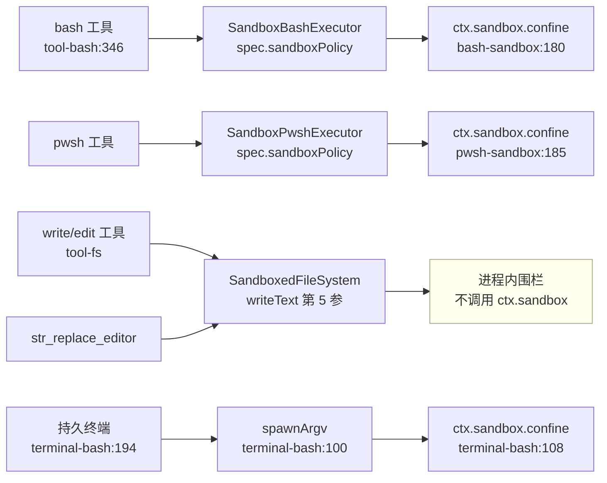
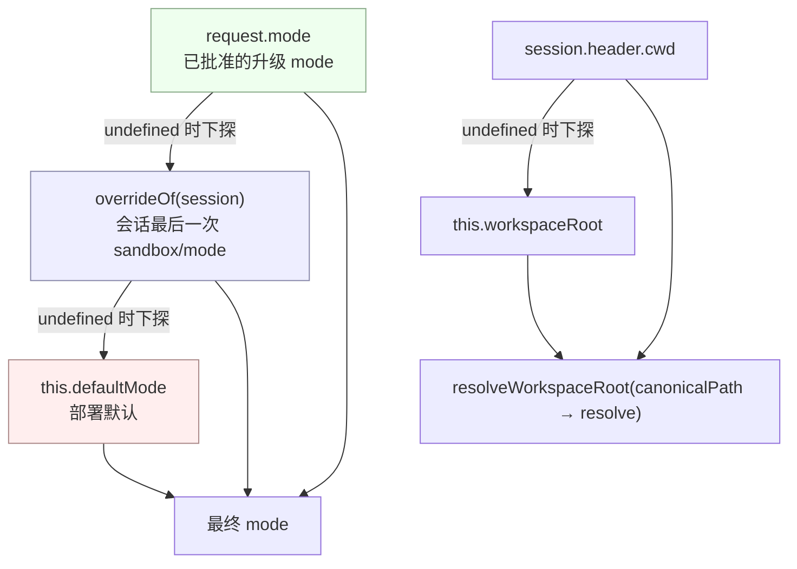
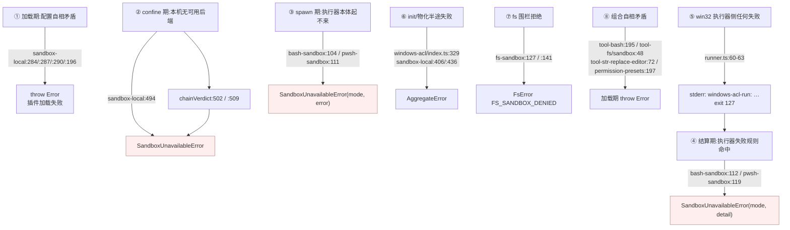

# 01 · 能力缝与策略:函数级走查

> 对应第七章 [第一节](../07-sandbox.md#第一节-沙箱能力缝的构成service-definition--provider--consumer) 与 [第二节](../07-sandbox.md#第二节-策略模型模式路径根逐调用携带fail-closed)。

---

## 一句话结论

`ctx.sandbox.confine(argv, policy)` 是一个**总函数**:输入精确 argv 与一份已完全解析的策略,输出"替代 argv + 三组分类事实",或抛 `SandboxUnavailableError`。这三组分类事实(`enforcement` / `denialSignatures` / `runnerFailureRules`)是消费者唯一的判定依据——缝不提供类型化的运行时拒绝通道,所以"后端说过什么"必须以**该后端真实产生的字符串**形式随每次调用下发。策略来自 `ctx.sandboxPolicy.resolve()`,它是**独立的第四方**,既不归 provider 也不归任何消费者。

---

## 第一节 `confine` 的契约与返回结构

### 1.1 抽象方法签名

```typescript
// packages/sandbox/sandbox/src/index.ts:158-176(节选)
export abstract class SandboxProvider extends Service {
  constructor(ctx: Context) { super(ctx, 'sandbox') }

  abstract confine(argv: readonly string[], policy: SandboxPolicy): ConfinedArgv
}
```

服务名硬编码在构造函数里(`super(ctx, 'sandbox')`),`declare module '@deepseek-ai/cordis'` 把 `ctx.sandbox` 声明成 `SandboxProvider`(`index.ts:146-150`)。两个入参的语义被 JSDoc 钉死(`index.ts:164-174`):

| 参数 | 真实类型 | 语义约束 | 落点 |
|---|---|---|---|
| `argv` | `readonly string[]` | **精确 argv,不是 shell 字符串**;shell 形态的消费者自己传 `['bash','-c',command]` | `index.ts:167-169`;bash 消费者在 `bash-sandbox/src/index.ts:180` 这么传 |
| `policy` | `SandboxPolicy`(即 `SandboxExecutionPolicy` 的 mode 收窄版) | **已完整解析**,provider 不再补默认值 | `index.ts:66-67,170-171` |

`SandboxPolicy` 相对 `SandboxExecutionPolicy` 的唯一差别是 mode 类型:

```typescript
// packages/sandbox/sandbox/src/index.ts:31-32,69-72
export type ConfinedSandboxMode = Exclude<SandboxMode, 'danger-full-access'>

export interface SandboxPolicy extends SandboxExecutionPolicy {
  mode: ConfinedSandboxMode
}
```

这是**编译器层面的 fail-closed 第一道**:`danger-full-access` 在类型上就进不了 provider。消费者要传窄化的 mode,必须显式重述判别式——`bash-sandbox/src/index.ts:96` 与 `terminal-bash/src/index.ts:108` 都写了 `{ ...policy, mode }` 并各自注释了"object spread 不保留窄化类型"。

### 1.2 `ConfinedArgv`:四个字段的真实类型与用途

```typescript
// packages/sandbox/sandbox/src/index.ts:95-116
export interface ConfinedArgv {
  argv: string[]
  enforcement: SandboxEnforcement
  denialSignatures: readonly string[]
  runnerFailureRules: readonly RunnerFailureRule[]
}
```

| 字段 | 真实类型 | 由谁写入 | 由谁消费 | 用途 |
|---|---|---|---|---|
| `argv` | `string[]` | `sandbox-local/src/index.ts:319,328` | `runArgv`/`startArgv`(`bash-sandbox/src/index.ts:99,126`);`spawnTerminal`(`terminal-bash/src/index.ts:197`) | 直接交给 subprocess 面 spawn,消费者不再拼参数 |
| `enforcement` | `'full' \| 'partial'`(`index.ts:59`) | `sandbox-local/src/index.ts:329` 取自 `SelectedRunner` | `bash-sandbox/src/index.ts:114` 写进 `result.sandbox`;`tool-bash/src/index.ts:176` 透传进工具输出 schema 的 `enforcement` 字段 | 上报"这个后端对本策略的强制完整度",供上层决定是否接受绝对边界 |
| `denialSignatures` | `readonly string[]` | `DENIAL_SIGNATURES[runner]`(`sandbox-local/src/index.ts:205-213`) | `matchesSignature`(`helpers.ts:112-116`) | 判定"约束生效并拦住了它" |
| `runnerFailureRules` | `readonly RunnerFailureRule[]` | `RUNNER_FAILURE_RULES[runner]`(`sandbox-local/src/index.ts:231-240`) | `classifyRunnerFailure`(`helpers.ts:81-103`) | 判定"执行器坏了、命令根本没跑" |

注释里给 `denialSignatures` 下了精确的语义边界(`index.ts:100-108`):它是**该后端自己的方言**,不是跨后端并集——"并集会声称某后端永远不会产生的拒绝"。所以 `DENIAL_SIGNATURES` 是 5 个键的完整表(4 个 runner + `runnerCommand`),每个键一个数组。

### 1.3 `RunnerFailureRule`:三个字段的求值顺序

```typescript
// packages/sandbox/sandbox/src/index.ts:81-88
export interface RunnerFailureRule {
  allowedExitCodes?: readonly number[]
  fatalSignatures: readonly string[]
  informationalLines?: readonly string[]
}
```

求值顺序写在类型 JSDoc 里(`index.ts:74-80`),实现逐行对应:

```typescript
// packages/shell/bash-sandbox/src/helpers.ts:86-101(节选)
if (exitCode === null || exitCode === 0) return undefined
const lines = stderr.split(/\r?\n/)
for (const rule of rules) {
  if (rule.allowedExitCodes !== undefined && !rule.allowedExitCodes.includes(exitCode)) continue
  const informationalLines = new Set((rule.informationalLines ?? []).map(line => line.toLowerCase()))
  const fatalSignatures = rule.fatalSignatures.filter(s => s.trim().length > 0).map(s => s.toLowerCase())
  for (const line of lines) {
    const lowered = line.toLowerCase()
    if (informationalLines.has(lowered)) continue
    if (fatalSignatures.some(signature => lowered.includes(signature))) return { detail: line }
  }
}
```

四条不可交换的规则,逐条落到行:

1. **非零退出是前提**,`null`(信号死亡)与 `0` 直接出局(`helpers.ts:86`)。
2. **退出码门控先于签名匹配**。`continue` 发生在签名循环之前(`:89`),所以 windows-acl 的 `127` 门控能挡住"子进程自己打印了 `windows-acl-run: ` 字样"的误判——理由写在 `sandbox-local/src/index.ts:224-227`。
3. **信息性行按整行等值剔除,不是子串**(`:90,:98`)。Landlock 的 `landlock-run: partial enforcement (older Landlock ABI)` 是每次受限运行都会打印的一行,必须整行比对才能剔除(`sandbox-local/src/index.ts:236`)。
4. **致命签名按大小写不敏感子串、逐行匹配**,命中后返回**原始行**作为 `detail`(`:96-99`),这个 `detail` 最终拼进 `SandboxUnavailableError` 的 ` Runner failure: <detail>`(`index.ts:139`)。

对照之下,`matchesSignature`(拒绝判定)是**全文子串**匹配而非逐行(`helpers.ts:113-115`)。这个不对称是真实的:拒绝方言只需要"stderr 里出现过",而执行器失败必须能指名一行。

### 1.4 `SandboxUnavailableError`:fail-closed 的载体

```typescript
// packages/sandbox/sandbox/src/index.ts:124-144(节选)
export const SANDBOX_UNAVAILABLE = 'SANDBOX_UNAVAILABLE'

export class SandboxUnavailableError extends HarnessError {
  constructor(mode: ConfinedSandboxMode, detail?: string) {
    super(
      `sandbox mode "${mode}" is requested but no sandbox backend is usable on this host; `
      + 'refusing to run the command unconfined. Install bubblewrap or run a Landlock-enforcing '
      + 'kernel (Linux), ensure sandbox-exec is usable (macOS), or ensure the ACL '
      + 'restricted-token runner can start (Windows) — otherwise switch the consumer to '
      + 'danger-full-access.'
      + (detail === undefined ? '' : ` Runner failure: ${detail}`),
      SANDBOX_UNAVAILABLE,
    )
    this.name = 'SandboxUnavailableError'
  }
}
```

继承 `HarnessError` 而非裸 `Error` 是硬要求:`ToolRuntime` 只对 `HarnessError` 填充 `result.error`(`packages/fs/tool-fs/src/sandbox.ts:110-123` 记下了同一条理由)。错误文案本身是排障指引,直接列出每个平台该装什么(`index.ts:132-143`)。

---

## 第二节 谁在调用 `confine`:调用点全表


<details><summary>Mermaid 源码</summary>



</details>

| 调用点 | 位置 | 传入的 argv | 传不传 `ctx.sandbox` |
|---|---|---|---|
| `SandboxBashExecutor.confine` | `packages/shell/bash-sandbox/src/index.ts:179-181` | `['bash', '-c', command]` | 传 |
| `SandboxPwshExecutor.confine` | `packages/shell/pwsh-sandbox/src/index.ts:184-186` | `this.argv(spec)`(pwsh 本地执行器给的 argv) | 传 |
| `BashTerminalBackend.spawnArgv` | `packages/terminal/terminal-bash/src/index.ts:100-109` | `[config.shellPath, ...config.shellArgs]` | 传(且 `ctx.get('sandbox')`,不是声明注入) |
| `SandboxedFileSystem.checkedTarget` | `packages/fs/fs-sandbox/src/index.ts:122-144` | — | **不传**;它是进程内策略围栏 |

第四个不调用 `ctx.sandbox` 是有意的:`fs-sandbox` 的文档头把话说清了——"围栏是**可信代码里的策略检查**,不是内核边界",被信任的代码只有目标路径,所以"就地重新 canonical 化 + 包含判定"就是这个面的完整答案(`fs-sandbox/src/index.ts:10-18`)。

---

## 第三节 `sandbox-policy`:resolve 链

### 3.1 部署默认与回退根

```typescript
// packages/sandbox/sandbox-policy/src/index.ts:111-116,124-131(节选)
static Config: z<Config> = z.object({
  mode: z.union(['read-only', 'workspace-write', 'danger-full-access'] as const).default('read-only'),
  workspaceRoot: z.string(),
})

constructor(ctx: Context, config: Config) {
  super(ctx, 'sandboxPolicy')
  this.defaultMode = config.mode as SandboxMode
  this.workspaceRoot = resolveWorkspaceRoot(config.workspaceRoot ?? process.cwd())
```

`mode` 默认 `read-only`(fail-safe);`workspaceRoot` **没有 schema 默认**——`process.cwd()` 在构造函数里解析,这样"存下来的根永远是绝对值,无论它怎么被传进来"(`index.ts:113-114,127-130`)。

### 3.2 `resolve` 的优先级链

```typescript
// packages/sandbox/sandbox-policy/src/index.ts:163-170
resolve(request: SandboxPolicyRequest = {}): SandboxExecutionPolicy {
  const { session } = request
  return {
    mode: request.mode ?? (session === undefined ? undefined : this.overrideOf(session)) ?? this.defaultMode,
    workspaceRoot: resolveWorkspaceRoot(session?.header.cwd ?? this.workspaceRoot),
    ...session === undefined ? {} : { sessionId: session.id },
  }
}
```

三个 `??` 串出四级优先级,**从左到右**:



<details><summary>Mermaid 源码</summary>



</details>

| 级别 | 来源 | 谁写入 | 作用域 |
|---|---|---|---|
| 1 | `request.mode` | 审批通过后的升级结果(`tool-bash/src/index.ts:334`、`tool-fs/src/sandbox.ts:97-107`) | 仅这一次调用 |
| 2 | `overrideOf(session)` | `setSandboxMode` 追加的 `sandbox/mode` 事件 | 该会话,跨重启可重放 |
| 3 | `this.defaultMode` | cordis.yml 的 `sandbox-policy.config.mode` | 部署 |

工作区根同样两级:`session.header.cwd`(会话创建时不可变的 `SessionHeader.cwd`)优先,否则 `this.workspaceRoot`(`index.ts:157-159`)。`sessionId` 只在有会话时出现,给后端做每会话状态键(`index.ts:44-51`)。

### 3.3 日志即状态:覆盖值的唯一存储

```typescript
// packages/sandbox/sandbox-policy/src/session-mode.ts:53-55
export function setSandboxMode(session: Session, mode: SandboxMode): void {
  session.append('sandbox/mode', { mode })
}
```

写路径只有这一行——"切换即其事件,没有任何东西在带外改 mode 状态"(`session-mode.ts:44-48`)。读取侧是投影折叠:

```typescript
// packages/sandbox/sandbox-policy/src/index.ts:132-138
ctx.sessionProjections.register({
  key: 'sandboxMode',
  stateVersion: 1,
  stateSchema: sandboxModeStateSchema,
  init: () => null,
  apply: (state, event) => (event.type === 'sandbox/mode' ? event.data.mode : state),
})

// packages/sandbox/sandbox-policy/src/index.ts:177-179
overrideOf(session: Session): SandboxMode | undefined {
  return this.ctx.sessionProjections.stateOf(session, 'sandboxMode') ?? undefined
}
```

由此得到三条性质,全部是这条实现的直接后果:**覆盖值跨重启存活**(日志重放即状态)、**两个会话永不互相可见**(投影按会话求值)、**没有外部配置存储**(`session-mode.ts:1-19`)。事件是 log-only(不是 surface 事件、不进模型转录),JSDoc 明确写了 `source?: 'delegation'` 这一可选字段的用途:标记"委派时种进子会话的覆盖值"(`session-mode.ts:26-38`)。

词表封闭性有两处机器校验:

```typescript
// packages/sandbox/sandbox-policy/src/session-mode.ts:42
export const SANDBOX_MODES: readonly SandboxMode[] = ['read-only', 'workspace-write', 'danger-full-access']

// packages/sandbox/sandbox-policy/src/invariant.ts:18-20
if (event.type === 'sandbox/mode' && !SANDBOX_MODES.includes(event.data.mode)) {
  fail(`sandbox/mode carries unknown mode ${JSON.stringify(event.data.mode)}`)
}
```

`SANDBOX_MODES` 同时是运行时词表(预设广告用,`permission-presets/src/index.ts:167`)与不变式判据。`invariant.ts` 的安装器同时扫描**已加载历史**(`session.snapshotEvents()`)与**新追加事件**(`internal/dispatch` 上的 `session/event`),所以伪造的持久化日志同样会被拒(`invariant.ts:24-34`)。

### 3.4 模型可见的策略文本

```typescript
// packages/sandbox/sandbox-policy/src/index.ts:140-151
ctx.inject(['systemPrompt'], (scope: Context) => {
  scope.systemPrompt.context({
    name: 'sandbox:policy',
    order: scope.systemPrompt.getContextOrder('SANDBOX_POLICY'),
    text: (context) => {
      const session = context.agent?.session
      return session === undefined ? '' : renderPolicyContext(this.resolve({ session }))
    },
  })
})
```

三点值得注意:**按会话即时求值**(所以切模式不需要重写稳定前缀)、**只描述策略不盘点挂载了什么能力**(`renderPolicyContext` 的三个 case 分支,`index.ts:41-55`)、**workspaceRoot 经 `JSON.stringify` 嵌入**(`index.ts:46`),路径里的引号不会破坏提示词结构。无会话时返回空串,不贡献任何文本。

---

## 第四节 roots 与 canonicalPath

### 4.1 `canonicalPath`:解析失败就原样返回

```typescript
// packages/sandbox/sandbox/src/roots.ts:30-41
export function canonicalPath(path: string): string {
  try {
    return realpathSync.native(path)
  } catch {
    return path
  }
}
```

两个决策写在注释里,值得逐条复述:**用 `realpathSync.native` 而不是 JS 实现**,因为"Node 的 JS realpath 在部分平台上会先词法折叠 `..` 再解析前面的符号链接",而原生实现按文件系统逐组件查找,与 `chdir`/`spawn` 及下游强制层一致(`roots.ts:32-35`);**失败时原样返回而不发明回退**——"缺失的根在它存在前不匹配任何路径,这是保守结果;发明回退会授予调用方从未指定的路径"(`roots.ts:26-28,37-40`)。

### 4.2 `writableRoots`:一处定义,两处消费

```typescript
// packages/sandbox/sandbox/src/roots.ts:52-55
export function writableRoots(policy: SandboxExecutionPolicy): string[] {
  if (policy.mode !== 'workspace-write') return []
  return [...new Set([policy.workspaceRoot, '/tmp', tmpdir()].map(canonicalPath))]
}
```

消费方只有两个,正是这个函数存在的理由(`roots.ts:1-14`):

| 消费方 | 位置 | 用途 |
|---|---|---|
| Seatbelt profile | `sandbox-local/src/profiles.ts:53-56` | 每个根一条 `(subpath "...")` 放行 |
| 进程内 fs 围栏 | `fs-sandbox/src/index.ts:134-139` | 逐根做包含判定 |

两者共用同一份列表,所以"write 工具不能写 `/tmp` 而 bash 能"这类不对称从根上不会出现。`sandbox-policy` 侧的工作区根走**另一条但互补**的路径:先 canonical 再 `resolve`,保证 `symlink/..` 与进程实际 cwd 一致(`sandbox-policy/src/index.ts:35-38`)。

bwrap 与 Landlock **不**共用这份列表(`profiles.ts:16-23` 直接拼挂载参数、`profiles.ts:30-36` 走 launcher 的 grant 词汇),差异由 `roots.ts:8-11` 的注释与测试钉住。

---

## 第五节 fail-closed 的抛点全表


<details><summary>Mermaid 源码</summary>



</details>

逐条列出:

| # | 场景 | 抛点 | 抛什么 |
|---|---|---|---|
| 1 | 平台无链,或链上所有探针失败 | `sandbox-local/src/index.ts:494`(由 `:502`/`:509` 的 `'unavailable'` 触发) | `SandboxUnavailableError(mode)` |
| 2 | `runnerFailureSignatures` 给了但 `runnerCommand` 为空 | `sandbox-local/src/index.ts:284` | 加载期 `Error` |
| 3 | `runnerCommand` 给了但没有失败签名 | `sandbox-local/src/index.ts:287` | 加载期 `Error` |
| 4 | 签名含空串或换行 | `sandbox-local/src/index.ts:290` | 加载期 `Error` |
| 5 | `probeTimeoutMs` 非正有限数 | `sandbox-local/src/index.ts:196`(`assertPositiveFinite`) | 加载期 `Error`(注释解释了为什么必须校验:Node 把 `timeout: 0` 当作**无超时**) |
| 6 | 前台 spawn 被拒,且证据指向执行器本体 | `bash-sandbox/src/index.ts:104`、`pwsh-sandbox/src/index.ts:111` | `SandboxUnavailableError(mode, String(error))` |
| 7 | `runnerFailureRules` 命中 | `bash-sandbox/src/index.ts:112`、`pwsh-sandbox/src/index.ts:119` | `SandboxUnavailableError(mode, detail)` |
| 8 | 后台进程的执行器失败 | 不抛;写 `proc.sandbox.runnerFailed`(`bash-sandbox/src/index.ts:161-166`) | 结算后由 `job_output` 读到 |
| 9 | win32 runner 侧任何失败 | `windows-acl/src/runner.ts:60-63` | stderr `windows-acl-run: <detail>` + exit 127 |
| 10 | `AclSandbox` 构造参数自相矛盾 | `windows-acl/src/index.ts:183,191,194,197,200,203,206,209` | `Error`(8 条独立校验) |
| 11 | `AclSandbox.init()` 半途失败 | `windows-acl/src/index.ts:329-333`(清理也失败时) | `AggregateError([error, ...cleanupFailures])` |
| 12 | ACL 授权物化半途失败 | `sandbox-local/src/index.ts:406`(工作区)、`:436`(临时) | `Error` 或 `AggregateError` |
| 13 | 临时根在工作区内 | `windows-acl/src/path-boundary.ts:24` | `Error` |
| 14 | fs 围栏:read-only 下任何变更 | `fs-sandbox/src/index.ts:127` | `FsError('FS_SANDBOX_DENIED')` |
| 15 | fs 围栏:workspace-write 下目标不在可写根内 | `fs-sandbox/src/index.ts:141` | `FsError('FS_SANDBOX_DENIED')` |
| 16 | 持久终端模式:无 `ctx.sandbox` 但模式受限 | `terminal-bash/src/index.ts:105` | `Error` |
| 17 | 持久终端打开时切换沙盒模式 | `terminal-bash/src/index.ts:58-60` | `Error` |
| 18 | 挂了会 confine 的实现却没有 `ctx.sandboxPolicy` | `tool-bash/src/index.ts:195`、`tool-fs/src/sandbox.ts:48`、`tool-str-replace-editor/src/index.ts:72` | 加载期 `Error` |
| 19 | 把权限预设挂在不会 confine 的 executor 上 | `permission-presets/src/index.ts:197` | 加载期 `Error` |
| 20 | 日志里出现词表外的 `sandbox/mode` | `sandbox-policy/src/invariant.ts:19` | `InvariantFailure` |

有两处**看起来像 fail-closed 但不是**的地方,需要区分:

- `sandbox-policy/src/index.ts:49-53` 的 `default` 分支抛 `unreachable sandbox mode`——它是静态穷尽性守卫,`SandboxMode` 是同进程封闭联合,带 `/* v8 ignore next 4 */`,不是运行时防线。
- `sandbox-local/src/index.ts:342`、`:537` 的 `assertNever(runner)`——同理,是对 `SelectedRunner['runner']` 的穷尽性守卫。

---

## 关键文件 / 符号索引表

| 文件 | 关键符号 | 行号 |
|---|---|---|
| `packages/sandbox/sandbox/src/index.ts` | `SandboxMode` / `ConfinedSandboxMode` | 29 / 32 |
| | `SandboxExecutionPolicy` / `SandboxPolicy` | 39-52 / 69-72 |
| | `SandboxEnforcement` | 59 |
| | `RunnerFailureRule` | 81-88 |
| | `ConfinedArgv` | 95-116 |
| | `SANDBOX_UNAVAILABLE` / `SandboxUnavailableError` | 124 / 131-144 |
| | `SandboxProvider.confine` | 175 |
| `packages/sandbox/sandbox/src/roots.ts` | `canonicalPath` | 30-41 |
| | `writableRoots` | 52-55 |
| `packages/sandbox/sandbox-policy/src/index.ts` | `Config` / `SandboxPolicyRequest` | 70-78 / 81-86 |
| | `SandboxPolicyService` | 109-180 |
| | 投影注册 `sandboxMode` | 132-138 |
| | `systemPrompt.context('sandbox:policy')` | 140-151 |
| | `resolve` / `overrideOf` | 163-170 / 177-179 |
| | `renderPolicyContext` / `resolveWorkspaceRoot` | 41-55 / 36-38 |
| `packages/sandbox/sandbox-policy/src/session-mode.ts` | `SessionEventMap['sandbox/mode']` | 24-39 |
| | `SANDBOX_MODES` / `setSandboxMode` | 42 / 53-55 |
| `packages/sandbox/sandbox-policy/src/invariant.ts` | `validateEvent` / `install` / `apply` | 17-21 / 24-34 / 42-43 |
| `packages/shell/bash-sandbox/src/helpers.ts` | `classifyRunnerFailure` | 81-103 |
| | `matchesSignature` | 112-116 |
| `packages/shell/bash-sandbox/src/index.ts` | `SandboxBashExecutor.confine` | 179-181 |
| `packages/fs/fs-sandbox/src/index.ts` | `SandboxedFileSystem.checkedTarget` | 122-144 |
| `packages/terminal/terminal-bash/src/index.ts` | `spawnArgv` | 100-109 |
