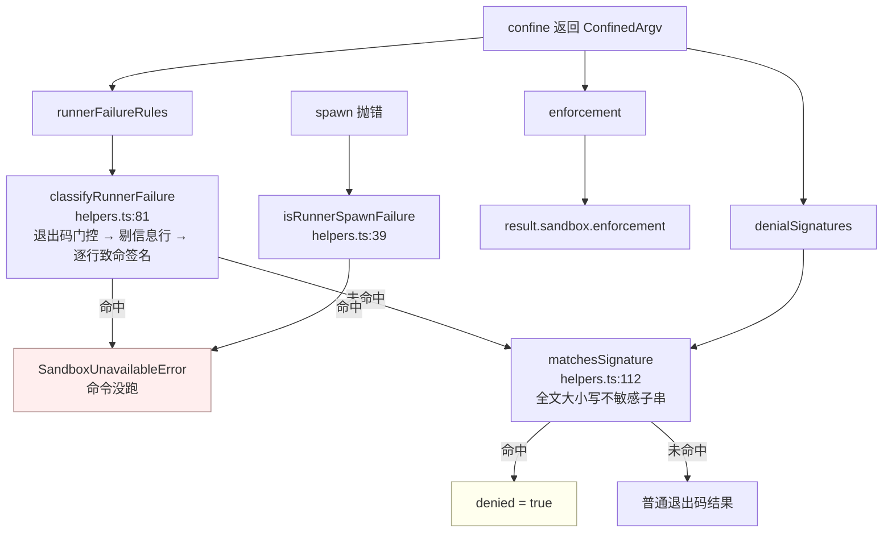
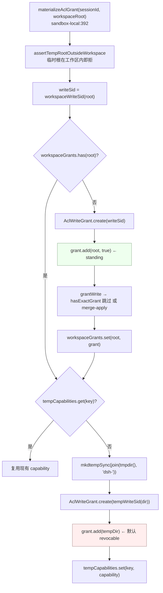

# 02 · 平台后端:函数级走查

> 对应第七章 [第三节](../07-sandbox.md#第三节-平台实现差异posix-runner-与-windows-acl)。
> 本篇拆开 `sandbox-local`(567 行)与 `sandbox-windows-acl` 的核心函数:选链、探针、argv 拼接、方言表、受限令牌、SID 派生、授权生命周期。

---

## 一句话结论

`LocalSandboxProvider.confine()` 做三件事:**选执行器**(平台优先、探针其次、结果整个 provider 生命期缓存)、**把它自己的 profile 方言拼成 argv 前缀**、**把该执行器的两组 stderr 事实原样下发**。win32 档位换了完全不同的机制——不是挂载或内核 allow-list,而是 `CreateRestrictedToken` + DACL 写授权,并且是唯一被静态标记为 `partial` 的档位。

---

## 第一节 平台选链与功能探针

### 1.1 链表与选择规则

```typescript
// packages/sandbox/sandbox-local/src/index.ts:141,159-166
type SelectedRunner = { runner: 'bwrap' | 'landlock' | 'seatbelt' | 'windows-acl'; enforcement: SandboxEnforcement }

const PLATFORM_CHAINS: Record<string, readonly SelectedRunner['runner'][]> = {
  linux: ['bwrap', 'landlock'],
  darwin: ['seatbelt'],
  win32: ['windows-acl'],
}
```

规则是**平台优先,探针其次**(`index.ts:150-158`):链上只有一个候选就**不探针**——"探针是仲裁,不是对没有替代方案的选项做二次验证"。后果是真实的:**win32 与 darwin 的探针在出厂组合里永不运行**,可用性由执行期拒绝兜底(`index.ts:162-165` 明写)。

```typescript
// packages/sandbox/sandbox-local/src/index.ts:499-510
private chainVerdict(): SelectedRunner | 'unavailable' {
  const chain = this.internals.chain ?? PLATFORM_CHAINS[this.internals.platform ?? process.platform] ?? []
  const [first, ...rest] = chain
  if (first === undefined) return 'unavailable'
  if (rest.length === 0) return { runner: first, enforcement: STATIC_ENFORCEMENT[first] }
  for (const runner of chain) {
    const enforcement = this.probeRunner(runner)
    if (enforcement !== 'unusable') return { runner, enforcement }
  }
  return 'unavailable'
}
```

| 分支 | 条件 | 结果 | 行号 |
|---|---|---|---|
| 空链 | 平台不在表里 | `'unavailable'` | `:502` |
| 独苗 | `rest.length === 0` | `STATIC_ENFORCEMENT[first]`,不探针 | `:504` |
| 多候选 | 按链序 `probeRunner` | 第一个非 `unusable` 者胜出,连 enforcement 一起定 | `:505-508` |
| 全败 | 所有探针不可用 | `'unavailable'` | `:509` |

判定缓存在 `selectedRunner` 字段,`??=` 保证只算一次(`:492-496`);粒度是**整个 provider 生命期**,这正是"安装/卸载/修复执行器需重载插件"的代码根据(`sandbox-local/README.md:131`)。

```typescript
// packages/sandbox/sandbox-local/src/index.ts:177-187
const STATIC_ENFORCEMENT: Record<SelectedRunner['runner'], SandboxEnforcement> = {
  bwrap: 'full',
  landlock: 'full',
  seatbelt: 'full',
  'windows-acl': 'partial',
}
```

只有 `windows-acl` 是 `partial`,两条不可消除的理由见第五节。`landlock` 在表里写 `full` 但**不可达**:Linux 链有两个候选,它只能经探针被选中,而探针报告才区分 `full` 与"按 ABI 的部分强制"(`:169-176` 明写这条不对称)。

### 1.2 四个探针:真的执行,不是查版本

| 探针 | 做什么 | 行号 |
|---|---|---|
| bwrap | 用 `read-only` profile 包 `true`, `status === 0` 即通过 | `index.ts:68-74` |
| Landlock | 执行 `landlock-run --probe`,解析 stdout 的 `partially enforced` | `:525`;`native/system/packages/entry/src/index.ts:116-127` |
| Seatbelt | `sandbox-exec -p` 应用**真实 profile** 跑 `true` | `index.ts:85-91` |
| windows-acl | 以 `read-only`(零授权、不改 DACL)包 `cmd /c exit 0` | `index.ts:100-112` |

```typescript
// packages/sandbox/sandbox-local/src/index.ts:519-538(节选)
case 'bwrap': return probe() ? 'full' : 'unusable'
case 'landlock': return probe(this.landlockLauncher())   // 探针自报 full|partial|unusable
case 'seatbelt': return probe(this.seatbeltExec()) ? 'full' : 'unusable'
case 'windows-acl': return probe() ? 'partial' : 'unusable'
```

Landlock 是唯一**由探针决定 full/partial** 的档位;其余三个的 enforcement 是常量,探针只决定"可用不可用"。Seatbelt 探针的注释指出它是 fail-closed 的落点:"`sandbox-exec` 被 Apple 标记为 deprecated 但每个 macOS 都还带着它;如果它哪天消失,这个探针就是失败封闭的那一点"(`:76-84`)。

### 1.3 `runnerCommand`:运维断言分支

```typescript
// packages/sandbox/sandbox-local/src/index.ts:317-324
if (this.runnerCommand !== undefined) {
  return {
    argv: [...this.runnerCommand, ...bwrapProfileArgs(policy), '--', ...argv],
    enforcement: 'full',
    denialSignatures: DENIAL_SIGNATURES.runnerCommand,
    runnerFailureRules: [{ fatalSignatures: this.configuredRunnerFailureSignatures }],
  }
}
```

构造函数做双向校验(`:283-291`):只给命令不给签名 → 抛错;只给签名不给命令 → 抛错;签名含空串或 `[\r\n]` → 抛错。该分支**完全跳过选链与探针**并直接断言 `full`——这就是 README 里"运维断言"的全部含义(`sandbox-local/README.md:132`)。它复用 bwrap 的 profile 拼写,所以自定义执行器必须实现 bwrap 兼容的参数集(`Config.runnerCommand` JSDoc,`index.ts:45-54`)。

---

## 第二节 三种 profile 的真实 argv

三个 builder 都返回"`--` 分隔符之前"的参数;分隔符与用户 argv 由 `confine()` 统一追加(`index.ts:319,328`),前缀由 `runnerArgv` 决定(`:337-343`)。

### 2.1 bwrap:只读绑定整根 + 按需叠加

```typescript
// packages/sandbox/sandbox-local/src/profiles.ts:16-23
export function bwrapProfileArgs(policy: SandboxPolicy): string[] {
  const args = ['--ro-bind', '/', '/', '--dev', '/dev', '--unshare-pid', '--proc', '/proc', '--die-with-parent']
  if (policy.mode === 'workspace-write') {
    args.push('--tmpfs', '/tmp')
    args.push('--bind', policy.workspaceRoot, policy.workspaceRoot)
  }
  return args
}
```

最终 argv(`workspace-write`):

```text
bwrap --ro-bind / / --dev /dev --unshare-pid --proc /proc --die-with-parent \
      --tmpfs /tmp --bind <workspaceRoot> <workspaceRoot> -- bash -c "echo hi"
```

要点:**先只读绑定整个宿主根**再叠加可写项,所以默认"哪儿都不能写";`--unshare-pid` + 私有 `/proc` 让命令能管自己的后代却看不到宿主进程,procfs magic link 因此无法绕过挂载(`sandbox-local/README.md:75`);`--die-with-parent` 让子进程随 bwrap 结束;`workspace-write` 下的 `/tmp` 是 **tmpfs**,与宿主 `/tmp` 不是同一个对象(`bash-sandbox/README.md:39`)。

### 2.2 Landlock:内核 allow-list,不是挂载

```typescript
// packages/sandbox/sandbox-local/src/profiles.ts:30-36
export function landlockProfileArgs(policy: SandboxPolicy): string[] {
  const readWrite = ['/dev/null']
  if (policy.mode === 'workspace-write') {
    readWrite.push('/tmp', policy.workspaceRoot)
  }
  return landlockGrantArgs({ readOnly: ['/'], readWrite })
}
```

最终 argv(`workspace-write`):

```text
landlock-run --ro / --rw /dev/null --rw /tmp --rw <workspaceRoot> -- bash -c "echo hi"
```

`/dev/null` 用 `--rw` 单文件授权表达;`grantArgs` 的拼写是 readOnly 先、readWrite 后、按调用方顺序(`native/system/packages/entry/src/index.ts:94-99`),而 launcher 对非目录授权"只保留文件兼容的访问位",这正是 `--rw /dev/null` 能工作的原因(`native/system/docs/cli-contract.md:15`)。本包**只做模式→授权映射**,路径解析、grant 拼写、探针解析全归上游版本化的 launcher(`profiles.ts:7`、`sandbox-local/README.md:77`)。

### 2.3 Seatbelt:SBPL 文本

```typescript
// packages/sandbox/sandbox-local/src/profiles.ts:51-58
export function seatbeltProfileArgs(policy: SandboxPolicy): string[] {
  const forms = ['(version 1)', '(allow default)', '(deny file-write*)', `(allow file-write* (literal ${sbplString('/dev/null')}))`]
  const roots = writableRoots(policy)
  if (roots.length > 0) {
    forms.push(`(allow file-write* ${roots.map(root => `(subpath ${sbplString(root)})`).join(' ')})`)
  }
  return ['-p', forms.join(' ')]
}
```

最终 argv(`workspace-write`):

```text
sandbox-exec -p '(version 1) (allow default) (deny file-write*) (allow file-write* (literal "/dev/null")) (allow file-write* (subpath "<root>") (subpath "/private/tmp") (subpath "<tmpdir>"))' -- bash -c "echo hi"
```

三点:**allow-default 加 `deny file-write*`** 只约束文件写,读/网络/进程全放行,与 `SandboxMode` 的词表边界一致;**可写根来自共享的 `writableRoots()`**(`sandbox/src/roots.ts:52`)而不是本文件自算,所以 Seatbelt 与进程内 fs 围栏不会漂移(`profiles.ts:44-48`);`sbplString` 只转义 `\` 与 `"`(`:39-41`)。

### 2.4 三档对照

| 维度 | bwrap | Landlock | Seatbelt |
|---|---|---|---|
| 机制 | 挂载命名空间 | 内核 ruleset(allow-list) | SBPL 策略文本 |
| `read-only` 的写汇 | 无额外项(`/dev` 是新挂的) | `--rw /dev/null` | `(literal "/dev/null")` |
| `workspace-write` 临时区 | `--tmpfs /tmp`(临时) | `--rw /tmp`(宿主) | `writableRoots()` 的 canonical `/tmp` 与 `os.tmpdir()` |
| 可写集来源 | 本文件手写 `--bind` | 本文件手写 `/tmp` + 根 | 共享 `writableRoots()` |
| full/partial 由谁定 | 静态 `full` | 探针报告 | 静态 `full` |

最后一行的不对称是真实的,`roots.ts:8-11` 承认:"bwrap 与 Landlock 保留各自的 grant 拼写,差异由测试钉住"。

---

## 第三节 拒绝方言与执行器失败规则

### 3.1 两组常量表

```typescript
// packages/sandbox/sandbox-local/src/index.ts:205-213
const DENIAL_SIGNATURES = {
  bwrap: ['read-only file system'],
  landlock: ['permission denied'],
  seatbelt: ['operation not permitted'],
  'windows-acl': ['access is denied', 'access to the path', 'permission denied'],
  runnerCommand: ['read-only file system', 'permission denied'],
} as const satisfies Record<SelectedRunner['runner'] | 'runnerCommand', readonly string[]>
```

`windows-acl` 的三条各对应一个真实产生方,注释带了完整例句(`:209-211`):pwsh/.NET 的 `Access to the path '...' is denied.`、cmd 的 `Access is denied.`、node EACCES 的 `permission denied`。

```typescript
// packages/sandbox/sandbox-local/src/index.ts:216,231-240
const WINDOWS_ACL_RUNNER_FAILURE_EXIT = 127

const RUNNER_FAILURE_RULES = {
  bwrap: [{ fatalSignatures: ['bwrap: '] }],
  landlock: [{
    allowedExitCodes: [LAUNCHER_FAILURE_EXIT],
    fatalSignatures: [`${LAUNCHER_BIN}: `],
    informationalLines: [`${LAUNCHER_BIN}: partial enforcement (older Landlock ABI)`],
  }],
  seatbelt: [{ fatalSignatures: ['sandbox-exec: '] }],
  'windows-acl': [{ allowedExitCodes: [WINDOWS_ACL_RUNNER_FAILURE_EXIT], fatalSignatures: ['windows-acl-run: '] }],
}
```

门控粒度是刻意的(`:218-230`):**Landlock 有版本化的 125 + `landlock-run: ` 致命行约定**(`native/system/docs/cli-contract.md:20-30`),**windows-acl 有执行器自己的 127 + `windows-acl-run: `**(`runner.ts:54-55`),两者带退出码门控;bwrap 与 Seatbelt **只有签名**——"bwrap 当前致命路径退出 1,但它的公开约定没有保留这个状态",`sandbox-exec` 干脆不发布 launcher 失败状态。`RUNNER_FAILURE_EXIT` 从上游导入(`:30`)。

### 3.2 三组事实如何被消费



`isRunnerSpawnFailure` 的判据四条缺一不可:

```typescript
// packages/shell/bash-sandbox/src/helpers.ts:39-53(节选)
if (runnerProgram === undefined || !isUsableWorkdir(workdir)) return false
if (typeof code !== 'string' || !EXECUTABLE_SPAWN_CODES.has(code)) return false   // {EACCES, ENOENT}
if (typeof syscall !== 'string') return false
const exactSyscall = `spawn ${runnerProgram}`
if (path === undefined) return syscall === exactSyscall
if (typeof path !== 'string' || path.length === 0 || path !== runnerProgram) return false
return syscall === 'spawn' || syscall === exactSyscall
```

即:**调用方 cwd 可进入**(先排除"是 cwd 坏了")、code ∈ {EACCES, ENOENT}、syscall 是字符串、`path` 精确等于 `argv[0]`(无 path 时 `syscall` 精确等于 `spawn <argv[0]>`)。注释承认一处非原子性:"cwd 是在分类时检查的,不与 spawn 原子;并发路径替换会改变归因,但**不可能让一次无约束执行发生**"(`helpers.ts:31-33`)。

---

## 第四节 Windows:受限令牌与 workspace SID

机制总览:**把当前进程令牌复制成 `WRITE_RESTRICTED` 令牌,restricting SID 列表里放进工作区与私有临时目录的写 SID;Windows 做两次访问检查,只有两次都通过才授予写类访问**(`sandbox-windows-acl/README.md:90`)。

### 4.1 令牌构造

`init()` 走 `openCurrentProcessToken`(`token.ts:23-42`),用 `OpenProcess(PROCESS_QUERY_INFORMATION, 0, process.pid)` 再 `OpenProcessToken(...)`,而不是 `GetCurrentProcess()` 伪句柄——后者"通过 koffi 不可寻址"(`token.ts:15-19`)。请求权限含 `TOKEN_ADJUST_DEFAULT`,正是后面修补默认 DACL 需要的(`token.ts:30`)。

```typescript
// packages/sandbox/sandbox-windows-acl/src/token.ts:204-218(节选)
const restrictingSids = buildRestrictingSids(mode === 'read-only'
  ? [logonSid, known.world]
  : writeSids.length === 0
    ? (() => { throw new Error('createRestrictedToken: workspace-write restricting list requires at least one write SID') })()
    : [logonSid, known.world, ...writeSids])
const created = api.createRestrictedToken(
  currentToken,
  abi.DISABLE_MAX_PRIVILEGE | abi.LUA_TOKEN | abi.WRITE_RESTRICTED,
  0, null, 0, null,
  restrictingSids.length / abi.SID_AND_ATTRIBUTES_SIZE,
  restrictingSids,
  tokenSlot,
)
```

| 模式 | restricting 列表 | 行号 |
|---|---|---|
| `read-only` | `[logon SID, EVERYONE]` | `token.ts:164` |
| `workspace-write` | `[logon SID, EVERYONE, workspace SID, (temp SID)]` | `token.ts:165` |

四个 SID 的理由(`token.ts:161-186`):**logon SID + EVERYONE 是保活组,两种模式都要**——否则早期 DLL 初始化死于 `0xC0000142`,CNG 让 pwsh 崩 `0xE0434352`;**写 SID 只进 workspace-write 列表**,于是 read-only 下先前留下的 standing ACE 保持惰性,而那条未撤销的 ACE 又让重新升级无需重新传播;Authenticated Users 与 INTERACTIVE/LOCAL 两个列表都没有——前者让 WMI 命名空间安全检查失败(`0x80041003`,CIM 在受限模式下不可用)并封掉 `C:\` 根目录树创建逃逸,后者封掉宿主 Public 树的写权限(它授予 INTERACTIVE)。

### 4.2 为什么修补令牌默认 DACL

```typescript
// packages/sandbox/sandbox-windows-acl/src/index.ts:294
setTokenDefaultDaclGrant(api, restrictedToken, this.tempWriteSidPtr ?? this.writeSidPtr ?? worldSid)
```

原因(`index.ts:282-293`、`token.ts:96-111`):受限令牌**原样继承用户的默认 DACL,而其中不指名任何 restricting SID**;受限进程创建的每个新对象(匿名 stdio 管道、同步对象)都用默认 DACL,于是写 pass-2 检查会拒掉管道创建(`ERROR_ACCESS_DENIED`,Node 表现为 spawn `EPERM`),**所有带管道的孙进程 spawn 都会坏掉**。修补方式是往默认 DACL 合并一条"某个 restricting SID 的 full-access ACE",优先用**私有临时 SID**,"这样某会话临时树里的默认 DACL 对象不会拿到共享的工作区能力"(`:291-293`)。实现三步 `GetTokenInformation(TokenDefaultDacl)` → `SetEntriesInAclW` → `SetTokenInformation`,每步查错(`token.ts:112-145`)。

### 4.3 写 SID 的确定性派生

```typescript
// packages/sandbox/sandbox-windows-acl/src/workspace-sid.ts:35-40,49-54(节选)
export function workspaceWriteSid(workspaceRoot: string): string {
  const digest = createHash('sha256').update(workspaceRoot, 'utf8').digest()
  const first = (digest.readUInt32LE(0) % (2 ** 30 - 1)) + 1
  const second = (digest.readUInt32LE(4) % (2 ** 30 - 1)) + 1
  return `S-1-4-${first}-${second}`
}

export function tempWriteSid(tempDir: string): string {
  const digest = createHash('sha256').update('temp\0', 'utf8').update(tempDir, 'utf8').digest()
  /* 同上派生出 first / second */
  return `S-1-4-${first}-${second}-1`
}
```

四点:**输入必须是 canonical 工作区路径**——`sandbox-policy` 的 `resolveWorkspaceRoot` 已先 canonical 再 resolve(`sandbox-policy/src/index.ts:36-38`),所以"同一目录的两种拼写派生同一个 SID"(`workspace-sid.ts:16-23`);**子授权 30 位**匹配 token 与 ACE 层承载的形状(`:31-33`);**temp 版本多一个固定第三子授权 `-1`**,把结果与所有两子授权的工作区 SID 域分离(`:43-47`);**SID 字符串本身不是秘密**——它的权力完全由指名它的 ACE 定义(`:8-10`)。作用域差异是本节关键:工作区 SID 是"每工作区每机器"身份,临时 SID 是"每目录"身份。

### 4.4 授权物化与 exact-ACE 跳过

```typescript
// packages/sandbox/sandbox-windows-acl/src/acl.ts:231-244(节选)
export function grantWrite(api: Win32Bindings, path: string, sidPtr: NativePtr): void {
  withPathLock(api, path, () => {
    const { oldAcl, descriptor } = readCurrentDacl(api, path)
    if (oldAcl !== null && hasExactGrant(oldAcl, sidPtr)) { /* 只释放 descriptor 即返回 */ return }
    mergeAndApply(api, path, buildExplicitAccess(sidPtr, abi.GRANT_ACCESS, abi.GRANT_MASK), oldAcl, descriptor, 'grantWrite')
  })
}
```

`hasExactGrant` 逐字段比对 `ACCESS_ALLOWED_ACE_TYPE`、`SUB_CONTAINERS_AND_OBJECTS_INHERIT`、`GRANT_MASK` 与**内联 SID**(`acl.ts:196-213`);注释记下真实教训:"ACE 的 SID 是内联的,没有指针可读,读一个指针会拿到垃圾地址并让 `EqualSid` 崩溃——用 gdb 验证过"(`:186-190`)。ACL 头或 ACE 尺寸不合理时**读作"没有精确授权"**,退回 merge 路径(`:189-191,199,205`)。

整个 get-merge-set 序列跑在**按路径的独占文件锁**下(`withPathLock`,`acl.ts:75-109`),锁文件为 `<GetTempPathW()>\dsh-acl-locks\<sha256(小写路径)前 16 hex>.lock`(`:55-58`)。三个设计点:锁根取自 `GetTempPathW`(不是 runner argv 或 `DSH_HOME`,见 `:47-50`);路径**小写化**才能把 Windows 的大小写不敏感拼写映射到同一把锁;`CreateFileW` **不共享删除权限**——"可删除的锁文件能在持有者脚下被删掉重建,让两个进程同时持有'同一把'锁"(`:62-64`)。

---

## 第五节 standing vs revocable:授权生命周期

### 5.1 两个 Map

```typescript
// packages/sandbox/sandbox-local/src/index.ts:266-274
private readonly workspaceGrants = new Map<string, AclWriteGrant>()
private readonly tempCapabilities = new Map<string, AclTempCapability>()
```

| Map | 键 | 生命周期 |
|---|---|---|
| `workspaceGrants` | `workspaceRoot`(`:395`) | **整个 provider 生命期,且刻意跨 provider 存活**——ACE 就是复用缓存 |
| `tempCapabilities` | `JSON.stringify([sessionId, workspaceRoot])`(`:412`) | 随 provider `dispose` 撤销并删除目录 |

键的选择本身是语义:工作区写权按**工作区**索引,临时能力按**会话 × 工作区**索引——"同一工作区的两个会话共享工作区写权、各有各的临时树"是这个键设计的直接推论。

### 5.2 物化流程



半物化失败路径逐条对应:

| 阶段 | 失败时的动作 | 行号 |
|---|---|---|
| 工作区 `grant.add` 抛错 | `grant.dispose()` 释放 SID;**不撤销**可能已生效的 standing ACE——"standing ACE 是预期终态,不是错误残留" | `index.ts:397-409` |
| 工作区清理也失败 | `AggregateError([error, cleanupError], '...workspace grant failed and its cleanup also failed')` | `index.ts:406` |
| 临时 `grant.add` 抛错 | dispose grant → `removeTempDir(tempDir)`,两者分别收集失败 | `index.ts:421-439` |
| 临时清理也失败 | `AggregateError([error, ...cleanupFailures], '...temp grant materialization failed and its cleanup also failed')` | `index.ts:436` |

`assertTempRootOutsideWorkspace` 在**任何授权之前**拒掉"临时根在工作区内",理由是"它下面创建的每个子目录都会继承 standing 工作区能力"(`path-boundary.ts:16-25`);`containsDirectory` 用 `realpathSync.native` + `path.relative` 做 canonical 判定(`:11-14`)。`AclSandbox.init()` 侧还有互补的 `assertPrivateTempDisjoint`,**双向**拒绝重叠——"任一继承方向都会把两个能力合并"(`path-boundary.ts:34-40`,调用点 `index.ts:246`)。

### 5.3 dispose:为什么工作区 ACE 不撤

`revokeAclGrants` 把两类 grant 都 dispose 并删除临时目录,失败只 `logger.warn` 不抛错——"cordis 拆卸不能被 grant 清理中止"(`index.ts:445-477`)。但 `AclWriteGrant.dispose()` 只遍历 `revocablePaths` 并 `revokeWrite`,standing 路径被跳过(`grant.ts:85-93`),所以**工作区 ACE 仍然留在磁盘上**——这正是设计意图:`ctx.effect(() => () => { this.revokeAclGrants() })` 的注释写明"干净的服务器关闭不留下临时 ACE;工作区 ACE 按设计保留(复用缓存),不干净的关闭会把它们留给下一次供给的 exact-ACE 跳过"(`index.ts:296-302`)。

`AclWriteGrant.add` 有一处反直觉但必要的行为:**路径在授权之前就被记录**——"`grantWrite` 可能在 apply 成功之后抛错(一次 `LocalFree` 失败),而 fail-closed 的 catch 仍必须撤销那条路径;撤销一条未授权的路径是无操作合并"(`grant.ts:63-68`)。

### 5.4 两种生命周期的完整对照

| 维度 | standing(工作区) | revocable(私有临时目录) |
|---|---|---|
| SID 身份 | `workspaceWriteSid(canonicalRoot)`,确定 | `tempWriteSid(randomDir)`,随机 |
| 作用域 | 每工作区每机器 | 每会话 × 工作区 |
| 加入方式 | `grant.add(root, true)`(`index.ts:398`) | `grant.add(tempDir)` 默认 false(`index.ts:420`) |
| dispose 行为 | **跳过撤销**(`grant.ts:87`) | `revokeWrite` 撤销 + `rmSync` 删目录(`grant.ts:87-92`、`index.ts:481`) |
| 重新供给代价 | exact-ACE 跳过 → O(1)(`acl.ts:234-241`) | 新随机目录 + 新 SID,必然全量 |
| 崩溃残留 | 留下 inert ACE(README 称"不可见残留") | 随机目录 + 仅 temp SID 的 ACE;新 provider 永不复用该路径或 SID |
| 幂等性 | 有 | 无(路径随机) |

### 5.5 runner 侧的 argv 契约与委托关系

```text
node runner.js --workspace <dir> --temp <dir> --mode <read-only|workspace-write> \
     [--write-sid <S-1-4-…> --temp-write-sid <S-1-4-…>] -- <argv...>
```

契约写在 `runner.ts:9-14`,由 `windowsAclRunnerArgv` 生产(`index.ts:358-377`):

| 形态 | 生产的 argv | 谁管 DACL |
|---|---|---|
| 无 `sessionId`,或 `read-only` | `--workspace <root> --temp <tmpdir()> --mode <mode>`,**不带 SID** | runner 自己(`manageDacls: true`) |
| `sessionId` 且 `workspace-write` | 追加 `--write-sid …--temp-write-sid …`,`--temp` 指向私有目录 | **seam 已物化**(`manageDacls: false`) |

runner 侧校验(`runner.ts:122-131`):`read-only` 下出现任一 SID 参数 → fail;`workspace-write` 下两个 SID **必须成对**;随后再过一次 `assertTempRootOutsideWorkspace`。带 SID 时还会**反算校验**——`workspaceWriteSid(parsed.workspace) !== parsed.writeSid` 或 `tempWriteSid(dir) !== parsed.tempWriteSid` 即 fail(`:151,154`),因为"provider 传了错的 SID 必须在 runner 边界大声失败"(`:117-118`)。

其余 runner 行为:`requireDirectory` 校验两个目录(`:119-120`);`SetConsoleCtrlHandler(null, 1)` **忽略自己的 CTRL+C**,让受限子进程继续处理自己的信号,而 runner 活到撤销授权并镜像退出码(`:134-139`);`stdio: 'inherit'` 字节直通(`:184`);`TMP`/`TEMP` 在 spawn 前重写到私有目录(`:172-179`),注释解释为什么不通过 `lpEnvironment` 传块——"通过 koffi 显式传块会让 `CreateProcessAsUserW` 报 `ERROR_INVALID_PARAMETER`,经验证"(`:34-38`);子进程放进 kill-on-close job(`index.ts:356`);退出码**全 32 位镜像**(`runner.ts:207-218`,注释附本机实测:`0xC0000005` 读回 `3221225477`,链路无截断)。失败契约最后一遍:**任何 runner 侧失败都打印 `windows-acl-run: <detail>` 并退出 127,子进程永不无约束启动**(`:40-43`)。

---

## 关键文件 / 符号索引表

| 文件 | 关键符号 | 行号 |
|---|---|---|
| `packages/sandbox/sandbox-local/src/index.ts` | `Config` / `SandboxInternals` | 44-65 / 115-138 |
| | `defaultProbe{Bwrap,Seatbelt,WindowsAcl}` | 68-74 / 85-91 / 100-112 |
| | `SelectedRunner` / `AclTempCapability` / `PLATFORM_CHAINS` / `STATIC_ENFORCEMENT` | 141 / 144-148 / 159-166 / 177-187 |
| | `DENIAL_SIGNATURES` / `WINDOWS_ACL_RUNNER_FAILURE_EXIT` / `RUNNER_FAILURE_RULES` | 205-213 / 216 / 231-240 |
| | `confine` / `runnerArgv` / `windowsAclRunnerArgv` / `materializeAclGrant` | 316-333 / 336-344 / 358-377 / 392-443 |
| | `revokeAclGrants` / `removeTempDir` / `windowsAclRunnerInvocation` / `selectRunner` / `chainVerdict` / `probeRunner` | 454-477 / 480-483 / 557-564 / 492-496 / 499-510 / 513-539 |
| `packages/sandbox/sandbox-local/src/profiles.ts` | `bwrapProfileArgs` / `landlockProfileArgs` / `sbplString` / `seatbeltProfileArgs` | 16-23 / 30-36 / 39-41 / 51-58 |
| `packages/sandbox/sandbox-windows-acl/src/index.ts` | `AclSandboxOptions` / 构造校验 / `setTokenDefaultDaclGrant` 调用点 | 59-98 / 180-210 / 294 |
| | `init` / `spawn` / `dispose` | 219-336 / 348-386 / 393-430 |
| `packages/sandbox/sandbox-windows-acl/src/token.ts` | `openCurrentProcessToken` / `findLogonSid` / `setTokenDefaultDaclGrant` / `createRestrictedToken` | 23-42 / 52-77 / 112-145 / 196-223 |
| `packages/sandbox/sandbox-windows-acl/src/workspace-sid.ts` | `workspaceWriteSid` / `tempWriteSid` | 35-40 / 49-54 |
| `packages/sandbox/sandbox-windows-acl/src/grant.ts` | `AclWriteGrant.create` / `add` / `dispose` | 49-58 / 74-77 / 85-103 |
| `packages/sandbox/sandbox-windows-acl/src/acl.ts` | `buildExplicitAccess` / `withPathLock` / `hasExactGrant` / `grantWrite` / `revokeWrite` | 34-44 / 75-109 / 196-213 / 231-244 / 258-271 |
| `packages/sandbox/sandbox-windows-acl/src/path-boundary.ts` | 三个边界函数 | 11-14 / 22-26 / 34-40 |
| `packages/sandbox/sandbox-windows-acl/src/runner.ts` | argv 契约 / `fail` / `parseArgs` / `main` / 退出码镜像 | 9-14 / 60-63 / 75-107 / 115-205 / 207-226 |
| `packages/shell/bash-sandbox/src/helpers.ts` | `isRunnerSpawnFailure` / `classifyRunnerFailure` / `matchesSignature` | 39-53 / 81-103 / 112-116 |
| `native/system/packages/entry/src/index.ts` | `grantArgs` / `probe` / `LAUNCHER_FAILURE_EXIT` | 94-99 / 116-127 / 31 |
