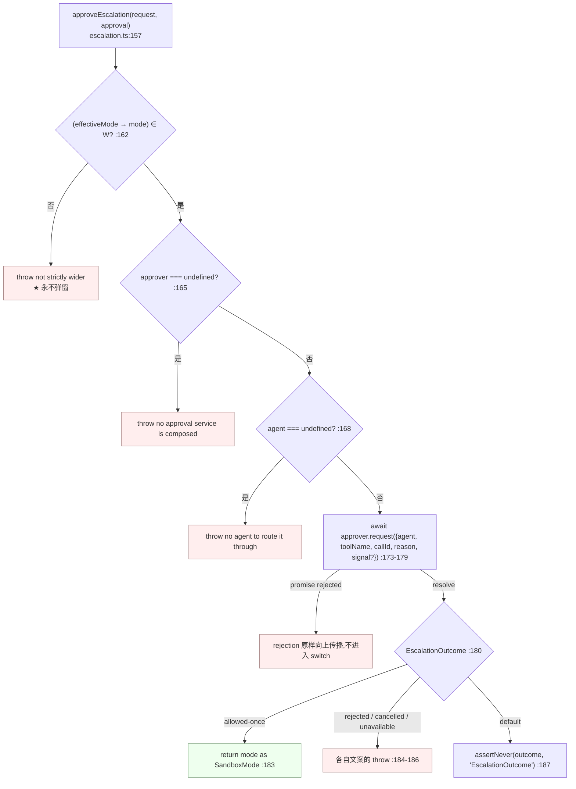
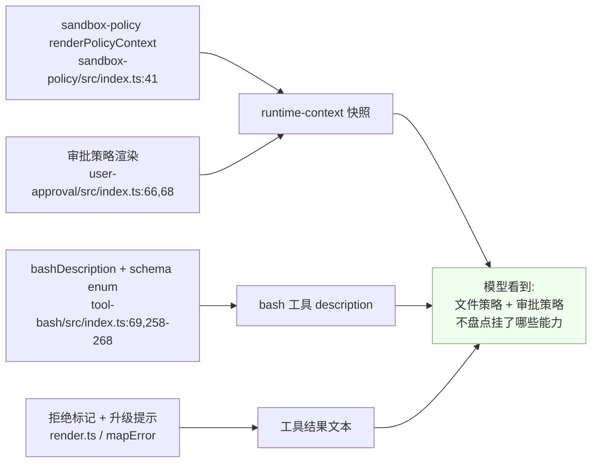
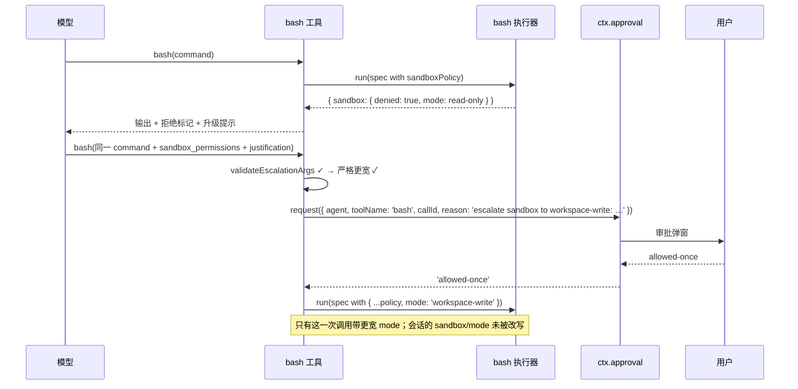

# 03 · 升级机制:严格更宽阶梯与有序失败封闭

> 对应第七章 [第五节](../07-sandbox.md#第五节升级escalation与审批衔接),并把它展开到逐条失败点。
> 覆盖 `packages/sandbox/sandbox/src/escalation.ts`(189 行)全部导出符号,以及两个工具族的广告闸门与错误映射。

---

## 一句话结论

升级是沙箱机制里**唯一**从拒绝中恢复的通道,由三块拼成:**一张封闭的严格更宽表**(`WIDER_MODES`,执行期判定)、**一个封闭的目标词表**(`ESCALATION_TARGETS`,schema 广告用)、**一个有序的失败封闭序列**(`approveEscalation`,先校验、后审批、再执行)。这条序列**没有任何降级路径**——无审批服务、无 agent、被拒、被取消、通道不可用,全部抛错,即"什么都没执行"。

---

## 第一节 `WIDER_MODES`:严格更宽的形式化定义

```typescript
// packages/sandbox/sandbox/src/escalation.ts:28-31
export const WIDER_MODES: Record<string, readonly SandboxMode[]> = {
  'read-only': ['workspace-write', 'danger-full-access'],
  'workspace-write': ['danger-full-access'],
}
```

把模式全集记作 `M = {read-only, workspace-write, danger-full-access}`,上表是**二元关系 `W ⊆ M × M` 的邻接表表示**:

```text
W = { (read-only, workspace-write),
      (read-only, danger-full-access),
      (workspace-write, danger-full-access) }
```

判定发生在执行期,针对**本次调用的有效模式**:

```typescript
// packages/sandbox/sandbox/src/escalation.ts:162-164
if (!(WIDER_MODES[effectiveMode] ?? []).includes(mode as SandboxMode)) {
  throw new Error(`sandbox escalation to "${mode}" is not strictly wider than this call's current "${effectiveMode}" mode`)
}
```

`?? []` 不是防御性写法:`danger-full-access` 不是表的键,所以查询结果天然为空数组——**上界无法再往上走**是靠这一点实现的,而不是靠额外分支。`includes()` 用字符串等值,所以任何表外取值都落到 `false` 分支。

### 1.1 四条性质,逐条对应代码

| 性质 | 形式化 | 实现方式 | 后果 |
|---|---|---|---|
| 非自反 | `∀m ∈ M, (m,m) ∉ W` | 三个键的值都不含自身 | `sandbox_permissions: "read-only"` 在 `read-only` 下必然抛错 |
| 传递 | `(a,b) ∈ W ∧ (b,c) ∈ W → (a,c) ∈ W` | `read-only → danger-full-access` 显式列出,不依赖传递闭包 | 表是完整关系,不是"只列直接后继" |
| 下界无入边 | `∄m, (m, read-only) ∈ W` | `read-only` 从不出现在任何值里 | 无法升级到 `read-only` |
| 上界无出边 | `WIDER_MODES['danger-full-access']` 未定义 | `?? []` | `danger-full-access` 下无法升级 |

四条合起来说明 `W` 就是**由文件效果包含关系诱导的严格全序的前驱关系**:`read-only ⊂ workspace-write ⊂ danger-full-access`,与 `SandboxMode` 的语义定义一致(`sandbox/src/index.ts:23-29`)。

### 1.2 为什么是执行期检查,不是 schema 约束

```typescript
// packages/sandbox/sandbox/src/escalation.ts:41
export const ESCALATION_TARGETS: readonly SandboxMode[] = ['workspace-write', 'danger-full-access']
```

分工写在这两处 JSDoc 里:**schema 的 enum 是注册表全局的,有效模式是逐调用的真相**(`escalation.ts:22-27`);而"不能把 enum 收窄成比组合默认更宽的那些"拥有一个真实的反例(`:33-40`):

| 组合默认 | 会话最后一次 `sandbox/mode` | 有效模式 | 若 enum 收窄为"比默认更宽" | 实际可用 |
|---|---|---|---|---|
| `read-only` | 无 | `read-only` | `['workspace-write','danger-full-access']` | 相同 |
| `danger-full-access` | `read-only` | `read-only` | `[]`(没有比 `danger-full-access` 更宽的模式) | **是 `['workspace-write','danger-full-access']`,能救** |

原文的措辞是"会让一个有效模式**低于**默认的会话被关着却没有撬杆"(`:37-39`)。

### 1.3 广告闸门:`escalationModes = []` 的含义

| 位置 | 闸门 | 行号 |
|---|---|---|
| bash 工具 | `const escalationModes = defaultMode === undefined ? [] : ESCALATION_TARGETS` | `tool-bash/src/index.ts:191-192` |
| fs 工具 | `this.escalationModes = defaultMode === undefined ? [] : ESCALATION_TARGETS` | `tool-fs/src/sandbox.ts:44-45` |

两个 `defaultMode` 分别来自 `ctx.shell.sandboxMode` 与 `ctx.fs.sandboxMode`;基类实现都返回 `undefined`(`packages/shell/shell/src/index.ts:74-76`、`packages/fs/fs/src/index.ts:103-105`),**只有真会 confine 的实现才覆写**(`bash-sandbox/src/index.ts:76-78` 返回 `ctx.sandboxPolicy.defaultMode`)。所以"这个组合有没有沙箱"是**能力事实**,不是配置项。

---

## 第二节 参数配对校验

```typescript
// packages/sandbox/sandbox/src/escalation.ts:51-61
export function validateEscalationArgs(sandboxPermissions: string | undefined, justification: string | undefined): void {
  if (sandboxPermissions !== undefined && justification === undefined) {
    throw new Error('invalid escalation: sandbox_permissions requires a justification')
  }
  if (justification !== undefined && sandboxPermissions === undefined) {
    throw new Error('invalid escalation: justification is only valid together with sandbox_permissions')
  }
  if (justification !== undefined && justification.trim().length === 0) {
    throw new Error('invalid justification: expected a non-empty sentence')
  }
}
```

三条检查覆盖三种畸形请求,理由在 JSDoc 里:"**没有理由的弹窗**与**驱动不了任何东西的理由**都算畸形请求"(`escalation.ts:43-50`)。第三条用 `trim()`,所以 `"   "` 同样被拒。调用点在两条工具路径的最前面:`tool-bash/src/index.ts:64-66`(`execute` 第一行在 `:330`)与 `tool-fs/src/sandbox.ts:88`(解析标准策略**之前**)。

---

## 第三节 `approveEscalation`:有序失败封闭序列



### 3.1 八条失败点 + 一条成功路径,逐条列出

| # | 阶段 | 判定 | 结果(逐字) | 行号 |
|---|---|---|---|---|
| 1 | **严格更宽**(不弹窗) | `!(WIDER_MODES[effectiveMode] ?? []).includes(mode)` | `sandbox escalation to "<mode>" is not strictly wider than this call's current "<effectiveMode>" mode` | `:162-164` |
| 2 | **审批服务存在** | `approval.approver === undefined` | `sandbox escalation to "<mode>" requires approval, but no approval service is composed` | `:165-167` |
| 3 | **可路由的 agent 存在** | `approval.agent === undefined` | `sandbox escalation to "<mode>" requires approval, but the call has no agent to route it through` | `:168-170` |
| 4 | **审批请求本身** | `await approval.approver.request(...)` 的 promise 被拒 | **原样传播**;`switch` 不参与,没有转译 | `:173-179` |
| 5 | 结果 `allowed-once` | — | **返回 `mode as SandboxMode`** | `:183` |
| 6 | 结果 `rejected` | — | `the user rejected escalating this <subject> to "<mode>"` | `:184` |
| 7 | 结果 `cancelled` | — | `approval for escalating to "<mode>" was cancelled` | `:185` |
| 8 | 结果 `unavailable` | — | `sandbox escalation to "<mode>" requires approval, but no approval channel is available` | `:186` |
| 9 | 词表外结果 | `default` | `assertNever(outcome, 'EscalationOutcome')`——编译期穷尽守卫 | `:187` |

四条顺序性质:

1. **第 1 条在任何副作用之前**——非更宽的请求**永远不会弹窗**给用户(`escalation.ts:151-152`)。这是安全性质:模型不能靠发无意义的升级请求刷用户注意力。
2. **第 2、3 条在请求之前**,不是"发出去再说";无审批服务/无 agent 的调用根本不产生审批事件。
3. **第 4 条没有转译**;审批服务抛出的任何异常原样冒泡。
4. **`subject` 只出现在"被拒"的文案里**(`:184`)。两族取值不同:bash 传 `'command'`(`tool-bash/src/index.ts:223`),fs 传 `'operation'`(`tool-fs/src/sandbox.ts:98`)。

### 3.2 结果词表与实际实现的同构

```typescript
// packages/sandbox/sandbox/src/escalation.ts:88-93
export type EscalationOutcome = 'allowed-once' | 'rejected' | 'cancelled' | 'unavailable'
```

它是**结构相同而非导入**:与审批缝的 `ApprovalOutcome` 结构一致,所以 `ApprovalService.request` 的返回值可直接赋值,而本包不必导入它(`escalation.ts:88-92`)。审批服务侧的词表完全对齐(`user-approval/src/index.ts:47-48`)。通道本身是最小结构类型:

```typescript
// packages/sandbox/sandbox/src/escalation.ts:102-109
export interface EscalationApprover<A = object, C = string> {
  request(req: { agent: A; toolName: string; callId: C; reason: string; signal?: AbortSignal }): Promise<EscalationOutcome>
}
```

`A` / `C` 是泛型,由工具层推断成自己的 `Agent` / `ToolCallId`,工具层用闭包把 `ctx.approval.request` 递下来(`escalation.ts:10-15`)。审批请求的 `reason` 是自包含的:

```typescript
// packages/sandbox/sandbox/src/escalation.ts:171-179
// Self-contained for the audit trail: approval/asked stores this reason,
// and the target mode is part of the grant's identity.
const outcome = await approval.approver.request({
  agent: approval.agent,
  toolName: approval.toolName,
  callId: approval.callId,
  reason: `escalate sandbox to ${mode}: ${justification}`,
  ...approval.signal ? { signal: approval.signal } : {},
})
```

---

## 第四节 工具层:广告、调用与错误映射

### 4.1 两个工具族各自的桥

| 族 | 桥的位置 | 组合守卫(先于共享序列) | 解析方式 |
|---|---|---|---|
| bash | `approveBashEscalation`(`tool-bash/src/index.ts:212-232`) | `escalationModes.length === 0` → `throw new Error('sandbox_permissions is not available in this composition (no sandboxing executor to escalate)')`(`:218-220`) | `effectiveMode = standingPolicy.mode`(`:221`) |
| fs | `FsSandboxController.resolvePolicy`(`tool-fs/src/sandbox.ts:87-108`) | 同左,文案换成 "no sandboxing filesystem to escalate"(`:93-95`) | `effectiveMode = policy.mode`(`:98`) |

组合守卫存在的原因是真实的:

```text
// packages/shell/tool-bash/src/index.ts:201-211(注释节选)
// ...the composition guard (the fields are unadvertised without a
// sandboxing executor, yet schema validation checks advertised keys only,
// so an unadvertised `sandbox_permissions` still reaches execute) ...
```

即 **schema 只校验被广告的键**;未广告的字段依然能到达 `execute`,所以"不广告"不等于"用不了",必须显式拒绝。两族的调用形态一致,只是 subject 与 toolName 不同:

```typescript
// packages/shell/tool-bash/src/index.ts:222-231
return approveEscalation(
  { requestedMode: mode, justification, effectiveMode, subject: 'command' },
  { approver: ctx.get('approval'), agent: exec.agent, callId: exec.callId, toolName: 'bash', signal: exec.signal },
)
```

fs 侧用同一个序列,并返回"原策略换 mode":`return { ...policy, mode: approvedMode }`(`tool-fs/src/sandbox.ts:107`)——**升级只换文件效果边界,不换工作区**。注意 `ctx.get('approval')` 而不是 `ctx.approval`:审批是可选服务,读法遵循 `packages/AGENTS.md` 的"可选服务用 `ctx.get(name)`"约定;`agent` 直接来自 `exec.agent`,无 agent 时是 `undefined`,于是第 3 条失败点触发。

### 4.2 广告的两种形态

bash 用条件展开 schema 字段(`tool-bash/src/index.ts:258-268`):

```typescript
...escalationModes.length > 0 ? {
  sandbox_permissions: { type: 'string' as const, enum: [...escalationModes],
    description: 'The wider sandbox mode this command needs. Only valid as a one-shot retry of a command the sandbox just denied; requires justification and user approval.' },
  justification: { type: 'string' as const,
    description: 'Required with sandbox_permissions: one sentence for the user explaining why this exact command needs the wider access.' },
} : {},
```

fs 侧从共享 controller 取字段对象(`tool-fs/src/sandbox.ts:59-73`),文案把 "command" 换成 "file operation",其余同构;消费点在 `tool-fs/src/edit.ts:92` 与 `write.ts:78`:`...sandbox.escalationModes.length > 0 ? sandbox.schemaFields() : {}`。`write` 与 `edit` 共用一个 `FsSandboxController`,在插件 `apply` 里构造一次(`tool-fs/src/index.ts:76-78`)。

### 4.3 系统提示里的升级叙事

`bashDescription` 在广告时才追加整段指引(`tool-bash/src/index.ts:80-91`),措辞刻意区分几种情形:

| 句子节选 | 约束 |
|---|---|
| "Attempting a command the sandbox may deny is safe and expected" | 鼓励先试,不凭策略自行推断 |
| "do not retry another way" | 拒绝后不许换路径绕过 |
| "retry the exact same command once" | 一次性、同一命令 |
| "Do not detour through chat to ask permission first" | 审批弹窗本身就是同意机制 |
| "If the session states approval prompts are disabled, there is no exception: a denial is final" | 与审批策略 `never` 的衔接 |
| "Never escalate speculatively: ground the request in a real denial" | 禁预先升级 |

### 4.4 拒绝如何变成模型可见文本

```typescript
// packages/sandbox/sandbox/src/escalation.ts:71-73,84-86
export function sandboxDenialMarker(mode: SandboxMode): string {
  return `[sandbox: file access denied under ${mode} mode]`
}
export function escalationHintMarker(subject: string): string {
  return `[sandbox: escalation available — retry this exact ${subject} once with sandbox_permissions (the narrowest wider mode that suffices) + justification; the approval prompt asks the user]`
}
```

| 挂载点 | 挂什么 | 行号 |
|---|---|---|
| bash 前台结果 | denied → 拒绝标记;`escalationModes.length > 0` 才追加提示 | `tool-bash/src/render.ts:45-51` |
| bash 后台读取 | runnerFailed → 专门的"执行器坏了"提示;否则 denied → 标记 + 提示 | `tool-bash/src/render.ts:85-92` |
| pwsh 前台 / 后台 | 与 bash 同构 | `tool-pwsh/src/render.ts:64,67,102,105,107` |
| fs 工具 | `mapError` 拼两行 | `tool-fs/src/sandbox.ts:124-130` |

fs 侧保留结构化错误码的理由被完整写进注释:

```typescript
// packages/fs/tool-fs/src/sandbox.ts:124-130
mapError(error: unknown, policy: SandboxExecutionPolicy | undefined): unknown {
  if (!(error instanceof FsError) || error.code !== 'FS_SANDBOX_DENIED') return error
  const mode = (policy as SandboxExecutionPolicy).mode
  return new FsError(`${sandboxDenialMarker(mode)}\n${escalationHintMarker('operation')}`, 'FS_SANDBOX_DENIED', { cause: error })
}
```

注释 `:110-123` 说明不能返回裸 `Error`:"`ToolRuntime` 只对 `HarnessError` 实例填充 `result.error`,裸 `Error` 会把重试与观察者依赖的错误码剥掉";又因为"`FS_SANDBOX_DENIED` 只在受限后端下产生,而受限后端总会广告升级字段,所以提示在这里**总是**适用"(`:117-119`)。`tool-str-replace-editor` 走另一条路——**只挂拒绝标记,不挂升级提示**(见 [04 篇](04-consumers.md#第七节-tool-str-replace-editor-的沙箱路径))。

---

## 第五节 与 `permission-presets`、渲染层、审批服务的衔接

### 5.1 预设把沙箱模式与审批策略捆成一体

```typescript
// packages/interaction/permission-presets/src/index.ts:165-182(节选)
static Config: z<Config> = z.object({
  presets: z.dict(z.object({
    sandbox: z.union(SANDBOX_MODES as SandboxMode[]).required(),
    approval: z.union(APPROVAL_POLICIES as ApprovalPolicy[]).required(),
    name: z.string(), description: z.string(),
  })).default({
    'workspace-write': { sandbox: 'workspace-write', approval: 'ask', ... },
    'danger-full-access': { sandbox: 'danger-full-access', approval: 'never', ... },
  }),
  defaultPreset: z.string(),
})
```

出厂组合三档全列(`packages/bundle/base/cordis.patch.yml:229-241`):`read-only+ask` / `workspace-write+ask` / `danger-full-access+never`。**捆绑而非两个独立旋钮**是这条设计的要点——沙箱更宽时审批更松,语义上是一个整体的权限姿态。一个约束被代码强制:

```typescript
// packages/interaction/permission-presets/src/index.ts:196-198
if (ctx.shell.sandboxMode === undefined) {
  throw new Error('permission: the mounted bash executor does not confine (no sandboxMode) — presets bundle a sandbox mode, so composing this plugin over an unconfined executor is a misconfiguration')
}
```

即预设**必须**挂在会 confine 的 executor 上——能力事实缺失就是配置错误,不是降级运行。

### 5.2 预设的写入路径

```typescript
// packages/interaction/permission-presets/src/index.ts:386-398(节选)
private apply(session: Session, name: string, setApproval: (policy: ApprovalPolicy) => void): void {
  const spec = this.resolve(name)
  if (this.current(session) !== name) session.append('permission/preset', { preset: name })
  const knobs = this.permissionState(session)
  if (spec.sandbox !== (knobs.sandbox ?? this.ctx.shell.sandboxMode)) setSandboxMode(session, spec.sandbox)
  if (spec.approval !== (knobs.approval ?? this.ctx.approval.config.policy ?? 'ask')) setApproval(spec.approval)
}
```

三点:**只在值真的变了才写事件**;沙箱变更走 `setSandboxMode`,即只追加一条 `sandbox/mode` 事件(见 [01 篇 3.3](01-seam-and-policy.md#33-日志即状态覆盖值的唯一存储));审批侧写自己的 `approval/policy` 事件。会话创建时另有一条补全路径 `pinInitialPermission`(`:406-431`),保证新会话一定带齐 `permission/preset`、`sandbox/mode`、`approval/policy` 三个事实——缺失项用 `ctx.shell.sandboxMode` 补齐(`:425-427`)。

### 5.3 三处模型可见文本的分工



三处各管一件事:**策略快照**说"现在的文件边界是什么"(三个 case 的 `renderPolicyContext`,`sandbox-policy/src/index.ts:41-55`);**工具描述**说"遇到拒绝该怎么办"(仅广告时追加);**结果文本**说"这一次被拒了,可以怎么恢复"。审批策略文本由审批包贡献到同一份快照(见[第二章](../02-security-analysis.md))。

### 5.4 端到端时序



最后一条 Note 是这条机制的核心性质:**升级不改任何持久状态**。下一次调用的有效模式仍是 `read-only`。

---

## 关键文件 / 符号索引表

| 文件 | 关键符号 | 行号 |
|---|---|---|
| `packages/sandbox/sandbox/src/escalation.ts` | `WIDER_MODES` / `ESCALATION_TARGETS` / `validateEscalationArgs` | 28-31 / 41 / 51-61 |
| | `sandboxDenialMarker` / `escalationHintMarker` / `EscalationOutcome` | 71-73 / 84-86 / 93 |
| | `EscalationApprover` / `EscalationApproval` / `EscalationRequest` | 102-109 / 118-129 / 132-141 |
| | `approveEscalation` | 157-189 |
| `packages/sandbox/sandbox/src/index.ts` | 升级词表再导出 | 12-20 |
| `packages/shell/tool-bash/src/index.ts` | 配对校验 / `bashDescription` | 64-66 / 69-92 |
| | 广告闸门 / `resolveSandboxPolicy` / `approveBashEscalation` | 191-199 / 212-232 |
| | 条件 schema 字段 / `execute` 的策略替换 | 258-268 / 329-347 |
| `packages/shell/tool-bash/src/render.ts` | 前台 / 后台标记与提示 | 45-51 / 85-92 |
| `packages/shell/tool-pwsh/src/render.ts` | 前台 / 后台 | 64,67 / 102,105,107 |
| `packages/fs/tool-fs/src/sandbox.ts` | 广告闸门 / `schemaFields` / `resolvePolicy` / `mapError` | 43-50 / 59-73 / 87-108 / 124-130 |
| `packages/fs/tool-fs/src/index.ts` | 单实例构造与两个工具共享 | 76-78 |
| `packages/fs/tool-fs/src/{edit,write}.ts` | schema 展开 / resolvePolicy / mapError | 92,117,139 / 78,110,122 |
| `packages/interaction/permission-presets/src/index.ts` | `Config` 预设表 / 组合守卫 | 165-182 / 196-198 |
| | `apply` 写路径 / `pinInitialPermission` | 386-398 / 406-431 |
| `packages/interaction/user-approval/src/index.ts` | `OUTCOMES` 词表 / `request` | 48 / 208 |
| `packages/bundle/base/cordis.patch.yml` | 出厂三档预设 | 229-241 |
