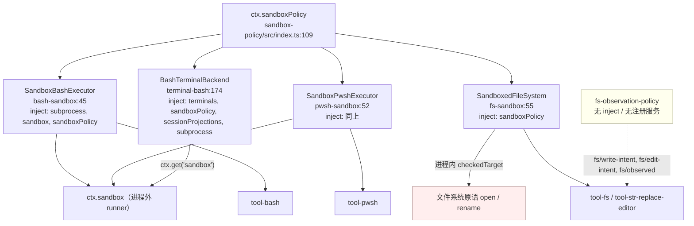
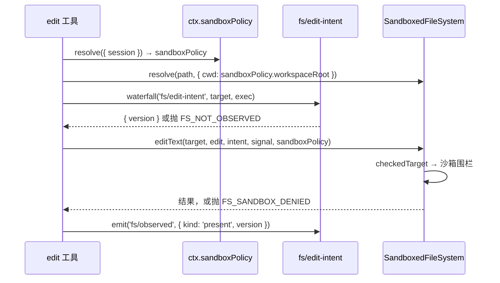

# 04 · 消费方:逐个走查

> 对应第七章 [第一节 1.3](../07-sandbox.md#13-consumer四个执行面--工具层的升级桥) 与 [1.5](../07-sandbox.md#15-明确不属于这条缝的两个包)。
> 涉及五个真正接触沙箱的消费方 + 一个正交策略包 + 一个工具:各自**在哪一行取策略**、**在哪一行围栏**、**拿什么事实结算**。

---

## 一句话结论

消费方的统一模式是"**继承本地实现 + 只加一层策略围栏**":bash/pwsh/terminal 走 `ctx.sandbox`(进程外 runner),fs 走进程内策略检查,**四者共用同一个 `ctx.sandboxPolicy`**。这让模型侧工具完全不变——换执行器不换工具。`fs-observation-policy` 虽然名字里有 "policy",但与这条缝**正交**:它管"新鲜度/防覆盖",不管"文件效果边界",既不注册服务也不 inject 任何服务。

---

## 第一节 消费方全景



<details><summary>Mermaid 源码</summary>



</details>

| 消费方 | 注册 | 围栏手段 | 调 `ctx.sandbox` | 需要 `ctx.sandboxPolicy` |
|---|---|---|---|---|
| `SandboxBashExecutor` | `ctx.shell`(取代 `bash-local`) | 进程外 runner | 是 | 是(声明注入) |
| `SandboxPwshExecutor` | `ctx.shell`(取代 `pwsh-local`) | 进程外 runner | 是 | 是(声明注入) |
| `SandboxedFileSystem` | `ctx.fs`(取代 `fs-local`) | 进程内策略检查 | 否 | 是(声明注入) |
| `BashTerminalBackend` | 终端后端注册表 | 进程外 runner | 是(`ctx.get`) | 是(声明注入) |
| `fs-observation-policy` | — | 三个 `fs/*` waterfall | 否 | **否** |

---

## 第二节 bash-sandbox:最完整的消费者

### 2.1 声明、继承与能力事实

```typescript
// packages/shell/bash-sandbox/src/index.ts:45-52,76-78
export class SandboxBashExecutor extends LocalBashExecutor {
  static override inject = ['subprocess', 'sandbox', 'sandboxPolicy']
  private readonly mode: SandboxMode
  ...
  override get sandboxMode(): SandboxMode { return this.mode }
```

`Config` 直接复用本地执行器(`export type Config = LocalConfig`,`:36`),因为沙箱默认值不在这里:"沙箱策略——默认模式与回退 `workspace-write` 根——**不**在这里:它住在 `ctx.sandboxPolicy` 上"(`:29-35`)。`mode` 取自 `ctx.sandboxPolicy.defaultMode`(`:72`),只给工具层的广告当能力事实。注意它是**部署默认模式而非有效模式**:基类 JSDoc 明确"会话覆盖可能让有效模式更窄或更宽,所以严格更宽的检查是逐调用做的"(`packages/shell/shell/src/index.ts:94-102`)。

### 2.2 `resolve`:把策略落进 spec

```typescript
// packages/shell/bash-sandbox/src/index.ts:85-87
override resolve(request: ShellExecRequest): ShellExecSpec {
  return { ...super.resolve(request), sandboxPolicy: request.sandboxPolicy ?? this.ctx.sandboxPolicy.resolve() }
}
```

优先级是**调用方策略 > 部署策略**:工具层已解析过带会话的策略并放进 request,所以正常工具调用永远走前者;直接调用 executor 的低层调用方回落到无参 `resolve()`。这条 `??` 就是"显式 > 隐式"约定在消费者边界的落点——`ShellExecRequest.sandboxPolicy` 可选、`ShellExecSpec.sandboxPolicy` 必填(`packages/shell/shell/src/types.ts:78,109`)。

### 2.3 `run`:前台路径的四步

```typescript
// packages/shell/bash-sandbox/src/index.ts:89-115(节选)
override async run(spec: ShellExecSpec): Promise<ShellRunResult> {
  const policy = spec.sandboxPolicy as SandboxExecutionPolicy
  const { mode } = policy
  if (mode === 'danger-full-access') return { ...await super.run(spec), sandbox: { mode, denied: false } }
  const confined = this.confine(spec.command, { ...policy, mode })
  let result: ShellRunResult
  try {
    result = await this.runArgv(spec, confined.argv)
  } catch (error) {
    if (spec.signal?.aborted === true) spec.signal.throwIfAborted()
    if (isRunnerSpawnFailure(error, confined.argv[0], spec.workdir)) throw new SandboxUnavailableError(mode, String(error))
    throw error
  }
  const runnerFailure = classifyRunnerFailure(result.exitCode, result.stderr.text, confined.runnerFailureRules)
  if (runnerFailure !== undefined) throw new SandboxUnavailableError(mode, runnerFailure.detail)
  return { ...result, sandbox: { mode, denied: classifyDenial(result, confined.denialSignatures), enforcement: confined.enforcement } }
}
```

三个顺序决策:**`danger-full-access` 在 `confine` 之前分流**(`:92-95`),它刻意绕过 `ctx.sandbox`——"它是显式的无约束模式,不是更宽的沙箱 profile"(`bash-sandbox/README.md:174`);**abort 优先于 runner 归因**(`:101-102`),"上游的中止即使阻止了 spawn 也仍然是取消";**runner 失败抛错,拒绝写字段**(`:110-114`)——前者是基础设施错误,后者是策略结果。

### 2.4 `start`:per-process facts

```typescript
// packages/shell/bash-sandbox/src/index.ts:53-66(字段与其 JSDoc)
private readonly processFacts = new Map<ShellProcess, {
  mode: ConfinedSandboxMode; enforcement: SandboxEnforcement
  denialSignatures: readonly string[]; runnerFailureRules: readonly RunnerFailureRule[]
  runnerProgram: string | undefined; workdir: string
}>()
```

必须 per-process 的理由写在字段 JSDoc 里:provider 在**重叠调用**之间可以给出不同的 enforcement 与方言,共享的"最近一次包装"会把某个进程按错的方言分类。安装时机同样是刻意的,注释的关键前提是"promise settlement 不可能在 `start()` 返回之前运行"——若 facts 的安装在 await 之后,一个瞬间退出的后台进程可能在 facts 装好前就已结算,分类就会丢:

```typescript
// packages/shell/bash-sandbox/src/index.ts:117-145(节选)
override start(spec: ShellExecSpec): ShellProcess {
  const policy = spec.sandboxPolicy as SandboxExecutionPolicy
  const { mode } = policy
  if (mode === 'danger-full-access') return super.start(spec)
  // Once startArgv returns, install facts synchronously; promise settlement
  // cannot run before start() returns.
  const confined = this.confine(spec.command, { ...policy, mode })
  let proc: ShellProcess
  try { proc = this.startArgv(spec, confined.argv) } catch (error) { /* 同 run 的归因 */ }
  const { enforcement, denialSignatures, runnerFailureRules } = confined
  this.processFacts.set(proc, { mode, enforcement, denialSignatures, runnerFailureRules, runnerProgram: confined.argv[0], workdir: spec.workdir })
  return proc
}
```

### 2.5 `onProcessDone`:结算时的两分支

```typescript
// packages/shell/bash-sandbox/src/index.ts:151-169(节选)
protected override onProcessDone(proc: ShellProcess, stderr: string, providerRejected: boolean, providerError?: unknown): void {
  const facts = this.processFacts.get(proc)
  if (facts !== undefined) {
    this.processFacts.delete(proc)
    const runnerFailed = providerRejected
      ? isRunnerSpawnFailure(providerError, facts.runnerProgram, facts.workdir)
      : classifyRunnerFailure(proc.exitCode, stderr, facts.runnerFailureRules) !== undefined
    proc.sandbox = { mode: facts.mode, denied: !runnerFailed && matchesSignature(proc.exitCode, stderr, facts.denialSignatures),
      enforcement: facts.enforcement, ...(runnerFailed ? { runnerFailed } : {}) }
  }
  super.onProcessDone(proc, stderr, providerRejected, providerError)
}
```

三点:**provider 拒绝时只能靠 `isRunnerSpawnFailure` 归因**——注释解释"provider 拒绝不暴露公开的失败阶段",所以只有错误本身独立指名 `argv[0]` 才归给执行器(`:156-157`);**已结算的 runner 失败优先于类拒绝诊断**(三元的两分支互斥);**`denied` 在 runnerFailed 时被显式压成 `false`**,"执行器坏了"不会被同时报成"被拦住"。facts 读完立刻 `delete`。

三类分类器全在 `helpers.ts`(细节见 [02 篇第三节](02-platform-backends.md#第三节拒绝方言与执行器失败规则))。bash 特有的一点:归因结果成为 `SandboxUnavailableError` 的第二参数,最终拼成 ` Runner failure: <detail>`(`sandbox/src/index.ts:139`)。

---

## 第三节 pwsh-sandbox:call-for-call 镜像

```typescript
// packages/shell/pwsh-sandbox/src/index.ts:51
/* jscpd:ignore-start -- deliberate call-for-call mirror of bash-sandbox's executor (pwsh-tool-and-executor Agent Note) */
```

整段被 `jscpd:ignore` 包住,理由是"刻意的逐调用镜像"。逐行对照后**只有两处实质差异**:

| 维度 | bash | pwsh |
|---|---|---|
| 基类 | `LocalBashExecutor` | `PwshLocalExecutor` |
| confine 的 argv 来源 | `this.confine(spec.command, …)` 内部拼 `['bash','-c',command]`(`bash-sandbox:179-181`) | `this.ctx.sandbox.confine(this.argv(spec), policy)`(`pwsh-sandbox:184-186`) |

差异根源是"shell 形态"不同:bash 消费者的命令是**一段 shell 源码**(`ShellExecSpec.command`),所以自己合成 `bash -c <source>`;pwsh 的 argv 由本地执行器算好。这正好印证缝契约的措辞:"shell 形态的消费者**自己**传 `['bash','-c',command]`"(`sandbox/src/index.ts:167-169`)。

其余全部同构:同样的 `inject`(`:53`)、`mode = ctx.sandboxPolicy.defaultMode`(`:79`)、`sandboxMode` getter(`:83-85`)、`resolve` 的 `??`(`:92-94`)、`run` 四步(`:96-122`)、`processFacts` 结构(`:66-73`)、`onProcessDone`(`:156-174`)。`helpers.ts` 也是镜像,只包了函数体(`:9,120`)。平台分工由出厂组合的 `disabled` 条件表达(`packages/bundle/base/cordis.patch.yml:214-222`):bash-sandbox 在 win32 禁用,pwsh-sandbox 在非 win32 禁用。

---

## 第四节 fs-sandbox:进程内策略围栏

### 4.1 只覆写两个变更方法

```typescript
// packages/fs/fs-sandbox/src/index.ts:55-62,80-88
export class SandboxedFileSystem extends LocalFileSystem {
  static inject = ['sandboxPolicy']
  private readonly defaultMode: SandboxMode
  constructor(ctx: Context, config: Config) { super(ctx, config); this.defaultMode = ctx.sandboxPolicy.defaultMode }
  ...
  override async writeText(target, content, expected?, signal?, sandboxPolicy?): Promise<FsWriteOutcome> {
    return super.writeText(await this.checkedTarget(target, sandboxPolicy), content, expected, signal)
  }
}
```

`editText` 的覆写形态完全一致(`:101-109`)。第 5 个参数**可选**:`ctx.fs` 被工具层与插件层共用,不能强制每个人传策略,缺省时回落到部署策略(`:123`)。读路径**完全不围栏**——"每个模式都允许读"(`:6-8`)。

### 4.2 `checkedTarget` 的三个分支

```typescript
// packages/fs/fs-sandbox/src/index.ts:122-144(节选)
private async checkedTarget(target: FsTarget, sandboxPolicy?: SandboxExecutionPolicy): Promise<FsTarget> {
  const policy = sandboxPolicy ?? this.ctx.sandboxPolicy.resolve()
  const { mode } = policy
  if (mode === 'danger-full-access') return target
  if (mode === 'read-only') {
    throw new FsError(`cannot write "${target.displayPath}": file access denied under read-only mode`, 'FS_SANDBOX_DENIED')
  }
  const fresh = await this.resolve(target.displayPath)
  let contained = false
  for (const root of writableRoots(policy)) {
    if (await isPathUnder(fresh.targetKey, root)) { contained = true; break }
  }
  if (!contained) throw new FsError(`cannot write "${target.displayPath}": file access denied under workspace-write mode`, 'FS_SANDBOX_DENIED')
  return fresh
}
```

| 分支 | 行为 | 行号 |
|---|---|---|
| `danger-full-access` | **原样返回调用方的 target**,不做任何 I/O | `:125` |
| `read-only` | 直接抛,不检查路径 | `:126-128` |
| `workspace-write` | 重新 `resolve` 得到 `fresh`,对 `writableRoots(policy)` 逐根做包含判定,通过则**返回 `fresh`** | `:129-143` |

返回 `fresh` 而非原 `target` 是**收窄 TOCTOU 的具体手段**:注释写"`resolve` 会 realpath 最深的已存在祖先,反映一个并发换过的符号链接",而"变更委托用的是**这个**新鲜 target,永远不是陈旧的"(`:111-121,129-131`)。同一段注释承认残余风险:"resolve 到 syscall 之间的 TOCTOU 被就地重新 canonical 化收窄,但未消除;对抗性宿主进程不在威胁模型内"(`:15-18`)。可写根用 `writableRoots(policy)`(`sandbox/src/roots.ts:52`)——与 Seatbelt profile 同一份列表。

### 4.3 `containment.ts`:两级包含判定

```typescript
// packages/fs/fs-sandbox/src/containment.ts:58-75
export async function isPathUnder(path: string, root: string, caseSensitive = process.platform !== 'win32'): Promise<boolean> {
  if (isLexicallyUnder(path, root, caseSensitive)) return true
  const rootInfo = await statIfPresent(root)
  if (!rootInfo) return false
  let ancestor = path
  while (true) {
    const ancestorInfo = await statIfPresent(ancestor)
    if (ancestorInfo && sameIdentity(ancestorInfo, rootInfo)) return true
    const parent = dirname(ancestor)
    if (parent === ancestor) return false
    ancestor = parent
  }
}
```

| 级 | 手段 | 覆盖 | 代价 |
|---|---|---|---|
| 1 | 词法前缀比较(`isLexicallyUnder`,`:23-29`) | 规范拼写 | O(1),无 I/O;大小写敏感度默认取平台约定(`process.platform !== 'win32'`) |
| 2 | 文件系统身份比较(`dev` + `ino`,`sameIdentity`,`:42-44`) | Windows 长名/8.3 别名、大小写差异,以及 target 尾部尚不存在的路径 | 逐级 `stat` 直到根 |

第二级从 target 本身向上走祖先链,`statIfPresent` 把 `ENOENT`/`ENOTDIR` 转成 `undefined` 继续往上(`:12-17,31-40`),遇到 `dirname(ancestor) === ancestor` 返回 `false`。所以"目标文件还不存在"也能判定——只要某个已存在的祖先是可写根本身或在其下。`statIfPresent` 的两处 `/* v8 ignore */` 暴露了真实假设:stat 的非缺失类失败需要"resolve 已经到过这个祖先后宿主出现权限或 I/O 故障",即实际不可达(`:35-38`)。

fs 面的 fail-closed 与 bash 面**形态不同**:它是可信代码里的检查,所以拒绝是结构化 `FsError('FS_SANDBOX_DENIED')` 而非 stderr 推断——"进程内围栏确切知道自己拒了什么"(`fs-sandbox/README.md:79`)。

---

## 第五节 terminal-bash:持久终端的两个围栏

```typescript
// packages/terminal/terminal-bash/src/index.ts:26-27
export const inject = ['terminals', 'sandboxPolicy', 'sessionProjections', 'subprocess']
```

注意**没有 `sandbox`**:它用 `ctx.get('sandbox')` 读可选服务(`:103`)。

### 5.1 `spawnArgv`:与执行器同构的分流

```typescript
// packages/terminal/terminal-bash/src/index.ts:100-109
function spawnArgv(ctx: Context, config: ResolvedConfig, policy: SandboxExecutionPolicy): string[] {
  const argv = [config.shellPath, ...config.shellArgs]
  if (policy.mode === 'danger-full-access') return argv
  const sandbox = ctx.get('sandbox')
  if (sandbox === undefined) {
    throw new Error(`terminal-bash: sandbox mode "${policy.mode}" requires a ctx.sandbox provider in the execution world`)
  }
  return sandbox.confine(argv, { ...policy, mode: policy.mode }).argv
}
```

三点:与 bash 执行器**同样的 `danger-full-access` 旁路**;缺 provider 时抛错而不是无约束启动;`{ ...policy, mode: policy.mode }` 重述判别式以保留窄化类型(注释在 `:107`)。终端只取 `.argv`,**丢弃另外三组分类事实**——PTY 会话不通过"退出码 + stderr"结算,而走交互式读写与提示标记(`CONTROLLED_PROMPT`、OSC `133;D;`),没有可分类的单次结果。策略按 **owner 会话**解析:

```typescript
// packages/terminal/terminal-bash/src/index.ts:193-196(节选)
ensureSandboxModeFence(this.ctx, spec.owner)
const policy = this.ctx.sandboxPolicy.resolve({ session: spec.owner.session })
const argv = spawnArgv(this.ctx, this.config, policy)
if (argv[0] === undefined) throw new Error('terminal-bash: sandbox returned empty argv')
```

`argv[0] === undefined` 的检查是对 provider 返回空数组的防御。

### 5.2 模式切换围栏

```typescript
// packages/terminal/terminal-bash/src/index.ts:37-62(节选)
function ensureSandboxModeFence(ctx: Context, owner: Agent): void {
  const existing = sandboxModeFences.get(owner)
  if (existing !== undefined) { existing.pty = ctx.terminals; existing.sandboxPolicy = ctx.sandboxPolicy; existing.sessionProjections = ctx.sessionProjections; return }
  const state: SandboxModeFenceState = { pty: ctx.terminals, sandboxPolicy: ctx.sandboxPolicy, sessionProjections: ctx.sessionProjections }
  sandboxModeFences.set(owner, state)
  owner.ctx.on('internal/dispatch', (_mode, eventName, args) => {
    if (eventName !== 'session/event') return
    const [session, event] = args as [Session, SessionEvent]
    if (session !== owner.session || event.type !== 'sandbox/mode') return
    const currentMode = (state.sessionProjections.stateOf(session, 'sandboxMode') ?? null) ?? state.sandboxPolicy.defaultMode
    if (event.data.mode === currentMode || !state.pty.hasOwnerActivity(owner)) return
    throw new Error(`cannot change sandbox mode from "${currentMode}" to "${event.data.mode}" while persistent terminal sessions are open or being created; wait for creation to settle and close them first`)
  }, { global: true })
}
```

| 元素 | 作用 | 行号 |
|---|---|---|
| `WeakMap<Agent, SandboxModeFenceState>` | 每 owner 一个围栏;已存在则**刷新三个服务引用**并返回(HMR 后服务对象可能换新) | `:35,38-44` |
| `internal/dispatch` + `{ global: true }` | 监听**所有** dispatch | `:51,61` |
| `session !== owner.session` / `event.type !== 'sandbox/mode'` | 双重过滤 | `:54` |
| `folded ?? defaultMode` | 复现 `resolve` 的优先级链算"当前模式" | `:55-56` |
| 值未变 或 无 owner 活动 | 提前放行 | `:57` |
| 否则 **throw** | 追加动作失败 | `:58-60` |

理由:`sandbox/mode` 一旦落盘就改了下一次 PTY 创建时的 confine argv,而 argv 在 `spawn` 时一次性算好、`LocalPtySession` 之后不再重算——"已经开着的终端仍跑在旧模式下"无法在既有架构里修补,只能拒绝切换。错误文案给出了操作指引。`ensureSandboxModeFence` 每次 `spawn` 都调用(`:193`),WeakMap 保证只注册一次监听器。

---

## 第六节 `fs-observation-policy` 与沙箱的关系

### 6.1 它不属于这条缝

```typescript
// packages/fs/fs-observation-policy/src/index.ts:97-106(节选,注释说明它不读任何服务)
export const name = 'fs-observation-policy'
export function apply(ctx: Context): void {
```

三条硬证据:**不注册任何服务**(`:1-8`,"it registers no service")、**没有 `inject`**(`:99-105`)、**全文件不碰 `sandboxPolicy` 参数**——它无法影响 `writeText`/`editText` 的第 5 个参数。

### 6.2 它管什么

```typescript
// packages/fs/fs-observation-policy/src/index.ts:116-129
// fs/write-intent: occupy the single decision slot — do NOT call next().
ctx.on('fs/write-intent', (target, actor) => Promise.resolve().then(() => gate.writeIntent(target, actor)))
// fs/edit-intent: occupy the single decision slot — do NOT call next().
ctx.on('fs/edit-intent', (target, actor) => Promise.resolve().then(() => gate.editIntent(target, actor)))
// fs/observed must remain synchronous and non-throwing
ctx.on('fs/observed', (target, observation, actor) => { gate.observe(target, observation, actor) })
```

| waterfall / 事件 | 产出 | 语义 |
|---|---|---|
| `fs/write-intent` | `createIfAbsent` 或 `replaceIfVersion`(版本来自上次观察) | 防覆盖:未见过的目标不允许无条件替换 |
| `fs/edit-intent` | `{ version }` 或抛 `FS_NOT_OBSERVED` | 先读后写:未观察即改直接拒绝 |
| `fs/observed` | 记录 `present` / `absent` | 唯一的状态写入点 |

状态结构是 `WeakMap<owner, Map<targetKey, FsObservation>>`(`:28`),owner 由 `actor.agent.session` 派生(`:36-41`)。**两个语义的区别是根本性的**:

| 维度 | 沙箱(`ctx.sandboxPolicy`) | 观察策略(`fs-observation-policy`) |
|---|---|---|
| 问的问题 | "这次变更**允许**碰到哪儿" | "这次变更**基于**哪次观察" |
| 违背后的错误 | `FS_SANDBOX_DENIED` | `FS_NOT_OBSERVED` / `FS_STALE_VERSION` |
| 状态位置 | 会话日志(`sandbox/mode` 事件) | 进程内 `WeakMap`,HMR 即丢 |
| 与能力的耦合 | 需要 `ctx.fs`/`ctx.shell` 提供 `sandboxMode` 事实 | 完全解耦 |
| 失败方向 | fail-closed(拒绝变更) | fail-closed(拒绝变更) |

一个直观例子:`read-only` 下,一个**已观察过**的文件依然不可写(沙箱先拒);`danger-full-access` 下,一个**从没读过**的文件依然不能被 `edit`(观察策略先拒)。两者互不代偿。

### 6.3 同一次调用上的叠加顺序


<details><summary>Mermaid 源码</summary>



</details>

顺序是**先观察策略、后沙箱围栏**:`fs/edit-intent` 在 `tool-fs/src/edit.ts:127`,`ctx.fs.editText` 在 `:128`,两者在同一个 `try` 里,任一拒绝都走同一段错误映射(`:135-140`)。另外 `:118` 的 `sessionResolveOptions(exec, input.filePath, sandboxPolicy?.workspaceRoot)` 让策略解析出的工作区根**优先于**会话 cwd 作为路径解析基准(`tool-fs/src/session-cwd.ts:35-45`)。

---

## 第七节 `tool-str-replace-editor` 的沙箱路径

```typescript
// packages/fs/tool-str-replace-editor/src/index.ts:66-87
class MutationPolicy {
  private readonly policy: SandboxPolicyService | undefined
  constructor(ctx: Context) {
    this.policy = ctx.fs.sandboxMode === undefined ? undefined : ctx.get('sandboxPolicy')
    if (ctx.fs.sandboxMode !== undefined && this.policy === undefined) {
      throw new Error('tool-str-replace-editor: the mounted filesystem confines but ctx.sandboxPolicy is missing')
    }
  }
  resolve(exec: ToolRunContext): SandboxExecutionPolicy | undefined {
    return this.policy?.resolve({ ...exec.agent === undefined ? {} : { session: exec.agent.session } })
  }
  mapError(error: unknown, policy: SandboxExecutionPolicy | undefined): unknown {
    if (!(error instanceof FsError) || error.code !== 'FS_SANDBOX_DENIED') return error
    const mode = (policy as SandboxExecutionPolicy).mode
    return new FsError(sandboxDenialMarker(mode), 'FS_SANDBOX_DENIED', { cause: error })
  }
}
```

与 `FsSandboxController` 的三处差异:

| 差异 | `tool-fs` | `tool-str-replace-editor` |
|---|---|---|
| 广告闸门 | 有 `escalationModes` 字段 | **没有**——不广告升级字段 |
| 拒绝映射文案 | 标记 **+ 升级提示**两行(`sandbox.ts:129`) | **只有标记**(`:85`) |
| 解析入参 | `ToolExecution` + 升级参数 | `ToolRunContext`,无升级参数 |

即 `str_replace_editor` 能**被沙箱拦住**,但**不能升级**;它与 `tool-fs` 共享同一套 `sandboxDenialMarker` 文本,所以模型在两处看到的拒绝形态一致。

### 7.1 三个命令的沙箱调用点

| 命令 | 函数 | 策略解析 | 变更调用 |
|---|---|---|---|
| `create` | `createFile`(`:240-273`) | `policy.resolve(exec)`(`:248`) | `ctx.fs.writeText(target, content, intent, exec.signal, sandboxPolicy)`(`:261-267`) |
| `str_replace` | `replaceInFile`(`:275-327`) | `policy.resolve(exec)`(`:286`) | `ctx.fs.writeText(target, 替换后全文, { kind:'replaceIfVersion' }, exec.signal, sandboxPolicy)`(`:313-321`) |
| `insert` | `insertInFile`(`:329-369`) | `policy.resolve(exec)`(`:339`) | `ctx.fs.writeText(target, after, expected, exec.signal, sandboxPolicy)`(`:363`) |

值得注意的是 `str_replace` 与 `insert` **都用 `ctx.fs.writeText` 而不是 `editText`**:它们在工具层自己算出新全文,再用 `replaceIfVersion` 意图做 CAS 写入(`:317-318`、`:358-360`)。所以这个工具只压到 `SandboxedFileSystem.writeText` 那一处围栏,`editText` 那条路径不被它使用。

三处都遵循同一模式:**策略先于 I/O 解析**,然后作为 `ctx.fs` 调用的最后一个参数传入,**错误经 `policy.mapError` 转换**后才抛出(`:269`、`:323`、`:365`),且调用点都在 `catch` 块里,所以 `FsError` 的结构化 code 与 `cause` 链完整保留。路径解析走同一个 `resolveTarget`(`:89-99`),它要求绝对路径——与 `tool-fs` 允许相对路径 + 会话 cwd 不同,因此它的路径不需要用 `sandboxPolicy.workspaceRoot` 做解析基准。

---

## 关键文件 / 符号索引表

| 文件 | 关键符号 | 行号 |
|---|---|---|
| `packages/shell/bash-sandbox/src/index.ts` | `inject` / `mode` / `processFacts` / `sandboxMode` / `resolve` | 46 / 52 / 59-66 / 76-78 / 85-87 |
| | `run` / `start` / `onProcessDone` / `confine` | 89-115 / 117-145 / 151-169 / 179-181 |
| `packages/shell/bash-sandbox/src/helpers.ts` | `isUsableWorkdir` / `isRunnerSpawnFailure` | 15-23 / 39-53 |
| | `classifyDenial` / `classifyRunnerFailure` / `matchesSignature` | 67-69 / 81-103 / 112-116 |
| `packages/shell/pwsh-sandbox/src/index.ts` | 类定义 / `inject` / `resolve` / `run` / `start` / `onProcessDone` / `confine` | 52-187 / 53 / 92-94 / 96-122 / 124-150 / 156-174 / 184-186 |
| `packages/fs/fs-sandbox/src/index.ts` | `SandboxedFileSystem` / `sandboxMode` / `writeText` / `editText` / `checkedTarget` | 55-67 / 64-67 / 80-88 / 101-109 / 122-144 |
| `packages/fs/fs-sandbox/src/containment.ts` | `isLexicallyUnder` / `sameIdentity` / `isPathUnder` | 23-29 / 42-44 / 58-75 |
| `packages/terminal/terminal-bash/src/index.ts` | `inject` / `sandboxModeFences` / `ensureSandboxModeFence` / `spawnArgv` / `spawn` | 27 / 35 / 37-62 / 100-109 / 191-218 |
| `packages/fs/fs-observation-policy/src/index.ts` | `ObservedStateGate` / `writeIntent` / `editIntent` / `observe` | 21-95 / 65-71 / 78-88 / 91-94 |
| | `apply` 三个监听器 | 106-130 |
| `packages/fs/tool-str-replace-editor/src/index.ts` | `MutationPolicy` / `resolveTarget` | 66-87 / 89-99 |
| | `createFile` / `replaceInFile` / `insertInFile` | 240-273 / 275-327 / 329-369 |
| `packages/fs/tool-fs/src/edit.ts` | resolvePolicy → resolve → editText → mapError | 117 / 118 / 128-134 / 139 |
| `packages/fs/tool-fs/src/session-cwd.ts` | `sessionCwd` / `sessionResolveOptions` | 22-26 / 35-45 |
| `packages/bundle/base/cordis.patch.yml` | 平台条件装配 | 214-222 |
