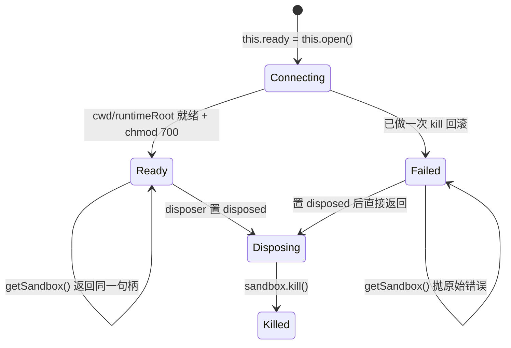
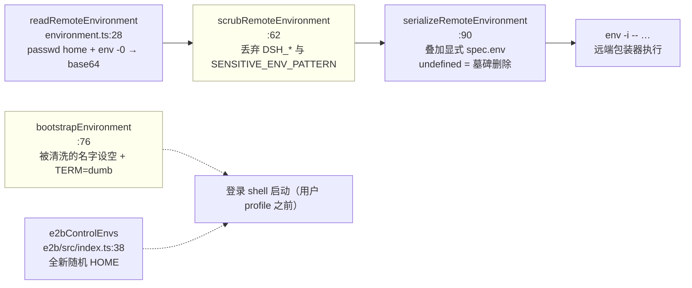

# 05 · E2B 远程沙箱:包结构、句柄生命周期、输出捕获

> 对应第七章 [第四节](../07-sandbox.md#第四节-e2b-远程沙箱适配替换能力而不是接缝);本篇补上第七章未展开的**代码证据链**、**句柄与终端的生命周期细节**、**输出捕获的线协议**。

---

## 一句话结论

E2B 家族**替换能力缝而不是注册 provider**:三包里没有任何一行注册 `ctx.sandbox`,也没有任何一行读 `ctx.sandboxPolicy`;`E2BFileSystem` 继承 `FileSystem` 且**不覆写 `sandboxMode`**,因此工具层根本不会广告升级字段。隔离边界由远端沙箱自身提供——三包必须按序装配,因为所有 adapter 都在 await 同一个 SDK 句柄。

---

## 第一节 包结构与职责

```text
packages/e2b/
  e2b/src/index.ts          191 行  E2BRuntime:共享句柄的生命周期与校验   → ctx.e2b
  e2b/src/api-url.ts         26 行  control-plane URL 推导(代理决策输入)
  fs-e2b/src/index.ts       628 行  E2BFileSystem:远端 fs provider        → ctx.fs
  subprocess-e2b/src/index.ts 231 行 E2BSubprocessRuntime:spawn/拆卸     → ctx.subprocess
  subprocess-e2b/src/process.ts 693 行 E2BSubprocessHandle:包装器、发布、终止、输出投影
  subprocess-e2b/src/{terminal,environment,output,remote}.ts  PTY / 环境清洗 / 输出解码 / 控制 shell 助手
```

| 包 | ctx key | 职责边界 |
|---|---|---|
| `dsh-e2b` | `ctx.e2b` | 只负责"一个远端 Linux 沙箱句柄";它不注册模型上下文(`e2b/e2b/README.md:115`) |
| `dsh-fs-e2b` / `dsh-subprocess-e2b` | `ctx.fs` / `ctx.subprocess` | 读写/编辑/列举都在远端,"宿主机文件从不被触碰"(`fs-e2b/README.md:12`);命令与交互终端都在远端,宿主环境与凭据被排除 |

装配顺序是硬约束:**owner 先加载、provider 后加载,拆卸顺序相反**——"每个 adapter 都在 await 同一个句柄"(`e2b/e2b/README.md:94`)。共享点是这一行:

```typescript
// packages/e2b/e2b/src/index.ts:105
this.runtimeRoot = posix.join(this.cwd, '.dsh-e2b')
```

两个 adapter 都从 `ctx.e2b.runtimeRoot` 下开状态目录:`processes/<uuid>`(`subprocess-e2b/src/index.ts:173`)与 `terminals/<uuid>`(`:195`)。

---

## 第二节 为什么是"替换能力缝"而不是"注册 provider"

### 2.1 缝本身的措辞就把它排除了

```typescript
// packages/sandbox/sandbox/src/index.ts:1-6
/**
 * Service Definition for the same-world process-confinement capability seam: wrap exact subprocess argv under a
 * host-path file policy. Containers, microVMs, and remote execution replace the
 * surrounding capability seam instead; this service shares the host kernel and filesystem.
 * @module @deepseek-ai/dsh-sandbox
 */
```

论证在注释里已经给全:**`ctx.sandbox` 包装的是宿主内核/宿主文件系统上的子进程**,而远端沙箱不共享宿主内核,所以它落在缝的定义域之外。

### 2.2 证据一:`packages/e2b` 里没有 `ctx.sandbox`,也没有 `SandboxProvider`

在 `packages/e2b/**` 上检索 `sandboxMode|SandboxProvider|sandboxPolicy|ctx.sandbox`,命中只有 **2 处,且都在同一个测试文件里**:

```typescript
// packages/e2b/e2b/tests/composition.e2e.ts:57-60
const sandboxPolicyFiber = await ctx.plugin(SandboxPolicyService, {
  mode: 'danger-full-access',
  workspaceRoot: '/home/user',
})
```

这不是"E2B 需要沙箱策略",而是**为了满足 `terminal-bash` 的声明注入**:

```typescript
// packages/terminal/terminal-bash/src/index.ts:26-27
/** Required services: terminal registry, shared confinement policy, projection registry, and process substrate. */
export const inject = ['terminals', 'sandboxPolicy', 'sessionProjections', 'subprocess']
```

而 `danger-full-access` 恰好让终端**永不咨询 `ctx.sandbox`**:

```typescript
// packages/terminal/terminal-bash/src/index.ts:100-106(节选)
function spawnArgv(ctx: Context, config: ResolvedConfig, policy: SandboxExecutionPolicy): string[] {
  const argv = [config.shellPath, ...config.shellArgs]
  if (policy.mode === 'danger-full-access') return argv
  const sandbox = ctx.get('sandbox')
  if (sandbox === undefined) { /* 抛错 */ }
```

所以那条装配是"把一个声明式的必需服务填成无约束模式",而不是"接入了沙箱"。这同时是一条重要的**组合事实**:E2B 家族要求与本地沙箱家族**不同时挂载**,否则 `terminal-bash` 会拿到真实的 `ctx.sandbox`,而它产出的宿主 runner argv 不能用于远端世界。

### 2.3 证据二:fs provider 未覆写 `sandboxMode`

```typescript
// packages/e2b/fs-e2b/src/index.ts:171-172
export class E2BFileSystem extends FileSystem {
  static inject = ['e2b']
```

对比本地实现:`SandboxedFileSystem` 明确覆写并返回部署默认模式(`fs-sandbox/src/index.ts:64-67`)。基类默认返回 `undefined`:

```typescript
// packages/fs/fs/src/index.ts:103-105
get sandboxMode(): SandboxMode | undefined {
  return undefined
}
```

下游后果是确定的:`tool-fs` 的 `FsSandboxController` 据此清空广告词表,并要求"受限却缺策略"在加载期抛错:

```typescript
// packages/fs/tool-fs/src/sandbox.ts:44-49
const defaultMode = ctx.fs.sandboxMode
this.escalationModes = defaultMode === undefined ? [] : ESCALATION_TARGETS
this.policy = defaultMode === undefined ? undefined : ctx.get('sandboxPolicy')
if (defaultMode !== undefined && this.policy === undefined) {
  throw new Error('tool-fs: the mounted filesystem confines but ctx.sandboxPolicy is missing')
}
```

于是 E2B 组合下 `write`/`edit` 的 schema 里**没有** `sandbox_permissions` 字段(`tool-fs/src/write.ts:78`、`edit.ts:92` 的条件展开都走 `{}` 分支);模型若硬塞这个字段,组合守卫会拒绝:

```typescript
// packages/fs/tool-fs/src/sandbox.ts:93-95
if (this.escalationModes.length === 0) {
  throw new Error('sandbox_permissions is not available in this composition (no sandboxing filesystem to escalate)')
}
```

**结论**:E2B 组合下不存在"升级"——因为不存在需要升级的策略边界。隔离是二元的(在远端沙箱里 / 不在),没有"更宽的档位"可换。

### 2.4 证据三:`packages/sandbox/*` 四包一个都不需要

| 组件 | E2B 组合是否需要 | 依据 |
|---|---|---|
| `dsh-sandbox`(缝) | 不需要 | 没有任何 `ctx.sandbox` 消费者存在(证据一) |
| `dsh-sandbox-local`(后端) | 不需要 | 没有缝可挂 |
| `dsh-sandbox-policy`(策略) | **仅为满足 `terminal-bash` 的声明注入而挂**,且配置为 `danger-full-access` | 证据一 |
| `dsh-sandbox-windows-acl` | 不需要 | 目标是远端 Linux |

---

## 第三节 句柄生命周期

### 3.1 构造期即开始连接

```typescript
// packages/e2b/e2b/src/index.ts:93-125(节选)
constructor(ctx: Context, config: Config) {
  super(ctx, 'e2b')
  const resolved = config as SchemaResolvedConfig
  const apiKey = config.apiKey ?? process.env.E2B_API_KEY
  this.config = { apiKey: apiKey ?? '', cwd: resolved.cwd, timeoutMs: resolved.timeoutMs }
  this.validate()
  this.cwd = this.config.cwd
  this.runtimeRoot = posix.join(this.cwd, '.dsh-e2b')
  this.ready = this.open()
  // A deployment may load the owner before any adapter uses it. Keep a
  // failed eager connection observed; getSandbox() still returns the error.
  void this.ready.catch(() => {})

  ctx.effect(() => async () => {
    this.disposed = true
    let sandbox: Sandbox
    try { sandbox = await this.ready } catch (_sandboxSetupFailure) { return }
    try { await sandbox.kill() } catch (error: unknown) { if (!(error instanceof SandboxNotFoundError)) throw error }
  }, 'e2b sandbox teardown')
}
```

| 决策 | 实现 | 理由 |
|---|---|---|
| 构造期即连 | `this.ready = this.open()` | 加载即可用;文件与命令特性"沙箱起来后就绪"(`e2b/e2b/README.md:63`) |
| 失败保持观察但不拒绝加载 | `void this.ready.catch(() => {})` | "部署可能在任何 adapter 使用它之前就加载 owner"(`index.ts:107-108`) |
| 拆卸先置 `disposed` | 在 `await this.ready` **之前** | 让"拆卸竞态就绪"可被 `getSandbox` 检测到 |
| `SandboxNotFoundError` 视为已静止 | 只吞这一种 | 沙箱可能已被超时删除 |

### 3.2 配置校验前置

```typescript
// packages/e2b/e2b/src/index.ts:142-152
private validate(): void {
  if (this.config.apiKey.length === 0) throw new Error('dsh-e2b: configure apiKey or set E2B_API_KEY')
  if (!posix.isAbsolute(this.config.cwd)) throw new Error(`dsh-e2b: cwd must be an absolute Linux path: ${this.config.cwd}`)
  if (!Number.isFinite(this.config.timeoutMs) || this.config.timeoutMs <= 0) throw new Error('dsh-e2b: timeoutMs must be a positive finite number')
}
```

三条都在**启动期**抛错,不是第一次远端操作时。默认 `cwd: /home/user/workspace`、`timeoutMs: 300_000`(`index.ts:78-82`)。API key **绝不进入沙箱**——它是宿主 SDK 连接的凭据(`Config.apiKey` JSDoc,`:46`)。

### 3.3 `open()`:建目录、验类型、chmod、一次性回滚

```typescript
// packages/e2b/e2b/src/index.ts:154-188(节选)
private async open(): Promise<Sandbox> {
  const route = proxyRouteFor(new URL(e2bApiUrl()))
  const sandbox = await Sandbox.create({
    apiKey: this.config.apiKey, timeoutMs: this.config.timeoutMs,
    secure: true, lifecycle: { onTimeout: 'kill' },
    ...route.proxied ? { proxy: route.proxy } : {},
  })
  try {
    await sandbox.files.makeDir(this.cwd)
    await sandbox.files.makeDir(this.runtimeRoot)
    const runtimeRoot = await sandbox.files.getInfo(this.runtimeRoot)
    if (runtimeRoot.type !== FileType.DIR || runtimeRoot.symlinkTarget !== undefined) {
      throw new Error(`dsh-e2b: runtime root must be a real directory: ${this.runtimeRoot}`)
    }
    await sandbox.commands.run(`chmod 700 -- ${quoteE2BShellArg(this.runtimeRoot)}`, { envs: e2bControlEnvs() })
    return sandbox
  } catch (error: unknown) {
    try { await sandbox.kill() } catch (_sandboxSetupRollbackFailure) { /* TODO(e2b-setup-rollback) */ }
    throw error
  }
}
```

| 步骤 | 校验 | 行号 |
|---|---|---|
| `Sandbox.create` | `secure: true` + `lifecycle: { onTimeout: 'kill' }`——过期**一定删除** | `:160-166` |
| 代理决策 | 对 **SDK 真正会调用的 URL** 判定;`e2bApiUrl()` 按 `E2B_API_URL` → 调试替代 → 域名默认推导 | `:159`;`api-url.ts:21-26` |
| 两目录 | `makeDir`,已存在不报错 | `:168-169` |
| 类型断言 | 必须是**真目录且不是符号链接**(`symlinkTarget !== undefined` 即拒) | `:170-173` |
| 权限 | `chmod 700`,路径经 `quoteE2BShellArg` 转义 | `:174-177` |
| 失败回滚 | **只做一次** `kill`,吞掉回滚失败并保留原始错误 | `:179-187` |

回滚只做一次是**有意记录**的取舍:`TODO(e2b-setup-rollback)` 说明"除非真实的双重失败活得比配置的沙箱超时还久,否则重试状态保持延后"(`:183-185`;`e2b/e2b/README.md:141-143`)。两个辅助函数解释了 SDK 的两层不可绕开:

```typescript
// packages/e2b/e2b/src/index.ts:29-31,38-42
export function quoteE2BShellArg(value: string): string {
  return `'${value.replaceAll('\'', "'\"'\"'")}'`
}
export function e2bControlEnvs(overrides: Readonly<Record<string, string>> = {}): Record<string, string> {
  return { ...overrides, HOME: `/.dsh-e2b-control-${randomUUID()}` }
}
```

前者应对"SDK 无法避免的 `/bin/bash -l -c` 层"(`:24-28`);后者"隔离 E2B 硬编码的登录 shell",给每个内部控制命令一个**全新的随机 HOME**,使 `quoteE2BShellArg` 之外的 profile 影响无从下手。

### 3.4 `getSandbox()`:二次检查 disposed

```typescript
// packages/e2b/e2b/src/index.ts:133-140
async getSandbox(): Promise<Sandbox> {
  if (this.disposed) throw new Error('E2B sandbox service is disposing')
  const sandbox = await this.ready
  // Disposal can race the awaited sandbox readiness despite the synchronous precheck.
  if (this.disposed) throw new Error('E2B sandbox service is disposing')
  return sandbox
}
```

两次检查都必需:第一次挡"已经拆卸";第二次挡"await 期间发生拆卸"。`oxlint-disable` 注释解释了为什么静态检查会认为第二个条件多余——"await 就绪会让出执行权给拆卸"(`:136-137`)。

### 3.5 句柄状态机


<details><summary>Mermaid 源码</summary>



</details>

---

## 第四节 输出捕获

### 4.1 远端包装器:同步接口,异步启动

`ctx.subprocess.spawn` 同步返回句柄,而远端命令必须经 SDK 异步启动。桥的做法是立即返回 `E2BSubprocessHandle`,由远端包装器**异步发布**自己的身份、退出码与状态文件(`commandText`,`subprocess-e2b/src/process.ts:93-120`):

```bash
set +e
dsh_e2b_env_bin=$1; dsh_e2b_node=$2; dsh_e2b_ps=$3; dsh_e2b_tr=$4
dsh_e2b_tee=$5; dsh_e2b_head=$6; dsh_e2b_rm=$7
shift 7
dsh_e2b_pgid="$("$dsh_e2b_ps" -o pgid= -p "$$" | "$dsh_e2b_tr" -d " ")"
printf '%s\n' "$dsh_e2b_pgid" > <paths.pid>
mapfile -d '' -t dsh_e2b_env < <paths.environment>
"$dsh_e2b_rm" -f -- <paths.environment>
"$dsh_e2b_env_bin" -i -- "${dsh_e2b_env[@]}" "$@" <stdoutRedirect> <stderrRedirect>
dsh_e2b_status=$?
printf '%s\n' "$dsh_e2b_status" > <paths.status>
wait
exit "$dsh_e2b_status"
```

| 步骤 | 作用 | 行号 |
|---|---|---|
| `dsh_e2b_*=$1..$7` + `shift 7` | 七个工具路径由宿主解析后作为位置参数传入,**不在远端查 PATH** | `:103-110` |
| `ps -o pgid= -p $$` + `tr -d " "` + `printf … > paths.pid` | 发布**进程组 id**(不是请求的目标 PID)到私有文件 | `:111-112` |
| `mapfile -d '' -t …` + `rm -f` | 读 NUL 分隔的环境文件并**立即删除** | `:113-114` |
| `env -i -- "${dsh_e2b_env[@]}" "$@"` | 清空环境,只用显式条目执行目标 | `:115` |
| `> >(…)` / `2> >(…)` | 进程替换把两路输出接进 base64 编码器 | `:95-100` |
| `printf … > paths.status` / `wait` / `exit` | 退出码发布、等后代结束、保持退出码 | `:117-119` |

重定向里还有可选 spill 支路(`:95-100`):有上限时 `tee --output-error=warn-nopipe` 分两路——一路 `head -c <maxBytes>` 写 spill 文件,一路进编码器。

### 4.2 线协议:base64 分行帧 + 保留完成帧

```typescript
// packages/e2b/subprocess-e2b/src/process.ts:26-37(节选)
const OUTPUT_ENCODER_SOURCE = [
  '(async () => {',
  '  for await (const chunk of process.stdin) {',
  "    if (!process.stdout.write(chunk.toString('base64') + '\\n')) {",
  "      await new Promise(resolve => process.stdout.once('drain', resolve))",
  '    }',
  '  }',
  `  if (!process.stdout.write(${JSON.stringify(E2B_OUTPUT_COMPLETE_FRAME)} + '\\n')) {`,
  "    await new Promise(resolve => process.stdout.once('drain', resolve))",
  '  }',
  '})().catch(() => { process.exitCode = 1 })',
].join('\n')
```

编码器是一个经 `-e` 传入的 node 单行程序(`process.ts:94`):逐块 base64、按行分帧、stdin 结束后写出**保留完成帧**,并**尊重背压**(`drain` 等待)。接收侧是 `E2BBase64Decoder`:

```typescript
// packages/e2b/subprocess-e2b/src/output.ts:8-9
/** Reserved non-base64 frame proving that one remote encoder reached clean EOF. */
export const E2B_OUTPUT_COMPLETE_FRAME = '!dsh-e2b-output-complete!'
```

| 检查 | 行为 | 行号 |
|---|---|---|
| 按 `\n` 切帧,跨回调累积 `pending` | `push(text)` | `output.ts:21-46` |
| 帧 == 完成帧 | 置 `complete`;重复出现 → 抛 duplicate completion | `:30-33` |
| 完成之后又来数据 | 抛 continued-after-completion | `:35` |
| 帧不匹配 `^[A-Za-z0-9+/]+={0,2}$` | 抛 invalid base64 | `:36-38` |
| base64 往返不一致 | 同样的错误 | `:40-42` |
| `finish(requireComplete)` | 有残留 → truncated;未见完成帧 → incomplete;`false` 时丢弃残留(被请求终止的场景) | `:52-61` |

保留帧之所以必要:`!dsh-e2b-output-complete!` **不是合法 base64**,不可能与真实数据混淆;而"看到它"是"远端编码器干净到达 EOF"的唯一证明。

### 4.3 有界读取:`E2BOutputReader`

```typescript
// packages/e2b/subprocess-e2b/src/output.ts:117-130
readFrom(fromByte: number): SubprocessOutputRead {
  const retained = Buffer.concat(this.chunks, this.retainedBytes)
  const firstRetained = this.totalBytes - this.retainedBytes
  const lossy = fromByte < firstRetained
  const start = lossy ? 0 : Math.min(retained.length, Math.max(0, fromByte - firstRetained))
  return {
    text: retained.subarray(start).toString('utf8'),
    nextOffset: this.totalBytes,
    lossy,
    ...(lossy && this.spillValid && this.maxSpillBytes !== undefined && this.totalBytes <= this.maxSpillBytes
      ? { spillPath: this.spillPath } : {}),
  }
}
```

`push` 只保留**尾部** `maxBytes`(`:97-114`),`readFrom` 按绝对字节偏移切片并报告 `lossy`。spill 路径只有在**四个条件同时成立**时才广告:已丢过字节、spill 仍有效、声明了上限、且**总字节数没超过上限**——最后一条防的是"spill 文件本身被 `head -c` 截断,却对外声称是完整输出"。

### 4.4 环境边界:三段式



<details><summary>Mermaid 源码</summary>



</details>

| 阶段 | 函数 | 关键点 |
|---|---|---|
| 读 | `readRemoteEnvironment`(`:28-55`) | 一次可信控制 shell 探针;`getent passwd` 取登录 home;`env -0` 取完整环境;**base64 ASCII 传输 + 严格 UTF-8 解码**,校验行数恰好 2、home 绝对且无 NUL |
| 洗 | `scrubRemoteEnvironment`(`:62-69`) | 丢弃 `DSH_` 前缀名与 `SENSITIVE_ENV_PATTERN`(`*KEY*`/`*SECRET*`/`*TOKEN*`,定义在 `packages/subprocess/subprocess/src/index.ts:45`) |
| 覆 | `serializeRemoteEnvironment`(`:90-104`) | 显式条目在清洗**之后**叠加;`undefined` 是拼接缝的墓碑语义;名字/值校验:非空名、无 `=`、无 NUL |

两条额外防线:`bootstrapEnvironment`(`:76-82`)给**每个被清洗掉的名字**一个空的 overrides 条目,使"后续命令与 PTY 登录 shell 在用户 profile 运行之前"就拿到空值(`subprocess-e2b/README.md:100`);`e2bControlEnvs` 给每个内部控制命令全新的随机根级 `HOME`。

### 4.5 终止阶梯与拆卸

```typescript
// packages/e2b/subprocess-e2b/src/remote.ts:81-97(节选)
export async function signalRemoteGroups(sandbox, envs, groups, signal: 'TERM' | 'KILL'): Promise<void> {
  try {
    await sandbox.commands.run(`kill -${signal} -- ${groups.map(group => `-${group}`).join(' ')}`, commandOpts(envs))
  } catch (error: unknown) {
    if (!(error instanceof CommandExitError) && !(error instanceof SandboxNotFoundError)) throw error
  }
}
```

一个**容忍两种结局**的单一信号路径:`CommandExitError`(组已不存在)与 `SandboxNotFoundError`(沙箱消失)都被吞掉。终止阶梯是 `SIGTERM` → 宽限期过后 `SIGKILL` → 以 **SDK kill 兜底** → 用**有界进程表探针**证明静止,且"只有僵尸的组算空组"(`subprocess-e2b/README.md:108`)。`signalRemoteGroups` 上的 `TODO(e2b-pgid-identity)` 说清了这条缺口:"用户态的身份预检查无法关掉数值 PGID 复用的竞态"(`remote.ts:87-88`)。

拆卸顺序是:**先置 `disposing`**(让新 spawn 被拒,`index.ts:149,188`)→ **abort 所有进行中的终端建立并等它们结算** → 并发终止所有 live handle 与 terminal → `Promise.allSettled` 聚合;0 个失败静默,1 个原样抛,多个包 `AggregateError`(`:82-107`)。自动释放路径有一条刻意的"失败时保留"语义:

```typescript
// packages/e2b/subprocess-e2b/src/index.ts:176-182(节选)
const release = async (): Promise<void> => { await handle.waitForExit(); this.live.delete(handle) }
void handle.done.then(release, release).catch((_automaticReleaseFailure: unknown) => {
  // Retain the handle so service disposal can retry its cleanup transaction.
})
```

---

## 第五节 与本地沙箱的差异清单

| 维度 | 本地(`ctx.sandbox` 家族) | E2B 家族 | 代码依据 |
|---|---|---|---|
| 隔离边界 | 宿主内核内套一层 runner(bwrap / Landlock / Seatbelt / 受限令牌) | 远端 Linux 沙箱整机 | `sandbox/src/index.ts:1-6` |
| 接入方式 | 注册 `ctx.sandbox` provider,消费者经 `confine` 包装 argv | 替换 `ctx.fs` 与 `ctx.subprocess` 两个能力实现 | 本篇第二节 |
| 策略来源 | `ctx.sandboxPolicy` 逐调用解析 mode + 根 | **无 `SandboxMode`**;`cwd` 只是解析约定 | `e2b/e2b/README.md:131` |
| 升级字段 | 由 `ctx.fs.sandboxMode` / `ctx.shell.sandboxMode` 决定是否广告 | 未覆写 → `undefined` → 不广告 | `fs-e2b/src/index.ts:171`;`fs/src/index.ts:103-105` |
| `ctx.sandboxPolicy` | 必需(`inject` 或加载期抛错) | 只为满足 `terminal-bash` 注入而挂,且 `danger-full-access` | `composition.e2e.ts:57-60` |
| 目录语义 | `workspaceRoot` 是**强制边界**(内核/ACL 层) | `cwd` **不是包含边界**;可寻址沙箱内其它路径 | `e2b/e2b/README.md:131` |
| 状态持久性 | 宿主文件系统,持久 | 到期或关闭即删除;无重连/暂停保留/模板/卷/快照 | `e2b/e2b/README.md:129` |
| 失败封闭 | `SandboxUnavailableError`(`SANDBOX_UNAVAILABLE`) | 沙箱消失视为**干净结束** | `e2b/e2b/README.md:63` |
| 环境 | `subprocess-local` 的 `childEnv` 清洗 + 显式覆盖 | 远端探针读环境后清洗,`spec.env` 逐项显式 opt-in | `environment.ts:62-104` |
| 宿主同步 | 天然同世界 | **无同步**:空 `cwd` 就是空的 | `fs-e2b/README.md:124` |
| 进程身份 | 宿主 PID / 进程组,句柄直接持有 | 私有包装文件**异步发布**进程组 id,且**不是**目标 PID;无复用围栏 | `process.ts:111-112`;`subprocess-e2b/README.md:74,96` |
| 输出捕获 | 宿主管道直接读 | 远端 base64 分行帧 + 保留完成帧;SDK 侧仍保留完整输出于宿主内存 | `process.ts:26-37`;`output.ts:8-9` |
| 拒绝形态 / 原子写 | stderr 方言推断(bash)或 `FS_SANDBOX_DENIED`(fs);`fs-local` 的原子写 | E2B 控制器错误 → `FsError` 码映射;随机同级 staging 目录 + `0700` + 同文件系统 rename,`createIfAbsent` 用 `ln -T` 守卫 | `fs-e2b/src/index.ts:135-147,556-625` |
| 运行环境 | 宿主进程身份;linux / darwin / win32 三档 | 沙箱内同一默认用户(`0700`/`0600` 无法隔离 `.dsh-e2b`);仅远端 Linux | `subprocess-e2b/README.md:146,151` |

E2B 侧另有两点与本地对应物**看似相似但语义不同**:其一是"原子发布"用的是 staging 目录 + rename/link(`fs-e2b/src/index.ts:566-608`),其中 `createIfAbsent` 用 `ln -T` 原子无覆盖发布、失败时用 `test -e || test -L` 分辨"已存在"与"真失败";关键是**取消信号不进入提交动作**(`:594` 显式传 `commandOpts(undefined)`),"所以取消不能中断原子发布,也不能把已提交的写报告成失败"(`fs-e2b/README.md:90`)。其二是进程内序列化:`withLock(targetKey, …)`(`:477-487`)把同一 canonical target 的变更串行化,尾部用 `then(…, …)` 保证失败也不断链。

---

## 关键文件 / 符号索引表

| 文件 | 关键符号 | 行号 |
|---|---|---|
| `packages/sandbox/sandbox/src/index.ts` | same-world 契约注释(排除远端) | 1-6 |
| `packages/e2b/README.md` | 三包与 ctx key 表 | 25-29 |
| `packages/e2b/e2b/src/index.ts` | `quoteE2BShellArg` / `e2bControlEnvs` / `Config` / `Config` 默认值 | 29-31 / 38-42 / 45-52 / 78-82 |
| | `E2BRuntime` / 构造与 teardown / `getSandbox` / `validate` / `open` | 77-189 / 93-126 / 133-140 / 142-152 / 154-188 |
| `packages/e2b/e2b/src/api-url.ts` | `e2bApiUrl` | 21-26 |
| `packages/e2b/fs-e2b/src/index.ts` | `E2BFileSystem` / `resolve` / `contains` / `mapError` | 171-174 / 176-188 / 200-203 / 135-147 |
| | `canonicalPath` / `withLock` / `writeAtomic` | 489-500 / 477-487 / 556-625 |
| `packages/e2b/subprocess-e2b/src/index.ts` | `E2BSubprocessRuntime` 与 `Config` / teardown effect / `resolveExecutable` / `spawn` / `spawnTerminal` | 60-65 / 82-107 / 111-145 / 148-184 / 187-228 |
| `packages/e2b/subprocess-e2b/src/process.ts` | `OUTPUT_ENCODER_SOURCE` / `commandText` | 26-37 / 93-120 |
| `packages/e2b/subprocess-e2b/src/output.ts` | `E2B_OUTPUT_COMPLETE_FRAME` / `E2BBase64Decoder` / `E2BOutputReader` | 9 / 21-61 / 97-130 |
| `packages/e2b/subprocess-e2b/src/environment.ts` | `readRemoteEnvironment` / `scrub` / `bootstrap` / `serialize` | 28-55 / 62-69 / 76-82 / 90-104 |
| `packages/e2b/subprocess-e2b/src/remote.ts` | `commandOpts` / `waitTick` / `signalRemoteGroups` | 34-39 / 56-69 / 81-97 |
| `packages/fs/fs/src/index.ts` + `tool-fs/src/sandbox.ts` | `sandboxMode` 基类默认 `undefined`;广告闸门与组合守卫 | 103-105 / 44-49, 93-95 |
| `packages/terminal/terminal-bash/src/index.ts` + `e2b/e2b/tests/composition.e2e.ts` | `inject` / `spawnArgv`;仅为满足注入而挂的 `SandboxPolicyService` | 27, 100-109 / 57-60 |
