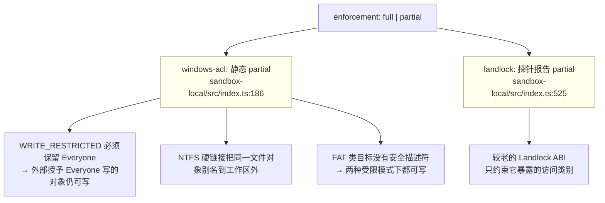
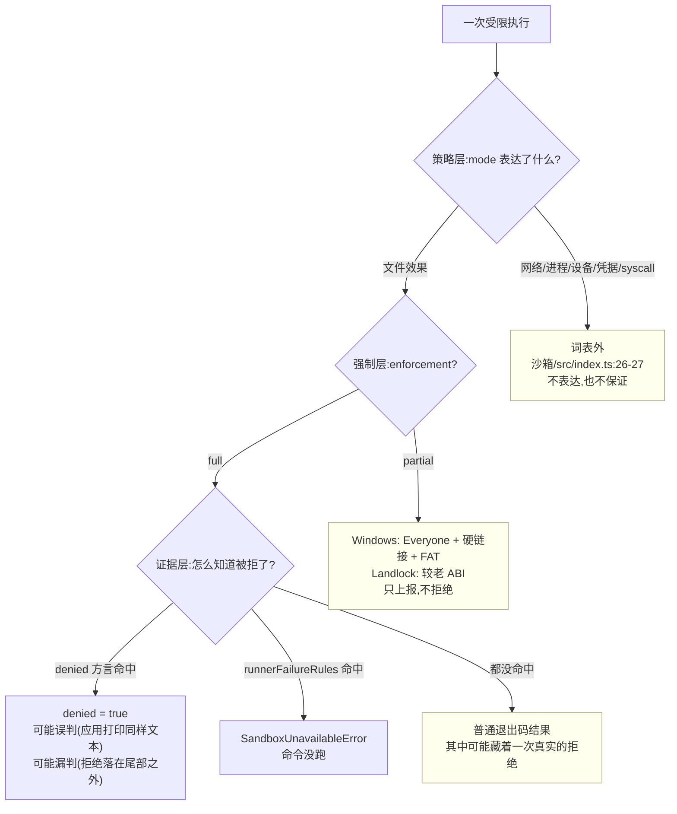

# 06 · 边界与失败模式

> 对应第七章 [第六节](../07-sandbox.md#第六节-已知限制)。
> 来源:源码注释与各包 README 的 `## Known Limitations and Deferred Work` 段落。

---

## 一句话结论

沙箱的边界有三层:**词表边界**(策略只表达文件效果)、**强制完整性边界**(`full` 与 `partial` 的差别)、**证据边界**(拒绝与执行器失败都靠 stderr 方言推断)。三层各有明确的、被源码明文记录的缺口,且**没有一层是"未知"**——都是设计取舍 + 已记录的残余风险。E2B 侧的缺口是另一类:它记录的是 POC 尚未覆盖的能力面。

---

## 第一节 策略词表未覆盖的维度

### 1.1 词表的自我声明

```typescript
// packages/sandbox/sandbox/src/index.ts:23-29
/**
 * File-effect policy for confined processes. `read-only` permits only required
 * sinks such as `/dev/null`; `workspace-write` also permits the workspace and a
 * backend-defined temp area; `danger-full-access` bypasses confinement. Network
 * and process visibility are outside this vocabulary.
 */
export type SandboxMode = 'read-only' | 'workspace-write' | 'danger-full-access'
```

"Network and process visibility are outside this vocabulary" 是词表自己的声明。README 把范围说得更完整:

```text
// packages/sandbox/sandbox/README.md:167
- **File effects are the whole policy vocabulary** — the seam expresses no network, process, syscall, device, or credential restrictions.
```

### 1.2 逐维度对照:词表说"不管",后端实际上给不给

| 维度 | 词表 | 实际后端行为(仅列源码/README 明写的事实) | 记录位置 |
|---|---|---|---|
| 网络 | 不表达 | 未记录任何后端限制网络;Windows 文档明写"writes are restricted; reads, network, and process visibility are not" | [`sandbox-windows-acl/src/index.ts:24-25`](https://github.com/deepseek-ai/deepseek-harness/blob/dbbaa4a37fb9098aba814c97d2956f7b2f105f46/packages/sandbox/sandbox-windows-acl/src/index.ts#L24-L25);[`sandbox-windows-acl/README.md:114`](https://github.com/deepseek-ai/deepseek-harness/blob/dbbaa4a37fb9098aba814c97d2956f7b2f105f46/packages/sandbox/sandbox-windows-acl/README.md#L114) |
| 进程可见性 | 不表达 | 只有 bwrap **顺带**提供:`--unshare-pid` + 私有 `/proc` 让命令看不到宿主进程 | [`sandbox-local/src/profiles.ts:17`](https://github.com/deepseek-ai/deepseek-harness/blob/dbbaa4a37fb9098aba814c97d2956f7b2f105f46/packages/sandbox/sandbox-local/src/profiles.ts#L17);[`sandbox-local/README.md:75`](https://github.com/deepseek-ai/deepseek-harness/blob/dbbaa4a37fb9098aba814c97d2956f7b2f105f46/packages/sandbox/sandbox-local/README.md#L75) |
| 进程管理能力 | 不表达 | bwrap 的私有 PID 命名空间让"命令能管自己的后代";其余后端无此保证 | [`sandbox-local/src/profiles.ts:17`](https://github.com/deepseek-ai/deepseek-harness/blob/dbbaa4a37fb9098aba814c97d2956f7b2f105f46/packages/sandbox/sandbox-local/src/profiles.ts#L17) |
| syscall | 不表达 | 未记录任何后端限制 syscall;Landlock 的 ruleset **只**治理它协商到的文件系统访问类别 | [`native/system/docs/cli-contract.md:34`](https://github.com/deepseek-ai/deepseek-harness/blob/dbbaa4a37fb9098aba814c97d2956f7b2f105f46/native/system/docs/cli-contract.md#L34) |
| 设备 | 不表达 | bwrap 给一个全新的 `/dev`(`--dev /dev`);`/dev/null` 在三种 POSIX profile 里都被显式放行,Windows 侧 NUL 写入是**环境权限**而非授予 | `profiles.ts:17,32,52`;[`sandbox-windows-acl/README.md:96`](https://github.com/deepseek-ai/deepseek-harness/blob/dbbaa4a37fb9098aba814c97d2956f7b2f105f46/packages/sandbox/sandbox-windows-acl/README.md#L96) |
| 凭据 | 不表达 | 凭据边界完全在上游:子进程环境清洗由 `subprocess-local` 负责,策略层不认识它 | [`sandbox/src/index.ts:26-27`](https://github.com/deepseek-ai/deepseek-harness/blob/dbbaa4a37fb9098aba814c97d2956f7b2f105f46/packages/sandbox/sandbox/src/index.ts#L26-L27);与[第二章](../02-security-analysis.md)的凭据一节衔接 |
| 读 | 不表达 | 三种 posix profile 都允许读(`--ro-bind / /`、`--ro /`、`(allow default)`);Windows 明写"a confined child can read any caller-readable file" | `profiles.ts:17,35,52`;[`sandbox-windows-acl/README.md:114`](https://github.com/deepseek-ai/deepseek-harness/blob/dbbaa4a37fb9098aba814c97d2956f7b2f105f46/packages/sandbox/sandbox-windows-acl/README.md#L114) |

**关键推论(源码明写)**:`read-only` 在 Windows 上"因此需要一条读侧策略才能被表达"([`sandbox-windows-acl/README.md:114`](https://github.com/deepseek-ai/deepseek-harness/blob/dbbaa4a37fb9098aba814c97d2956f7b2f105f46/packages/sandbox/sandbox-windows-acl/README.md#L114))——因为 `WRITE_RESTRICTED` 只与写访问求交。

### 1.3 越出词表的两个"能力替换"形态

```text
// packages/sandbox/sandbox/src/index.ts:2-4
... Containers, microVMs, and remote execution replace the
surrounding capability seam instead; this service shares the host kernel and filesystem.
```

```text
// packages/sandbox/sandbox/README.md:168
- **Same-world confinement only** — containers, microVMs, and remote execution require replacing capability implementations rather than adding a provider here.
```

所以"网络隔离 / 整机隔离"这类需求**在架构上没有落在本条缝的扩展点上**,只能替换 `ctx.fs`/`ctx.subprocess`(E2B 就是这么做的,见 [05 篇](05-e2b-remote.md))。

### 1.4 词表没有的其它维度

| 缺口 | 记录 |
|---|---|
| **每会话只有一个主工作区根**;额外可写根不在 `SandboxExecutionPolicy` 里 | [`sandbox-policy/README.md:147`](https://github.com/deepseek-ai/deepseek-harness/blob/dbbaa4a37fb9098aba814c97d2956f7b2f105f46/packages/sandbox/sandbox-policy/README.md#L147) |
| **平台临时区被故意概括描述**——各后端授予的临时区不同,且是在策略解析之后才选的,因此"无法在上下文中如实枚举" | [`sandbox-policy/README.md:149`](https://github.com/deepseek-ai/deepseek-harness/blob/dbbaa4a37fb9098aba814c97d2956f7b2f105f46/packages/sandbox/sandbox-policy/README.md#L149) |
| **一个 Cordis 上下文只能有一个 provider**;并用多种机制需要 provider 级阶梯或分离上下文 | `sandbox/README.md:171` |
| fs 围栏的**可写集与 runner 的一致性来自唯一 owner**(`writableRoots`);某个 runner profile 若在别处定义可写集就会漂移 | [`fs-sandbox/README.md:124`](https://github.com/deepseek-ai/deepseek-harness/blob/dbbaa4a37fb9098aba814c97d2956f7b2f105f46/packages/fs/fs-sandbox/README.md#L124) |

---

## 第二节 `partial enforcement` 的含义

### 2.1 定义

```typescript
// packages/sandbox/sandbox/src/index.ts:54-59
/**
 * Enforcement completeness for this host. `partial` means an active backend or
 * older kernel ABI cannot govern every promised file effect; callers requiring
 * an absolute boundary must not treat it as `full`.
 */
export type SandboxEnforcement = 'full' | 'partial'
```

即 `partial` ≠ "沙箱没生效",而是"**沙箱生效了,但它对模式承诺的文件效果只治理了一个子集**"。语义上它是 `full` 的**弱化**,不是 `full` 的反面。

### 2.2 当前的两个 partial 来源



<details><summary>Mermaid 源码</summary>



</details>

| 来源 | 判定方式 | 记录位置 |
|---|---|---|
| Windows ACL 档位 | **静态**——`STATIC_ENFORCEMENT['windows-acl'] = 'partial'`,永不为 `full` | [`sandbox-local/src/index.ts:177-187`](https://github.com/deepseek-ai/deepseek-harness/blob/dbbaa4a37fb9098aba814c97d2956f7b2f105f46/packages/sandbox/sandbox-local/src/index.ts#L177-L187);[`sandbox-local/README.md:128`](https://github.com/deepseek-ai/deepseek-harness/blob/dbbaa4a37fb9098aba814c97d2956f7b2f105f46/packages/sandbox/sandbox-local/README.md#L128) |
| 较老的 Landlock ABI | **探针报告**——`probe(launcher)` 返回 `'full' \| 'partial' \| 'unusable'`,由 launcher 的 `--probe` stdout 是否含 `partially enforced` 决定 | [`sandbox-local/src/index.ts:525`](https://github.com/deepseek-ai/deepseek-harness/blob/dbbaa4a37fb9098aba814c97d2956f7b2f105f46/packages/sandbox/sandbox-local/src/index.ts#L525);[`native/system/packages/entry/src/index.ts:116-127`](https://github.com/deepseek-ai/deepseek-harness/blob/dbbaa4a37fb9098aba814c97d2956f7b2f105f46/native/system/packages/entry/src/index.ts#L116-L127) |

Windows 的两条不可消除理由([`sandbox-local/src/index.ts:181-185`](https://github.com/deepseek-ai/deepseek-harness/blob/dbbaa4a37fb9098aba814c97d2956f7b2f105f46/packages/sandbox/sandbox-local/src/index.ts#L181-L185)、[`sandbox-windows-acl/README.md:112-113`](https://github.com/deepseek-ai/deepseek-harness/blob/dbbaa4a37fb9098aba814c97d2956f7b2f105f46/packages/sandbox/sandbox-windows-acl/README.md#L112-L113)):

1. **Everyone 必须留在两个 restricting 列表里**——移除它会让早期 DLL 初始化死 `0xC0000142`、CNG 让 pwsh 崩 `0xE0434352`;所以"一个外部 NTFS 对象只要其 DACL 给 Everyone 请求的写权限,就会通过两次检查,在两种模式下都可写"。
2. **硬链接是文件对象别名,不是路径别名**——继承的工作区 ACE 传播到已存在的硬链接上会改**同一个底层文件**的安全描述符,于是同一对象可通过外部别名写入;"对普通 pnpm 安装来说,拒绝多重链接文件并不可行"。

另外两条相关的 Windows 事实:FAT 类卷上的目标没有安全描述符,所以"在两种受限模式下都保持可写——FAT 被视为遗留残留"([`sandbox-windows-acl/README.md:174`](https://github.com/deepseek-ai/deepseek-harness/blob/dbbaa4a37fb9098aba814c97d2956f7b2f105f46/packages/sandbox/sandbox-windows-acl/README.md#L174));NUL 写入是环境权限(设备 DACL 给 Everyone `0x1201BF`),两种模式下行为不同(openers 可写,`Set-Content NUL` 失败)但那是 PowerShell/.NET 层效果,不是设备 DACL([`sandbox-windows-acl/README.md:96`](https://github.com/deepseek-ai/deepseek-harness/blob/dbbaa4a37fb9098aba814c97d2956f7b2f105f46/packages/sandbox/sandbox-windows-acl/README.md#L96))。

### 2.3 消费者目前怎么用这个字段

**只上报,不拒绝**。`enforcement` 从 provider 一路透传到工具输出:

| 层 | 落点 |
|---|---|
| provider | [`sandbox-local/src/index.ts:329`](https://github.com/deepseek-ai/deepseek-harness/blob/dbbaa4a37fb9098aba814c97d2956f7b2f105f46/packages/sandbox/sandbox-local/src/index.ts#L329) |
| 执行器 | [`bash-sandbox/src/index.ts:114`](https://github.com/deepseek-ai/deepseek-harness/blob/dbbaa4a37fb9098aba814c97d2956f7b2f105f46/packages/shell/bash-sandbox/src/index.ts#L114) → `result.sandbox.enforcement` |
| shell 缝类型 | `ShellSandboxInfo.enforcement?` |
| 工具输出 schema | [`tool-bash/src/index.ts:314`](https://github.com/deepseek-ai/deepseek-harness/blob/dbbaa4a37fb9098aba814c97d2956f7b2f105f46/packages/shell/tool-bash/src/index.ts#L314)(`enforcement: { type: 'string' }`,非必填) |
| 工具层透传 | [`tool-bash/src/index.ts:176`](https://github.com/deepseek-ai/deepseek-harness/blob/dbbaa4a37fb9098aba814c97d2956f7b2f105f46/packages/shell/tool-bash/src/index.ts#L176) |

缝的契约把决定权留给调用方:"需要绝对边界的调用方**不得**把它当作 `full`"([`sandbox/src/index.ts:56-58`](https://github.com/deepseek-ai/deepseek-harness/blob/dbbaa4a37fb9098aba814c97d2956f7b2f105f46/packages/sandbox/sandbox/src/index.ts#L56-L58))。当前代码里没有调用方据此拒绝——这本身是当前状态的事实,README 用的是"callers ... can reject or surface them"(`sandbox/README.md:62`)。

### 2.4 另一类"部分":平台侧的机制差异

以下三条不是 `partial` 字段,但同样是"承诺与实现的差":

| 事实 | 记录 |
|---|---|
| bwrap 的 `/tmp` 是 **tmpfs**(与宿主 `/tmp` 无关),Landlock 用宿主 `/tmp`,Seatbelt 用 canonical `/tmp`(= `/private/tmp`)与 `os.tmpdir()` | [`bash-sandbox/README.md:39`](https://github.com/deepseek-ai/deepseek-harness/blob/dbbaa4a37fb9098aba814c97d2956f7b2f105f46/packages/shell/bash-sandbox/README.md#L39);`profiles.ts:19,33,53` |
| Windows 受限进程内**管道 stdio 不可用**——libuv 的管道 stdio 用命名管道,其客户端打开请求写访问,而没有任何 restricting SID 被授予(这是 Win32 层默认 SD 模板的作用,不是令牌默认 DACL),所以受限进程里 `spawn(..., { stdio: 'pipe' })` 报 EPERM;匿名管道(PowerShell 管道)可用 | [`sandbox-windows-acl/README.md:171`](https://github.com/deepseek-ai/deepseek-harness/blob/dbbaa4a37fb9098aba814c97d2956f7b2f105f46/packages/sandbox/sandbox-windows-acl/README.md#L171) |
| Windows **控制台隔离不可用**——`CREATE_NO_WINDOW` / `CREATE_NEW_CONSOLE` 的子进程在 DLL 初始化时死于 `STATUS_DLL_INIT_FAILED`;子进程共享宿主控制台 | [`sandbox-windows-acl/README.md:115`](https://github.com/deepseek-ai/deepseek-harness/blob/dbbaa4a37fb9098aba814c97d2956f7b2f105f46/packages/sandbox/sandbox-windows-acl/README.md#L115);[`sandbox-windows-acl/src/index.ts:26-28`](https://github.com/deepseek-ai/deepseek-harness/blob/dbbaa4a37fb9098aba814c97d2956f7b2f105f46/packages/sandbox/sandbox-windows-acl/src/index.ts#L26-L28) |

最后一条在本仓库里有直接后果:受限侧统一走 `stdio: 'inherit'`([`runner.ts:184`](https://github.com/deepseek-ai/deepseek-harness/blob/dbbaa4a37fb9098aba814c97d2956f7b2f105f46/packages/sandbox/sandbox-windows-acl/src/runner.ts#L184)),这也解释了系统提示里那句"restricted 侧不能捕获管道输出"。

---

## 第三节 词表外的拒绝方言

### 3.1 机制本身不是类型化通道

```text
// packages/sandbox/sandbox/README.md:169
- **Denial reporting is a stderr dialect** — the seam returns backend signatures instead of a typed runtime denial channel, so consumers that need classification infer it from the child process's output.
```

缝返回的是"该后端产生哪些子串",而不是"这一次被拒了"。分类在消费者侧:

| 分类器 | 匹配方式 | 判据强度 |
|---|---|---|
| `classifyRunnerFailure` | 退出码门控 → 整行剔除信息行 → **逐行**子串 | 强(能指名一行) |
| `matchesSignature`(拒绝) | **全文**大小写不敏感子串 | 弱(只要出现过) |

### 3.2 会误判与漏判的场景,逐条列出

| # | 场景 | 方向 | 记录位置 |
|---|---|---|---|
| 1 | 应用自身打印了与方言匹配的错误文本 | **误判为拒绝** | [`bash-sandbox/README.md:172`](https://github.com/deepseek-ai/deepseek-harness/blob/dbbaa4a37fb9098aba814c97d2956f7b2f105f46/packages/shell/bash-sandbox/README.md#L172) |
| 2 | 拒绝信息落在保留尾部之外(输出被截断) | **漏判** | [`bash-sandbox/README.md:172`](https://github.com/deepseek-ai/deepseek-harness/blob/dbbaa4a37fb9098aba814c97d2956f7b2f105f46/packages/shell/bash-sandbox/README.md#L172) |
| 3 | 子进程**刻意模仿 runner** 的诊断行 | 错误的可用性/诊断归因 | `sandbox/README.md:170` |
| 4 | 后台进程的执行器失败**没有立即错误通道**,只能在该进程结算后经 `job_output` 读到 | 延迟上报 | [`bash-sandbox/README.md:173`](https://github.com/deepseek-ai/deepseek-harness/blob/dbbaa4a37fb9098aba814c97d2956f7b2f105f46/packages/shell/bash-sandbox/README.md#L173) |
| 5 | 把某个后端的方言与另一个后端的并集使用 | 会声称该后端永不会产生的拒绝 | [`sandbox/src/index.ts:100-108`](https://github.com/deepseek-ai/deepseek-harness/blob/dbbaa4a37fb9098aba814c97d2956f7b2f105f46/packages/sandbox/sandbox/src/index.ts#L100-L108)(缝用方言表而非并集来规避) |
| 6 | 退出码为 `null`(信号死亡)时任何签名匹配都不成立 | 拒绝不被识别 | `helpers.ts:86,113` |

第 3 条的性质值得单独强调,因为它容易被误读为漏洞。README 的原话是:

```text
// packages/sandbox/sandbox/README.md:170
- **Runner diagnostics are in-band** — exit status plus stderr evidence cannot prove which process wrote a matching line, so a confined child that deliberately mimics its runner can cause a false availability or diagnostic attribution; this cannot bypass confinement, and an out-of-band runner-status channel is deferred.
```

即"归因错误**不能绕过约束**"——它只会让报告错(把命令失败说成沙箱不可用,或反之),不会让本该被拦的操作通过。

第 4 条有一个互补的正向通道:`start()` 期间的**同步** subprocess 抛错(错误独立指名 runner 路径)会**立即**让 `start()` 失败([`bash-sandbox/README.md:173`](https://github.com/deepseek-ai/deepseek-harness/blob/dbbaa4a37fb9098aba814c97d2956f7b2f105f46/packages/shell/bash-sandbox/README.md#L173)、[`bash-sandbox/src/index.ts:130-133`](https://github.com/deepseek-ai/deepseek-harness/blob/dbbaa4a37fb9098aba814c97d2956f7b2f105f46/packages/shell/bash-sandbox/src/index.ts#L130-L133))。区别在于错误是同步抛出还是异步结算。

### 3.3 runner 失败的判定需要"退出码 + 致命行"两条

`RUNNER_FAILURE_RULES` 的两条带门控、两条不带([`sandbox-local/src/index.ts:231-240`](https://github.com/deepseek-ai/deepseek-harness/blob/dbbaa4a37fb9098aba814c97d2956f7b2f105f46/packages/sandbox/sandbox-local/src/index.ts#L231-L240)),原因已在 [02 篇](02-platform-backends.md#31-两组常量表)展开。这里只补一条由此产生的**残余风险**:

| 后端 | 门控 | 残余风险 |
|---|---|---|
| Landlock | 退出码 125 + `landlock-run: ` 致命行 | launcher 自己的契约说明了为什么需要两条:"exec 成功后子进程状态原样传递,**包括 125**",所以只有 `125` 加致命行才能归因([`native/system/docs/cli-contract.md:23`](https://github.com/deepseek-ai/deepseek-harness/blob/dbbaa4a37fb9098aba814c97d2956f7b2f105f46/native/system/docs/cli-contract.md#L23)) |
| windows-acl | 退出码 127 + `windows-acl-run: ` | 注释明写门控的作用:防止"受限命令仅仅**打印**这个签名",或"runner 清理失败被报在非零子退出上"被误判成"命令没跑"([`sandbox-local/src/index.ts:224-227`](https://github.com/deepseek-ai/deepseek-harness/blob/dbbaa4a37fb9098aba814c97d2956f7b2f105f46/packages/sandbox/sandbox-local/src/index.ts#L224-L227)) |
| bwrap | 无(仅签名) | 注释承认:"bwrap 当前致命路径退出 1,但它的**公开契约没有保留**这个状态"([`:220-221`](https://github.com/deepseek-ai/deepseek-harness/blob/dbbaa4a37fb9098aba814c97d2956f7b2f105f46/packages/sandbox/sandbox-local/src/index.ts#L220-L221)) |
| Seatbelt | 无(仅签名) | `sandbox-exec` **不发布** launcher 失败状态([`:221-222`](https://github.com/deepseek-ai/deepseek-harness/blob/dbbaa4a37fb9098aba814c97d2956f7b2f105f46/packages/sandbox/sandbox-local/src/index.ts#L221-L222)) |

### 3.4 `danger-full-access` 不是"更宽的 profile"

```text
// packages/shell/bash-sandbox/README.md:174
- **`danger-full-access` deliberately bypasses `ctx.sandbox`** — it is an explicit unconfined mode, not a wider sandbox profile.
```

代码依据:[`bash-sandbox/src/index.ts:92-95`](https://github.com/deepseek-ai/deepseek-harness/blob/dbbaa4a37fb9098aba814c97d2956f7b2f105f46/packages/shell/bash-sandbox/src/index.ts#L92-L95) 与 [`terminal-bash/src/index.ts:102`](https://github.com/deepseek-ai/deepseek-harness/blob/dbbaa4a37fb9098aba814c97d2956f7b2f105f46/packages/terminal/terminal-bash/src/index.ts#L102) 都在 `confine` 之前分流。所以在这一档下:**provider 完全不被咨询**,任何"provider 的方言/可用性"事实都不存在,`result.sandbox` 只带 `{ mode, denied: false }`。

### 3.5 词表封闭性的运行时守卫

| 守卫 | 行为 | 位置 |
|---|---|---|
| `SANDBOX_MODES` | 运行时词表,预设广告与不变式共用 | [`sandbox-policy/src/session-mode.ts:42`](https://github.com/deepseek-ai/deepseek-harness/blob/dbbaa4a37fb9098aba814c97d2956f7b2f105f46/packages/sandbox/sandbox-policy/src/session-mode.ts#L42) |
| [`invariant.ts`](https://github.com/deepseek-ai/deepseek-harness/blob/dbbaa4a37fb9098aba814c97d2956f7b2f105f46/packages/sandbox/sandbox-policy/src/invariant.ts) | 拒绝日志里词表外的 `sandbox/mode`(扫历史 + 监听新事件) | [`sandbox-policy/src/invariant.ts:18-34`](https://github.com/deepseek-ai/deepseek-harness/blob/dbbaa4a37fb9098aba814c97d2956f7b2f105f46/packages/sandbox/sandbox-policy/src/invariant.ts#L18-L34) |
| schema 的 `enum` | `sandbox_permissions` 的取值被钉在 `ESCALATION_TARGETS` | [`tool-bash/src/index.ts:261`](https://github.com/deepseek-ai/deepseek-harness/blob/dbbaa4a37fb9098aba814c97d2956f7b2f105f46/packages/shell/tool-bash/src/index.ts#L261);[`tool-fs/src/sandbox.ts:63`](https://github.com/deepseek-ai/deepseek-harness/blob/dbbaa4a37fb9098aba814c97d2956f7b2f105f46/packages/fs/tool-fs/src/sandbox.ts#L63) |
| 未广告字段仍能到达 `execute` | 所以需要执行期的组合守卫 | [`tool-bash/src/index.ts:205-220`](https://github.com/deepseek-ai/deepseek-harness/blob/dbbaa4a37fb9098aba814c97d2956f7b2f105f46/packages/shell/tool-bash/src/index.ts#L205-L220) |

最后一条是**已知的 schema 局限**而非漏洞:JSON Schema 只校验被广告的键,未广告键仍会进入 `execute`——四个组合守卫(`tool-bash:195`、`tool-fs/sandbox:48`、`tool-str-replace-editor:72`、`permission-presets:197`)是补齐它的手段。

---

## 第四节 E2B / 远程的语义缺口

以下全部来自 `packages/e2b/*/README.md` 的 Known Limitations 与 `Dev Note`。

### 4.1 范围缺口

| 缺口 | 记录位置 |
|---|---|
| **不是整机 harness 运行时**——Cordis 服务、agent/session 状态、会话日志、LLM 请求、技能、SDK 侧缓冲都留在宿主进程 | [`e2b/e2b/README.md:128`](https://github.com/deepseek-ai/deepseek-harness/blob/dbbaa4a37fb9098aba814c97d2956f7b2f105f46/packages/e2b/e2b/README.md#L128) |
| **沙箱状态是临时的**——拆卸与超时都会删除;重连、暂停保留、模板、卷、快照都在 POC 之外 | [`e2b/e2b/README.md:129`](https://github.com/deepseek-ai/deepseek-harness/blob/dbbaa4a37fb9098aba814c97d2956f7b2f105f46/packages/e2b/e2b/README.md#L129) |
| **没有配置部署平台**——网络策略、宿主工作区同步、沙箱发现都在 POC 之外 | [`e2b/e2b/README.md:130`](https://github.com/deepseek-ai/deepseek-harness/blob/dbbaa4a37fb9098aba814c97d2956f7b2f105f46/packages/e2b/e2b/README.md#L130) |
| **`cwd` 是解析约定,不是包含边界**——adapter 与命令可以寻址沙箱内其它路径;E2B 网络访问沿用基础镜像的策略 | [`e2b/e2b/README.md:131`](https://github.com/deepseek-ai/deepseek-harness/blob/dbbaa4a37fb9098aba814c97d2956f7b2f105f46/packages/e2b/e2b/README.md#L131) |
| **没有宿主同步**——空 `cwd` 会一直是空的,本地文件既不上传也不回写 | [`fs-e2b/README.md:124`](https://github.com/deepseek-ai/deepseek-harness/blob/dbbaa4a37fb9098aba814c97d2956f7b2f105f46/packages/e2b/fs-e2b/README.md#L124) |
| **POC 针对 E2B 默认 Linux 镜像**——依赖 GNU `realpath`/`base64`/`chmod`、同文件系统 rename、流式读与元数据扩展属性;自定义模板不在范围内 | [`fs-e2b/README.md:128`](https://github.com/deepseek-ai/deepseek-harness/blob/dbbaa4a37fb9098aba814c97d2956f7b2f105f46/packages/e2b/fs-e2b/README.md#L128) |
| **假定了 Linux 工具与 E2B 传输语义**——没有 Windows、没有逃逸会话恢复、没有网络分区保真层 | [`subprocess-e2b/README.md:151`](https://github.com/deepseek-ai/deepseek-harness/blob/dbbaa4a37fb9098aba814c97d2956f7b2f105f46/packages/e2b/subprocess-e2b/README.md#L151) |

### 4.2 内存与隔离缺口

| 缺口 | 记录位置 |
|---|---|
| **SDK 仍在宿主内存保留完整命令输出**——`CommandHandle.stdout`/`.stderr` 累积 base64 传输,即使 adapter 只暴露有界原始字节尾部;"subprocess 缝的常规宿主内存上界没有达成,且传输保留比源流更大" | [`subprocess-e2b/README.md:144`](https://github.com/deepseek-ai/deepseek-harness/blob/dbbaa4a37fb9098aba814c97d2956f7b2f105f46/packages/e2b/subprocess-e2b/README.md#L144) |
| **私有状态存活到沙箱生命期**——进程目录与有效 spill 文件留在 `.dsh-e2b` 下直到 owner 删除沙箱;POC 不提供沙箱内清扫 | [`subprocess-e2b/README.md:145`](https://github.com/deepseek-ai/deepseek-harness/blob/dbbaa4a37fb9098aba814c97d2956f7b2f105f46/packages/e2b/subprocess-e2b/README.md#L145) |
| **控制状态与沙箱用户同 UID**——E2B 以同一默认用户运行每条命令,所以 `0700`/`0600` 无法把 `.dsh-e2b` 控制文件与并发运行的沙箱进程隔离;真正的隔离需要 E2B 的每命令用户或带外控制通道 | [`subprocess-e2b/README.md:146`](https://github.com/deepseek-ai/deepseek-harness/blob/dbbaa4a37fb9098aba814c97d2956f7b2f105f46/packages/e2b/subprocess-e2b/README.md#L146) |
| **数值进程身份没有复用围栏**——E2B 暴露数值 PID/PGID 的输入、发信号与清理操作,但没有原子身份绑定替代;代码里的 `TODO(e2b-pgid-identity)` 明写"用户态的身份预检查无法关掉数值 PGID 复用的竞态" | [`subprocess-e2b/README.md:147`](https://github.com/deepseek-ai/deepseek-harness/blob/dbbaa4a37fb9098aba814c97d2956f7b2f105f46/packages/e2b/subprocess-e2b/README.md#L147);[`remote.ts:87-88`](https://github.com/deepseek-ai/deepseek-harness/blob/dbbaa4a37fb9098aba814c97d2956f7b2f105f46/packages/e2b/subprocess-e2b/src/remote.ts#L87-L88) |

### 4.3 语义保真缺口

| 缺口 | 记录位置 |
|---|---|
| **初始环境探针继承沙箱默认值**——E2B 把命令 overrides 与默认环境项合并,所以探针**无法在枚举前**把未知的凭据形状名字清空;因此"本 POC 不支持把密钥放在沙箱默认环境变量里";代码里是 `TODO(e2b-replace-environment)` | [`subprocess-e2b/README.md:148`](https://github.com/deepseek-ai/deepseek-harness/blob/dbbaa4a37fb9098aba814c97d2956f7b2f105f46/packages/e2b/subprocess-e2b/README.md#L148);[`environment.ts:29-30`](https://github.com/deepseek-ai/deepseek-harness/blob/dbbaa4a37fb9098aba814c97d2956f7b2f105f46/packages/e2b/subprocess-e2b/src/environment.ts#L29-L30) |
| **E2B 不暴露信号事实**——adapter 请求的 `SIGTERM`/`SIGKILL` 只有在没有包装器发布的直接退出码胜出时才会被报告;每个**未被请求**的 SDK 退出都保持为退出码,**包括等于 `128 + signal` 的值** | [`subprocess-e2b/README.md:149`](https://github.com/deepseek-ai/deepseek-harness/blob/dbbaa4a37fb9098aba814c97d2956f7b2f105f46/packages/e2b/subprocess-e2b/README.md#L149) |
| **无法精确检查终端 stdin 等待**——E2B 暴露前台进程组但不暴露"它正在等待 fd 0"所需的 syscall 证据,所以通用 PTY 后端回落到可控提示标记 + 有界静默 | [`subprocess-e2b/README.md:150`](https://github.com/deepseek-ai/deepseek-harness/blob/dbbaa4a37fb9098aba814c97d2956f7b2f105f46/packages/e2b/subprocess-e2b/README.md#L150) |
| **`collect`/`inherit` 的命令状态需要控制面轮询**——因为 E2B 无法独立于"后代持有输出"观察直接命令退出;`TODO(e2b-status-watch)` | [`subprocess-e2b/README.md:167`](https://github.com/deepseek-ai/deepseek-harness/blob/dbbaa4a37fb9098aba814c97d2956f7b2f105f46/packages/e2b/subprocess-e2b/README.md#L167);`Config.pollMs` 默认 `20`([`subprocess-e2b/src/index.ts:63-65`](https://github.com/deepseek-ai/deepseek-harness/blob/dbbaa4a37fb9098aba814c97d2956f7b2f105f46/packages/e2b/subprocess-e2b/src/index.ts#L63-L65)) |

### 4.4 fs 侧的语义缺口

| 缺口 | 记录位置 |
|---|---|
| **变更协调是宿主进程局部的**——`createIfAbsent` 能防住与远端创建者的竞态,但另一个 harness 连接或命令仍可能与替换竞态;版本守卫只能检测 E2B 表示的元数据变化 | [`fs-e2b/README.md:125`](https://github.com/deepseek-ai/deepseek-harness/blob/dbbaa4a37fb9098aba814c97d2956f7b2f105f46/packages/e2b/fs-e2b/README.md#L125) |
| **读会按路径重新打开 canonical target**——解析与流打开之间发生的远端路径替换不被稳定文件句柄围栏;"没有观察到的产品缺陷足以证明在 POC 里加一套 provider 专属的有界读协议" | [`fs-e2b/README.md:126`](https://github.com/deepseek-ai/deepseek-harness/blob/dbbaa4a37fb9098aba814c97d2956f7b2f105f46/packages/e2b/fs-e2b/README.md#L126) |
| **整文件变更成本仍在**——覆盖写差异与字面编辑都会把完整文件读进宿主内存,且每次操作都有 E2B 控制面延迟 | [`fs-e2b/README.md:127`](https://github.com/deepseek-ai/deepseek-harness/blob/dbbaa4a37fb9098aba814c97d2956f7b2f105f46/packages/e2b/fs-e2b/README.md#L127) |

### 4.5 沙箱侧对远程组合的约束

一条容易踩的装配事实:E2B 组合下若同时挂了本地 `ctx.sandbox`,`terminal-bash` 会走 `sandbox.confine(argv, policy)` 并把**宿主 runner** 的前缀加到一个远端世界要执行的 argv 上。避免它的现实做法就是 [05 篇](05-e2b-remote.md#22-代码证据一packagese2b-里没有-ctxsandbox也没有-sandboxprovider)记录的那条测试装配:只挂 `sandbox-policy` 且取 `danger-full-access`。

---

## 第五节 边界总表



<details><summary>Mermaid 源码</summary>



</details>

| 边界 | 性质 | 记录位置 |
|---|---|---|
| 词表只有文件效果 | 设计取舍 | [`sandbox/src/index.ts:26-27`](https://github.com/deepseek-ai/deepseek-harness/blob/dbbaa4a37fb9098aba814c97d2956f7b2f105f46/packages/sandbox/sandbox/src/index.ts#L26-L27);`sandbox/README.md:167` |
| same-world only | 设计取舍(架构扩展点不在此) | [`sandbox/src/index.ts:2-4`](https://github.com/deepseek-ai/deepseek-harness/blob/dbbaa4a37fb9098aba814c97d2956f7b2f105f46/packages/sandbox/sandbox/src/index.ts#L2-L4);`sandbox/README.md:168` |
| 拒绝是 stderr 方言 | 设计取舍(无类型化通道) | `sandbox/README.md:169` |
| runner 诊断带内 | 已记录残余风险(不能绕过约束) | `sandbox/README.md:170` |
| 一个 context 一个 provider | 架构约束 | `sandbox/README.md:171` |
| Windows `partial` | 机制固有 | [`sandbox-local/src/index.ts:181-186`](https://github.com/deepseek-ai/deepseek-harness/blob/dbbaa4a37fb9098aba814c97d2956f7b2f105f46/packages/sandbox/sandbox-local/src/index.ts#L181-L186) |
| Landlock 老 ABI `partial` | 探针上报 | [`sandbox-local/README.md:129`](https://github.com/deepseek-ai/deepseek-harness/blob/dbbaa4a37fb9098aba814c97d2956f7b2f105f46/packages/sandbox/sandbox-local/README.md#L129) |
| Seatbelt 依赖已弃用的 `sandbox-exec` | 外部依赖风险;探针是 fail-closed 点 | [`sandbox-local/README.md:130`](https://github.com/deepseek-ai/deepseek-harness/blob/dbbaa4a37fb9098aba814c97d2956f7b2f105f46/packages/sandbox/sandbox-local/README.md#L130);[`sandbox-local/src/index.ts:76-84`](https://github.com/deepseek-ai/deepseek-harness/blob/dbbaa4a37fb9098aba814c97d2956f7b2f105f46/packages/sandbox/sandbox-local/src/index.ts#L76-L84) |
| runner 选择被缓存整个 provider 生命期 | 运维约束(需重载插件) | [`sandbox-local/README.md:131`](https://github.com/deepseek-ai/deepseek-harness/blob/dbbaa4a37fb9098aba814c97d2956f7b2f105f46/packages/sandbox/sandbox-local/README.md#L131) |
| `runnerCommand` 是运维断言 | 信任边界(跳过探针;若本身是 shell 脚本,解释器启动在约束之前) | [`sandbox-local/README.md:132`](https://github.com/deepseek-ai/deepseek-harness/blob/dbbaa4a37fb9098aba814c97d2956f7b2f105f46/packages/sandbox/sandbox-local/README.md#L132) |
| fs 围栏是策略检查而非内核边界 | 威胁模型(对抗性宿主进程不在内) | [`fs-sandbox/src/index.ts:10-18`](https://github.com/deepseek-ai/deepseek-harness/blob/dbbaa4a37fb9098aba814c97d2956f7b2f105f46/packages/fs/fs-sandbox/src/index.ts#L10-L18);[`fs-sandbox/README.md:123`](https://github.com/deepseek-ai/deepseek-harness/blob/dbbaa4a37fb9098aba814c97d2956f7b2f105f46/packages/fs/fs-sandbox/README.md#L123) |
| 一个工作区一个写 allowlist | ACL 语义 | [`sandbox-windows-acl/README.md:167`](https://github.com/deepseek-ai/deepseek-harness/blob/dbbaa4a37fb9098aba814c97d2956f7b2f105f46/packages/sandbox/sandbox-windows-acl/README.md#L167) |
| standing 工作区 ACE 是不可见残留 | 清理语义 | [`sandbox-windows-acl/README.md:169`](https://github.com/deepseek-ai/deepseek-harness/blob/dbbaa4a37fb9098aba814c97d2956f7b2f105f46/packages/sandbox/sandbox-windows-acl/README.md#L169) |
| NULL-DACL 目录在 grant+revoke 后不保原语义 | 边界情形(真实工作区带真实 DACL) | [`sandbox-windows-acl/README.md:170`](https://github.com/deepseek-ai/deepseek-harness/blob/dbbaa4a37fb9098aba814c97d2956f7b2f105f46/packages/sandbox/sandbox-windows-acl/README.md#L170) |
| 授予是急性的整树传播(大工作区数十秒) | 性能事实 | [`sandbox-windows-acl/README.md:172`](https://github.com/deepseek-ai/deepseek-harness/blob/dbbaa4a37fb9098aba814c97d2956f7b2f105f46/packages/sandbox/sandbox-windows-acl/README.md#L172) |
| 清理尽力而为 | 失败语义(残留惰性) | [`sandbox-windows-acl/README.md:168`](https://github.com/deepseek-ai/deepseek-harness/blob/dbbaa4a37fb9098aba814c97d2956f7b2f105f46/packages/sandbox/sandbox-windows-acl/README.md#L168) |
| PowerShell 语言模式随受限模式变化 | 平台行为 | [`sandbox-windows-acl/README.md:175`](https://github.com/deepseek-ai/deepseek-harness/blob/dbbaa4a37fb9098aba814c97d2956f7b2f105f46/packages/sandbox/sandbox-windows-acl/README.md#L175) |
| 后台 runner 失败无立即错误通道 | 观测延迟 | [`bash-sandbox/README.md:173`](https://github.com/deepseek-ai/deepseek-harness/blob/dbbaa4a37fb9098aba814c97d2956f7b2f105f46/packages/shell/bash-sandbox/README.md#L173) |
| E2B:非整机运行时 / 状态临时 / 无部署平台 / `cwd` 不是包含边界 | POC 范围 | [`e2b/e2b/README.md:128-131`](https://github.com/deepseek-ai/deepseek-harness/blob/dbbaa4a37fb9098aba814c97d2956f7b2f105f46/packages/e2b/e2b/README.md#L128-L131) |
| E2B:SDK 保留完整输出于宿主内存 | 内存缺口 | [`subprocess-e2b/README.md:144`](https://github.com/deepseek-ai/deepseek-harness/blob/dbbaa4a37fb9098aba814c97d2956f7b2f105f46/packages/e2b/subprocess-e2b/README.md#L144) |
| E2B:控制状态同 UID、数值身份无复用围栏 | 隔离缺口 | [`subprocess-e2b/README.md:146-147`](https://github.com/deepseek-ai/deepseek-harness/blob/dbbaa4a37fb9098aba814c97d2956f7b2f105f46/packages/e2b/subprocess-e2b/README.md#L146-L147) |
| E2B:初始环境探针继承沙箱默认值 | 语义缺口(故不支持沙箱默认环境变量里放密钥) | [`subprocess-e2b/README.md:148`](https://github.com/deepseek-ai/deepseek-harness/blob/dbbaa4a37fb9098aba814c97d2956f7b2f105f46/packages/e2b/subprocess-e2b/README.md#L148) |

---

## 关键文件 / 符号索引表

| 文件 | 关键内容 | 行号 |
|---|---|---|
| [`packages/sandbox/sandbox/src/index.ts`](https://github.com/deepseek-ai/deepseek-harness/blob/dbbaa4a37fb9098aba814c97d2956f7b2f105f46/packages/sandbox/sandbox/src/index.ts) | 词表与 same-world 声明 | 1-6 / 23-29 |
| | `SandboxEnforcement` 定义 | 54-59 |
| | 方言语义边界注释 | 100-108 |
| | 禁止静默放行 | 152-157 |
| [`packages/sandbox/sandbox/README.md`](https://github.com/deepseek-ai/deepseek-harness/blob/dbbaa4a37fb9098aba814c97d2956f7b2f105f46/packages/sandbox/sandbox/README.md) | 五条 Known Limitations | 167-171 |
| [`packages/sandbox/sandbox-local/src/index.ts`](https://github.com/deepseek-ai/deepseek-harness/blob/dbbaa4a37fb9098aba814c97d2956f7b2f105f46/packages/sandbox/sandbox-local/src/index.ts) | `STATIC_ENFORCEMENT`(windows-acl partial) | 177-187 |
| | `RUNNER_FAILURE_RULES` 及其注释 | 218-240 |
| | Seatbelt 探针即 fail-closed 点 | 76-84 |
| [`packages/sandbox/sandbox-local/README.md`](https://github.com/deepseek-ai/deepseek-harness/blob/dbbaa4a37fb9098aba814c97d2956f7b2f105f46/packages/sandbox/sandbox-local/README.md) | 五条 Known Limitations | 128-132 |
| [`packages/sandbox/sandbox-policy/README.md`](https://github.com/deepseek-ai/deepseek-harness/blob/dbbaa4a37fb9098aba814c97d2956f7b2f105f46/packages/sandbox/sandbox-policy/README.md) | 三条 Known Limitations | 147-149 |
| [`packages/sandbox/sandbox-windows-acl/src/index.ts`](https://github.com/deepseek-ai/deepseek-harness/blob/dbbaa4a37fb9098aba814c97d2956f7b2f105f46/packages/sandbox/sandbox-windows-acl/src/index.ts) | 三条固有边界 | 23-39 |
| [`packages/sandbox/sandbox-windows-acl/README.md`](https://github.com/deepseek-ai/deepseek-harness/blob/dbbaa4a37fb9098aba814c97d2956f7b2f105f46/packages/sandbox/sandbox-windows-acl/README.md) | 读/网络/进程不受限 | 114 |
| | 控制台隔离不可用 | 115 |
| | NUL 写入是环境权限 | 96 |
| | 十条 Known Limitations | 167-175 |
| [`packages/shell/bash-sandbox/README.md`](https://github.com/deepseek-ai/deepseek-harness/blob/dbbaa4a37fb9098aba814c97d2956f7b2f105f46/packages/shell/bash-sandbox/README.md) | 四条 Known Limitations | 171-174 |
| [`packages/shell/bash-sandbox/src/helpers.ts`](https://github.com/deepseek-ai/deepseek-harness/blob/dbbaa4a37fb9098aba814c97d2956f7b2f105f46/packages/shell/bash-sandbox/src/helpers.ts) | 逐行 / 全文两种匹配的差异 | 81-103 / 112-116 |
| [`packages/fs/fs-sandbox/src/index.ts`](https://github.com/deepseek-ai/deepseek-harness/blob/dbbaa4a37fb9098aba814c97d2956f7b2f105f46/packages/fs/fs-sandbox/src/index.ts) | 威胁模型注释 | 10-18 |
| [`packages/fs/fs-sandbox/README.md`](https://github.com/deepseek-ai/deepseek-harness/blob/dbbaa4a37fb9098aba814c97d2956f7b2f105f46/packages/fs/fs-sandbox/README.md) | 三条 Known Limitations | 123-125 |
| [`native/system/docs/cli-contract.md`](https://github.com/deepseek-ai/deepseek-harness/blob/dbbaa4a37fb9098aba814c97d2956f7b2f105f46/native/system/docs/cli-contract.md) | 125 加致命行才可归因 | 20-30 |
| [`native/system/docs/cli-contract.md`](https://github.com/deepseek-ai/deepseek-harness/blob/dbbaa4a37fb9098aba814c97d2956f7b2f105f46/native/system/docs/cli-contract.md) | ABI 差即 full/partial 之差 | 34 |
| [`packages/e2b/e2b/README.md`](https://github.com/deepseek-ai/deepseek-harness/blob/dbbaa4a37fb9098aba814c97d2956f7b2f105f46/packages/e2b/e2b/README.md) | 四条 Known Limitations | 128-131 |
| [`packages/e2b/fs-e2b/README.md`](https://github.com/deepseek-ai/deepseek-harness/blob/dbbaa4a37fb9098aba814c97d2956f7b2f105f46/packages/e2b/fs-e2b/README.md) | 五条 Known Limitations | 124-128 |
| [`packages/e2b/subprocess-e2b/README.md`](https://github.com/deepseek-ai/deepseek-harness/blob/dbbaa4a37fb9098aba814c97d2956f7b2f105f46/packages/e2b/subprocess-e2b/README.md) | 八条 Known Limitations | 144-151 |
| [`packages/e2b/subprocess-e2b/src/remote.ts`](https://github.com/deepseek-ai/deepseek-harness/blob/dbbaa4a37fb9098aba814c97d2956f7b2f105f46/packages/e2b/subprocess-e2b/src/remote.ts) | `TODO(e2b-pgid-identity)` | 87-88 |
| [`packages/e2b/subprocess-e2b/src/environment.ts`](https://github.com/deepseek-ai/deepseek-harness/blob/dbbaa4a37fb9098aba814c97d2956f7b2f105f46/packages/e2b/subprocess-e2b/src/environment.ts) | `TODO(e2b-replace-environment)` | 29-30 |
