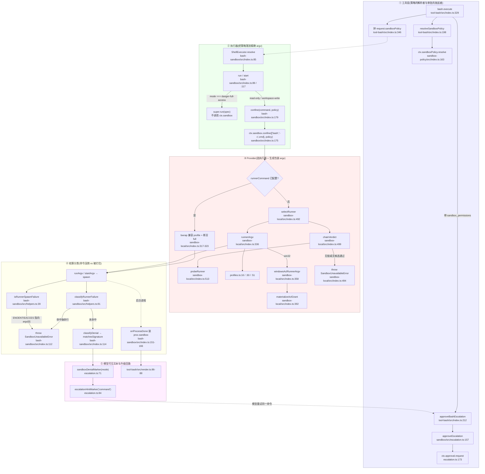

# Sandbox 模块 · 函数级深化分析

> 分析对象:[deepseek-ai/deepseek-harness](https://github.com/deepseek-ai/deepseek-harness) @ `dbbaa4a37`
> 范围:`packages/sandbox/*`(4 包 12 个源文件)+ 消费方 `packages/shell/{bash-sandbox,pwsh-sandbox,tool-bash}`、`packages/fs/{fs-sandbox,tool-fs,tool-str-replace-editor,fs-observation-policy}`、`packages/terminal/terminal-bash`、`packages/interaction/permission-presets` + `packages/e2b/*`(3 包 12 个源文件)

---

## 一、按问题索引

| 想知道 | 读 |
|---|---|
| 沙箱在 DSH 里是什么、与 Claude Code 的差异、设计动机 | [第七章](../07-sandbox.md) |
| 沙箱与审批/凭据/受信面的整体关系 | [第二章](../02-security-analysis.md) |
| `confine()` 的每个返回字段谁在用、`resolve()` 的优先级从哪来、fail-closed 抛在哪一行 | 本模块 [`01-seam-and-policy.md`](./01-seam-and-policy.md) |
| bwrap/Landlock/Seatbelt 的真实 argv、拒绝方言怎么匹配、ACL 令牌与 SID 怎么造 | 本模块 [`02-platform-backends.md`](./02-platform-backends.md) |
| `approveEscalation` 逐条失败点、工具层怎么广告与映射错误 | 本模块 [`03-escalation-and-approval.md`](./03-escalation-and-approval.md) |
| 五个消费方各自在哪一行取策略、在哪一行围栏 | 本模块 [`04-consumers.md`](./04-consumers.md) |
| E2B 为什么"替换能力缝"、句柄与输出怎么走 | 本模块 [`05-e2b-remote.md`](./05-e2b-remote.md) |
| 沙箱**做不到**什么、哪些拒绝会被漏判 | 本模块 [`06-limits-and-failure-modes.md`](./06-limits-and-failure-modes.md) |

---

## 二、工具调用 → 策略解析 → confine → 执行器 → 拒绝/升级:函数级调用栈

下图是骨架:**一次 `bash` 工具调用穿过沙箱的全部函数跨度**,节点标注真实定义位置。实线为同步调用,虚线为跨层数据流。


<details><summary>Mermaid 源码</summary>



</details>

读图要点:

1. **策略在工具层解析,不在执行器里**。`tool-bash/src/index.ts:198-199` 与 `tool-fs/src/sandbox.ts:89` 都只调 `ctx.sandboxPolicy.resolve(...)`,执行器拿到的 `spec.sandboxPolicy` 已是完整策略(`packages/shell/shell/src/types.ts:109`),这就是"默认值是消费者边界上的显式步骤"的落点。
2. **`danger-full-access` 是一条捷径,不是更宽的 profile**。两个执行器都在进入 `confine` 之前就分流(`bash-sandbox/src/index.ts:92`、`pwsh-sandbox/src/index.ts:99`),`ctx.sandbox` 全程不被调用。
3. **Provider 只有两个出口**:包装后的 argv,或 `SandboxUnavailableError`(`sandbox/src/index.ts:152-157` 明文禁止静默原样放行)。
4. **分类顺序不可交换**:先判"执行器坏了、命令没跑"(S2/S3),再判"约束生效并拦住了它"(S5)。原因写在 `bash-sandbox/src/index.ts:108-109`。
5. **升级是一次带更宽策略的新调用**,不是修改 provider 状态:审批通过后只在这一次的 `policy.mode` 上替换(`tool-bash/src/index.ts:336-338`)。

图上 T2 → T3 → E4 一路传下去的那个对象,真实定义是"模式 + 根 + 会话身份"三元组;`SandboxPolicy` 只是把 `mode` 收窄成非 `danger-full-access` 的别名(`sessionId` 是后端 key 每会话状态的凭据,`danger-full-access` 在这条缝上不会出现——执行器在 `confine` 之前就分流了):

```typescript
// packages/sandbox/sandbox/src/index.ts:29-72(节选)
export type SandboxMode = 'read-only' | 'workspace-write' | 'danger-full-access'
export type ConfinedSandboxMode = Exclude<SandboxMode, 'danger-full-access'>
// ...(略)
export interface SandboxExecutionPolicy {
  /** The file-effect mode this execution runs under. */
  mode: SandboxMode
  /** Absolute root directory `workspace-write` may write under. */
  workspaceRoot: string
  // ...(略):sessionId 及其注释
}
// ...(略)
export interface SandboxPolicy extends SandboxExecutionPolicy {
  /** The file-effect mode this execution runs under. */
  mode: ConfinedSandboxMode
}
```

provider 只有两个出口(读图要点 3):要么返回这个结构,要么抛 `SandboxUnavailableError`。结构里四个字段分别回答"跑什么""约束得多严""什么 stderr 算被拦""什么 stderr 算执行器坏了";而缝本身只有一个方法,`argv` 是精确数组而不是 shell 字符串——shell 形状的消费者自己拼 `['bash', '-c', command]`:

```typescript
// packages/sandbox/sandbox/src/index.ts:95-116(节选)
export interface ConfinedArgv {
  /** The wrapped argv (runner, profile, separator, then the caller's argv). */
  argv: string[]
  /** How completely the selected backend enforces the policy's file effects. */
  enforcement: SandboxEnforcement
  // ...(略):denialSignatures 与其方言注释(EROFS / EACCES / EPERM)
  denialSignatures: readonly string[]
  // ...(略):runnerFailureRules 与其顺序注释
  runnerFailureRules: readonly RunnerFailureRule[]
}
```

```typescript
// packages/sandbox/sandbox/src/index.ts:175(契约 JSDoc 见 :164-174)
  abstract confine(argv: readonly string[], policy: SandboxPolicy): ConfinedArgv
```

---

## 三、分册索引

| 文件 | 覆盖符号(真实位置) | 一句话 |
|---|---|---|
| [`01-seam-and-policy.md`](./01-seam-and-policy.md) | `SandboxProvider.confine` `sandbox/src/index.ts:175`、`ConfinedArgv` `:95`、`RunnerFailureRule` `:81`、`SandboxUnavailableError` `:131`、`SandboxPolicyService.resolve` `sandbox-policy/src/index.ts:163`、`overrideOf` `:177`、`canonicalPath`/`writableRoots` `roots.ts:30`/`:52`、`SANDBOX_MODES` `session-mode.ts:42`、`setSandboxMode` `:53`、`validateEvent` `invariant.ts:18` | `confine` 契约与返回结构的逐字段走查、resolve 优先级链、日志即状态的投影折叠、fail-closed 全部抛点 |
| [`02-platform-backends.md`](./02-platform-backends.md) | `PLATFORM_CHAINS` `sandbox-local/src/index.ts:159`、`chainVerdict` `:499`、`probeRunner` `:513`、`DENIAL_SIGNATURES` `:205`、`RUNNER_FAILURE_RULES` `:231`、`profiles.ts:16/:30/:51`、`AclSandbox.init` `windows-acl/src/index.ts:219`、`createRestrictedToken` `token.ts:196`、`workspaceWriteSid` `workspace-sid.ts:35`、`AclWriteGrant` `grant.ts:28`、`grantWrite`/`hasExactGrant` `acl.ts:231`/`:196`、`runner.ts` 全体 | 平台选链与探针、三种 profile 的真实 argv、两种 stderr 方言的分工、受限令牌与写 SID 派生、standing vs revocable 生命周期 |
| [`03-escalation-and-approval.md`](./03-escalation-and-approval.md) | `WIDER_MODES` `escalation.ts:28`、`ESCALATION_TARGETS` `:41`、`validateEscalationArgs` `:51`、`approveEscalation` `:157`、`renderPolicyContext` `sandbox-policy/src/index.ts:41`、`bashDescription` `tool-bash/src/index.ts:69`、`FsSandboxController` `tool-fs/src/sandbox.ts:37`、`PermissionPresetService.apply` `permission-presets/src/index.ts:386` | 严格更宽的集合论定义与反例、`approveEscalation` 的六条有序失败点逐条列出、广告闸门与错误映射、与预设/渲染的衔接 |
| [`04-consumers.md`](./04-consumers.md) | `SandboxBashExecutor` `bash-sandbox/src/index.ts:45`、`helpers.ts` 全体、`SandboxPwshExecutor` `pwsh-sandbox/src/index.ts:52`、`SandboxedFileSystem.checkedTarget` `fs-sandbox/src/index.ts:122`、`isPathUnder` `fs-sandbox/src/containment.ts:58`、`spawnArgv` `terminal-bash/src/index.ts:100`、`ObservedStateGate` `fs-observation-policy/src/index.ts:21`、`MutationPolicy` `tool-str-replace-editor/src/index.ts:66` | 五个消费方逐行走查;`fs-observation-policy` 为何与这条缝正交;`str_replace_editor` 的沙箱路径 |
| [`05-e2b-remote.md`](./05-e2b-remote.md) | `E2BRuntime` `e2b/e2b/src/index.ts:77`、`open` `:154`、`E2BFileSystem` `e2b/fs-e2b/src/index.ts:171`、`writeAtomic` `:556`、`E2BSubprocessRuntime` `e2b/subprocess-e2b/src/index.ts:60`、`commandText` `process.ts:93`、`scrubRemoteEnvironment` `environment.ts:62` | 三包职责、"替换能力缝而非注册 provider"的代码证据、句柄生命周期、输出捕获链、与本地沙箱的逐项对照表 |
| [`06-limits-and-failure-modes.md`](./06-limits-and-failure-modes.md) | 全部 `README.md` 的 `## Known Limitations and Deferred Work` + `sandbox/src/index.ts:23-29`、`sandbox-windows-acl/src/index.ts:23-39`、`fs-sandbox/src/index.ts:10-18` | 策略词表未覆盖的维度、`partial` 的真实含义、词表外的拒绝方言与会漏判的场景、E2B 语义缺口,全部按源码与 README 记录 |

建议阅读顺序:`01 → 02`(缝与后端主干),再看 `03`(升级),然后 `04`(消费方),最后 `05`/`06`(远程与边界)。

---

## 四、模块清单

| 包 / 文件 | 行数 | 角色 |
|---|---|---|
| `packages/sandbox/sandbox/src/index.ts` | 178 | Service Definition:`confine`、模式/策略/`ConfinedArgv` 类型、`SandboxUnavailableError` |
| `packages/sandbox/sandbox/src/escalation.ts` | 189 | 升级词表与编排:`WIDER_MODES`、参数配对校验、标记文本、`approveEscalation` |
| `packages/sandbox/sandbox/src/roots.ts` | 55 | `canonicalPath` 与共享 `writableRoots` |
| `packages/sandbox/sandbox-policy/src/index.ts` | 182 | 策略归属地:`Config` 默认、`resolve` 优先级、`sandbox:policy` 上下文贡献 |
| `packages/sandbox/sandbox-policy/src/session-mode.ts` | 55 | `sandbox/mode` 事件与 `setSandboxMode` 写路径 |
| `packages/sandbox/sandbox-policy/src/invariant.ts` | 43 | 拒绝日志里词表外的 `sandbox/mode` |
| `packages/sandbox/sandbox-local/src/index.ts` | 567 | 平台链选择、功能探针、执行器 argv、ACL 授权生命周期与分类方言 |
| `packages/sandbox/sandbox-local/src/profiles.ts` | 58 | bwrap / Landlock / Seatbelt 三种 profile 构造 |
| `packages/sandbox/sandbox-windows-acl/src/index.ts` | 431 | `AclSandbox`:受限令牌策略、DACL 授权、fail-closed spawn/dispose |
| `packages/sandbox/sandbox-windows-acl/src/token.ts` | 223 | `CreateRestrictedToken` 构造、日志 SID、默认 DACL 修补 |
| `packages/sandbox/sandbox-windows-acl/src/runner.ts` | 226 | win32 执行器:argv 契约、TMP/TEMP 重写、退出码镜像、失败签名 |
| `packages/sandbox/sandbox-windows-acl/src/{workspace-sid,grant,acl,path-boundary,spawn,ffi,win32-abi}.ts` | 54 / 104 / 271 / 40 / — / — / — | SID 派生、授权物化、DACL 原语、路径边界、spawn 原语、FFI 与 ABI 常量 |
| `packages/shell/bash-sandbox/src/{index,helpers}.ts` | 184 / 116 | bash 消费者与三类分类器 |
| `packages/shell/pwsh-sandbox/src/index.ts` | 190 | pwsh 消费者(call-for-call 镜像) |
| `packages/fs/fs-sandbox/src/{index,containment}.ts` | 147 / 76 | `SandboxedFileSystem` 与包含判定 |
| `packages/terminal/terminal-bash/src/index.ts` | 226 | 持久终端:PTY argv 包装与模式切换围栏 |
| `packages/e2b/e2b/src/index.ts` | 191 | `E2BRuntime`:共享远端沙箱句柄 |
| `packages/e2b/fs-e2b/src/index.ts` | 628 | 远端文件系统 provider(原子发布、NUL 帧传输) |
| `packages/e2b/subprocess-e2b/src/index.ts` | 231 | 远端子进程 provider(包装器、私有进程身份、终止阶梯) |

---

## 五、术语约定

| 术语 | 含义 | 首次定义位置 |
|---|---|---|
| 能力缝(capability seam) | Service Definition / Provider / Consumer 三角色齐备的一条能力边界 | `packages/sandbox/sandbox/src/index.ts:1-6` |
| 逐调用策略(per-call policy) | `SandboxPolicy` 作为调用参数流动,不固定在 provider 上 | `sandbox/src/index.ts:61-72` |
| 拒绝方言(denial dialect) | 该后端真实产生的、表示"文件效果被拦"的 stderr 子串 | `sandbox/src/index.ts:100-108` |
| 执行器失败规则(runner failure rule) | 证明"执行器自己坏了、命令没跑"的退出码门控 + 致命行 | `sandbox/src/index.ts:74-88` |
| fail-closed | 无法强制执行时抛错,绝不静默无约束放行 | `sandbox/src/index.ts:152-157` |
| standing grant | 工作区 ACE,刻意不撤销,作为跨会话复用缓存 | `sandbox-local/src/index.ts:266-272` |
| revocable grant | 私有临时目录 ACE,随 provider dispose 撤销 | `sandbox-local/src/index.ts:266-272` |

### 升级口径(`WIDER_MODES`)与 fail-closed 抛点

```typescript
// packages/sandbox/sandbox/src/escalation.ts:28-31
export const WIDER_MODES: Record<string, readonly SandboxMode[]> = {
  'read-only': ['workspace-write', 'danger-full-access'],
  'workspace-write': ['danger-full-access'],
}
```

这张表只有一个执行点,就是升级入口的第一条有序失败点(该函数共六条有序失败点,其余五条都在 `approval` 通道上):

```typescript
// packages/sandbox/sandbox/src/escalation.ts:157-164
export async function approveEscalation<A, C>(request: EscalationRequest, approval: EscalationApproval<A, C>): Promise<SandboxMode> {
  const { requestedMode: mode, effectiveMode, justification, subject } = request
  // Strict widening is an EXECUTION check against the call's effective mode —
  // deliberately not a schema constraint (the enum is the closed target
  // vocabulary; the effective mode is per-call truth).
  if (!(WIDER_MODES[effectiveMode] ?? []).includes(mode as SandboxMode)) {
    throw new Error(`sandbox escalation to "${mode}" is not strictly wider than this call's current "${effectiveMode}" mode`)
  }
```

升级之外还有一道 fail-closed:provider 侧平台没有可用链、或所有候选探针都不通过时,命令**根本不跑**:

```typescript
// packages/sandbox/sandbox-local/src/index.ts:492-496
  private selectRunner(mode: ConfinedSandboxMode): SelectedRunner {
    this.selectedRunner ??= this.chainVerdict()
    if (this.selectedRunner === 'unavailable') throw new SandboxUnavailableError(mode)
    return this.selectedRunner
  }
```

---

## 声明

DeepSeek Harness 的所有权利归其原权利人所有,任何错漏以仓库源码与官方文档为准。
