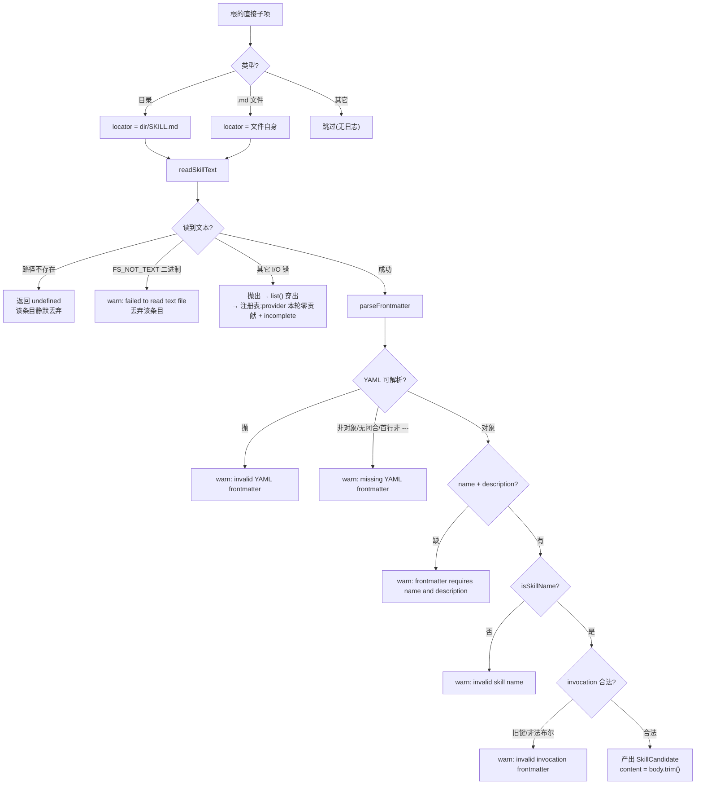

# 01 · SKILL.md 契约与发现

> 上游:[第四章 · 第一节](../04-skills.md#第一节-skillmd-格式与目录约定)(格式与根表总览)
> 主源码:`packages/skill/skill-filesystem/src/index.ts`(1049 行)
> 本篇回答:一份文件要满足什么条件才算一个 skill、六个根按什么顺序扫、扫描代码逐行走、以及每一种坏输入各自降级成什么。

---

## 1. 两种物理形态(唯一的两种)

`discoverRoot()` 的入口判定是整条发现链上唯一的形态决策:

```typescript
// packages/skill/skill-filesystem/src/index.ts:723-733
async function discoverRoot(root: SkillRoot, ctx: Context, provider: string): Promise<SkillCandidate[]> {
  const skills: SkillCandidate[] = []
  const entries = await listSkillRootEntries(root, ctx)
  for (const entry of entries.sort((a, b) => a.name.localeCompare(b.name))) {
    if (root.skipSystem && entry.name === '.system') continue
    const locator = entry.type === 'directory'
      ? { path: join(entry.path, 'SKILL.md'), directory: entry.path }   // 形态 A:目录 bundle
      : entry.type === 'file' && entry.name.endsWith('.md')
        ? { path: entry.path, directory: root.path }                     // 形态 B:扁平文件
        : undefined
    if (locator === undefined) continue
```

| 形态 | 命中条件 | 指令文件 | `resourceBase` |
|---|---|---|---|
| 目录 bundle | 根的直接子项是**目录** | `<root>/<dir>/SKILL.md` | `{ kind: 'directory', path: <root>/<dir> }`(`:745`) |
| 扁平 Markdown | 根的直接子项是**文件**且名字以 `.md` 结尾 | `<root>/<name>.md` | `{ kind: 'directory', path: <root> }`(`:731` 传入 `locator.directory`) |
| 其余 | 其它文件(如 `.gitignore`)、其它类型 | — | `continue`,`:733` 直接跳过 |

三条硬边界,均可从代码直接读出:

1. **只扫一层**。`discoverRoot` 只遍历根的直接子项,没有递归。`references/a/SKILL.md`、`<root>/pkg/<name>/SKILL.md` 都不会被发现(`docs/subsystems/skills.md:85` 明确记录 "Nested recursive `**/SKILL.md` discovery is not supported")。
2. **名称不来自文件名**。`name` 只从 frontmatter 读取(`:814`),`entry.name` 仅用于排序与 `.md` 后缀判定。因此 `<root>/whatever.md` 里写 `name: my-skill` 得到的是 `my-skill`,而 `<root>/my-skill/` 里 frontmatter 写 `name: other` 得到的是 `other`。
3. **目录 bundle 必须恰好叫 `SKILL.md`**(大写,`:729`),不匹配大小写变体。

### 目录项类型判定:符号链接要跟一层

`ctx.fs` 可用时,`FsDirEntry.type` 直接给出 `'directory' | 'file' | 'other'`(`entryFromFs`,`:773-775`)。走 Node 时类型需要自己判:

```typescript
// packages/skill/skill-filesystem/src/index.ts:899-915
async function nodeEntryKind(fullPath, entry, ctx) {
  if (entry.isDirectory()) return 'directory'
  if (entry.isFile()) return 'file'
  if (!entry.isSymbolicLink()) return undefined          // FIFO 等特殊文件:静默丢弃
  try {
    const info = await stat(fullPath)                    // stat 而非 lstat:跟随一层链接
    if (info.isDirectory()) return 'directory'
    if (info.isFile()) return 'file'
    return undefined
  } catch (error) {
    ctx.logger.warn(`skill entry ${fullPath} ignored: failed to follow symbolic link: ...`)
    return undefined
  }
}
```

符号链接跟随**静默成功**(`stat` 解析目标),只有链接断掉才 warn。注意 `FsDirEntry.path` 用的是 `entry.target.displayPath`——链接根在沙箱/远程工作区里保持为展示路径,与 `readSkillText` 的双轨读取保持一致。

---

## 2. frontmatter 契约:逐字段

解析入口 `parseSkillFile()`(`:797-840`)。它不是通用的 Markdown frontmatter 库,而是一个**窄到只认首行 `---`** 的实现:

```typescript
// packages/skill/skill-filesystem/src/index.ts:917-929
function parseFrontmatter(raw: string): { data: Record<string, unknown>; body: string } | undefined {
  const firstLineEnd = raw.indexOf('\n')
  if (firstLineEnd < 0) return undefined                    // 单行文件:无 frontmatter
  const firstLine = raw.slice(0, firstLineEnd).replace(/\r$/, '')   // CRLF 容忍
  if (firstLine !== '---') return undefined                 // 首行必须恰为 ---,BOM/空行都不行
  const start = firstLineEnd + 1
  const closing = findClosingFrontmatter(raw, start)
  if (closing === undefined) return undefined               // 未闭合 → 无 frontmatter
  const yaml = raw.slice(start, closing.start)
  const parsed = parseYaml(yaml) as unknown
  if (typeof parsed !== 'object' || parsed === null || Array.isArray(parsed)) return undefined
  return { data: parsed as Record<string, unknown>, body: raw.slice(closing.bodyStart) }
}
```

`findClosingFrontmatter`(`:931-943`)逐行找**整行恰为 `---`** 的位置,所以 YAML 值里出现 `---`(如 `description: "a --- b"`)不会误闭合(测试 `skill-filesystem.spec.ts:378` 固定了这一点)。CRLF 在两处都做了 `replace(/\r$/, '')`。

非对象 YAML(数组、标量)**不报"类型错"**,而是直接被 `parseFrontmatter` 判成"没有 frontmatter";空 frontmatter 块(`---\n---`)经 `parseYaml('')` 得到 `null`,同样落进这一支。两者的告警文案都是 `missing YAML frontmatter`——这是一个刻意的合并:**"没有"和"不是对象"对调用方是同一件事**。

### 字段表

| 字段 | 必填 | 读取函数 | 非法后果 |
|---|---|---|---|
| `name` | **是** | `stringField(data, 'name')`(`:814`,`:990`) | 缺失/空串/非字符串 → warn `frontmatter requires name and description`,`:816-819` |
| `description` | **是** | 同上(`:815`) | 同上 |
| — `name` 语法 | — | `isSkillName(name)`(`skill/src/index.ts:35`) | 不合 kebab-case → warn `invalid skill name "..."`,`:820-823` |
| `whenToUse` | 否 | `optionalString(data, 'whenToUse')`(`:834`) | 非字符串或空串 → 该字段**静默丢弃**,skill 保留 |
| `disable-model-invocation` | 否 | `frontmatterBoolean`(`:1004`) | 见下方文法;**非法值让整个 skill 消失** |
| `user-invocable` | 否 | `frontmatterBoolean`(`:1005`) | 同上 |
| `metadata` | 否 | `optionalMetadata(data)`(`:1039-1045`) | 非对象/数组/`null` → 静默丢弃 |
| `disableModelInvocation` / `modelInvocable` / `userInvocable` | — | `rejectLegacyInvocationKey`(`:1012-1016`) | **抛错**,整个 skill 消失 |
| 其它键 | — | — | 完全忽略,不透传(只有 `metadata` 内的键进 `SkillCandidate.metadata`) |

`whenToUse` 与 `metadata` 是**provider 元数据**:进 `SkillCandidate`/`SkillDefinition`,但既不出现在模型目录,也不出现在 `<skill_content>` 包装里(第四章 1.2 已记录)。实测:本仓库 `.agents/skills/` 下 12 个真实 skill 中**没有一个**使用 `whenToUse` 或 `metadata`;唯一使用 invocation 键的是 `.agents/skills/dsh-translate-docs/SKILL.md:4-5`(`disable-model-invocation: true` + `user-invocable: true`,即"只许人类显式调用")。

### invocation 双布尔的完整文法

```typescript
// packages/skill/skill-filesystem/src/index.ts:1000-1010
function parseInvocationPolicy(data: Record<string, unknown>): SkillInvocationPolicy {
  rejectLegacyInvocationKey(data, 'disableModelInvocation', 'disable-model-invocation')
  rejectLegacyInvocationKey(data, 'modelInvocable', 'disable-model-invocation')
  rejectLegacyInvocationKey(data, 'userInvocable', 'user-invocable')
  const disableModelInvocation = frontmatterBoolean(data, 'disable-model-invocation')
  const userInvocable = frontmatterBoolean(data, 'user-invocable')
  return {
    modelInvocable: disableModelInvocation !== true,   // 反向键:缺省 = 允许
    userInvocable: userInvocable !== false,            // 正向键:缺省 = 允许
  }
}
```

注意两个字段的**极性相反**:一个叫 `disable-*`,一个叫 `user-*`。代码把它们归一成两个正向布尔(`SkillInvocationPolicy`,`skill/src/index.ts:49-54`),此后整条链路只读正向值——极性转换只发生在这 6 行里。

`frontmatterBoolean`(`:1018-1037`)接受的输入:

| 输入 | 结果 |
|---|---|
| YAML 布尔 `true` / `false` | 直接返回 |
| 数字 `1` / `0`,字符串 `'1'` / `'0'` | `true` / `false` |
| 字符串 `true/false`、`yes/no`、`on/off`(大小写不敏感) | 对应布尔 |
| 其它任何值(含 `2`、`'maybe'`、`null`、数组、对象) | **`throw new TypeError`**,`:1036` |

由于 `yes|no|on|off` 在 YAML 1.2(`yaml` 包默认)里不是布尔字面量,它们以字符串形态进入 `switch` 分支——这一支是为对齐 Claude skills 的既有实践而保留的兼容面(Agent Note `2026-07-28-skill-invocation-policy.md:19`)。

**失败关闭**:非法布尔值不会退回默认值,而是让整个文件从发现中消失(`:825-830` 的 `catch`)。理由在 Agent Note 里写明——invocation 策略解析失败时若默认放行,会把本应被禁用的入口暴露给模型。

---

## 3. 六档发现根:真实路径与优先级

```typescript
// packages/skill/skill-filesystem/src/index.ts:245-265
private async roots(cwd: string | undefined): Promise<SkillRoot[]> {
  const roots: SkillRoot[] = []
  if (this.includeDefaultRoots && cwd !== undefined) {
    const projectRoot = await findProjectRoot(resolve(cwd), optionalFileSystem(this.ctx))
    roots.push(
      { path: join(projectRoot, '.dsh/skills'),    source: 'project-dsh',    rank: PROJECT_DSH_RANK,    projectRoot },
      { path: join(projectRoot, '.agents/skills'), source: 'project-agents', rank: PROJECT_AGENTS_RANK, projectRoot },
    )
  }
  roots.push(...this.customSkillDirs.map(path => ({ path, source: 'custom' as const, rank: CUSTOM_RANK })))
  if (this.includeDefaultRoots) {
    roots.push(
      { path: join(this.dshHome, 'skills'),    source: 'user-dsh',    rank: USER_DSH_RANK,    skipSystem: true },
      { path: join(this.agentsHome, 'skills'), source: 'user-agents', rank: USER_AGENTS_RANK },
    )
  }
  if (this.bundledSkillDir !== undefined) {
    roots.push({ path: this.bundledSkillDir, source: 'bundled', rank: BUNDLED_SKILL_RANK, trustedHost: true })
  }
  return roots
}
```

常量定义在 `:36-40` 与 `skill/src/index.ts:28`:

| Rank | `source` | 真实路径 | 出现条件 | 特殊标记 |
|---|---|---|---|---|
| 100 | `project-dsh` | `<projectRoot>/.dsh/skills` | `includeDefaultRoots` 且调用方给了 `cwd` | `projectRoot` 参与 watcher 分组 |
| 200 | `project-agents` | `<projectRoot>/.agents/skills` | 同上 | 同上;本仓库 `.agents/skills/` 正是此根 |
| 250 | `runtime` | (内存,无路径) | 有 `ctx.skills.register()` 调用 | 由注册表合成,见 [02](./02-provider-registry.md#5-运行时注册register-与-rank-250) |
| 300 | `custom` | `Config.customSkillDirs` 每一项(resolve 过) | 配置非空;**不**受 `includeDefaultRoots` 影响 | 顺序即数组顺序 |
| 400 | `user-dsh` | `<dshHome>/skills`,即 `$DSH_HOME` 或 `~/.dsh` | `includeDefaultRoots` | `skipSystem: true` |
| 500 | `user-agents` | `<agentsHome>/skills`,即 `$DSH_AGENTS_HOME` 或 `~/.agents` | `includeDefaultRoots` | — |
| 600 | `bundled` | `Config.bundledSkillDir` ?? `$DSH_BUNDLED_SKILL_DIR` | 两者之一给出,且 `includeDefaultRoots` 时才读环境变量(`:175-177`) | `trustedHost: true` |

四个容易读错的点:

1. **`includeDefaultRoots: false` 不影响 `custom`**。定制根永远在列表里(`:254` 在 `if` 之外)。这是给"隔离 provider"用的:隔离实例只看到自己显式配置的根,不会重复发现应用的 bundled skills(`:172-174` 注释)。
2. **`bundledSkillDir` 的环境变量默认值依赖 `includeDefaultRoots`**。显式 `config.bundledSkillDir` 恒生效;`$DSH_BUNDLED_SKILL_DIR` 只在 `includeDefaultRoots` 为真时才被读。实测:该环境变量在整个仓库里**只有测试设置**(`apps/web/tests/scaffold.ts:474`),出货 profile 不设——所以 rank 600 档在默认部署下是空的。
3. **`skipSystem` 只跳过 `.system` 这一层子目录**(`:727`,以及 watcher 谓词 `:670`、`:684`)。它不是为了隐藏文件,而是为将来"系统内置 skill"预留的命名空间,当前没有任何部署往里放东西。
4. **`projectRoot` 探测走 `ctx.fs`**(`findProjectRoot(cwd, optionalFileSystem(ctx))`,`:945-955`):

```typescript
// packages/skill/skill-filesystem/src/index.ts:945-955
async function findProjectRoot(cwd: string, fs: FileSystem | undefined): Promise<string> {
  let current = cwd
  while (true) {
    if (await pathExists(join(current, '.git'), fs)) return current
    const parent = dirname(current)
    if (parent === current) return cwd          // 走到盘根都没有 → 退回 cwd 本身
    current = parent
  }
}
```

有 `ctx.fs` 时 `.git` 探测经 `fs.resolve` + `fs.stat`(`:964-978`),宿主沙箱边界不会被绕过;探测失败一律当作"这个候选不可用",继续向上走,不会把探测错误升级成发现失败。

### 优先级到底怎么用

`rank` **只在同一层内**参与裁决,跨层是无条件遮蔽(详见 [02](./02-provider-registry.md#3-层内三级裁决) 与 [05](./05-scope-and-composition.md#3-层间遮蔽-vs-层内-rank))。本 provider 的六个根同属一个 provider、同一层,所以 rank 就是它们的相对优先级:**数字小的赢**。

`SkillSource` 本身**不参与**裁决(`skill/src/index.ts:39` 注释:"prompt-visible metadata, not precedence by itself")。它是给消费者看的人类可读标签。

---

## 4. 扫描实现走查:`list` 与读取的双轨

### 4.1 `FileSystemSkillProvider.list()`

```typescript
// packages/skill/skill-filesystem/src/index.ts:186-202
async list(options: SkillLookupOptions): Promise<SkillCandidate[] | SkillProviderObservation> {
  const roots = await this.roots(options.cwd)
  let complete = true
  try {
    await this.watchManager.observeRoots(roots)
  } catch (error) {
    if (this.disposal !== undefined) throw error       // 已经在拆了:让错误照常抛出
    complete = false                                   // 只是 watcher 起不来:降级为不完整观测
  }
  const candidates: SkillCandidate[] = []
  for (const root of roots) {
    for (const skill of await discoverRoot(root, this.ctx, this.name)) candidates.push(skill)
  }
  return complete ? candidates : { candidates, complete }
}
```

关键点:**这个 `try` 只包住 watcher 启动,不包住目录扫描**。`discoverRoot` 抛出的非"路径不存在"错误会穿出 `list()`,由注册表在 `listLayerCandidates`(`skill/src/index.ts:604-608`)兜住:记 warn `skill provider "..." skipped`、把本次观测标记为不可缓存、该 provider 本次贡献零候选。两条降级路径的后果不同,值得分清:

| 失败点 | 后果 |
|---|---|
| watcher 起不来(`observeRoots` 抛) | 候选**照常返回**,只是带 `{ candidates, complete: false }`;消费者保留 last-good 目录 |
| 目录列举/读取抛非缺席错 | 候选**全部丢失**,注册表标记 incomplete 并跳过该 provider 本轮贡献 |

### 4.2 列目录:两条读取轨

```typescript
// packages/skill/skill-filesystem/src/index.ts:753-757
async function listSkillRootEntries(root: SkillRoot, ctx: Context): Promise<SkillRootEntry[]> {
  const fs = optionalFileSystem(ctx)
  if (fs !== undefined && root.trustedHost !== true) return await listSkillRootEntriesFromFileSystem(root, fs)
  return await listSkillRootEntriesFromNode(root, ctx)
}
```

| 轨 | 条件 | 实现 | 失败语义 |
|---|---|---|---|
| 文件系统服务 | 有 `ctx.fs` 且**非** `trustedHost` | `fs.resolve` → `fs.listDir`(`:759-771`) | `FS_NOT_FOUND`/`FS_NOT_DIRECTORY`/`ENOENT`/`ENOTDIR` → 返回 `[]`;其余抛出 |
| Node 直读 | 无 `ctx.fs`,或根是 `trustedHost` | `readdir(root.path, { withFileTypes: true })`(`:777-795`) | 同上,但只有 `ENOENT`/`ENOTDIR` 算缺席 |

`trustedHost` 目前只有 `bundled` 根带(`:262`),含义是"这是随包出货的受信目录,绕过 `ctx.fs` 策略直读宿主机"。**所以沙箱里唯一的直读口是 bundled 根**——一个部署如果想在沙箱工作区里读 skill,必须让 `ctx.fs` 覆盖该路径。

### 4.3 读文本:同一个 `trustedHost` 开关

`readSkillText()`(`:846-860`)复用同一条件:

```typescript
// packages/skill/skill-filesystem/src/index.ts:846-860
async function readSkillText(ctx, path, signal?, trustedHost = false): Promise<SkillText | undefined> {
  signal?.throwIfAborted()
  const fs = optionalFileSystem(ctx)
  if (fs !== undefined && !trustedHost) return await readSkillTextFromFileSystem(ctx, fs, path, signal)
  try {
    const resolvedPath = await realpath(path)                       // Node 轨:realpath 解链接
    return { path: resolvedPath, content: await readFile(resolvedPath, { encoding: 'utf8', signal }) }
  } catch (error) {
    signal?.throwIfAborted()
    if (isAbsentSkillPathError(error)) return undefined             // 不见了 = 空,不是错
    throw error
  }
}
```

`ctx.fs` 轨(`:862-893`)多两步:先 `fs.stat` 确认是 `file`(不是目录/链接目标不是文件就返回 `undefined`),再 `fs.readText`。`FS_NOT_TEXT`(二进制文件)被单独处理:

```typescript
// packages/skill/skill-filesystem/src/index.ts:884-892
  try {
    return { path: fs.processPath(target), content: await fs.readText(target, signal) }
  } catch (error) {
    signal?.throwIfAborted()
    if (isAbsentSkillPathError(error)) return undefined
    if (!hasErrorCode(error, 'FS_NOT_TEXT')) throw error
    ctx.logger.warn(`skill file ${path} ignored: ${fsReadErrorMessage(target, error)}`)
    return undefined                              // 二进制文件:只丢这一个,不炸整次发现
  }
```

`fs.processPath(target)` 给出的是**沙箱视角的路径**(而不是宿主绝对路径),与 `entryFromFs` 用 `displayPath` 是同一条原则:候选暴露给模型/UI 的路径统一走展示路径。

---

## 5. 错误与降级语义总表


<details><summary>Mermaid 源码</summary>



</details>

| 坏输入 | 日志 | 范围 | 相邻 skill |
|---|---|---|---|
| 首行不是 `---` / 无闭合 `---` / YAML 非对象 | `skill file <p> ignored: missing YAML frontmatter` | 单文件 | 不受影响 |
| YAML 语法错(`parseYaml` 抛) | `skill file <p> ignored: invalid YAML frontmatter: <e>` | 单文件 | 不受影响 |
| 缺 `name` 或 `description` | `skill file <p> ignored: frontmatter requires name and description` | 单文件 | 不受影响 |
| `name` 非 kebab-case | `skill file <p> ignored: invalid skill name "<n>"` | 单文件 | 不受影响 |
| 旧 camelCase invocation 键 / 非法布尔值 | `skill file <p> ignored: invalid invocation frontmatter: <e>` | 单文件 | 不受影响 |
| 断链符号链接 | `skill entry <p> ignored: failed to follow symbolic link: <e>` | 单条目 | 不受影响 |
| 二进制 `.md`(经 `ctx.fs`) | `skill file <p> ignored: failed to read text file at <d>: <e>` | 单文件 | 不受影响 |
| 路径不存在 | (无日志) | 单条目/整根 | 不受影响;根全缺 = 合法空状态 |
| 其它 I/O 错 | 注册表侧 warn `skill provider "filesystem" skipped: <e>` | **整个 provider 本轮** | 全部候选丢失,观测 incomplete |

**模型侧完全看不到这些告警**。`tool-skill` 只收到 `SkillCatalogSnapshot`,`complete: false` 时它保持 last-good 目录([03](./03-catalog-and-loading.md#4-digest-与四个返回分支))。这带来一个已记录的运维代价:`skill-filesystem/README.md:150` ——"模型目录不携带逐 skill 诊断,无法区分'没有这个 skill'和'这个 skill 写坏了'"。

### 重名:三层各自的裁决者

| 重名场景 | 裁决者 | 谁赢 |
|---|---|---|
| 同一根内两个文件声明同一 `name` | `collectLayer` 排序后 first-wins(`skill/src/index.ts:569-580`) | 排序键相同(同 rank 同 provider)后看 `localOrder`,即 `entry.name.localeCompare` **升序在前**的那个 |
| 不同根(同层同 provider) | `compareIndexedCandidates` 第一键(`skill/src/index.ts:808`) | **rank 小者**:100 > 200 > 300 > 400 > 500 > 600 |
| 不同层(preset 层 vs 全局层) | `collectFresh` 的 `merged.set` 覆写序(`skill/src/index.ts:556-562`) | **近层无条件赢**,与 rank 无关 |

落败者一律记 warn `skill "<n>" from <source> ignored because a higher-priority skill already exists`(`skill/src/index.ts:575`),且**没有 API 能看到被遮蔽的定义**(`skill/README.md:141` 已知限制)。

---

## 6. 与 provider 契约的边界

文件系统 provider 对 `discoverRoot` 产出 `SkillCandidate` 时,以下字段由**它**填:

```typescript
// packages/skill/skill-filesystem/src/index.ts:736-748(节选)
skills.push({
  name: parsed.name,
  description: parsed.description,
  ...parsed.whenToUse !== undefined ? { whenToUse: parsed.whenToUse } : {},
  invocation: parsed.invocation,
  provider,                                    // = this.name,默认 'filesystem'
  source: root.source,                         // 六档之一
  rank: root.rank,                             // 六档之一
  locator,                                     // { path, directory } 不透明句柄
  resourceBase: { kind: 'directory', path: locator.directory },
  path: parsed.path,                           // realpath / processPath 后的绝对路径
  ...parsed.metadata !== undefined ? { metadata: parsed.metadata } : {},
})
```

`provider` 字段必须等于注册时的 provider 名,否则注册表在 `validateCandidate` 抛错(`skill/src/index.ts:733-735`)。`locator` 对注册表不透明,只在 `get(candidate)` 时原样还回来——`FileSystemSkillProvider.get()` 用 `locator.path` 重读文件(`:210-226`),因此**正文永远是最新的**,与目录候选无关。

**发现与加载的一致性由注册表兜底**:若两次读取之间 frontmatter 里的 `name` 变了,`get()` 返回的定义名与候选名不符,注册表丢弃该结果并失效缓存(`skill/src/index.ts:512-515`)。这意味着"改名字"这件事不需要 provider 侧的任何版本号。

---

## 7. 关键文件 / 符号索引表

| 位置 | 符号 | 作用 |
|---|---|---|
| `skill-filesystem/src/index.ts:36-40` | `PROJECT_DSH_RANK` … `USER_AGENTS_RANK` | 五档常量(600 在 `skill/src/index.ts:28`) |
| `skill-filesystem/src/index.ts:41-43` | `DEFAULT_WATCH_STABILITY_THRESHOLD_MS` / `_POLL_INTERVAL_MS` / `_MAX_PROJECTS` | watcher 默认值(200ms / 100ms / 128) |
| `skill-filesystem/src/index.ts:49-89` | `Config` + schemastery schema | 12 个配置字段及默认值 |
| `skill-filesystem/src/index.ts:91-122` | `SkillRoot` / `SkillRootEntry` / `ParsedSkill` / `LocalLocator` | provider 内部结构 |
| `skill-filesystem/src/index.ts:134-147` | `apply()` | 注册 provider + disposal effect + `fs/observed` 监听 |
| `skill-filesystem/src/index.ts:150-178` | `FileSystemSkillProvider` 构造 | home 解析、bundled 根决策、signal→dispose |
| `skill-filesystem/src/index.ts:186-202` | `list()` | watcher 降级 + 六根串行扫描 |
| `skill-filesystem/src/index.ts:210-226` | `get()` | 用 locator 重读正文,组装 `SkillDefinition` |
| `skill-filesystem/src/index.ts:245-265` | `roots()` | 六档根的构造顺序与条件 |
| `skill-filesystem/src/index.ts:723-751` | `discoverRoot()` | 形态判定 + 排序 + 逐条解析 |
| `skill-filesystem/src/index.ts:753-795` | `listSkillRootEntries*` / `entryFromFs` | 双轨列目录 |
| `skill-filesystem/src/index.ts:797-840` | `parseSkillFile()` | frontmatter 全字段校验与降级 |
| `skill-filesystem/src/index.ts:846-893` | `readSkillText` / `readSkillTextFromFileSystem` | 双轨读文本与错误分类 |
| `skill-filesystem/src/index.ts:899-915` | `nodeEntryKind()` | 符号链接跟随 |
| `skill-filesystem/src/index.ts:917-943` | `parseFrontmatter` / `findClosingFrontmatter` | 窄 frontmatter 实现 |
| `skill-filesystem/src/index.ts:945-988` | `findProjectRoot` / `pathExists*` | `.git` 祖先探测(经 `ctx.fs`) |
| `skill-filesystem/src/index.ts:990-1045` | `stringField` / `optionalString` / `parseInvocationPolicy` / `rejectLegacyInvocationKey` / `frontmatterBoolean` / `optionalMetadata` | 字段级读取器 |
| `skill/src/index.ts:28,35-37` | `BUNDLED_SKILL_RANK` / `isSkillName` | rank 600 与名称文法(唯一真源) |
| `skill/src/index.ts:604-608` | `listLayerCandidates` 的 catch | 扫描错误的注册表侧兜底 |
| `.agents/skills/dsh-translate-docs/SKILL.md:1-5` | — | 唯一使用 invocation 键的真实样本 |
| `packages/preset/agent-presets/presets/cordis/skills/` | `cordis-plugin-development` / `editing-cordis-compositions` | preset 自带目录-bundle 样本 |
