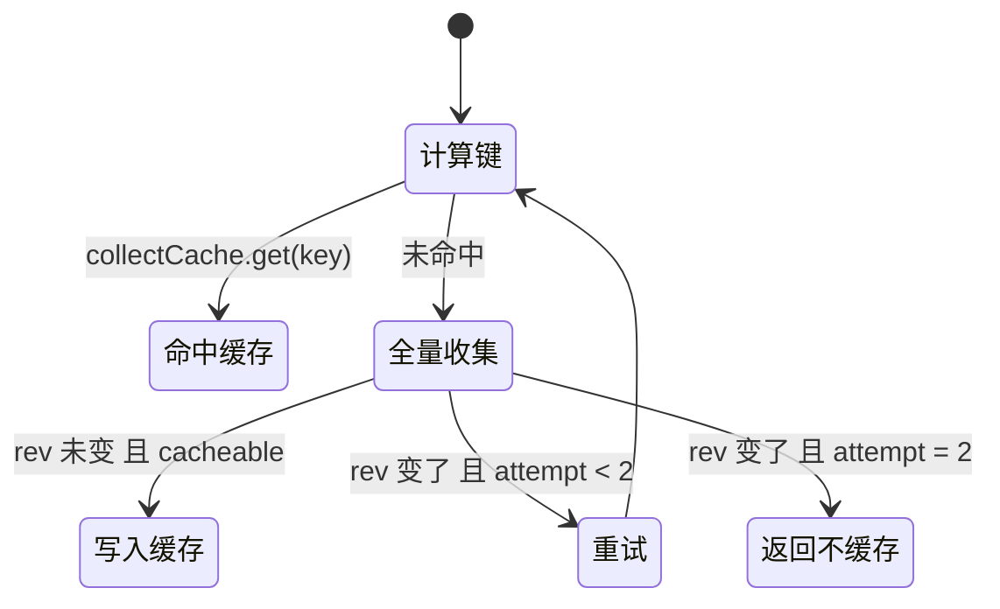

# 02 · Provider Registry:注册、裁决、缓存与加载

> 上游:[第四章 · 第二节](../04-skills.md#第二节-provider-registry注册合并与裁决)
> 主源码:[`packages/skill/skill/src/index.ts`](https://github.com/deepseek-ai/deepseek-harness/blob/dbbaa4a37fb9098aba814c97d2956f7b2f105f46/packages/skill/skill/src/index.ts)(868 行)

---

## 1. 服务定位与对外面

`SkillRegistry` 是 Cordis `Service`,通过声明合并挂到 `ctx.skills`:

```typescript
// packages/skill/skill/src/index.ts:283-298(节选)
declare module '@deepseek-ai/cordis' {
  interface Context { skills: SkillRegistry }
  interface Events {
    /** A skill provider, runtime contribution, or provider-backed catalog may
     * have changed. ... consumers refetch the catalog for their own lookup
     * options. Listener failures are contained and cannot veto the mutation.
     * @mode emit */
    'skills/change'(): void
  }
}
```

```typescript
// packages/skill/skill/src/index.ts:361-377(节选)
  private readonly collectCacheMaxEntries: number
  private readonly layers = new ScopedLayers<SkillLayer>(
    scope => new SkillLayer(scope),
    () => { this.invalidateCache() },        // 层的生灭也走统一失效
  )
  private readonly collectCache = new Map<string, Map<string, IndexedCandidate>>()
  private revision = 0
  private nextProviderOrder = 0
  /** Stable identities for cache keys; scope keys are opaque identity-compared objects. */
  private readonly scopeIds = new WeakMap<ScopeKey, number>()
```

公开面只有五个成员:`registerProvider(create)`(`:390`)、`register(skill)`(`:439`)、`list(options)`(`:470`)、`snapshot(options)`(`:481`)、`get(name, options)`(`:500`),外加 `skills/change` 事件(`:296`)。配置只有 `collectCacheMaxEntries`,默认 128(`:22`、`:357-359`)。注册表**不含任何 skill 内容**(`skill/README.md:12`),也不做 invocation 过滤——`list()` 保留全部四种策略组合([`docs/subsystems/skills.md:128`](https://github.com/deepseek-ai/deepseek-harness/blob/dbbaa4a37fb9098aba814c97d2956f7b2f105f46/docs/subsystems/skills.md#L128)),策略由消费者在自己边界执行。

---

## 2. Provider 注册:控制对象与层归属

```typescript
// packages/skill/skill/src/index.ts:390-428
registerProvider(create: (control: SkillProviderControl) => SkillProvider): () => void {
  const lifecycle = new AbortController()
  let registration: { layer: SkillLayer; name: string } | undefined
  let provider: SkillProvider
  const control: SkillProviderControl = {
    signal: lifecycle.signal,
    invalidate: () => {
      const active = registration
      if (active !== undefined && active.layer.providers.get(active.name)?.provider === provider) {
        this.invalidateCache()
      }
    },
  }
  try {
    provider = create(control)
    const name = provider.name
    if (name === RUNTIME_PROVIDER) {
      throw new Error(`"${RUNTIME_PROVIDER}" is reserved for runtime skill registrations`)
    }
    const order = this.nextProviderOrder
    this.nextProviderOrder += 1
    return this.layers.effect(
      this.ctx,
      (layer) => {
        const undo = layer.providers.insert(name, { provider, order })
        registration = { layer, name }
        return () => {
          registration = undefined
          undo()
          lifecycle.abort(new Error(`skill provider "${name}" disposed`))
        }
      },
      { label: 'skills.registerProvider()' },
    )
  } catch (error) {
    lifecycle.abort(error)
    throw error
  }
}
```

1. **工厂同步、发现异步**。`create(control)` 在注册栈内同步调用(`:404`);远程初始化、鉴权、扫描全部推到被 await 的 `list()`。`create` 抛错时 `catch`(`:424-427`)先 `lifecycle.abort(error)` 让 `control.signal` 立刻携带原因,再把错误原样抛出——`apply()` 阶段即失败,不留半注册状态。
2. **`invalidate()` 的身份守卫比较对象 identity,不是名字**:`active.layer.providers.get(active.name)?.provider === provider`(`:398`)。同名 provider 被替换后,旧 provider 的迟到回调打不动新注册;dispose 时 `registration = undefined`(`:417`)让守卫直接短路。
3. **`layers.effect(this.ctx, ...)`(`:411`)同时决定"落哪层"与"谁负责拆"**。`ScopedLayers.effect` 内部读 `scopeOf(ctx)`([`packages/core/scope/src/store.ts:231`](https://github.com/deepseek-ai/deepseek-harness/blob/dbbaa4a37fb9098aba814c97d2956f7b2f105f46/packages/core/scope/src/store.ts#L231)):无 scope → 全局层,有 scope → 该 scope 的层被惰性创建。preset 卸载 / HMR 热替换 dispose 对应 fiber 时,provider 自动注销并失效缓存。`this.ctx` 之所以等于**调用方** ctx,靠 Cordis 的 traceable 代理把 `tracker.property = 'ctx'` 解析成调用点(见 [05 §1](./05-scope-and-composition.md#thisctx-为什么等于调用方的-ctx))。
4. **`nextProviderOrder` 是服务级单调计数器**(`:368`、`:409`),只在**同层内**充当次级排序键。

```typescript
// packages/skill/skill/src/index.ts:327-343(节选)
readonly providers: NamedEntries<RegisteredProvider>
readonly runtime = new Map<string, SkillDefinition>()

this.providers = new NamedEntries(name => new Error(scope === undefined
  ? `a skill provider named "${name}" is already registered`
  : `a skill provider named "${name}" is already registered in this scope`))
...
isEmpty(): boolean {
  return this.providers.isEmpty() && this.runtime.size === 0
}
```

`NamedEntries.insert`([`store.ts:43-54`](https://github.com/deepseek-ai/deepseek-harness/blob/dbbaa4a37fb9098aba814c97d2956f7b2f105f46/packages/core/scope/src/store.ts#L43-L54))同名即抛,**provider 名唯一性是"每层"而非进程级**:`filesystem` 这个默认名可以在全局层、`standard` 层、`cordis` 层各注册一次(`presets/*/agent.cordis.yml` 证实)。`isEmpty()` 是层回收的唯一判据——`ScopedLayers.effect` 的 disposer 里 `layer.isEmpty()` 才删除该 scope 的层([`store.ts:259`](https://github.com/deepseek-ai/deepseek-harness/blob/dbbaa4a37fb9098aba814c97d2956f7b2f105f46/packages/core/scope/src/store.ts#L259))。

---

## 3. 层内三级裁决

```typescript
// packages/skill/skill/src/index.ts:807-811
function compareIndexedCandidates(left: IndexedCandidate, right: IndexedCandidate): number {
  return left.candidate.rank - right.candidate.rank
    || left.providerOrder - right.providerOrder
    || left.localOrder - right.localOrder
}
```

| 键 | 谁填 | 含义 |
|---|---|---|
| `candidate.rank` | **provider** | 优先级权重,小者赢。文件系统 provider 填根 rank(100…600),badge 填 600,运行时条目填 250 |
| `providerOrder` | 注册表 | `nextProviderOrder` 单调序;**运行时条目恒为 `-1`**(`:593`),故同 rank 时运行时条目排在 provider 条目之前 |
| `localOrder` | 注册表 | provider 返回数组下标(`:614-615`);运行时条目按名称码点升序编号(`:589`) |

`localOrder` 对文件系统 provider 等价于"文件名 `localeCompare` 升序"([01](./01-skill-format-and-discovery.md#重名三层各自的裁决者)),对 badge provider 恒为 0。

```typescript
// packages/skill/skill/src/index.ts:567-582(结构)
collected.entries.sort(compareIndexedCandidates)
for (const entry of collected.entries) {
  if (seen.has(skill.name)) {
    this.ctx.logger.warn(`skill "${skill.name}" from ${skill.source} ignored because a higher-priority skill already exists`)
    continue
  }
  seen.add(skill.name); result.push(entry)
}
```

排序后**首个胜出**是全部去重语义的重心;排序键全等时依赖 `Array.prototype.sort` 的稳定性(ES2019 规范保证),等价于"候选数组中出现更早者"。

```typescript
// packages/skill/skill/src/index.ts:584-619(节选)
private async listLayerCandidates(layer: SkillLayer, options: SkillLookupOptions): Promise<LayerCollectResult> {
  throwIfAborted(options.signal)
  const candidates: IndexedCandidate[] = []
  let cacheable = true
  let runtimeOrder = 0
  for (const skill of [...layer.runtime.values()].sort((a, b) => compareCodePoints(a.name, b.name))) {
    candidates.push({ candidate: runtimeCandidate(skill), provider: RUNTIME_SKILL_PROVIDER,
      providerOrder: -1, localOrder: runtimeOrder, layer })
    runtimeOrder += 1
  }
  for (const { provider, order } of [...layer.providers.values()]) {
    let localOrder = 0
    let output: unknown
    try {
      output = await waitWithAbort(provider.list(options), options.signal)
    } catch (error) {
      if (options.signal?.aborted === true) throw toError(options.signal.reason)
      cacheable = false
      this.ctx.logger.warn(`skill provider "${provider.name}" skipped: ${errorMessage(error)}`)
    }
    if (output === undefined) continue
    const observation = normalizeProviderObservation(output, provider.name)
    if (!observation.complete) cacheable = false
    for (const candidate of observation.candidates) {
      validateCandidate(candidate, provider.name)                       // ← try 之外
      candidates.push({ candidate, provider, providerOrder: order, localOrder, layer })
      localOrder += 1
    }
  }
  return { entries: candidates, cacheable }
}
```

这里藏着**两条截然不同的失败路径**,是本文件最容易读错的地方:

| 失败点 | 位置 | 相对 `try` | 后果 |
|---|---|---|---|
| `provider.list()` reject | `:603` | **在** try 内 | 记 warn、`cacheable = false`、跳过该 provider,其余继续 |
| 观测畸形 | `:610` `normalizeProviderObservation` | **在** try 外 | 抛 `TypeError` → 整个 `collect()` 失败 |
| 候选字段非法 | `:613` `validateCandidate` | **在** try 外 | 同上,fail-fast |

即:**provider 自己崩了会被吞掉并降级;provider 返回坏数据则炸掉整次读**。前者是"源不可用",后者是"契约违约"([`skills.md:15`](https://github.com/deepseek-ai/deepseek-harness/blob/dbbaa4a37fb9098aba814c97d2956f7b2f105f46/docs/subsystems/skills.md#L15) 的 "malformed candidates fail fast")。取消信号在两处被优先解释成 abort 原因(`:585`、`:605`),不会被误记成 provider 失败。代价:**串行 await** 使一个慢 provider 拖住其后所有 provider(`skill/README.md:139`),取消只停调用方的等待,停不掉不配合的 provider。

---

## 4. 层间遮蔽

```typescript
// packages/skill/skill/src/index.ts:551-565(节选)
// Global first, then existing chain overlays farthest ancestor first and the
// exact scope last, so the nearest layer's same-name entry replaces the
// farther ones — the tools registry's shadowing rule. Rank decides
// duplicates only within one layer.
const layers = [this.layers.global, ...this.layers.chainLayers(options.scope)]
const merged = new Map<string, IndexedCandidate>()
let cacheable = true
for (const layer of layers) {
  const collected = await this.collectLayer(layer, options)
  if (!collected.cacheable) cacheable = false
  for (const entry of collected.entries) merged.set(entry.candidate.name, entry)   // 后写覆盖
}
return { entries: merged, cacheable }
```

`chainLayers`([`store.ts:192-199`](https://github.com/deepseek-ai/deepseek-harness/blob/dbbaa4a37fb9098aba814c97d2956f7b2f105f46/packages/core/scope/src/store.ts#L192-L199))返回最远祖先在前、精确 scope 最后;循环里后写覆盖,因此**近层无条件赢**——preset 层里 rank 999 的 skill 也会盖掉全局层 rank 100 的 skill。测试 [`skill.spec.ts:1142`](https://github.com/deepseek-ai/deepseek-harness/blob/dbbaa4a37fb9098aba814c97d2956f7b2f105f46/packages/skill/skill/tests/skill.spec.ts#L1142)("lets the nearest layer win a duplicate name regardless of rank")与 [`:1110`](https://github.com/deepseek-ai/deepseek-harness/blob/dbbaa4a37fb9098aba814c97d2956f7b2f105f46/packages/skill/skill/tests/skill.spec.ts#L1110)("scoped provider 只进该 scope 视图")钉住这两条。跨层遮蔽与同层遮蔽都是**静默**的,只有同层同名才 warn。

---

## 5. 修订号(rev)缓存与失效

```typescript
// packages/skill/skill/src/index.ts:519-549(节选)
throwIfAborted(options.signal)
let attempt = 1
while (true) {
  const revision = this.revision
  // The chain is part of the key rather than assumed stable: a blank-session
  // recompose re-parents an existing scope without touching this registry,
  // and only a chain-bearing key makes the next read see the new preset.
  const key = this.collectCacheKey(options.cwd, scopeChainOf(options.scope), revision)
  const cached = this.collectCache.get(key)
  if (cached !== undefined) return { entries: cached, cacheable: true }

  const result = await this.collectFresh(options)
  throwIfAborted(options.signal)
  if (revision !== this.revision) {
    if (attempt < MAX_COLLECT_ATTEMPTS) { attempt += 1; continue }   // MAX = 2,(:23)
    return { entries: result.entries, cacheable: false }             // 再变 → 可用但不缓存
  }
  if (result.cacheable) {
    this.collectCache.set(key, result.entries)
    if (this.collectCache.size > this.collectCacheMaxEntries) {
      const oldest = this.collectCache.keys().next() as IteratorYieldResult<string>
      this.collectCache.delete(oldest.value)                         // FIFO:Map 插入序
    }
  }
  return result
}
```


<details><summary>Mermaid 源码</summary>



</details>

1. **缓存键显式携带 scope 链**:`JSON.stringify({ cwd, scopes: chain.map(scopeId), revision })`(`:643-645`),scope key 是身份比较的不透明对象,`scopeId` 用 WeakMap 发稳定序号(`:633-641`)。注释(`:524-526`)说明原因:blank-session 重组合会给既有 scope **换父**(`rebind`),注册表看不到这次变化,只有把链写进键里下一次读才会看到新 preset。测试 [`skill.spec.ts:1173`](https://github.com/deepseek-ai/deepseek-harness/blob/dbbaa4a37fb9098aba814c97d2956f7b2f105f46/packages/skill/skill/tests/skill.spec.ts#L1173)。
2. **在途失效只重试一次**,第二次仍变则返回 `cacheable: false`——结果可用但不许缓存。测试 [`:793`](https://github.com/deepseek-ai/deepseek-harness/blob/dbbaa4a37fb9098aba814c97d2956f7b2f105f46/packages/skill/skill/tests/skill.spec.ts#L793)(重试成功)与 [`:826`](https://github.com/deepseek-ai/deepseek-harness/blob/dbbaa4a37fb9098aba814c97d2956f7b2f105f46/packages/skill/skill/tests/skill.spec.ts#L826)(反复失效后不缓存)。
3. **FIFO 淘汰**。因为每次失效都清空缓存,缓存内所有键共享同一 revision,插入序即新鲜度序,FIFO 等价于 LRU。

### 失效的三条路与唯一出口

```typescript
// packages/skill/skill/src/index.ts:621-631
private invalidateCache(): void {
  this.revision += 1
  this.collectCache.clear()
  this.notifyChange()
}

/** Invalidate after a stale definition load, only while the exact registration that produced the entry is still live. */
private invalidateEntry(entry: IndexedCandidate): void {
  /* v8 ignore else -- A definition load can outlive the exact provider registration it selected. */
  if (entry.layer.providers.get(entry.provider.name)?.provider === entry.provider) this.invalidateCache()
}
```

| 触发 | 入口 | 条件 |
|---|---|---|
| provider 自调 `invalidate()` | `control.invalidate`(`:396-401`) | 该注册仍持有该 provider 对象 |
| 运行时 skill 注册/注销、provider 注册/注销 | `layers.effect` 的 onChange(`:364`) | 任何层的 effect 建立或 dispose |
| `get()` 发现定义名变质 | `invalidateEntry`(`:628`) | 该 entry 所属层的同名 provider 仍是同一对象 |

**没有 TTL**(`skill/README.md:138`):远程源变了只能靠 provider 自己的观测机制。`IndexedCandidate.layer`(`:305-306`)存在的唯一理由就是让 `invalidateEntry` 做这个身份复核——它是"加载出去的 entry 晚于注册而返回"这一竞态的收敛点。

```typescript
// packages/skill/skill/src/index.ts:647-659(节选)
/** Notify catalog observers without making their refresh work load-bearing. */
private notifyChange(): void {
  for (const callback of this.ctx.events.dispatch('emit', ['skills/change'])) {
    try {
      const returned: unknown = callback()
      void Promise.resolve(returned).catch((error: unknown) => {
        this.ctx.logger.warn(`skills/change listener rejected: ${errorMessage(error)}`)
      })
    } catch (error: unknown) {
      this.ctx.logger.warn(`skills/change listener threw: ${errorMessage(error)}`)
    }
  }
}
```

事件**不带 diff**,监听者自己带 lookup options 重新 `snapshot()`;同步抛与异步 reject 都被逐条 containment,监听器无法否决注册表变更(测试 [`skill.spec.ts:768`](https://github.com/deepseek-ai/deepseek-harness/blob/dbbaa4a37fb9098aba814c97d2956f7b2f105f46/packages/skill/skill/tests/skill.spec.ts#L768))。值得记录的事实:全仓库**生产代码里没有监听者**——目录消费者 `tool-skill` 选择每个 pre-step 重新快照 + digest 比对([03](./03-catalog-and-loading.md)),事件只留给外部消费者。

---

## 6. `get()`:加载闸门逐行

```typescript
// packages/skill/skill/src/index.ts:500-517
async get(name: string, options: SkillViewOptions = {}): Promise<SkillDefinition | undefined> {
  if (!isSkillName(name)) return undefined                    // 闸门 1
  const collected = await this.collect(options)
  throwIfAborted(options.signal)                              // 闸门 2:缓存命中也要重查
  const match = collected.entries.get(name)
  if (match === undefined) return undefined                   // 闸门 3
  const definition = await waitWithAbort(match.provider.get(match.candidate, options), options.signal)  // 闸门 4
  if (definition === undefined) return undefined              // 闸门 5
  validateDefinition(definition)                              // 闸门 6
  if (definition.name !== match.candidate.name) {
    this.invalidateEntry(match)                               // 闸门 7:发现/加载之间换了名字
    return undefined
  }
  return definition
}
```

| 闸门 | 拦什么 | 失败表现 |
|---|---|---|
| 1 `isSkillName` | 非法名字 | **静默 `undefined`**,不抛(`skill/README.md:66`) |
| 2 `throwIfAborted` | 缓存的目录也要响应取消 | 抛 abort reason |
| 3 `entries.get` | 名字不在本视图内 | `undefined` |
| 4 `waitWithAbort`(`:819-842`) | provider 不配合取消 | 抛 abort reason;promise 继续在后台跑但结果被丢弃 |
| 5 `definition === undefined` | 文件被删 / 远端 404 | `undefined` |
| 6 `validateDefinition` | provider 返回违约数据 | 抛 `TypeError`/`Error` |
| 7 名字复核 | 发现与加载之间 frontmatter 的 `name` 变了 | 失效该 provider + `undefined` |

`waitWithAbort` 两侧都清理 abort 监听器(避免长命 signal 上累积);`toError`(`:850-857`)连 `instanceof` 都用 `try` 包住——恶意 Proxy 可以在 `instanceof` 里抛,注释明确写了这一点。测试 [`skill.spec.ts:338`](https://github.com/deepseek-ai/deepseek-harness/blob/dbbaa4a37fb9098aba814c97d2956f7b2f105f46/packages/skill/skill/tests/skill.spec.ts#L338) 覆盖"敌意 abort reason"。

**`get()` 是策略中立的受信加载器**:它不读 `invocation`,不做 `isModelInvocable` 过滤。Agent Note [`2026-07-28-skill-invocation-policy.md:40`](https://github.com/deepseek-ai/deepseek-harness/blob/dbbaa4a37fb9098aba814c97d2956f7b2f105f46/.agents/notes/implemented/feature/2026-07-28-skill-invocation-policy.md#L40) 记录了拒绝在 `get()` 里过滤的理由——`get()` 无法知道调用方是模型工具、人类命令还是受信编排。策略因此落在消费者边界([03 §2](./03-catalog-and-loading.md#22-execute-的四道闸门))。**定义永不缓存**(`skill/README.md:99`),每次 `get()` 都让胜出 provider 重读当前正文。
---

## 7. 运行时注册:`register()` 与 rank 250

```typescript
// packages/skill/skill/src/index.ts:439-460(节选)
validateRuntimeSkill(skill)
const scope = scopeOf(this.ctx)
const existingLayer = scope === undefined ? this.layers.global : this.layers.peek(scope)
if (existingLayer !== undefined && existingLayer.runtime.has(skill.name)) {
  this.ctx.logger.warn(`runtime skill "${skill.name}" ignored because it is already registered`)
  return () => {}                                    // 空 disposer:后到者删不掉胜者
}
const definition: SkillDefinition = {
  ...skill,
  invocation: skill.invocation ?? { modelInvocable: true, userInvocable: true },
  provider: skill.provider ?? RUNTIME_PROVIDER,      // 'runtime'
}
return this.layers.effect(this.ctx, (layer) => {
  layer.runtime.set(definition.name, definition)
  return () => { layer.runtime.delete(definition.name) }
}, { label: 'skills.register()' })
```

- **first-wins 用 `peek` 而非 `chainLayers`**(`:442`):同名检查只看**本层**的运行时表,父层同名不算冲突,跨层由 `collectFresh` 的覆盖规则处理。测试 [`skill.spec.ts:1213`](https://github.com/deepseek-ai/deepseek-harness/blob/dbbaa4a37fb9098aba814c97d2956f7b2f105f46/packages/skill/skill/tests/skill.spec.ts#L1213)。
- **空 disposer 是刻意的**([`:445`](https://github.com/deepseek-ai/deepseek-harness/blob/dbbaa4a37fb9098aba814c97d2956f7b2f105f46/packages/skill/skill/tests/skill.spec.ts#L445)):后注册者被 dispose 时不会误删先前胜者的条目。
- **默认值只解析一次**,此后整条链路只看到完整定义。
- **`runtimeCandidate()`([`:691-705`](https://github.com/deepseek-ai/deepseek-harness/blob/dbbaa4a37fb9098aba814c97d2956f7b2f105f46/packages/skill/skill/tests/skill.spec.ts#L691-L705))把定义本身当 locator**,`RUNTIME_SKILL_PROVIDER.get()`([`:686-688`](https://github.com/deepseek-ai/deepseek-harness/blob/dbbaa4a37fb9098aba814c97d2956f7b2f105f46/packages/skill/skill/tests/skill.spec.ts#L686-L688))直接 `Promise.resolve(candidate.locator as SkillDefinition)`——运行时条目加载零成本。
- **rank = `RUNTIME_RANK` = 250**([`:25`](https://github.com/deepseek-ai/deepseek-harness/blob/dbbaa4a37fb9098aba814c97d2956f7b2f105f46/packages/skill/skill/tests/skill.spec.ts#L25)、[`:700`](https://github.com/deepseek-ai/deepseek-harness/blob/dbbaa4a37fb9098aba814c97d2956f7b2f105f46/packages/skill/skill/tests/skill.spec.ts#L700)),排在 project(100/200)之后、custom(300)之前,即 [01](./01-skill-format-and-discovery.md#3-六档发现根真实路径与优先级) 那张表里唯一不在文件系统 provider 手里的"第七档"。

`validateRuntimeSkill`([`:741-745`](https://github.com/deepseek-ai/deepseek-harness/blob/dbbaa4a37fb9098aba814c97d2956f7b2f105f46/packages/skill/skill/tests/skill.spec.ts#L741-L745))只查名称文法、`description` 非空、`invocation` 布尔合法三项——比 provider 候选校验松,因为其余字段由注册表自己填。

---

## 8. 校验器与摘要投影

| 函数 | 行 | 校验对象 | 失败 |
|---|---|---|---|
| `normalizeProviderObservation` | [`:662-674`](https://github.com/deepseek-ai/deepseek-harness/blob/dbbaa4a37fb9098aba814c97d2956f7b2f105f46/packages/skill/skill/tests/skill.spec.ts#L662-L674) | `list()` 返回值:数组 = 完整观测;否则须 `{ candidates: 数组, complete: boolean }` | 抛(整次读失败) |
| `validateCandidate` | `:707-739` | 名称(字符串 + kebab)、`description`(非空字符串)、`invocation` 两布尔、`whenToUse` 类型、`source` 字符串、`rank` 有限数、`provider` 字符串**且等于注册名**、`path` 类型 | 抛(整次读失败) |
| `validateRuntimeSkill` | `:741-745` | 名称、`description`、`invocation` | 抛 |
| `validateDefinition` | `:748-767` | 与 candidate 同构,`content` 必须为字符串 | 抛 |
| `validateInvocation` | `:783-795` | 非 null、非数组对象,两个字段都是布尔 | 抛 |
| `assertPositiveInteger` | `:813-817` | `collectCacheMaxEntries ≥ 1` | 构造期抛 |

`validateCandidate` 里有一条特殊规则:**`candidate.provider !== providerName` 直接抛**(`:733-735`)。provider 不能替别的 provider 报候选,这条保证 `IndexedCandidate.provider` 与 `candidate.provider` 永远同名,`invalidateEntry` 的身份守卫才有意义。

`toSummary`(`:769-781`)只保留 `name / path? / description / whenToUse? / invocation / source / provider / resourceBase?`——**`rank`、`locator`、`metadata`、`content` 一律不出现在 `list()`/`snapshot()` 结果里**。发现层不知道优先级细节,消费者也拿不到 locator 去绕过注册表加载。

排序用码点比较而非本地化排序(`:797-805`),因为目录顺序会进会话日志与 digest,`localeCompare` 在不同机器上可能给出不同顺序。测试 [`skill.spec.ts:602`](https://github.com/deepseek-ai/deepseek-harness/blob/dbbaa4a37fb9098aba814c97d2956f7b2f105f46/packages/skill/skill/tests/skill.spec.ts#L602)("sorts model-visible summaries without locale-sensitive collation")。注意 [01](./01-skill-format-and-discovery.md) 里文件系统 provider 用的是 `entry.name.localeCompare`——那里只影响 `localOrder`,且文件名与 skill 名无关。

---

## 9. 渲染契约:`renderSkillContent`

```typescript
// packages/skill/skill/src/index.ts:170-183
export function renderSkillContent(skill: Pick<SkillDefinition, 'name' | 'provider' | 'resourceBase' | 'content'>): string {
  const resourceHint = renderResourceHint(skill)
  return [
    `<skill_content name="${escapeAttr(skill.name)}">`,
    '<skill_resources>',
    ...resourceHint,
    '</skill_resources>',
    '',
    '<skill_instructions>',
    skill.content,
    '</skill_instructions>',
    '</skill_content>',
  ].join('\n')
}
```

`renderResourceHint`(`:185-214`)四支,`SkillResourceBase` 是封闭联合,默认支走 `assertNever`:

| `resourceBase` | 逐字输出 |
|---|---|
| `undefined` | `Resources for this skill are managed by provider "<provider>".` + `Load referenced resources only as needed.` |
| `{ kind: 'directory', path }` | `Base directory for this skill: <path>` + `Resolve relative paths mentioned by this skill against the base directory before using them. Load referenced resources only as needed.` |
| `{ kind: 'url', url }` | `Base URL for this skill: <url>` + `Resolve relative URLs mentioned by this skill against the base URL before using them. Load referenced resources only as needed.` |
| `{ kind: 'opaque', description }` | `Resources for this skill: <description>` + `Load referenced resources only as needed.` |

两种转义函数**故意不同**(`:216-228`):`escapeAttr` 用于属性值,转义 `&`、`"`、`<`(**不转义 `>`**,属性语境里无害);`escapeText` 用于包装内的散文(provider 名、路径、URL、opaque 描述),转义 `&`、`<`、`>` 以防 provider 文本伪造闭合标签。`escapeText` 是导出的,`tool-skill` 复用它渲染目录行([03 §5](./03-catalog-and-loading.md#53-目录行的转义归属))。

**正文逐字嵌入,不转义、不截断**(`:165-166` 注释:skills 是受信本地内容,用户输入不进这个包装)。

---

## 10. 关键文件 / 符号索引表

| 位置 | 符号 | 作用 |
|---|---|---|
| [`skill/src/index.ts:21-37`](https://github.com/deepseek-ai/deepseek-harness/blob/dbbaa4a37fb9098aba814c97d2956f7b2f105f46/packages/skill/skill/src/index.ts#L21-L37) | `SKILL_NAME` / `DEFAULT_COLLECT_CACHE_ENTRIES` / `MAX_COLLECT_ATTEMPTS` / `RUNTIME_PROVIDER` / `RUNTIME_RANK` / `BUNDLED_SKILL_RANK` / `isSkillName` | 全部常量与名称文法(唯一真源) |
| [`skill/src/index.ts:39-119`](https://github.com/deepseek-ai/deepseek-harness/blob/dbbaa4a37fb9098aba814c97d2956f7b2f105f46/packages/skill/skill/src/index.ts#L39-L119) | `SkillSource` / `SkillResourceBase` / `SkillInvocationPolicy` / `SkillSummary` / `SkillCandidate` / `SkillDefinition` / `SkillRegistration` / `SkillLookupOptions` / `SkillViewOptions` | 能力缝的全部类型契约 |
| [`skill/src/index.ts:126-159`](https://github.com/deepseek-ai/deepseek-harness/blob/dbbaa4a37fb9098aba814c97d2956f7b2f105f46/packages/skill/skill/src/index.ts#L126-L159) | `isModelInvocable` / `isUserInvocable` / `SkillInvocationSource` + `MessageSourceMap` 合并 | 策略读取器与 `/name` 注入的 durable source |
| [`skill/src/index.ts:170-228`](https://github.com/deepseek-ai/deepseek-harness/blob/dbbaa4a37fb9098aba814c97d2956f7b2f105f46/packages/skill/skill/src/index.ts#L170-L228) | `renderSkillContent` / `renderResourceHint` / `escapeAttr` / `escapeText` | seam 内共享渲染器 |
| [`skill/src/index.ts:231-297`](https://github.com/deepseek-ai/deepseek-harness/blob/dbbaa4a37fb9098aba814c97d2956f7b2f105f46/packages/skill/skill/src/index.ts#L231-L297) | `SkillCatalogSnapshot` / `SkillProviderObservation` / `SkillProvider` / `SkillProviderControl` / `Config` / `'skills/change'` | provider 契约、配置与失效通知 |
| [`skill/src/index.ts:300-343`](https://github.com/deepseek-ai/deepseek-harness/blob/dbbaa4a37fb9098aba814c97d2956f7b2f105f46/packages/skill/skill/src/index.ts#L300-L343) | `IndexedCandidate` / `RegisteredProvider` / `SkillLayer` | 层内结构 |
| [`skill/src/index.ts:390-460`](https://github.com/deepseek-ai/deepseek-harness/blob/dbbaa4a37fb9098aba814c97d2956f7b2f105f46/packages/skill/skill/src/index.ts#L390-L460) | `registerProvider()` / `register()` | 注册两条路:身份守卫 + 落层 + 空 disposer |
| [`skill/src/index.ts:470-549`](https://github.com/deepseek-ai/deepseek-harness/blob/dbbaa4a37fb9098aba814c97d2956f7b2f105f46/packages/skill/skill/src/index.ts#L470-L549) | `list` / `snapshot` / `get` / `collect()` | 三个读入口、七道加载闸门、rev 缓存与 FIFO 淘汰 |
| [`skill/src/index.ts:551-619`](https://github.com/deepseek-ai/deepseek-harness/blob/dbbaa4a37fb9098aba814c97d2956f7b2f105f46/packages/skill/skill/src/index.ts#L551-L619) | `collectFresh` / `collectLayer` / `listLayerCandidates` | 层间遮蔽、层内去重、两条失败路径 |
| [`skill/src/index.ts:621-705`](https://github.com/deepseek-ai/deepseek-harness/blob/dbbaa4a37fb9098aba814c97d2956f7b2f105f46/packages/skill/skill/src/index.ts#L621-L705) | `invalidateCache` / `invalidateEntry` / `scopeId` / `collectCacheKey` / `notifyChange` / `normalizeProviderObservation` / `RUNTIME_SKILL_PROVIDER` / `runtimeCandidate` | 失效、缓存键与运行时合成 |
| [`skill/src/index.ts:707-817`](https://github.com/deepseek-ai/deepseek-harness/blob/dbbaa4a37fb9098aba814c97d2956f7b2f105f46/packages/skill/skill/src/index.ts#L707-L817) | `validateCandidate` / `validateRuntimeSkill` / `validateDefinition` / `toSummary` / `validateInvocation` / 三个比较函数 / `assertPositiveInteger` | 全部校验器与排序 |
| [`skill/src/index.ts:819-868`](https://github.com/deepseek-ai/deepseek-harness/blob/dbbaa4a37fb9098aba814c97d2956f7b2f105f46/packages/skill/skill/src/index.ts#L819-L868) | `waitWithAbort` / `throwIfAborted` / `toError` / `errorMessage` / `export default` | 取消竞速与错误兜底 |
| [`packages/core/scope/src/store.ts:159-266`](https://github.com/deepseek-ai/deepseek-harness/blob/dbbaa4a37fb9098aba814c97d2956f7b2f105f46/packages/core/scope/src/store.ts#L159-L266) | `ScopedLayers` / `peek` / `chainLayers` / `merge` / `effect` | 分层的通用实现 |
| [`vendor/cordis/src/utils.ts:173-199`](https://github.com/deepseek-ai/deepseek-harness/blob/dbbaa4a37fb9098aba814c97d2956f7b2f105f46/vendor/cordis/src/utils.ts#L173-L199) | `createTraceable` | 让 `service.ctx` 解析为调用方 ctx |
