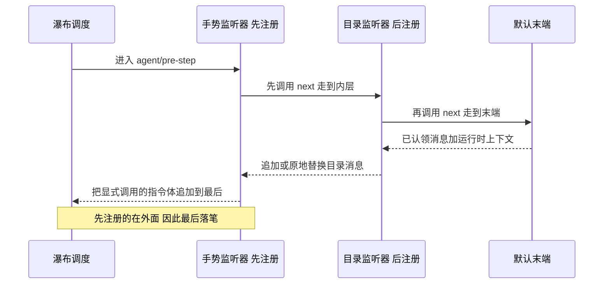
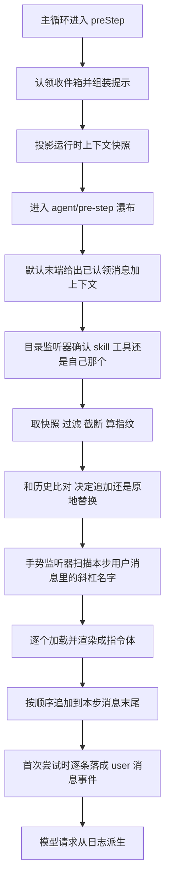

# 03 · 会话目录与按需加载

> 上游:[第四章 · 第四节](../04-skills.md#第四节-catalog-与-loader模型如何按需拿到完整指令)
> 主源码:`packages/skill/tool-skill/src/index.ts`(431 行)
> 本篇回答:目录条目是怎么从注册表摘要变成会话消息的、`agent/pre-step` 的嵌套顺序如何决定注入位置、`skill` 工具逐行的四道闸门、`/name` 手势的正则边界、以及 digest 四个返回分支各自的确切条件。

---

## 1. 插件形状

```typescript
// packages/skill/tool-skill/src/index.ts:24-27
export const name = 'tool-skill'
export const inject = ['agents', 'tools', 'skills']

const DEFAULT_CATALOG_DESCRIPTION_MAX_LENGTH = 500
```

`inject` 三项各有实职:`agents`(拿 `Agent` 与其 `session`)、`tools`(注册 `skill` 工具 + 可见性查询)、`skills`(注册表只读)。

`apply()` 按固定顺序装四样东西:`skill` 工具的定义、工具注册、手势监听器、目录监听器。每一件的具体位置见下表。

先装手势监听器、后装目录监听器,这个顺序是有意的。Cordis 的 waterfall 里,监听器的嵌套关系由注册顺序决定:先注册的在最外层,后注册的在里层。外层先调用 `next()` 把控制权交给内层,等内层返回后再对结果做最后加工——所以先注册的手势监听器反而最后落笔。这条规则直接决定了注入位置:背景信息在前,模型真正要执行的材料在最后。


<details><summary>Mermaid 源码</summary>



</details>

| 阶段 | 做了什么 | 关键调用(文件:行) |
|---|---|---|
| 装配顺序 | `apply()` 依次装四样:工具定义、注册工具、手势监听器、目录监听器 | `apply()`(`packages/skill/tool-skill/src/index.ts:77-252`) |
| 注册工具 | 工具注册排在监听器之前,这样反向拆卸时先拆监听器、再注销工具,不会留下"工具没了但指引还在"的中间态 | `ctx.tools.register(skillTool)`(`index.ts:161`、`206-207` 注释) |
| 注册手势监听器 | 先注册 = 瀑布里更外层,拿到对结果的最后写权 | `index.ts:177-204` |
| 注册目录监听器 | 后注册 = 内层,先产出目录消息 | `index.ts:213-251` |
| 默认末端 | 产出 `{ kind: 'enter', messages: [claimed, context?] }`,即工作区规则与运行时策略 | 末端回调(`core/agent-loop/src/agent.ts:249-255`) |
| 目录居中 | 目录消息接在上下文之后,是"本步有什么能力"的清单 | `index.ts:242-250` |
| 注入最后 | `/name` 加载出来的指令体追加到本步全部注入的最后 | `index.ts:186-203` |
| 最终顺序 | 消息等于已认领消息、上下文、目录、显式注入,依次排列 | 三条注册顺序共同决定(`index.ts:163-170` 注释) |

<details><summary>原图(供逐行核对)</summary>

```text
agent/pre-step waterfall 的调用栈(由外到内)
┌─ 手势监听器(tool-skill/src/index.ts:177)  ← 先注册 = 更外层
│   const decision = await next()
│   ┌─ 目录监听器(:213) → await next()
│   │   ┌─ 默认末端:() => ({ kind: 'enter', messages: [claimed..., context] })
│   │   └─ 返回:追加/替换目录消息
│   └─ 返回:把 /name 注入 append 到目录之后
└─ 最终 decision.messages = [ ...claimed, context?, 目录?, ...注入? ]
```

</details>

这就是 `:163-170` 注释所说的"background first, the material the model must act on last":工作区规则与运行时策略(默认末端产出)在前,目录居中,用户显式要求的指令体**在最后**,离模型的回答最近。若注册顺序反过来,注入会落在目录之前,位置就不再确定。

`ctx.tools.register` 在工具之后、监听器之前:**reverse teardown 先拆监听器再注销工具**(`:206-207` 注释),避免出现"工具没了但指引还在"的中间态。

---

## 2. `skill` 工具的 schema 与四道闸门

### 2.1 模型看到的契约

```typescript
// packages/skill/tool-skill/src/index.ts:81-86
const skillTool = defineTool({
  name: 'skill',
  description: 'Load the full instructions for an available skill. Call this with the exact skill name from the session skill catalog before acting on a task that names or clearly matches that skill.',
  parameters: {
    name: { type: 'string', required: true, description: 'The exact skill name from the available skills list.' },
  },
```

描述文本里有两个契约让模型知道的点:名字必须**精确**(`the exact skill name`)、时机是**动手之前**(`before acting on a task`)。两处措辞都指向同一件事:目录是路由表,不是指令。

输出 schema(`:87-124`)把 `resourceBase` 的三个变体写成 `oneOf`,每个都 `additionalProperties: false` 且带 `const` 判别字段——这个 schema 同时是**模型可见契约**与渲染器的输入类型。顶层四个字段:`name`、`provider`、`resourceBase`(可选三选一)、`content`:

```typescript
// packages/skill/tool-skill/src/index.ts:122-125
          content: { type: 'string', required: true },
        },
      },
      render: (_args, value) => [{ type: 'text', text: renderSkillContent(value) }],
```

`render` 把结果压成**单个文本块**,内容由 `renderSkillContent`(注册表侧共享,`skill/src/index.ts:170`)生成;UI 侧展示元数据在 `presentCall`(`:157-159`):`{ card: 'generic', title: 'Load skill <name>', kind: 'read', rawInput }`。

### 2.2 `execute()` 的四道闸门

```typescript
// packages/skill/tool-skill/src/index.ts:127-156(节选)
if (!isSkillName(args.name)) throw new Error(`invalid skill name "${args.name}"`)          // 闸门 1
// The agent is its own scope key, so the lookup resolves the layered
// registry exactly as this agent's composition sees it.
const lookup = { cwd: exec.agent?.session.header.cwd, signal: exec.signal, scope: exec.agent }
const summary = (await ctx.skills.list(lookup)).find(skill => skill.name === args.name)
if (!summary) throw new Error(`skill "${args.name}" is unknown or no longer available`)    // 2a
if (!isModelInvocable(summary)) throw new Error(`skill "${args.name}" is not available for model invocation`)  // 2b
const skill = await ctx.skills.get(args.name, lookup)
if (!skill) throw new Error(`skill "${args.name}" is unknown or no longer available`)      // 3a
if (!isModelInvocable(skill)) throw new Error(`skill "${args.name}" is not available for model invocation`)    // 3b
return { name: skill.name, provider: skill.provider, ...resourceBase..., content: skill.content }
```

| 闸门 | 检查对象 | 拦下的情形 | 模型看到 |
|---|---|---|---|
| 1 | `isSkillName(args.name)` | 非法名字(大写、下划线、空格) | `Error: invalid skill name "<n>"` |
| 2a | `list()` 结果中同名摘要存在 | 名字不在本 agent 的合并视图里 | `Error: skill "<n>" is unknown or no longer available` |
| 2b | `isModelInvocable(summary)` | `disable-model-invocation: true` | `Error: skill "<n>" is not available for model invocation` |
| 3a | `get()` 返回非 undefined | 文件在两次查询之间消失 | 同 2a 文案 |
| 3b | `isModelInvocable(skill)` | **发现与加载之间**策略变化(文件被编辑) | 同 2b 文案 |

**为什么要查两次策略**:目录摘要来自注册表缓存,正文来自 provider 实时重读。两次之间磁盘可能被改。代码在**加载之前**先拦一次是刻意的顺序——被拒的名字根本走不到正文加载(Agent Note `2026-07-28-skill-invocation-policy.md:17`);加载之后**再拦一次**是因为加载结果才是真正要返回的东西。测试 `tool-skill.spec.ts:914`("checks model policy before provider loading and rechecks the loaded definition")钉住这条。

`lookup.scope = exec.agent`(`:133`)是整条链上作用域语义的落点:**agent 就是它自己的 scope key**,所以这次查找恰好解析出该 agent 组合看到的那份分层注册表(详见 [05](./05-scope-and-composition.md#5-agent-读到的合并视图))。

返回值**不含 `invocation`、`source`、`path`、`metadata`**(`:148-155`):工具输出 schema 只声明了 `name`/`provider`/`resourceBase`/`content` 四个字段,`additionalProperties: false`。模型看不到 skill 来自哪个根、是否可被用户调用、文件在哪。`resourceBase` 用展开复制(`{ ...skill.resourceBase }`)而不是直接传引用——输出对象会被序列化进会话日志,借来的对象不该穿透。

---

## 3. 目录构造:排序、过滤、去重、截断

```typescript
// packages/skill/tool-skill/src/index.ts:220-228
const toolVisible = ctx.tools.get(skillTool.name, agent) === skillTool
const snapshot = toolVisible
  ? await ctx.skills.snapshot({ cwd: agent.session.header.cwd, signal, scope: agent })
  : { skills: [], complete: true }
signal.throwIfAborted()
if (!snapshot.complete) return decision
const skills = snapshot.skills.filter(isModelInvocable)
const entries = catalogSourceEntries(skills, catalogDescriptionMaxLength)
const digest = digestCatalogEntries(entries)
```

| 步骤 | 谁做 | 规则 |
|---|---|---|
| **排序** | 注册表 `snapshot()`(`skill/src/index.ts:486`) | `compareSkillSummary` 按**名称码点**升序;tool-skill **不重排** |
| **去重** | 注册表 `collectLayer` / `collectFresh` | 同名只剩胜者;tool-skill **不再去重** |
| **过滤** | `isModelInvocable`(`:226`) | 只留 `invocation.modelInvocable === true`;`disable-model-invocation` skill 在此消失 |
| **截断** | `catalogDescription`(`:391-394`) | 见下 |
| **投影** | `catalogSourceEntries`(`:50-58`) | 只保留 `{ name, description }`,丢掉 `path`/`source`/`provider`/`whenToUse`/`resourceBase` |

```typescript
// packages/skill/tool-skill/src/index.ts:391-394
const normalized = value.replaceAll(/\s+/g, ' ').trim()
return normalized.length <= maxLength ? normalized : `${normalized.slice(0, maxLength - 3)}...`
```

截断规则有三个细节:

1. **先归一化空白**:所有连续空白(含换行)压成单个空格再 `trim`。真实 skill 的 `description` 常常是长段落,归一化后才是"一行"。
2. **超限时切片长度是 `maxLength - 3`**,给省略号留位,所以最终长度**恰好等于** `maxLength`。
3. `catalogDescriptionMaxLength` 的最小值是 **3**(`:79` 的 `assertPositiveInteger(..., 3)`),否则 `slice(0, 0) + '...'` 只剩省略号。配置在 `apply()` 里就校验,不会等到运行时。

**截断后的描述同时进两处**:模型看到的目录行,以及 durable source 的 `entries`。这是刻意的——digest 算在 entries 上,如果 source 存的是未截断原文而目录渲染的是截断版,改一个 `catalogDescriptionMaxLength` 就不会触发重发。

---

## 4. digest 与五个返回分支

### 4.1 digest 算在条目上,不算在渲染文本上

```typescript
// packages/skill/tool-skill/src/index.ts:328-335(节选)
// JSON per entry rather than a separator character: every separator is itself
// a legal description character, so only quoting makes the boundary exact.
const canonical = entries.map(entry => JSON.stringify([entry.name, entry.description])).join('\n')
return createHash('sha256').update(canonical).digest('hex')
```

两条实现决策值得引用:

- **每条 `JSON.stringify` 而不是拼分隔符**。任何分隔符本身都是合法的描述字符,只有引号转义才能给出精确边界(`:329-330` 注释)。这阻止了 `["a","b"]` 与 `["a\nb"]` 这类碰撞。
- **算在 entries 上,不算在渲染文本上**。`<system-reminder>` 框架文案的改动(例如调措辞、加一句行为规范)永远不会触发重发;只有条目级变化(增删、描述变、可见性变)才会。

### 4.2 历史基准:从会话日志里找

```typescript
// packages/skill/tool-skill/src/index.ts:361-378(节选)
const visible = new Set(agent.session.surface.nodes)
let published = false
for (let index = agent.session.seq - 1; index >= 0; index -= 1) {
  const event = agent.session.eventAt(SessionSeq(index))
  if (event === undefined) throw new Error(`skill catalog cannot read seq ${String(index)} below the current Session length`)
  if (event.type !== 'user/message' || event.data.source.kind !== 'skill-catalog') continue
  const entries = readCatalogEntries(event.data.source)
  if (entries === undefined) continue
  const digest = digestCatalogEntries(entries)
  published = true                                   // ← 不可见的可读目录也算「发布过」
  if (visible.has(event.seq)) return { visibleDigest: digest, published }
}
return { published }
```

三个语义要点:

1. **`visible` 来自 `agent.session.surface.nodes`**(`SessionSurface` 的当前可见事件序列表,`packages/core/session/src/surface.ts:190-195`)。从最新往旧扫,**第一条可读且仍在 surface 上的目录**决定基准。被压缩(compaction)藏掉的目录不算基准,但仍会把 `published` 置真。
2. **`published` 与 `visibleDigest` 是两个独立事实**。任何一条可读目录事件(哪怕不可见)都会让 `published = true`;`visibleDigest` 才要求可见。这个区分支撑了压缩后的行为:压缩藏掉初始目录后,`published` 仍为真,所以下一次重建会走**替换**模板而不是首版模板。
3. **`eventAt` 返回 undefined 就抛**。`agent.session.seq` 是日志长度(`packages/core/session/src/index.ts:669`),`eventAt` 直取 `log[seq]`(`:623`);在 `[0, seq)` 区间内取不到说明日志被外部改写。硬失败优于静默跳过(测试 `tool-skill.spec.ts:602`)。

`readCatalogEntries`(`:348-359`)对 source 做**结构校验而非信任**:条目不是数组、任一项不是对象、`name` 非字符串或为空、`description` 非字符串,任一不成立就返回 `undefined`,整条记录被当作"不是本插件的目录"。注释(`:337-346`)写明理由:resumed / forked / 外部写入的日志种子可能带畸形 source,抛在 pre-step 里会让该会话此后每一轮都失败——**降级成"不认识"而不是失败**。测试 `tool-skill.spec.ts:560`。

### 4.3 五个分支

```typescript
// packages/skill/tool-skill/src/index.ts:225-251
if (!snapshot.complete) return decision                                    // A
const skills = snapshot.skills.filter(isModelInvocable)
const entries = catalogSourceEntries(skills, catalogDescriptionMaxLength)
const digest = digestCatalogEntries(entries)
const history = catalogHistory(agent)
const existing = catalogMessage(decision.messages)
if (history.visibleDigest === digest) {                                    // B
  return existing === undefined
    ? decision
    : { ...decision, messages: decision.messages.filter(m => m.id !== existing.message.id) }
}
if (existing !== undefined && digestCatalogEntries(existing.entries) === digest) return decision   // C
if (!history.published && skills.length === 0) {                           // D
  return existing === undefined
    ? decision
    : { ...decision, messages: decision.messages.filter(m => m.id !== existing.message.id) }
}
const catalog = history.published ? renderCatalogUpdate(entries) : renderCatalogMessage(entries)  // E
return {
  ...decision,
  messages: existing === undefined
    ? [...decision.messages, catalog]
    : decision.messages.map(m => m.id === existing.message.id ? catalog : m),
}
```

| 分支 | 条件 | 行为 | 为什么 |
|---|---|---|---|
| **A** | `snapshot.complete === false` | 原样放行 | 保留 last-good 视图;不缓存的中间态不上屏。测试 `:335`、`:706` |
| **B** | 历史可见目录的 digest == 当前 digest | 若本步消息列表里有目录消息则**剔除**,否则原样 | 历史已经携带同一份目录,本步再发就是重复 |
| **C** | 本步已有候选目录且其 entries digest == 当前 digest | 原样放行 | 同一步内的幂等:不重复替换成内容相同的消息 |
| **D** | 从未发布过 **且** 当前无可见 skill | 剔除本步候选目录,否则沉默 | 空目录不值得占用上下文;但若历史发过目录,则落到 E 发空墓碑 |
| **E** | 其余 | `published ? renderCatalogUpdate : renderCatalogMessage`;有 `existing` 就**原地替换**(保持消息位置),否则追加 | 首版 vs 整表替换;替换必须保持位置,否则会打乱 KV-cache 复用前缀 |

`existing` 由 `catalogMessage(decision.messages)`(`:380-389`)得出:扫**本步消息列表**找第一条 `source.kind === 'skill-catalog'` 且 entries 可读的消息。它与 `catalogHistory` 的区别是范围——一个是当前 step 的候选批次,一个是整条会话日志。

### 4.4 目录投递到模型视野的完整路径

`agent/pre-step` 瀑布从 `preStep`(`core/agent-loop/src/agent.ts:249-255`)进入,默认末端产出的 `messages` 已经是 `[...claimed, context]`。两个监听器依次 `await next()` 后各自扩写,最终回到 `step()`:

```typescript
// packages/core/agent-loop/src/agent.ts:373-377
      if (firstAttempt) {
        for (const message of decision.messages) {
          this.session.append('user/message', message, { surfaceOp: 'append' })
        }
      }
```

落日志只在**首次尝试**发生,`firstAttempt` 在同一 step 内第一次构建请求时为真、重试请求时不再追加——否则 SDK 重试会把同一份目录写进日志多次。这满足仓库"模型可见 ⟺ 已落日志"的不变式:**目录与注入都是可重放的 `user/message` 事件,不是瞬态提示文本**。整条路径可以概括成一句话:主循环先备好提示和上下文,再让瀑布的两层监听器依次加料,最后由 `step()` 把这一批消息落成会话事件。落日志只在首次尝试时执行,否则 SDK 重试会把同一份目录反复写进日志。这正是仓库"模型可见 ⟺ 已落日志"不变式的要求:目录和注入都是可重放的 `user/message` 事件,不是瞬态提示文本。


<details><summary>Mermaid 源码</summary>



</details>

| 阶段 | 做了什么 | 关键调用(文件:行) |
|---|---|---|
| 认领收件箱 | 取出本步要处理的用户输入 | `inbox.claim()`(`core/agent-loop/src/agent.ts:240-259`) |
| 组装系统提示 | 按本 agent 的 scope 组装一次,含工具 schema | `systemPrompt.assemble()`(`agent.ts:241`) |
| 上下文快照 | 渲染具名上下文段落,再投影成一条消息 | `renderContextSections()` / `runtimeContext.project()`(`agent.ts:242-243`) |
| 进入瀑布 | 把已认领消息交给 `agent/pre-step`,附带 turn、step、signal | `dispatch.waterfall()`(`agent.ts:244`) |
| 默认末端 | 产出"已认领消息 + 上下文"这个初始批次 | 末端回调(`agent.ts:245`) |
| 目录监听器 | 查工具可见性、取快照、过滤、截断、算指纹,再决定追加还是替换 | `tool-skill/src/index.ts:213-251` |
| 手势监听器 | 扫描本步用户消息里的 `/name`,逐个加载、过滤、渲染 | `tool-skill/src/index.ts:177-204` |
| 追加注入 | 把渲染好的指令体追加到本步消息列表最后 | `tool-skill/src/index.ts:186-203` |
| 落日志 | 首次尝试时把 `decision.messages` 逐条写成 `user/message` 事件 | `session.append()`(`core/agent-loop/src/agent.ts:373-377`) |
| 派生请求 | 消息历史从日志派生,模型看到的就是刚落下的这批事件 | `deriveMessages()`(`core/agent-loop/src/agent.ts:603`) |

<details><summary>原图(供逐行核对)</summary>

```text
preStep(agent.ts:240)
  → inbox.claim / systemPrompt.assemble / runtimeContext.project
  → dispatch.waterfall('agent/pre-step', { messages: claimed, turn, step, signal }, 默认末端)
        手势监听器(tool-skill:177)→ await next() → 目录监听器(tool-skill:213)→ await next() → 默认末端
        目录监听器: tools.get('skill', agent) === skillTool ?
                    skills.snapshot({ cwd, signal, scope: agent })
                    → filter(isModelInvocable) → entries → sha256 digest
                    → catalogHistory(agent) / catalogMessage(decision.messages) → 追加或原地替换
        手势监听器: invokedSkillNames(messages) → skills.get + isUserInvocable
                    → renderSkillContent → 追加到最后
  → step(decision)(agent.ts:352)
  → for (m of decision.messages) session.append('user/message', m, { surfaceOp: 'append' })
```

</details>

---

## 5. 渲染契约:两套模板与转义归属

### 5.1 首版模板

```typescript
// packages/skill/tool-skill/src/index.ts:256-275(文本主体与 source)
'<system-reminder>',
'A skill is a reusable set of task-specific instructions. The following skills are available in this session:',
'', '<available_skills>', ...renderCatalogEntries(entries), '</available_skills>', '',
"If the user names a skill, or the task clearly matches a skill's description, call the `skill` tool with the exact skill name before taking task actions. Load all applicable skills, then follow their full instructions. This catalog contains summaries only; do not infer or follow a skill's instructions until it has been loaded.",
'A user may also invoke a skill directly; its <skill_content> block then appears in this conversation. Follow it, and do not call the `skill` tool again for that skill.',
'</system-reminder>',
// ...
    source: { kind: 'skill-catalog', form: 'catalog', entries },
```

`form: 'catalog'` 与 `SkillCatalogSource` 的注释(`:28-33`)构成一条硬规定:**呈现层不许回 parse `<available_skills>` 文本**。框架文案是给模型写的,结构化 `entries` 才是给人和非模型消费者的真源。

### 5.2 替换模板(含空墓碑)

`renderCatalogUpdate`(`:279-311`)在两处与首版不同:开头一句 `The available skill catalog changed. This complete catalog replaces every earlier available-skills list in this session:`;结尾按 `entries.length === 0` 分叉:

| 分支 | 文案 |
|---|---|
| 空(墓碑) | `No skills are currently available through the \`skill\` tool. Do not use names from earlier skill catalogs.` + `A user may still invoke a skill directly; ...` |
| 非空 | `Use only names in this replacement catalog. If the user names a listed skill, or the task clearly matches its description, call the \`skill\` tool with the exact name before acting.` + 同一句用户显式调用的说明 |

source 多一个 `update: true` 标记(`:307`)——它是"这是替换而非首次发布"的唯一持久化证据,`catalogHistory` 并不读它(只读 entries),它留给展示层。

**清空目录是一条显式墓碑消息,不是沉默**:移除全部 skill 后模型仍会收到一条空 `<available_skills>`,并被明确告知不要使用旧名字。测试 `tool-skill.spec.ts:466`。

### 5.3 目录行的转义归属

```typescript
// packages/skill/tool-skill/src/index.ts:313-321(节选)
/**
 * Model-facing catalog lines, projected from the same entries the source records.
 * The pseudo-XML escaping belongs to this frame, not to the published fact, so it
 * is applied here and never stored. Names are `isSkillName`-validated and carry
 * no escapable character.
 */
return entries.map(entry => `- \`${entry.name}\`: ${escapeText(entry.description)}`)
```

这是本章最值得记住的一条分层规则:**转义属于渲染帧,不属于持久化事实**。`entries` 里存的是归一化+截断后的原始描述文本;`escapeText`(`skill/src/index.ts:226`)只在生成模型可见字符串时套一层。带来两个后果:

- digest 不受转义影响——描述里出现 `<` 不会因为转义与否而产生两种指纹。
- 展示层拿到 `entries` 时是干净文本,不需要反解 `&lt;`。

名字不做转义,因为它已被 `isSkillName` 约束为 `[a-z0-9-]`(`:317-318` 注释)。

---

## 6. `/name` 手势:解析与注入

```typescript
// packages/skill/tool-skill/src/index.ts:402-409(节选)
/**
 * A whitespace-bounded `/name` token (the public skill-name grammar) anywhere
 * in the text ... A second `/` or any non-boundary character breaks the match,
 * which keeps file paths (`/usr/bin`) and fractions (`5/8`) out.
 */
const SKILL_GESTURE = /(^|\s)\/([a-z0-9]+(?:-[a-z0-9]+)*)(?=\s|$)/g
```

| 输入 | 是否命中 | 原因 |
|---|---|---|
| `看看 /dsh-doc` | ✅ 命中 `dsh-doc` | 前面是空白,后面是行尾 |
| `use /record-browser-gif now` | ✅ | 两侧都是空白 |
| `5/8` | ❌ | 前面不是空白 |
| `/usr/bin` | ❌ | `usr/bin` 里第二个 `/` 断开;`usr` 后面不是空白/行尾 |
| `https://x/y` | ❌ | 同上 |
| `/Dsh-Doc` | ❌ | 名称文法要求小写 |

解析入口 `invokedSkillNames`(`:418-431`)另加两道过滤:

```typescript
// packages/skill/tool-skill/src/index.ts:418-431(节选)
for (const message of messages) {
  if ((message.source as { kind?: unknown }).kind !== 'user') continue     // 只扫直接用户输入
  for (const block of message.content) {
    if (block.type !== 'text') continue                                     // 只扫文本块
    for (const match of block.text.matchAll(SKILL_GESTURE)) {
      const name = match[2]
      if (name !== undefined && !names.includes(name)) names.push(name)     // 首见序去重
    }
  }
}
```

1. **`source.kind === 'user'` 是唯一入口**。工具结果、注入内容、系统消息都无法伪造手势——即使它们的文本里出现 `/dsh-doc`。测试 `tool-skill.spec.ts:1067`("never scans non-user sources")。
2. **只扫 `type: 'text'` 块**。图片、工具结果块等被跳过(测试 `:1095`)。
3. **首见序去重**,同一步里重复 `/x /x` 只注入一次(测试 `:1067`)。

一个值得记录的细节:`:164-166` 的注释仍写着 "a claimed user message whose **first line starts with** `/<name>`",而实际实现(`SKILL_GESTURE` 的 `(^|\s)` 前缀)接受**句中任意空白边界**上的 token。测试 `:1034` 明确覆盖了 mid-sentence 手势。以代码与测试为准。

### 注入体

```typescript
// packages/skill/tool-skill/src/index.ts:186-203(节选)
const lookup = { cwd: agent.session.header.cwd, signal, scope: agent }
const injections: UserMessage[] = []
for (const name of names) {
  const skill = await ctx.skills.get(name, lookup)
  signal.throwIfAborted()
  // Unknown names and user-disabled skills stay plain prose: ... The check sits
  // on the loaded definition — the single lookup that produces what is injected.
  if (skill === undefined || !isUserInvocable(skill)) continue
  const source: SkillInvocationSource = { kind: 'skill-invocation', name, form: 'instructions' }
  injections.push(createUserMessage({
    content: [{ type: 'text', text: renderSkillContent(skill) }], source,
  }))
}
return injections.length === 0 ? decision : { ...decision, messages: [...decision.messages, ...injections] }
```

| 维度 | 值 |
|---|---|
| 过滤依据 | `isUserInvocable(skill)`,查在**加载出来的定义**上(`:195`) |
| 角色 | user(`createUserMessage`,`dsh-llm`) |
| source | `{ kind: 'skill-invocation', name, form: 'instructions' }`(`skill/src/index.ts:146-152`) |
| 内容 | `renderSkillContent(skill)`——与工具结果**逐字相同**的 `<skill_content>` 包装 |
| 位置 | `[...decision.messages, ...injections]`,即本步全部注入的最后 |
| 未命中 | 保持普通散文,不报错、不注入 |

`form: 'instructions'` 与 `kind: 'skill-invocation'` 一起告诉 transcript 消费者:这条消息是"给模型的指令材料",不是用户新说的话。用户自己的原文仍走原来的 user 消息,两个事实不混。

**这是 `disable-model-invocation` skill 的唯一入口**([01](./01-skill-format-and-discovery.md) 里 `.agents/skills/dsh-translate-docs/SKILL.md:4-5` 就是这种)。目录和 `skill` 工具对它们不可见,但 `/name` 仍能注入。

---

## 7. 目录 digest 与工具可见性的绑定

```typescript
// packages/skill/tool-skill/src/index.ts:206-223(节选)
// Register after the tool so reverse teardown removes guidance first. Exact definition
// identity prevents a scoped shadow merely named `skill` from inheriting this catalog.
// The comparison is against the definition this plugin registered, not against
// a lookup of its own name: `register()` files into the CALLING context's
// scope, so a plugin mounted inside an agent preset registers for that agent
// alone and an unscoped lookup correctly finds nothing.
ctx.on('agent/pre-step', async ({ agent, signal }, next) => {
  const decision = await next()
  if (decision.kind === 'reject') return decision
  signal.throwIfAborted()
  const toolVisible = ctx.tools.get(skillTool.name, agent) === skillTool
  const snapshot = toolVisible
    ? await ctx.skills.snapshot({ cwd: agent.session.header.cwd, signal, scope: agent })
    : { skills: [], complete: true }
```

比对的是**本插件注册的那个定义对象本身**,不是"按名查到的东西"。这挡住两件事:

| 场景 | `tools.get('skill', agent)` 返回 | 结果 |
|---|---|---|
| 正常 | `=== skillTool` | 目录正常发布 |
| 该 agent 的 restriction 排除了 `skill` | 某个别的工具或 `undefined` | `toolVisible = false` → 空快照 → 已发布过则发空墓碑 |
| 同层出现同名 scoped shadow | **shadow 的定义对象** | `=== skillTool` 为假,即使名字一样也不认 |

第二条尤其关键:如果按名字查找,一个恰好叫 `skill` 的遮蔽工具会让本插件的目录继续挂着,而模型实际调用的是另一套实现——**目录指引与实际工具脱节**。身份比对让"目录存在"与"这个工具可用"变成同一个事实。测试 `tool-skill.spec.ts:735`(restriction 场景)与 `:754`(同名 shadow 场景)。

反面提示也写在注释里:`register()` 是**按调用上下文的作用域**落层的,所以挂进 preset 的实例在无 scope 的查询里查不到自己。用 `=== skillTool` 就绕开了这个陷阱。

### 可见性丢失后的收敛

`toolVisible = false` 时 `snapshot` 被替换成 `{ skills: [], complete: true }`——注意 **`complete` 仍为真**,所以不会被分支 A 拦下。然后 `entries = []`,`digest = sha256('')`:

- 历史里有可见的非空目录 → 分支 B/C 不成立,分支 D 要求 `!history.published`,不成立 → **分支 E 发空墓碑**,显式退休旧名字。
- 从未发布过 → 分支 D 成立 → **沉默**,不产生任何消息。

这条"可见性同生共死"的规则有一个直接的用户可见后果:一次 restriction 变更会让会话追加一条空目录消息,而不是留下一个悬空的指引。

---

## 8. 关键文件 / 符号索引表

| 位置 | 符号 | 作用 |
|---|---|---|
| `tool-skill/src/index.ts:24-27` | `name` / `inject` / `DEFAULT_CATALOG_DESCRIPTION_MAX_LENGTH` | 插件声明与默认截断长度 500 |
| `tool-skill/src/index.ts:34-69` | `SkillCatalogSource` + `MessageSourceMap` 合并 / `catalogSourceEntries` / `Config` | durable source、投影与配置 schema |
| `tool-skill/src/index.ts:77-161` | `apply()` 开头 / `skillTool = defineTool({...})` / `ctx.tools.register` | 配置校验、描述/参数/输出 schema/render/presentCall/execute、注册 |
| `tool-skill/src/index.ts:127-159` | `execute()` / `presentCall()` | 四道闸门、返回值投影、`kind: 'read'` |
| `tool-skill/src/index.ts:177-204` | 手势监听器 | `/name` 加载与追加注入 |
| `tool-skill/src/index.ts:213-251` | 目录监听器 | 五个返回分支 |
| `tool-skill/src/index.ts:254-311` | `renderCatalogMessage()` / `renderCatalogUpdate()` | 首版模板与替换模板(含空墓碑) |
| `tool-skill/src/index.ts:313-335` | `renderCatalogEntries()` / `digestCatalogEntries()` | 目录行、转义归属与 sha256 指纹 |
| `tool-skill/src/index.ts:348-400` | `readCatalogEntries` / `catalogHistory` / `catalogMessage` / `catalogDescription` | source 校验、历史基准、本步候选、归一化截断 |
| `tool-skill/src/index.ts:409-431` | `SKILL_GESTURE` / `invokedSkillNames()` | 手势词法与扫描边界 |
| `skill/src/index.ts:146-159` | `SkillInvocationSource` | 注入 source 的类型真源 |
| `skill/src/index.ts:170-228` | `renderSkillContent` / `escapeText` | 两条路径共享的渲染器 |
| `core/agent-loop/src/agent.ts:240-259,373-377` | `preStep()` / `step()` 首次尝试 | 瀑布调用点与 `decision.messages` → `user/message` 落日志 |
| `core/session/src/surface.ts:190-195` | `SessionSurface.nodes` | `catalogHistory` 的可见性依据 |
| `core/session/src/index.ts:623,669` | `eventAt` / `seq` | 日志读取与长度边界 |
