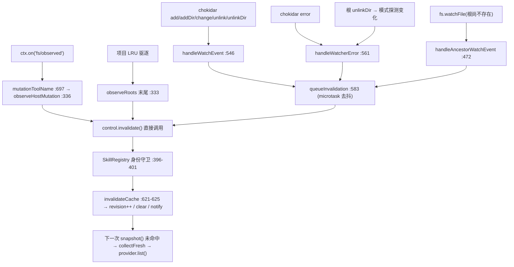

# 04 · 文件监视与失效闭环

> 上游:[第四章 · 第三节](../04-skills.md#第三节-本地-provider监视与失效闭环)、[第六节第 4 条](../04-skills.md#第六节-作用域行为agent--preset-分层)
> 主源码:`packages/skill/skill-filesystem/src/index.ts:134-147, 288-707`、[`packages/api/session-controller/src/skill-catalog.ts`](https://github.com/deepseek-ai/deepseek-harness/blob/dbbaa4a37fb9098aba814c97d2956f7b2f105f46/packages/api/session-controller/src/skill-catalog.ts)、[`packages/client/ui-skill/src/client/index.ts`](https://github.com/deepseek-ai/deepseek-harness/blob/dbbaa4a37fb9098aba814c97d2956f7b2f105f46/packages/client/ui-skill/src/client/index.ts)

---

## 1. 失效输入全景


<details><summary>Mermaid 源码</summary>



</details>

三条输入的差别只在**时序**,不在语义:

| 输入 | 时机 | 去抖 | 触发条件 |
|---|---|---|---|
| watcher 事件 | 文件稳定后(chokidar `awaitWriteFinish`) | 有(microtask 合并) | 通过 `isRelevantWatchEvent` |
| `fs/observed` | 模型工具写入**当场** | **无** | actor 是 `write`/`edit` 且目标像 skill 路径 |
| 结构变更(驱逐/重挂) | `observeRoots` 返回前 / 根 unlinkDir 后 | 无 | 驱逐或模式探测变化时 |

---

## 2. chokidar 配置:每一项的理由

```typescript
// packages/skill/skill-filesystem/src/index.ts:492-506(节选)
  // Chokidar owns late native fs.watch errors only for persistent watchers;
  // this provider's effect explicitly closes every handle at teardown.
  const watcher = chokidar.watch(mode.anchor, {
    persistent: true, ignoreInitial: true, depth: 1,
    followSymlinks: this.config.followSymlinks, atomic: true,
    awaitWriteFinish: {
      stabilityThreshold: this.config.stabilityThresholdMs,   // 默认 200ms
      pollInterval: this.config.pollIntervalMs,               // 默认 100ms
    },
    usePolling: this.config.usePolling, interval: this.config.pollIntervalMs,
  })
```

| 选项 | 值 | 作用与后果 |
|---|---|---|
| `persistent: true` | 常量 | 让 chokidar 接管迟到的原生 `fs.watch` 错误(`:492-493` 注释);代价是句柄必须由本 provider 的 effect 显式关闭(§6.3) |
| `ignoreInitial: true` | 常量 | 首次扫描不产生 `add` 事件;否则每次 `observeRoots` 都把整棵根判成"新增"并触发无意义失效 |
| `depth: 1` | 常量 | **只到根的直接子项**。这是"bundle 内部 resources 变化不构成目录变更"的机械保证:`<root>/<skill>/references/a.md` 在第 3 层,压根不会被上报 |
| `followSymlinks` / `atomic` | `Config.watchFollowSymlinks`(默认 true)/ 常量 | 关掉时 `resolveRootWatchMode` 保留符号链接根不规范化(`:635-638`);`atomic` 把编辑器"写临时文件再 rename"的 unlink+add 合并成一个 change |
| `awaitWriteFinish.stabilityThreshold` / `pollInterval` | `Config.watchStabilityThresholdMs` / `Config.watchPollIntervalMs`,默认 **200** / **100** | 文件须稳定 200ms 才上报,防止读到写了一半的 frontmatter;`pollInterval` 同时是 `usePolling` 的轮询间隔 |
| `usePolling` | `Config.watchUsePolling`,默认 false | 网络盘 / 容器挂载 / 某些 Windows 场景下原生事件不可靠时的退路 |

`resolveWatchConfig`(`:612-627`)对 `watchStabilityThresholdMs` / `watchPollIntervalMs` / `watchMaxProjects` 各过一遍 `assertPositiveInteger`(`:703-707`),plugin 加载期就抛错(测试 [`skill-filesystem.spec.ts:848`](https://github.com/deepseek-ai/deepseek-harness/blob/dbbaa4a37fb9098aba814c97d2956f7b2f105f46/packages/skill/skill-filesystem/tests/skill-filesystem.spec.ts#L848))。

**稳定窗口与 `fs/observed` 的分工**是这一节的重点:模型用 `write`/`edit` 写 SKILL.md,若只靠 chokidar 要等 200ms 稳定窗口加事件调度;`fs/observed` 直通把这一段完全跳过,所以"模型刚写的 skill 下一步就能用"是**确定性的**。

---

## 3. 根的监视锚点:`root` 与 `ancestor` 两态机

根可能不存在(用户还没建 `~/.dsh/skills`)。`resolveRootWatchMode` 从根路径向上找最近的**现存目录**:

```typescript
// packages/skill/skill-filesystem/src/index.ts:631-653(节选)
  while (true) {
    try {
      const info = await stat(candidate)
      if (info.isDirectory()) {
        const preserveRootLink = candidate === root && !followSymlinks
          && (await lstat(candidate)).isSymbolicLink()
        const anchor = preserveRootLink ? resolve(candidate) : await canonicalizeWatchPath(candidate)
        if (candidate === root) return { kind: 'root', anchor }
        const firstSegment = relative(candidate, root).split(sep)[0]
        return { kind: 'ancestor', anchor, nextPath: join(anchor, firstSegment) }
      }
    } catch (error) { if (!isAbsentPathError(error)) throw error }   // 权限/IO 错照常抛出
    const parent = dirname(candidate)
    if (parent === candidate) return { kind: 'ancestor', anchor: candidate, nextPath: root }
    candidate = parent
  }
```

| 模式 | 何时 | 监视方式 | 事件语义 |
|---|---|---|---|
| `root` | 根本身存在且是目录 | `chokidar.watch(anchor, ...)`(`:491`) | 全套事件过滤 |
| `ancestor` | 根不存在,`candidate` 是最近现存祖先 | `fs.watchFile(nextPath, { persistent: false, interval })`(`:456-470`) | 只关心"路径出现/消失",不看内容 |

`nextPath = join(anchor, firstSegment)` 监视的是**从现存祖先到目标根的第一段路径**。根是 `~/.dsh/skills` 而 `~/.dsh` 存在时监视 `~/.dsh/skills` 这一条;若 `~/.dsh` 也不存在则继续向上,直到某一级现存,再监视"那一级下的下一段"。这实现的是**一次只补一段缺失路径**的渐进探测([`skill-filesystem/README.md:151`](https://github.com/deepseek-ai/deepseek-harness/blob/dbbaa4a37fb9098aba814c97d2956f7b2f105f46/packages/skill/skill-filesystem/README.md#L151))。

用 Node 原生 `watchFile` 而非 chokidar 的理由:这类"路径还不存在"的探测在 chokidar 上平台差异极大,而 `watchFile` 的轮询语义三平台一致,代价是固定延迟 `watchPollIntervalMs`。`persistent: false` 让这种句柄**不阻止进程退出**,生命周期完全由 provider 的 disposal 负责。`sameWatchMode`(`:656-660`)比较 `kind` 与 `anchor`(ancestor 模式还比 `nextPath`),用在"是否要重挂"(`:404`)与"ancestor 事件是否意味着状态真变了"(`:485`)两处。

### 双重探测与就绪等待

```typescript
// packages/skill/skill-filesystem/src/index.ts:441-450(节选)
while (!this.closing && state.owners.size > 0) {
  const mode = await resolveRootWatchMode(state.root.path, this.config.followSymlinks)
  const watcher = mode.kind === 'ancestor'
    ? this.openAncestorWatcher(state, mode) : await this.openRootWatcher(state, mode)
  const current = await resolveRootWatchMode(state.root.path, this.config.followSymlinks)
  if (sameWatchMode(mode, current)) return watcher
  await this.closeWatcher(watcher)          // 挂载期间路径变了 → 关掉重来
}
```

挂载前后各探测一次:若中间路径状态变了(例如根正好被创建出来),刚挂上的 watcher 模式就过期了。不重来会留下一个监视着"下一段路径"、而根其实已存在的 ancestor watcher,永久不产生事件。

```typescript
// packages/skill/skill-filesystem/src/index.ts:511-543(节选)
let ready = false
const readiness = Promise.withResolvers<undefined>()
const onAbort = (): void => { readiness.reject(signal.reason) }
const onError = (error: unknown): void => {
  if (!ready) { readiness.reject(error); return }
  this.handleWatcherError(state, error)          // ready 之后的错误是运行时错误
}
watcher.on('error', onError)
watcher.once('ready', () => { ready = true; readiness.resolve(undefined) })
for (const event of ['add', 'addDir', 'change', 'unlink', 'unlinkDir'] as const) {
  watcher.on(event, (path) => { this.handleWatchEvent(state, mode, event, path) })
}
try { await readiness.promise } catch (error) { await this.closeWatcher(handle); throw error }
```

`ready` 标志把 `error` 分成两类:**就绪前的错误**是启动失败(reject `readiness` → `observeRoots` 抛出 → `list()` 降级为不完整观测);**就绪后的错误**是运行时故障(标记 `unhealthy` 并重挂)。同一个事件走两条完全不同的路。

---

## 4. 事件过滤:两个谓词

```typescript
// packages/skill/skill-filesystem/src/index.ts:662-679
function isRelevantWatchEvent(root: SkillRoot, event: SkillWatchEvent, path: string): boolean {
  const segments = containedSegments(root.path, path)
  if (segments === undefined) return false                     // 根之外
  if (segments.length === 0) return event === 'addDir' || event === 'unlinkDir'
  if (root.skipSystem === true && segments[0] === '.system') return false
  if (segments.length === 1) {
    if (event === 'addDir' || event === 'unlinkDir') return true
    return segments[0]?.endsWith('.md') === true
  }
  return segments.length === 2 && segments[1] === 'SKILL.md'
    && event !== 'addDir' && event !== 'unlinkDir'
}
```

`containedSegments`(`:690-695`)把路径转成相对根的段数组:`relative` 为空 → `[]`;越界或绝对路径 → `undefined`。

| `segments.length` | 含义 | 接受的事件 |
|---|---|---|
| `undefined` | 路径在根之外(调用方传 `{ ...state.root, path: mode.anchor }`,锚点即根) | 全拒 |
| 0 | 根自己 | `addDir` / `unlinkDir` |
| 1 | 根的直接子项 | 目录的 `addDir`/`unlinkDir`;文件的 **`.md` 后缀 + 任意事件** |
| 2 | 二级路径 | 必须**恰为 `SKILL.md`**,且排除 `addDir`/`unlinkDir`(≥3 的 bundle 内部资源全拒) |

配合 `depth: 1`,能被上报的路径最多到二级,所以"`.md` 一级文件"与"`SKILL.md` 二级文件"就是全部覆盖面。`references/`、`scripts/`、`templates/` 里任何改动都不构成目录变更。`skipSystem` 根的 `.system` 子树在这里被挡掉(与 `discoverRoot` 的 `:727` 对齐),不会出现"目录里没有但 watcher 一直失效"的不一致。

```typescript
// packages/skill/skill-filesystem/src/index.ts:681-688(节选)
  if (segments === undefined || segments.length === 0 || segments.length > 2) return false
  if (root.skipSystem === true && segments[0] === '.system') return false
  return segments.length === 1 ? segments[0]?.endsWith('.md') === true : segments[1] === 'SKILL.md'
```

与 watcher 版的差别:根自己不算(`length === 0` 直接 false,工具不可能"写入根目录本身");不区分事件类型(`fs/observed` 只有路径);二级判定不排除 `addDir`/`unlinkDir`(没有事件名可用)。`<root>/<name>/x/SKILL.md` 深度为 3 → 提前 false,正确,因为它本来就不是被发现的形态。

---

## 5. 去抖与直通

```typescript
// packages/skill/skill-filesystem/src/index.ts:583-592(节选)
  if (this.closing || this.invalidationQueued) return
  this.invalidationQueued = true
  queueMicrotask(() => {
    this.invalidationQueued = false
    /* v8 ignore next -- Effect teardown can win this queued microtask before provider disposal emits. */
    if (this.closing) return
    this.invalidate()
  })
```

**同一 microtask 批次内的所有事件合并成一次失效**。写一个 SKILL.md 常见的 unlink+add+change 三连,或一批文件同时落地,都只产生一次 `revision++` 与一次缓存清空。粒度是 microtask 而非定时器:同步事件回调里连续触发会合并,跨宏任务的两次改动各触发一次(测试 [`skill-filesystem-watcher.spec.ts:245`](https://github.com/deepseek-ai/deepseek-harness/blob/dbbaa4a37fb9098aba814c97d2956f7b2f105f46/packages/skill/skill-filesystem/tests/skill-filesystem-watcher.spec.ts#L245))。

```typescript
// packages/skill/skill-filesystem/src/index.ts:336-341
observeHostMutation(path: string): void {
  if (this.closing) return
  const normalized = resolve(path)
  if (![...this.roots.values()].some(state => isPotentialSkillPath(state.root, normalized))) return
  this.invalidate()
}
```

它直接调 `invalidate()`,没有去抖、没有 microtask。理由与 §2 同一件事:这条路的全部价值就是**不等稳定窗口**。代价是"一次批量写 N 个 skill 产生 N 次失效",但每次失效只是 `revision++` + 清 Map + 广播,成本极低,且下一次 `snapshot()` 会重新收集。

---

## 6. 结构变更与拆除

### 6.1 项目级 LRU

```typescript
// packages/skill/skill-filesystem/src/index.ts:301-334(节选)
  for (const root of roots) {
    if (root.projectRoot === undefined) {
      pending.push(this.retainRoot(root, `shared:${root.path}`))     // custom / user / bundled
      continue
    }
    ...按 projectRoot 分组
  }
  for (const [projectRoot, grouped] of projectRoots) {
    this.projects.delete(projectRoot)              // 先删再插 = 移到 Map 末尾(最近使用)
    this.projects.set(projectRoot, new Set(grouped.map(root => root.path)))
    for (const root of grouped) pending.push(this.retainRoot(root, `project:${projectRoot}`))
  }
  let evictedProject = false
  while (this.projects.size > this.config.maxProjects) {              // 默认 128
    const oldest = this.projects.entries().next()
    if (oldest.done) break
    const [projectRoot, paths] = oldest.value
    this.projects.delete(projectRoot)
    for (const path of paths) pending.push(this.releaseRoot(path, `project:${projectRoot}`))
    evictedProject = true
  }
  await Promise.all(pending)
  if (evictedProject) this.invalidate()
```

| 概念 | 实现 |
|---|---|
| 所有权与引用计数 | `owners: Set<string>`(`:276`):共享根 owner 是 `shared:<path>`,项目根是 `project:<projectRoot>`;`retainRoot` 加(`:363`)、`releaseRoot` 减(`:371`),**归零才关 watcher**(`:372-377`) |
| LRU 与驱逐 | `projects: Map<projectRoot, Set<rootPath>>` 靠"删了再插"维持访问序;超 `watchMaxProjects` 时从头弹、释放其下所有根、主动 `invalidate()` |

驱逐后主动失效的理由:候选没问题,但根不再被监视,目录可能漏掉后续变化,所以让下一读重新建立。`retainRoot`(`:357-365`)对新根先登记 `unhealthy: true` 再尝试 `ensureWatcher`;起不来时 `owners` 里仍有它,下次读还会重试(测试 [`skill-filesystem.spec.ts:743`](https://github.com/deepseek-ai/deepseek-harness/blob/dbbaa4a37fb9098aba814c97d2956f7b2f105f46/packages/skill/skill-filesystem/tests/skill-filesystem.spec.ts#L743))。

### 6.2 重挂路径

```typescript
// packages/skill/skill-filesystem/src/index.ts:569-581(节选)
const currentOpening = state.opening ?? Promise.resolve()
void (async () => {
  await settleWatcherOpening(currentOpening)      // 等当前挂载先落定
  try { await this.ensureWatcher(state) } catch {
    // Watch startup logged the retry failure; the next incomplete discovery retries it again.
    return
  }
  this.queueInvalidation()
})()
```

重挂是**一次尝试 + 交给下次发现兜底**,没有退避、没有定时器。`ensureWatcher`(`:380-395`)本身去重:已有在途挂载(`state.opening !== undefined`)直接复用该 promise。`ensureCurrentWatcher`(`:397-407`)每次都重新探测模式:

```typescript
// packages/skill/skill-filesystem/src/index.ts:400-404
    const current = await resolveRootWatchMode(state.root.path, this.config.followSymlinks)
    // A child unlink can publish an empty catalog before root unlinkDir arrives.
    // Discovery therefore revalidates the retained handle independently.
    if (!state.unhealthy && sameWatchMode(watcher.mode, current)) return
```

注释说的是:一个子目录被删可能先发出目录已空的信号,而根的 `unlinkDir` 还没到;只有独立复核才能发现保留的句柄其实已过期。这是"子项 unlink 后能被立即重建并观测到"的基础(测试 [`skill-filesystem-watcher.spec.ts:320`](https://github.com/deepseek-ai/deepseek-harness/blob/dbbaa4a37fb9098aba814c97d2956f7b2f105f46/packages/skill/skill-filesystem/tests/skill-filesystem-watcher.spec.ts#L320))。`replaceWatcher`([`:409-436`](https://github.com/deepseek-ai/deepseek-harness/blob/dbbaa4a37fb9098aba814c97d2956f7b2f105f46/packages/skill/skill-filesystem/tests/skill-filesystem-watcher.spec.ts#L409-L436))先关旧再开新,并在每个 await 之后复核 `this.closing || state.owners.size === 0`;失败时置 `unhealthy = true`、warn、然后 `throw`。

### 6.3 dispose 与接线

```typescript
// packages/skill/skill-filesystem/src/index.ts:343-355(节选)
  this.closing = true                                     // 1. 之后到达的事件一律无效
  this.lifecycle.abort(new Error('skill-filesystem watcher disposed'))   // 2. 让挂载中的 readiness 落定
  const states = [...this.roots.values()]
  this.roots.clear(); this.projects.clear()
  await Promise.all(states.map(async (state) => {
    await settleWatcherOpening(state.opening)              // 3. 吞掉挂载失败,只负责收敛
    const watcher = state.watcher
    state.watcher = undefined
    if (watcher !== undefined) await this.closeWatcher(watcher)   // 4. close 异常降级为 warn
  }))
```

四步各自对应一个竞态:第 1 步拦住所有回调的第一道守卫(`closing`);第 2 步让 `openRootWatcher` 里注册的 `onAbort` reject 挂载中的 `readiness`,使 `ensureWatcher` 的 promise 落定而非悬挂;第 3 步 `settleWatcherOpening`(`:603-610`)吞掉启动错误——它已记过日志;第 4 步 `closeWatcher`(`:594-600`)把 `close()` 异常降级为 warn。外层 `FileSystemSkillProvider.dispose()`(`:240-243`)用 `??=` 做成**单飞**,并发与重复调用幂等(测试 [`skill-filesystem.spec.ts:785`](https://github.com/deepseek-ai/deepseek-harness/blob/dbbaa4a37fb9098aba814c97d2956f7b2f105f46/packages/skill/skill-filesystem/tests/skill-filesystem.spec.ts#L785))。

```typescript
// packages/skill/skill-filesystem/src/index.ts:134-147(节选)
  ctx.skills.registerProvider((control) => {
    provider = new FileSystemSkillProvider(ctx, control, config)
    return provider
  })
  ctx.effect(function* () {
    yield async () => { await provider.dispose() }
  }, 'skill-filesystem watcher')
  ctx.on('fs/observed', (target, _observation, actor) => {
    if (mutationToolName(actor) === undefined) return
    provider.observeHostMutation(target.displayPath)
  })
```

第二条 effect **单独负责 watcher 拆除**,与 provider 注册分开;label `skill-filesystem watcher` 让拆除在 HMR/卸载日志里可辨认。构造函数里还有一条兜底:`control.signal` abort 时自动 `void this.dispose()`(`:171`),覆盖"provider 注册先被拆、watcher effect 后拆"的顺序。`mutationToolName`(`:697-701`)只认 `'edit'` 与 `'write'` 两个名字,其余任何 actor(含 shell 工具、MCP 工具)都不走直通,交给 chokidar。

---

## 7. 冷会话目录:`SessionSkillCatalog`

浏览器要渲染 `/` 补全,但会话可能是**未激活的冷会话**(没有 live Agent,也就没有 agent scope key)。

```typescript
// packages/api/session-controller/src/skill-catalog.ts:20-26
export class SessionSkillCatalog extends TypertRemoteService {
  static inject = ['agents', 'sessionQuery', 'typert']
  constructor(ctx: Context) {
    super(ctx, 'sessionSkillCatalog', { namespace: 'skills' })   // → ctx.remote.skills.list
  }
```

```typescript
// packages/api/session-controller/src/skill-catalog.ts:62-77(节选)
    const live = this.ctx.agents.get(sessionId)
    const presets = this.ctx.get('agentPresets')
    const scoped = live === undefined ? undefined : presets?.serviceFor(live, 'skills')
    const skillRegistry = scoped ?? this.ctx.get('skills')
    if (skillRegistry === undefined) {
      throw new RemoteError('gateway/internal',
        'skill registry is absent: neither this session\'s agent preset nor the host composition mounts @deepseek-ai/dsh-skill', {})
    }
    const scope = await this.scopeFor(sessionId, agentPreset)
    const skills = (await skillRegistry.list({ cwd, scope })).filter(isUserInvocable)
```

| 步骤 | 活 Agent | 冷会话 |
|---|---|---|
| cwd | `observation.header.cwd`(`:46`) | 同 |
| preset | `observation.projections.values.agentPreset`(`:47`) | 同 |
| 注册表 | `presets.serviceFor(live, 'skills')` —— **该 agent 所在 preset 的注册表实例** | `this.ctx.get('skills')` —— 宿主全局实例 |
| scope key | `live` 本身(`:98`) | `presets.standingKeyFor(agentPreset)`(`:102`) |

```typescript
// packages/api/session-controller/src/skill-catalog.ts:93-107(节选)
const live = this.ctx.agents.get(sessionId)
if (live !== undefined) return live
const presets = this.ctx.get('agentPresets')
if (presets === undefined) return undefined
try { return await presets.standingKeyFor(agentPreset) }
catch {
  // An unknown or unusable recorded preset falls back to the global registry.
  return undefined
}
```

**`standingKeyFor` 不激活 Agent**:它只保证 preset 的 standing composition 已挂载并返回其 scope key([`packages/preset/agent-presets/src/index.ts:763-766`](https://github.com/deepseek-ai/deepseek-harness/blob/dbbaa4a37fb9098aba814c97d2956f7b2f105f46/packages/preset/agent-presets/src/index.ts#L763-L766))。因此冷会话也能读到"如果这个会话现在跑起来会看到什么目录"。三级降级最终落到 `undefined` scope = 只读全局层。

返回的 `SkillEntry`([`packages/api/session-controller/src/types.ts:225-236`](https://github.com/deepseek-ai/deepseek-harness/blob/dbbaa4a37fb9098aba814c97d2956f7b2f105f46/packages/api/session-controller/src/types.ts#L225-L236))字段面与模型目录**不同**:有 `name` / `description` / `whenToUse?` / `path?` / `modelInvocable`;没有 `content`(只列目录,绝不加载正文)、`source` / `provider` / `rank` / `resourceBase`。`path` 的存在是为了**预览**(UI 可点击条目直接打开真实文件)。过滤用 `isUserInvocable`([`:77`](https://github.com/deepseek-ai/deepseek-harness/blob/dbbaa4a37fb9098aba814c97d2956f7b2f105f46/packages/api/session-controller/src/types.ts#L77)),与模型目录的 `isModelInvocable` 正交——两个方向的目录互不污染。

---

## 8. 浏览器补全:`ui-skill`

```typescript
// packages/client/ui-skill/src/client/index.ts:64
export const inject = ['inputTriggers', 'sessions', 'slots', 'locale', 'remote', 'remote.skills', 'sidebarRight']
```

`apply()`([`:70-220`](https://github.com/deepseek-ai/deepseek-harness/blob/dbbaa4a37fb9098aba814c97d2956f7b2f105f46/packages/api/session-controller/src/types.ts#L70-L220))装四样:locale 字典([`:71`](https://github.com/deepseek-ai/deepseek-harness/blob/dbbaa4a37fb9098aba814c97d2956f7b2f105f46/packages/api/session-controller/src/types.ts#L71))、`tool.call.toolview` 上的 `skill` 行视图([`:72-75`](https://github.com/deepseek-ai/deepseek-harness/blob/dbbaa4a37fb9098aba814c97d2956f7b2f105f46/packages/api/session-controller/src/types.ts#L72-L75))、`/` 输入源([`:214`](https://github.com/deepseek-ai/deepseek-harness/blob/dbbaa4a37fb9098aba814c97d2956f7b2f105f46/packages/api/session-controller/src/types.ts#L214))、两级失效监听([`:211-212`](https://github.com/deepseek-ai/deepseek-harness/blob/dbbaa4a37fb9098aba814c97d2956f7b2f105f46/packages/api/session-controller/src/types.ts#L211-L212))。宿主行在 [`packages/bundle/web-app/cordis.patch.yml:294-295`](https://github.com/deepseek-ai/deepseek-harness/blob/dbbaa4a37fb9098aba814c97d2956f7b2f105f46/packages/bundle/web-app/cordis.patch.yml#L294-L295)。

```typescript
// packages/client/ui-skill/src/client/index.ts:98-122(节选)
const existing = fetches.get(sessionId)
if (existing !== undefined) return existing                // 单飞
const abort = new AbortController()
const promise = (async () => {
  const result = await skills.list({ sessionId }, abort.signal)
  if (!result.ok) throw new Error(`skills/list failed: ${result.error.code}: ${result.error.message}`)
  return result.value.skills
})()
const entry: CatalogFetch = { promise, abort }
fetches.set(sessionId, entry)
promise.then(
  (skills) => { entry.settled = skills; notifyLexicon(sessionId) },   // 落定快照供同步读取
  () => { if (fetches.get(sessionId) === entry) fetches.delete(sessionId) },  // 失败不污染键
)
return entry
```

| 机制 | 实现 | 服务的行为 |
|---|---|---|
| 单飞 / 逐键缓存 | `fetches: Map<SessionId, CatalogFetch>` / `settled?: readonly SkillEntry[]` | 一次会话一次 RPC(测试 `browser-plugin.client.spec.ts:227`);候选过滤在**本地**对已落定快照做,每次按键不再发请求(测试 `:212`) |
| 失败不污染 | reject 时删键 | 下一次调用重新发(测试 `:250`) |
| 独立 abort | `entry.abort` 只由 `invalidate` 触发 | **关掉菜单不会杀掉预热**,其他消费者仍能命中(测试 `:239`) |
| 两层失效 | `agent-preset/selected` 只清被切走的键(`:211`);`connection/reset` 清全部(`:212`) | 目录属于 preset;宿主目录可能跨代不同(测试 `:279`、`:294`) |

`invalidate`(`:124-130`)删键 + `entry.abort.abort()` + `notifyLexicon`;`clearAll`(`:132-134`)对每个键调用它。候选面:

```typescript
// packages/client/ui-skill/src/client/index.ts:140-158(节选)
const source: InputTriggerSource = {
  trigger: '/', name: 'skill', order: 2,
  async candidates(session, { query, signal }) {
    if (sessions.subagentAddress(session.sessionId) !== undefined) return []
    const skills = await fetchCatalog(session.sessionId).promise
    if (signal.aborted) return []                     // 被取代的按键:共享 fetch 保持温热
    return rankByName(skills, query).map(skill => ({
      name: skill.name,
      description: skill.modelInvocable ? skill.description : `${t('menu.userOnly')} · ${skill.description}`,
    }))
  },
```

- **子 agent 会话直接返回空**(`:145`):子会话的历史不属于当前输入面(测试 `:474`)。
- 排序复用 `rankByName`([`packages/client/ui-primitives/src/rank-by-name.ts:70-93`](https://github.com/deepseek-ai/deepseek-harness/blob/dbbaa4a37fb9098aba814c97d2956f7b2f105f46/packages/client/ui-primitives/src/rank-by-name.ts#L70-L93)):大小写不敏感的**有序子序列**匹配,前缀命中优先,再按对齐分,最后保持源序——与同一个 `/` 菜单里的命令组一致。
- `modelInvocable === false` 的条目**加前缀标记**而非隐藏:它们是人类唯一可用的 skill,必须出现在补全里(测试 `:380`)。

```typescript
// packages/client/ui-skill/src/client/index.ts:197-206(节选)
    onPick({ candidate }) {
      return { text: `/${candidate.name} ` }
    },
```

**落地的是字面文本 `/name `**。这是 plain-text-reference 决策:浏览器端不做解析或注入,只把选中的名字写成文本,提示词原样上送,**确定性完全留在宿主侧的 pre-step 边界**([03 §6](./03-catalog-and-loading.md#6-name-手势解析与注入))。三个结果:

1. 补全路径与用户手打 `/name` 走同一条宿主逻辑,没有第二套实现。
2. `disable-model-invocation` 的 skill 也能从补全进入。
3. 与宿主命令同名的 skill,最终由客户端的命令裁决在"这一行变成 prompt 之前"决定归属(`:202-204` 注释)。

`openReference`(`:178-196`)是 `path` 字段的唯一消费者:`/name` 引用被点击时用 `fileAddressFor(sessionId, cwd, path)` 在右栏打开真实文件;若快照未落定,先发起同一次共享 fetch,再在 `!aborted` 时打开。`warm`(`:159-164`)在 scope 出生时 fire-and-forget 预热该会话的键;`lexicon`(`:165-167`)仅在已落定时返回名字数组,未落定返回 `undefined`——**同步读取永不等网络**;`subscribeLexicon`(`:168-177`)为每个会话维护监听器集合,在落定与失效两处通知(测试 `:327`)。

---

## 9. 关键文件 / 符号索引表

| 位置 | 符号 | 作用 |
|---|---|---|
| [`skill-filesystem/src/index.ts:60-89`](https://github.com/deepseek-ai/deepseek-harness/blob/dbbaa4a37fb9098aba814c97d2956f7b2f105f46/packages/skill/skill-filesystem/src/index.ts#L60-L89) | `Config` 的 `watch*` 字段 | 全部监视可调项(默认 200 / 100 / 128 / true) |
| `skill-filesystem/src/index.ts:134-147,232-243` | `apply()` / `observeHostMutation` / `dispose` | 接线、直通入口与单飞拆除 |
| [`skill-filesystem/src/index.ts:288-378`](https://github.com/deepseek-ai/deepseek-harness/blob/dbbaa4a37fb9098aba814c97d2956f7b2f105f46/packages/skill/skill-filesystem/src/index.ts#L288-L378) | `SkillWatchManager` 字段 / `observeRoots` / `observeHostMutation` / `dispose` / `retainRoot` / `releaseRoot` | owner 分组、LRU 驱逐、第一方直通、平息式拆除与引用计数 |
| [`skill-filesystem/src/index.ts:380-544`](https://github.com/deepseek-ai/deepseek-harness/blob/dbbaa4a37fb9098aba814c97d2956f7b2f105f46/packages/skill/skill-filesystem/src/index.ts#L380-L544) | `ensureWatcher` / `ensureCurrentWatcher` / `replaceWatcher` / `openStableWatcher` / `openAncestorWatcher` / `handleAncestorWatchEvent` / `openRootWatcher` | 重挂、双探测、缺路径轮询、chokidar 配置与 `ready` 门 |
| [`skill-filesystem/src/index.ts:546-707`](https://github.com/deepseek-ai/deepseek-harness/blob/dbbaa4a37fb9098aba814c97d2956f7b2f105f46/packages/skill/skill-filesystem/src/index.ts#L546-L707) | `handleWatchEvent` / `handleWatcherError` / `scheduleRewatch` / `queueInvalidation` / `closeWatcher` / `settleWatcherOpening` / `resolveWatchConfig` / `resolveRootWatchMode` / `sameWatchMode` / 三个路径谓词 / `mutationToolName` | 事件分发、错误升级、microtask 去抖、配置校验与路径判定 |
| [`api/session-controller/src/skill-catalog.ts:20-107`](https://github.com/deepseek-ai/deepseek-harness/blob/dbbaa4a37fb9098aba814c97d2956f7b2f105f46/packages/api/session-controller/src/skill-catalog.ts#L20-L107) / [`types.ts:219-241`](https://github.com/deepseek-ai/deepseek-harness/blob/dbbaa4a37fb9098aba814c97d2956f7b2f105f46/packages/api/session-controller/src/types.ts#L219-L241) | `SessionSkillCatalog` / `list()` / `scopeFor()` / `SkillListRequest` / `SkillEntry` / `SkillListValue` | 冷可读 Remote、三级回退 scope 与 RPC 契约(含 `path` 供预览) |
| [`packages/preset/agent-presets/src/index.ts:763-766`](https://github.com/deepseek-ai/deepseek-harness/blob/dbbaa4a37fb9098aba814c97d2956f7b2f105f46/packages/preset/agent-presets/src/index.ts#L763-L766) | `standingKeyFor()` | 不激活 Agent 的 scope key |
| `client/ui-skill/src/client/index.ts:55-134,140-207` | `CatalogFetch` / `fetchCatalog` / `invalidate` / `clearAll` / `source` | 单飞、会话级缓存、两层失效、触发符声明与落字面文本 |
| [`client/ui-primitives/src/rank-by-name.ts:70-93`](https://github.com/deepseek-ai/deepseek-harness/blob/dbbaa4a37fb9098aba814c97d2956f7b2f105f46/packages/client/ui-primitives/src/rank-by-name.ts#L70-L93) / [`packages/bundle/web-app/cordis.patch.yml:294-295`](https://github.com/deepseek-ai/deepseek-harness/blob/dbbaa4a37fb9098aba814c97d2956f7b2f105f46/packages/bundle/web-app/cordis.patch.yml#L294-L295) | `rankByName()` / `ui-skill` 行 | 与命令组共享的匹配排序、浏览器半的装载点 |
