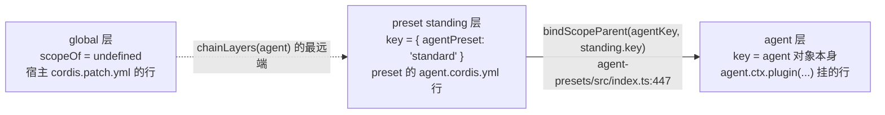

# 05 · 作用域与组合

> 上游:[第四章 · 第六节](../04-skills.md#第六节-作用域行为agent--preset-分层)、[第十章:Multi-Agent](../10-multi-agent.md)
> 主源码:`packages/core/scope/src/{index,store}.ts`、`packages/core/tools/src/index.ts:686-747,1120-1200`、[`packages/preset/agent-presets/src/index.ts`](https://github.com/deepseek-ai/deepseek-harness/blob/dbbaa4a37fb9098aba814c97d2956f7b2f105f46/packages/preset/agent-presets/src/index.ts)、`packages/bundle/*/cordis.patch.yml`、`packages/preset/agent-presets/presets/*/agent.cordis.yml`

---

## 1. 分层底座:`ScopedLayers`

两个注册表共用同一个容器([`packages/core/scope/src/store.ts:152-266`](https://github.com/deepseek-ai/deepseek-harness/blob/dbbaa4a37fb9098aba814c97d2956f7b2f105f46/packages/core/scope/src/store.ts#L152-L266))。读路径:

```typescript
// packages/core/scope/src/store.ts:159-199(节选)
  readonly global: L                                     // 构造期即建,就是 scope === undefined 的层
  private readonly scoped = new Map<ScopeKey, L>()

  /**
   * Read an existing exact-scope overlay. Deliberately chain-blind: callers
   * addressing one scope's OWN contributions (its restrictions, its guards)
   * must not silently pick up an ancestor's — use chainLayers where
   * inheritance is the point.
   */
  peek(scope: ScopeKey | undefined): L | undefined { ... }

  /** Existing overlays along the parent chain, farthest ancestor first and the exact scope last. */
  chainLayers(scope: ScopeKey | undefined): L[] {
    const layers: L[] = []
    for (const key of scopeChainOf(scope).reverse()) {
      const layer = this.scoped.get(key)
      if (layer !== undefined) layers.push(layer)        // 读不创造层
    }
    return layers
  }
```

三条规定:`global` 恒存在且最先建(`:169`);`chainLayers` 用 `get` 而非 `getOrCreate`,缺席的 scope 被跳过;**`peek` 与 `chainLayers` 是两种语义,不可互换**——前者是"这个 scope 自己的贡献"(链盲),后者是"它继承到的贡献"(链全)。skill 注册表只用 `chainLayers`,外加 `register()` 里的一次 `peek` 做同层同名检查;tools 注册表两者都用(§4)。

写路径:

```typescript
// packages/core/scope/src/store.ts:226-266(节选)
    const scope = scopeOf(ctx)
    const dispose = ctx.effect(function* (this: ScopedLayers<L>) {
      let layer: L; let created = false
      if (scope === undefined) { layer = this.global }
      else {
        const existing = this.scoped.get(scope)
        if (existing === undefined) { layer = this.createLayer(scope); this.scoped.set(scope, layer); created = true }
        else { layer = existing }
      }
      let undo: () => void
      try { undo = action(layer) }
      catch (error) {
        if (scope !== undefined && created && layer.isEmpty()) this.scoped.delete(scope)   // 失败补偿
        throw error
      }
      yield () => {
        undo()
        if (scope !== undefined && layer.isEmpty()) this.scoped.delete(scope)             // 空层回收
        if (notify) this.onChange()
      }
      if (notify) this.onChange()
    }.bind(this), options.label)
    return dispose
```

**同一段代码决定三件事**:落哪层(`scopeOf(ctx)`)、谁负责拆(`ctx.effect` 绑到该 fiber)、什么时候回收空层(`layer.isEmpty()`,即 `SkillLayer.isEmpty()`,[`skill/src/index.ts:340-342`](https://github.com/deepseek-ai/deepseek-harness/blob/dbbaa4a37fb9098aba814c97d2956f7b2f105f46/packages/skill/skill/src/index.ts#L340-L342))。注册失败时的补偿删除保证一次失败的插入不留空图层。skill 注册表给 `onChange` 传的是 `() => { this.invalidateCache() }`([`skill/src/index.ts:364`](https://github.com/deepseek-ai/deepseek-harness/blob/dbbaa4a37fb9098aba814c97d2956f7b2f105f46/packages/skill/skill/src/index.ts#L364))——**任何层的建立或拆除都让目录缓存整体失效**,因为"作用域结构变了"与"skill 内容变了"对读者而言都是"这次快照不可信"。### `this.ctx` 为什么等于调用方的 ctx

`registerProvider` 里写的是 `this.layers.effect(this.ctx, ...)`([`skill/src/index.ts:411`](https://github.com/deepseek-ai/deepseek-harness/blob/dbbaa4a37fb9098aba814c97d2956f7b2f105f46/packages/skill/skill/src/index.ts#L411)),而它的 JSDoc 说"into the calling context's layer"。两者能同时成立靠 Cordis 的 traceable service 代理:`Service` 构造时设 `tracker.property = 'ctx'`([`vendor/cordis/src/service.ts:46`](https://github.com/deepseek-ai/deepseek-harness/blob/dbbaa4a37fb9098aba814c97d2956f7b2f105f46/vendor/cordis/src/service.ts#L46)),代理的 `get` 处理里 `if (prop === tracker.property) return ctx`([`vendor/cordis/src/utils.ts:176`](https://github.com/deepseek-ai/deepseek-harness/blob/dbbaa4a37fb9098aba814c97d2956f7b2f105f46/vendor/cordis/src/utils.ts#L176))返回**发起这次调用的那个 ctx**,方法调用还会额外套一层 shadow([`utils.ts:194-196`](https://github.com/deepseek-ai/deepseek-harness/blob/dbbaa4a37fb9098aba814c97d2956f7b2f105f46/vendor/cordis/src/utils.ts#L194-L196))把 `this` 绑到该 ctx。于是:

| 调用点 | `scopeOf(this.ctx)` | 落层 |
|---|---|---|
| 宿主 profile 的行 / preset standing composition 的行 / agent 自己 `agent.ctx.plugin(...)` 挂的插件 | `undefined` / standing key / agent key | 全局层 / 该 preset 的层 / 该 agent 的层 |

一句话:**注册的落点由调用点决定,不由服务实例决定**。`SkillRegistry` 只有一个实例(宿主平面),但它服务所有层。

---

## 2. scope 链:agent → preset → 根

```typescript
// packages/core/scope/src/index.ts:98-102(节选)
/**
 * @param key - the starting key, or `undefined` for the empty chain.
 * @returns keys nearest-first: `[key, parent, grandparent, …]`.
 */
const chain: ScopeKey[] = []
for (let cursor = key; cursor !== undefined; cursor = scopeParents.get(cursor)) chain.push(cursor)
return chain
```

一个 scope key **只能被 bind 一次**(`bindScopeParent`,`:72-82`),此后只有拿到那次 bind 返回的 `ScopeParentBinding` 才能 `rebind`。preset 系统私有持有这张 binding([`packages/preset/agent-presets/src/index.ts:421`](https://github.com/deepseek-ai/deepseek-harness/blob/dbbaa4a37fb9098aba814c97d2956f7b2f105f46/packages/preset/agent-presets/src/index.ts#L421)),所以"把一个已组合的 agent 换到另一个 preset"只有编排层能做。



| key | 谁创建 | 代码 |
|---|---|---|
| 全局(`undefined`)/ preset standing(`{ agentPreset: '<id>' }`)/ agent(**实例自身**) | 不存在 / `AgentPresets.ensureStanding()` / Agent 工厂 | `ScopedLayers.global` 构造期即建;[`agent-presets/src/index.ts:792-793`](https://github.com/deepseek-ai/deepseek-harness/blob/dbbaa4a37fb9098aba814c97d2956f7b2f105f46/packages/preset/agent-presets/src/index.ts#L792-L793);`createScope(ctx, key)`(`tool-skill` 的 `scope: agent` 就是这个对象) |

"agent 就是自己的 scope key"是整条链上最省事的一个决定:不需要额外发号,agent 对象的身份天然唯一,`SkillViewOptions.scope` 直接吃 `Agent`([`skill/src/index.ts:116-119`](https://github.com/deepseek-ai/deepseek-harness/blob/dbbaa4a37fb9098aba814c97d2956f7b2f105f46/packages/skill/skill/src/index.ts#L116-L119))。`scopeChainOf(agent)` 返回 `[agent, standing]`(最近在前),`chainLayers` 再 `.reverse()` 成 `[standing, agent]`,于是:

```text
layers = [global, ...chainLayers(agent)] = [global, standing, agent]   ← 从远到近
merged.set(...) 按序覆写 → 近层赢
```

**注册表实例本身也在宿主平面**。[`packages/bundle/web-app/cordis.patch.yml:393-400`](https://github.com/deepseek-ai/deepseek-harness/blob/dbbaa4a37fb9098aba814c97d2956f7b2f105f46/packages/bundle/web-app/cordis.patch.yml#L393-L400) 把这条写成明文:`The \`skill\` REGISTRY stays in the host plane. It is host+per-scope layered (the tools-registry shape) ... only the per-agent rows move behind presets`。preset 不重挂注册表,只往它里面注册。

---

## 3. 层间遮蔽 vs 层内 rank

| 规则 | 实现 | 是否记日志 |
|---|---|---|
| 层间:近层无条件赢同名 | `collectFresh` 的 `merged.set` 覆写序([`skill/src/index.ts:562`](https://github.com/deepseek-ai/deepseek-harness/blob/dbbaa4a37fb9098aba814c97d2956f7b2f105f46/packages/skill/skill/src/index.ts#L562)) | 否(静默) |
| 层内:同 provider 同名 / 跨 provider 同名(`rank` 决定次序,[`:807-811`](https://github.com/deepseek-ai/deepseek-harness/blob/dbbaa4a37fb9098aba814c97d2956f7b2f105f46/packages/skill/skill/src/index.ts#L807-L811)) | 排序后 first-wins(`collectLayer`,[`:569-580`](https://github.com/deepseek-ai/deepseek-harness/blob/dbbaa4a37fb9098aba814c97d2956f7b2f105f46/packages/skill/skill/src/index.ts#L569-L580)) | 是,warn |
| 层内:`register()` 同名 | `peek` 检查 + 空 disposer([`:443-446`](https://github.com/deepseek-ai/deepseek-harness/blob/dbbaa4a37fb9098aba814c97d2956f7b2f105f46/packages/skill/skill/src/index.ts#L443-L446)) | 是,warn |

一组具体推演。假设 `standard` preset 层的 provider 返回 rank 100 的 `foo`,全局层有 rank 600 的 `foo`:

| 视角 | 结果 |
|---|---|
| `snapshot({ scope: agentOnStandard })` | `foo` = standard 层那一个(近层遮蔽) |
| `snapshot({})`(省略 scope) | `foo` = 全局层那一个 |

两者可以**同时存在且互不可见**。测试 [`skill.spec.ts:1110`](https://github.com/deepseek-ai/deepseek-harness/blob/dbbaa4a37fb9098aba814c97d2956f7b2f105f46/packages/skill/skill/tests/skill.spec.ts#L1110)("files a scoped provider into its layer and merges it into that scope view only")与 [`:1142`](https://github.com/deepseek-ai/deepseek-harness/blob/dbbaa4a37fb9098aba814c97d2956f7b2f105f46/packages/skill/skill/tests/skill.spec.ts#L1142)("lets the nearest layer win a duplicate name regardless of rank")分别固定这两条。

`rank` 的数值没有跨层含义。这正是 [01](./01-skill-format-and-discovery.md#3-六档发现根真实路径与优先级) 那张表被限定在"同一 provider、同一层"语境下的原因:六档根全部来自同一个注册在某一层里的 `filesystem` provider 实例,它们的相对次序才由 rank 决定。若某个 preset 层也注册了一个 `filesystem` provider,两个实例在同层内不相遇(不同层),层间由近层遮蔽决定,rank 依然只在各自层内起作用。

---

## 4. 与 tools 注册表的同构对比

```typescript
// packages/core/tools/src/index.ts:708-736(节选)
  readonly tools: NamedEntries<ToolDefinition>
  readonly restrictions = new AnonymousEntries<CompiledToolRestriction>()
  readonly guards = new AnonymousEntries<ToolGuard>()
  /** Presentation this scope's agent declared for itself, shadowing the deployment default. */
  mode: ToolPresentationMode | undefined
  isEmpty(): boolean {
    return this.tools.isEmpty() && this.restrictions.isEmpty() && this.guards.isEmpty() && this.mode === undefined
  }
  /** Whether every compiled restriction in this layer admits a global tool name. */
  admits(name: string): boolean {
    for (const filter of this.restrictions.values()) {
      if ((filter.allow !== undefined && !filter.allow.has(name)) || (filter.deny !== undefined && filter.deny.has(name))) return false
    }
    return true
  }
```

| 维度 | `SkillRegistry` | `ToolRuntime` |
|---|---|---|
| 层容器 / 合并原语 | `ScopedLayers<SkillLayer>`([`skill/src/index.ts:362`](https://github.com/deepseek-ai/deepseek-harness/blob/dbbaa4a37fb9098aba814c97d2956f7b2f105f46/packages/skill/skill/src/index.ts#L362)) | `ScopedLayers<ToolLayer>`([`tools/src/index.ts:804`](https://github.com/deepseek-ai/deepseek-harness/blob/dbbaa4a37fb9098aba814c97d2956f7b2f105f46/packages/core/tools/src/index.ts#L804)),同一份 `ScopedLayers` 代码 |
| 层间遮蔽 | 近层同名无条件赢 | 近层同名无条件赢 |
| 层内条目表 | `providers: NamedEntries<RegisteredProvider>` + `runtime: Map` | `tools: NamedEntries<ToolDefinition>` |
| **层内同名冲突** | provider 名冲突抛错;skill 名冲突按 rank 裁决 first-wins + warn | **工具名冲突直接抛错**([`:719-721`](https://github.com/deepseek-ai/deepseek-harness/blob/dbbaa4a37fb9098aba814c97d2956f7b2f105f46/packages/core/tools/src/index.ts#L719-L721)) |
| 层内额外语义与 API | 无;`registerProvider` / `register` | `restrictions`(过滤继承面)、`guards`(单调拒绝)、`mode`(单一格);`register` / `restrict` / `guard` / `presentAs` |
| 预留名 / 读路径 | provider 名 `runtime`([`skill/src/index.ts:406`](https://github.com/deepseek-ai/deepseek-harness/blob/dbbaa4a37fb9098aba814c97d2956f7b2f105f46/packages/skill/skill/src/index.ts#L406));`collect()`(rev 缓存)→ `snapshot()` | 工具名 `run_code`([`tools/src/index.ts:1045`](https://github.com/deepseek-ai/deepseek-harness/blob/dbbaa4a37fb9098aba814c97d2956f7b2f105f46/packages/core/tools/src/index.ts#L1045));`view(scope)`(每次遍历,无缓存,[`:1142`](https://github.com/deepseek-ai/deepseek-harness/blob/dbbaa4a37fb9098aba814c97d2956f7b2f105f46/packages/core/tools/src/index.ts#L1142)) |
| **继承面的过滤** | **无**——策略由消费者在边界执行 | `layers.every(layer => layer.admits(name))`([`:1164`](https://github.com/deepseek-ai/deepseek-harness/blob/dbbaa4a37fb9098aba814c97d2956f7b2f105f46/packages/core/tools/src/index.ts#L1164)) |
| 作用域自己的注册是否受过滤 | 不适用 | **豁免**(`own` 层不参与 restriction) |

### 两条真正的不对称及理由

**不对称一:同名冲突。** tools 的名字是模型可见的一等标识符,撞名会让模型无法区分,所以同层直接拒绝注册。skills 的名字在不同来源间天然可能重复(两个部署根各放一份 `dsh-doc`),所以引入 `rank` 让多源同名有个确定胜负,并以 warn 记录落败者。`SkillCandidate.rank` 的 JSDoc 直接写着这个用途([`skill/src/index.ts:78`](https://github.com/deepseek-ai/deepseek-harness/blob/dbbaa4a37fb9098aba814c97d2956f7b2f105f46/packages/skill/skill/src/index.ts#L78):"Lower ranks win duplicate skill names **before provider registration order** is considered")。

**不对称二:是否有继承面过滤。**

```typescript
// packages/core/tools/src/index.ts:1127-1172(节选)
   * A restriction filters what a scope inherits — the global layer and every
   * ancestor layer on its chain — and never what its OWN layer registers.
   * That exemption is what a per-child capability filter has to keep intact:
   * the delegation runtime registers a child's structured-output tool into the
   * child's own layer, and a filter naming the capabilities the child may use
   * must not strip the machinery it answers through.
    const layers = this.layers.chainLayers(scope)
    // Chain-blind on purpose: this is the ONE layer whose registrations the
    // scope owns rather than inherits, and it is absent until the scope contributes something.
    const own = this.layers.peek(scope)
    const inherited = new Map<string, ToolDefinition>(this.layers.global.tools.entries())
    for (const layer of layers) {
      if (layer === own) continue
      for (const [name, definition] of layer.tools.entries()) inherited.set(name, definition)
    }
    if (layers.every(layer => layer.admits(name))) visible.set(name, definition)
    if (own !== undefined) for (const [n, d] of own.tools.entries()) visible.set(n, d)   // 绕过滤
```

skills 侧完全没有对应机制。这不是缺失,而是两个注册表的**消费者不同**:工具是可执行的,子 agent 的能力收窄必须在执行前生效,过滤必须发生在注册表读路径上;skill 只是指令文本,收窄发生在消费边界——`tool-skill` 的 `ctx.tools.get(skillTool.name, agent) === skillTool` 就是它的收窄机制,**用 tools 的 restriction 去关掉 skill 的入口**(见 [03 §7](./03-catalog-and-loading.md#7-目录-digest-与工具可见性的绑定))。skill 注册表保持策略中立:Agent Note [`2026-07-28-skill-invocation-policy.md:40`](https://github.com/deepseek-ai/deepseek-harness/blob/dbbaa4a37fb9098aba814c97d2956f7b2f105f46/.agents/notes/implemented/feature/2026-07-28-skill-invocation-policy.md#L40) 明确拒绝"在 `ctx.skills.get()` 里执行 invocation 策略",理由是 `get()` 无法知道调用方是模型工具、人类命令还是受信编排。

一个后果:若部署想收窄的是**目录内容**而不是工具可见性,当前没有内建手段,只能靠"给子 agent 换 preset / 换层"这类结构手段。这属于 [第十章 Multi-Agent](../10-multi-agent.md) 的编排范畴。

---

## 5. preset 挂载 provider:真实 yml 片段

### 5.1 宿主平面四行与 web profile 的覆盖

```yaml
# packages/bundle/base/cordis.patch.yml:273-284
    - id: skill
      name: '@deepseek-ai/dsh-skill'
    - id: skill-filesystem
      name: '@deepseek-ai/dsh-skill-filesystem'
    - id: skill-badge
      name: '@deepseek-ai/dsh-skill-badge'
      disabled: true
    - id: tool-skill
      name: '@deepseek-ai/dsh-tool-skill'
```

四行就是能力缝三角色:Service Definition(`skill`)、Provider(`skill-filesystem`、`skill-badge`)、Consumer(`tool-skill`)。

```yaml
# packages/bundle/web-app/cordis.patch.yml:393-406(注释节选)
# The `skill` REGISTRY stays in the host plane. It is host+per-scope layered
# (the tools-registry shape): deployment-level providers — repository plugins,
# a host skill-filesystem row — register into its global layer, while a preset's
# `skill-filesystem` registers into that preset's layer, and each agent reads the
# merged catalog its scope chain selects. Only the per-agent rows move behind
# presets: the base host `skill-filesystem` row is disabled here (presets own local
# discovery), and `tool-skill` is what a preset mounts to give its agent the
# catalog and loader at all.

- id: skill-filesystem
  disabled: true
- id: tool-skill
  disabled: true
```

这是**同一份 patch 层的覆盖**:base 的 `id` 在 web-app 层被 `disabled: true` 关掉。`skill` 注册表行不动——它必须在宿主平面,因为 preset 是"每个会话一个"的,而注册表是跨会话共享的分层容器。

### 5.2 preset 层:standard / ptc / cordis

```yaml
# packages/preset/agent-presets/presets/standard/agent.cordis.yml:77-88
# ── skills ──────────────────────────────────────────────────────────────────
# The skill REGISTRY lives in the host composition and is layered per scope:
# these rows register into THIS preset's layer of it, so they need no realm.
# `skill-filesystem` contributes local-root discovery for agents on this preset, and
# `tool-skill` gives them the catalog and loader; the merged catalog also
# carries whatever the deployment registered globally (repository plugins).
- id: skill-filesystem
  name: '@deepseek-ai/dsh-skill-filesystem'
- id: tool-skill
  name: '@deepseek-ai/dsh-tool-skill'
```

`ptc` preset 是**逐字相同**的两行([`presets/ptc/agent.cordis.yml:84-95`](https://github.com/deepseek-ai/deepseek-harness/blob/dbbaa4a37fb9098aba814c97d2956f7b2f105f46/packages/preset/agent-presets/presets/ptc/agent.cordis.yml#L84-L95))。两个 preset 各有一份独立的 `filesystem` provider 实例,provider 名都是默认的 `filesystem`,但因为落在**不同的层**,不冲突。

```yaml
# packages/preset/agent-presets/presets/cordis/agent.cordis.yml:249-263
# The composition-authoring skill travels with this preset rather than living
# in the user's skill root: it documents THIS deployment's two planes, and a
# preset is the unit that gets copied and edited. `baseUrl` is the preset's
# own directory, so the root resolves wherever the preset is installed.
- id: skill-filesystem
  name: '@deepseek-ai/dsh-skill-filesystem'
  config:
    customSkillDirs:
      - !!js "process.getBuiltinModule('node:url').fileURLToPath(new URL('skills/', baseUrl))"
- id: tool-skill
  name: '@deepseek-ai/dsh-tool-skill'
```

三个可学的模式:

1. **`!!js` 只允许出现在 plugin `config` 下**(根 [`AGENTS.md`](https://github.com/deepseek-ai/deepseek-harness/blob/dbbaa4a37fb9098aba814c97d2956f7b2f105f46/AGENTS.md) 的 Secrets 段)。`baseUrl` 是 Loader 提供给该 entry 的 preset 目录,所以 `new URL('skills/', baseUrl)` 在 preset 被复制到任何位置后仍解析正确——**不写死路径**。
2. **用 `customSkillDirs`(rank 300)而不是 `bundledSkillDir`(rank 600)**:这两个 skill 是 preset 的一部分,应参与正常的本地优先级(项目根里的同名 skill 可以覆盖它),而不是最高信任的打包根。
3. **skill 文件与 preset 同包出货**:`presets/cordis/skills/{cordis-plugin-development,editing-cordis-compositions}/SKILL.md`。preset 是"被复制和编辑的单位",skill 跟着走。

---

## 6. agent 读到的合并视图

以 web profile 下跑 `standard` preset 的 agent 为例,逐层展开 `snapshot({ cwd, scope: agent })`:

```text
layers = [global, standing(standard), agent]

global 层      providers: (空)   ← web-app patch 关掉了宿主 skill-filesystem;skill-badge 默认 disabled
standing 层    providers: { 'filesystem' → FileSystemSkillProvider#1 }
               六个根: .dsh/skills(100) .agents/skills(200) custom(300)
                       ~/.dsh/skills(400) ~/.agents/skills(500) bundled?(600,未配置)
agent 层       providers: (空)   ← 没有 agent.ctx.plugin 挂 skill provider

merged = global ⊕ standard ⊕ agent = standard 的六个根扫出的候选,按 rank 去重后按名称码点排序
```

换成 `cordis` preset,preset 层多出**一个 `filesystem` provider 实例**(`customSkillDirs` 指向 preset 自带目录),它在同一层内的 `providerOrder` 更大,于是同名 skill 在 preset 自带目录与用户 `~/.agents/skills` 之间由 **rank** 裁决:preset 目录是 `custom`(300),赢过 `user-agents`(500);`cordis-plugin-development` 与 `editing-cordis-compositions` 只在这一个 preset 的 agent 目录里出现,不影响其他 preset。

换成 CLI/headless profile(不套 preset),`agent` 与其 preset 层都不存在,`chainLayers` 返回空 → **只读全局层**,而全局层的 `skill-filesystem` 是启用的。这是 [01](./01-skill-format-and-discovery.md) 与 [02](./02-provider-registry.md) 里所有"默认行为"的语境。

`tool-skill` 的两条查询正好落在两个不同的作用域维度上:

| 查询 | 代码 | 作用域维度 |
|---|---|---|
| `ctx.skills.snapshot({ cwd, signal, scope: agent })` | [`tool-skill/src/index.ts:222`](https://github.com/deepseek-ai/deepseek-harness/blob/dbbaa4a37fb9098aba814c97d2956f7b2f105f46/packages/skill/tool-skill/src/index.ts#L222) | skill 注册表的**层选择** |
| `ctx.tools.get(skillTool.name, agent)` | [`tool-skill/src/index.ts:220`](https://github.com/deepseek-ai/deepseek-harness/blob/dbbaa4a37fb9098aba814c97d2956f7b2f105f46/packages/skill/tool-skill/src/index.ts#L220) | tools 注册表的**可见性判定**(含 restriction) |

两者必须同时成立:目录既要有内容,工具也要真的能被这个 agent 调用。

---

## 7. 子 agent 继承规则

子 agent 的能力继承**不是**"复制父 agent 的注册表",而是**加入同一个 standing composition**:

```typescript
// packages/preset/agent-presets/src/index.ts:470-485(节选)
   * A parent that joined no preset — a rosterless deployment — yields no join
   * and no error: there, the model-facing rows sit in the host composition and
   * the child already sees them through the global layer.
  composeFrom(agentCtx: Context, parentCtx: Context): string | undefined {
    const agentKey = scopeOf(agentCtx)
    if (agentKey === undefined) {
      throw new Error('agent-presets: refusing to compose an unscoped context; the scope key is what joins an agent to its preset')
    }
    const standing = standingMountFor(parentCtx)
    if (standing === undefined) return undefined
    this.bindings.set(agentKey, bindScopeParent(agentKey, standing.key))
    return standing.presetId
  }
```

`:454-461` 的注释说明了为什么是 bind 而不是重新 mount:`It is a bind, not a mount: the parent's generation is already composed, so the child gets that exact instance — the same plugin objects, the same tool registrations, the same prompt sections. Re-resolving the parent's preset by id instead would re-read the roster, and a composition file edited since the parent started would hand the child a DIFFERENT generation than the one its parent's history was produced under`。对 skills 的直接后果:

| 场景 | 子 agent 看到的 skill 目录 |
|---|---|
| 父 agent 跑 `standard` preset / 部署无 preset(rosterless) / 父 agent 没有 scope key | `composeFrom` 把子 key 绑到**同一个** standing key → 子看到与父**同一个** `filesystem` provider 实例的目录 / `standingMountFor` 返回 `undefined` → 不绑、不报错 → 子从**全局层**看到宿主 composition 的行 / 抛错(程序错误,不是降级) |

三个推论:

1. **preset 里的 `tool-skill` 实例同时服务父子 agent**。目录按 agent 计算(`scope: agent`),但 provider 实例、watcher 句柄、`filesystem` 的六个根都是共享的。所以子 agent 改磁盘上的 skill 会同时影响父 agent 的下一次快照——这是共享 composition 的应有语义。
2. **子 agent 不会重新读 preset 文件**。`composeFrom` 是同步的、"no composition failure mode of its own — it reads no roster, mounts nothing, and touches no file"。因此"父 agent 启动后有人编辑了 preset 文件"不会让子 agent 拿到一个不同的 generation。
3. **子 agent 可以有自己的层**。若某插件通过 `agent.ctx.plugin(...)` 给子 agent 注册 skill provider,那份贡献落在子 agent 自己的层,父 agent 看不到。这与 tools 的 `delegation runtime registers a child's structured-output tool into the child's own layer`([`tools/src/index.ts:1130-1131`](https://github.com/deepseek-ai/deepseek-harness/blob/dbbaa4a37fb9098aba814c97d2956f7b2f105f46/packages/core/tools/src/index.ts#L1130-L1131))是同一模式。

**继承不做收窄**:`composeFrom` 只建父子链,没有"给子 agent 一份减配目录"的 API。若子 agent 需要更窄的 skill 面,当前手段是给它一个不同的 preset 或不同的 composition;对能力收窄则应走 tools 的 restriction(它会让 `skill` 工具本身不可见,进而让目录退场)。

`standingKeyFor`([`:763-766`](https://github.com/deepseek-ai/deepseek-harness/blob/dbbaa4a37fb9098aba814c97d2956f7b2f105f46/packages/core/tools/src/index.ts#L763-L766))是**冷读**版本的同一件事:它保证 preset 的 standing composition 已挂载并返回其 scope key,但"starts no agent, no session, and no turn"。`packages/api/session-controller/src/skill-catalog.ts:75,102` 正是用它给未激活的会话解析 scope([04 §7](./04-watcher-and-invalidation.md#7-冷会话目录sessionskillcatalog))。### preset generation 的失效

`ensureStanding`([`:769-817`](https://github.com/deepseek-ai/deepseek-harness/blob/dbbaa4a37fb9098aba814c97d2956f7b2f105f46/packages/core/tools/src/index.ts#L769-L817))对已挂载的 preset 做一次 `compositionStamp(preset.path)` 比对(`mtimeMs` + `size`,[`:820-824`](https://github.com/deepseek-ai/deepseek-harness/blob/dbbaa4a37fb9098aba814c97d2956f7b2f105f46/packages/core/tools/src/index.ts#L820-L824)):变了就丢弃当前 generation 并在下一次挂载时重建。代码里留了一条明确的 TODO:

```typescript
// packages/preset/agent-presets/src/index.ts:780-785
      // TODO: reclaim the superseded generation once the last agent joined to
      // it is gone. The subtree is not inert — `dsh-skill-filesystem` watches its
      // roots — and the settings-page authoring flow turns "a composition
      // changed" into a per-save event. This needs a joined-agent count on
      // StandingMount, incremented in `mount`/`composeFrom`/`recompose` and
      // decremented when the agent's scope key dies.
```

对 skills 而言,"这是活的"具体意味着:被取代的 generation 里那个 `filesystem` provider 的 chokidar 句柄**仍在监视**([04 §2](./04-watcher-and-invalidation.md#2-chokidar-配置每一项的理由) 的 `persistent: true`)。这是当前实现的一处已知代价。

---

## 8. bundled skills 的四种出货方式

| 方式 | 机制 | 真实位置 | 默认是否启用 |
|---|---|---|---|
| **A. 项目自带** | rank 200 的项目根 | `<projectRoot>/.agents/skills/`,本仓库 12 个 skill | ✅ 有 cwd 即启用 |
| **B. preset 自带** | `customSkillDirs`(rank 300),`!!js` + `baseUrl` 解析 | `packages/preset/agent-presets/presets/cordis/skills/` | ✅ 挂该 preset 即启用 |
| **C. 打包资产 provider** | 独立 provider 实现,rank 600 | `packages/skill/skill-badge/{src/index.ts,assets/dsh-badge.md}` | ❌ 行上 `disabled: true` |
| **D. 部署 bundled 根** | `bundledSkillDir` / `$DSH_BUNDLED_SKILL_DIR`,rank 600,`trustedHost` | 由部署方提供目录 | ❌ 出货 profile 不设该变量 |
A/B 都是普通目录,差别只在根与 rank:A 依赖 cwd 里有 `.git`,B 依赖 preset 目录布局,后者的 `!!js` 表达式是**唯一**能让随包发布的路径在任意安装位置正确解析的手段([`presets/cordis/agent.cordis.yml:260`](https://github.com/deepseek-ai/deepseek-harness/blob/dbbaa4a37fb9098aba814c97d2956f7b2f105f46/packages/preset/agent-presets/presets/cordis/agent.cordis.yml#L260))。

### C:`dsh-skill-badge` —— 最小打包 provider

```typescript
// packages/skill/skill-badge/src/index.ts:17-49(节选)
const SKILL_BODY_URL = new URL('../assets/dsh-badge.md', import.meta.url)
const RESOURCE_BASE = { kind: 'directory', path: fileURLToPath(new URL('../assets/', import.meta.url)) } as const
const CANDIDATE: SkillCandidate = {
  name: 'dsh-badge', description: DESCRIPTION, invocation: INVOCATION,
  provider: PROVIDER_NAME, source: 'bundled', resourceBase: RESOURCE_BASE,
  rank: BUNDLED_SKILL_RANK,
  locator: SKILL_BODY_URL,                       // locator 是一个 URL,不是路径
}

const provider: SkillProvider = {
  name: PROVIDER_NAME,
  list: () => Promise.resolve([CANDIDATE]),
  async get(_candidate): Promise<SkillDefinition> {
    return { ..., content: await readFile(SKILL_BODY_URL, 'utf8') }
  },
}

/** Register the bundled `dsh-badge` provider on `ctx.skills`. */
export function apply(ctx: Context): void {
  ctx.skills.registerProvider(() => provider)
}
```

这 60 行说明三件事:

1. **`SkillProvider` 契约小到一个对象两个字面量方法**。`list()` 返回常量数组,`get()` 用 `import.meta.url` 定位打包资产。远程 registry 型 provider 面对的是同一份契约,只是把这两处换成网络调用。
2. **`locator` 的类型完全自由**。这里是 `URL`;文件系统 provider 是 `{ path, directory }`。注册表只存不解释([`skill/src/index.ts:80-81`](https://github.com/deepseek-ai/deepseek-harness/blob/dbbaa4a37fb9098aba814c97d2956f7b2f105f46/packages/skill/skill/src/index.ts#L80-L81))。
3. **出货 = 一行 disabled 的插件行 + 包内资产**。[`packages/bundle/base/cordis.patch.yml:279-281`](https://github.com/deepseek-ai/deepseek-harness/blob/dbbaa4a37fb9098aba814c97d2956f7b2f105f46/packages/bundle/base/cordis.patch.yml#L279-L281) 的 `disabled: true` 让它成为**显式 opt-in**([`docs/subsystems/skills.md:79`](https://github.com/deepseek-ai/deepseek-harness/blob/dbbaa4a37fb9098aba814c97d2956f7b2f105f46/docs/subsystems/skills.md#L79))。依赖声明在 [`packages/bundle/base/package.json:82`](https://github.com/deepseek-ai/deepseek-harness/blob/dbbaa4a37fb9098aba814c97d2956f7b2f105f46/packages/bundle/base/package.json#L82),工程注册在 [`tsconfig.base.json:386`](https://github.com/deepseek-ai/deepseek-harness/blob/dbbaa4a37fb9098aba814c97d2956f7b2f105f46/tsconfig.base.json#L386) 与 [`tsconfig.host.json:234`](https://github.com/deepseek-ai/deepseek-harness/blob/dbbaa4a37fb9098aba814c97d2956f7b2f105f46/tsconfig.host.json#L234)。

### D:`bundledSkillDir` 的现状

```typescript
// packages/skill/skill-filesystem/src/index.ts:172-177(节选)
    // The environment bundled root is a default root: an isolated provider
    // must see only its explicit roots, or every such provider would
    // re-discover the app's bundled skills under its own provider name.
    const bundledSkillDir = config.bundledSkillDir
      ?? (this.includeDefaultRoots ? process.env.DSH_BUNDLED_SKILL_DIR : undefined)
    this.bundledSkillDir = bundledSkillDir === undefined ? undefined : resolve(bundledSkillDir)
```

语义是"部署方提供的**受信** skill 目录":rank 600、`trustedHost: true` 让它的读取绕过 `ctx.fs` 直接走宿主机 I/O([01 §4.2](./01-skill-format-and-discovery.md#42-列目录两条读取轨))。

仓库现状:`$DSH_BUNDLED_SKILL_DIR` **只有测试在设**([`apps/web/tests/scaffold.ts:474`](https://github.com/deepseek-ai/deepseek-harness/blob/dbbaa4a37fb9098aba814c97d2956f7b2f105f46/apps/web/tests/scaffold.ts#L474)、[`scaffold-hermetic.e2e.ts:38`](https://github.com/deepseek-ai/deepseek-harness/blob/dbbaa4a37fb9098aba814c97d2956f7b2f105f46/apps/web/tests/scaffold-hermetic.e2e.ts#L38)),没有任何出货 profile 设置它。所以默认部署下 rank 600 档是空的,打包 skill 实际走 C(显式 opt-in 的 provider)与 B(preset 自带目录)两条路。[`skill-filesystem/README.md:56`](https://github.com/deepseek-ai/deepseek-harness/blob/dbbaa4a37fb9098aba814c97d2956f7b2f105f46/packages/skill/skill-filesystem/README.md#L56) 的表述是"`bundledSkillDir` adds a bundled root at rank 600 **when configured**"。

### 一个副作用:同名 skill 的可见性随 profile 变化

因为 A/B/C/D 的启用条件各不相同,同一个 skill 名在不同 profile 下的归属会不同。以 `dsh-badge` 为例:默认部署下模型看不到它(行 disabled);把该行打开后它以 rank 600 参与裁决——在项目根(`.agents/skills/`)里放一个同名 skill 就能以 rank 200 覆盖它。这就是 rank 跨源裁决存在的意义:**打包内容不享有特权,它只是优先级最低的一档**。

---

## 9. 关键文件 / 符号索引表

| 位置 | 符号 | 作用 |
|---|---|---|
| [`core/scope/src/store.ts:30-150`](https://github.com/deepseek-ai/deepseek-harness/blob/dbbaa4a37fb9098aba814c97d2956f7b2f105f46/packages/core/scope/src/store.ts#L30-L150) | `NamedEntries` / `AnonymousEntries` | 插入序命名表(同名抛错 + 幂等 undo)与匿名追加表 |
| [`core/scope/src/store.ts:159-266`](https://github.com/deepseek-ai/deepseek-harness/blob/dbbaa4a37fb9098aba814c97d2956f7b2f105f46/packages/core/scope/src/store.ts#L159-L266) | `ScopedLayers` / `peek` / `chainLayers` / `merge` / `effect` | 分层容器、读两种语义、效果所有权与空层回收 |
| [`core/scope/src/index.ts:39-185`](https://github.com/deepseek-ai/deepseek-harness/blob/dbbaa4a37fb9098aba814c97d2956f7b2f105f46/packages/core/scope/src/index.ts#L39-L185) | `scopeParents` / `bindScopeParent` / `scopeParentOf` / `scopeChainOf` / `createScope` / `scopeOf` / `scopeTarget` | 父子链、一次性绑定、scope key 制造读取、事件向上准入 |
| [`vendor/cordis/src/service.ts:42-59`](https://github.com/deepseek-ai/deepseek-harness/blob/dbbaa4a37fb9098aba814c97d2956f7b2f105f46/vendor/cordis/src/service.ts#L42-L59) / [`utils.ts:173-199`](https://github.com/deepseek-ai/deepseek-harness/blob/dbbaa4a37fb9098aba814c97d2956f7b2f105f46/vendor/cordis/src/utils.ts#L173-L199) | `Service` 构造 / `createTraceable` | `tracker.property = 'ctx'` 与 `service.ctx` 解析为调用方 ctx |
| [`core/tools/src/index.ts:686-747`](https://github.com/deepseek-ai/deepseek-harness/blob/dbbaa4a37fb9098aba814c97d2956f7b2f105f46/packages/core/tools/src/index.ts#L686-L747) | `ToolView` / `ToolLayer` / `admits` / `guardReason` | 同构对照的另一半 |
| `core/tools/src/index.ts:1027-1050,1120-1183` | `register()` / `view()` | 同名直接拒绝、`run_code` 预留、继承面过滤与 own 层豁免 |
| `skill/src/index.ts:327-343,362-364` | `SkillLayer` / `ScopedLayers` 构造 | provider 表 + runtime 表 + 每层唯一性;`onChange` = 整体失效 |
| `skill/src/index.ts:390-428,551-565` | `registerProvider()` / `collectFresh()` | 调用方 ctx 落层点与 `[global, ...chainLayers]` 合并序 |
| [`preset/agent-presets/src/index.ts:420-499`](https://github.com/deepseek-ai/deepseek-harness/blob/dbbaa4a37fb9098aba814c97d2956f7b2f105f46/packages/preset/agent-presets/src/index.ts#L420-L499) | `bindings` / `mount()` / `composeFrom()` / `composedPreset()` | agent key 绑到 preset standing key;**子 agent 继承**的唯一入口 |
| [`preset/agent-presets/src/index.ts:755-824`](https://github.com/deepseek-ai/deepseek-harness/blob/dbbaa4a37fb9098aba814c97d2956f7b2f105f46/packages/preset/agent-presets/src/index.ts#L755-L824) | `standingKeyFor` / `ensureStanding` / `CompositionStamp` | 冷读 scope key + generation stamp 失效 |
| [`bundle/base/cordis.patch.yml:273-284`](https://github.com/deepseek-ai/deepseek-harness/blob/dbbaa4a37fb9098aba814c97d2956f7b2f105f46/packages/bundle/base/cordis.patch.yml#L273-L284) / [`web-app/cordis.patch.yml:393-406`](https://github.com/deepseek-ai/deepseek-harness/blob/dbbaa4a37fb9098aba814c97d2956f7b2f105f46/packages/bundle/web-app/cordis.patch.yml#L393-L406) | 四行组合与覆盖行 | registry 留宿主,provider 与 consumer 下放 preset |
| `preset/agent-presets/presets/{standard,ptc}/agent.cordis.yml` / [`presets/cordis/agent.cordis.yml:249-263`](https://github.com/deepseek-ai/deepseek-harness/blob/dbbaa4a37fb9098aba814c97d2956f7b2f105f46/packages/preset/agent-presets/presets/cordis/agent.cordis.yml#L249-L263) + `presets/cordis/skills/` | skill 两组行 / `customSkillDirs` + `!!js` | preset 层挂载样本与 preset 自带 skill 的配置、实体 |
| [`skill/skill-badge/src/index.ts`](https://github.com/deepseek-ai/deepseek-harness/blob/dbbaa4a37fb9098aba814c97d2956f7b2f105f46/packages/skill/skill-badge/src/index.ts) + [`assets/dsh-badge.md`](https://github.com/deepseek-ai/deepseek-harness/blob/dbbaa4a37fb9098aba814c97d2956f7b2f105f46/packages/skill/skill-badge/assets/dsh-badge.md) | 全部 60 行 | 最小打包 provider 样本与正文资产 |
| [`apps/web/tests/scaffold.ts:474`](https://github.com/deepseek-ai/deepseek-harness/blob/dbbaa4a37fb9098aba814c97d2956f7b2f105f46/apps/web/tests/scaffold.ts#L474) | `DSH_BUNDLED_SKILL_DIR` | 该环境变量在仓库中的唯一设置点 |
