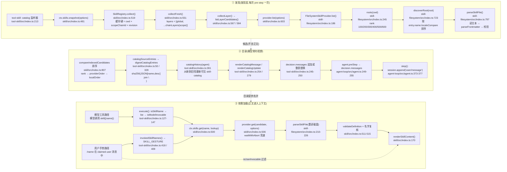

# Skills 模块 · 深度展开文档集

> 分析对象:[deepseek-ai/deepseek-harness](https://github.com/deepseek-ai/deepseek-harness) @ `dbbaa4a37`
> 上游章节:[第四章:Skills 的技术实现与运行方式](../04-skills.md)
> 代码面:`packages/skill/`(registry / filesystem provider / badge provider / tool-skill consumer)、[`packages/api/session-controller/src/skill-catalog.ts`](https://github.com/deepseek-ai/deepseek-harness/blob/dbbaa4a37fb9098aba814c97d2956f7b2f105f46/packages/api/session-controller/src/skill-catalog.ts)、`packages/client/ui-skill/`

---

## 主题覆盖对照

| 主题 | 第四章(总览) | 本目录(展开) |
|---|---|---|
| skill 的定位 | "提示级能力缝,不是工具" + 三角色分离 | 不重复;01 直接进入契约逐字段 |
| frontmatter 字段 | 一张 6 行字段表 + 三个边界决策 | [01](./01-skill-format-and-discovery.md):`parseSkillFile` 逐分支走查、布尔文法穷举、降级矩阵 |
| 六档发现根与 rank | 一张表 + 一句"小的赢" | [01](./01-skill-format-and-discovery.md):`roots()` 构造顺序、`skipSystem`/`trustedHost` 的差异、根存在性探测 |
| provider 注册 | `registerProvider` 的三段要点 | [02](./02-provider-registry.md):`control.invalidate()` 的身份守卫、`layers.effect` 落层、dispose 链 |
| 合并裁决 | 引用 `compareIndexedCandidates` 三行 | [02](./02-provider-registry.md):三个排序键的来源、`collectLayer` 去重循环、`rev` 缓存键与重试 |
| 目录注入 | `agent/pre-step` 伪代码 + digest 三种分支 | [03](./03-catalog-and-loading.md):四道闸门、`catalogHistory` 的 surface 可见性判定、整表替换的四个 return 分支 |
| `renderSkillContent` | 贴出实现 | [03](./03-catalog-and-loading.md):`renderResourceHint` 四种 hint 的逐字文案与转义规则 |
| watcher | 两路失效输入的一句话概述 | [04](./04-watcher-and-invalidation.md):chokidar 全配置项、`resolveRootWatchMode` 的两态机、事件过滤谓词逐行 |
| 冷会话目录 | 一段列举 | [04](./04-watcher-and-invalidation.md):`SessionSkillCatalog` 的三级回退、`ui-skill` 的会话级缓存与单飞 |
| 作用域 | 5 条列举 | [05](./05-scope-and-composition.md):与 tools 注册表的同构对比表、真实 yml 片段、子 agent 继承链 |

---

## 模块索引

| 文档 | 覆盖范围 | 主源码 |
|---|---|---|
| [01 · SKILL.md 契约与发现](./01-skill-format-and-discovery.md) | frontmatter 全字段与校验、两种物理形态、六档发现根与 rank、`list`/`read` 走查、错误降级语义 | [`packages/skill/skill-filesystem/src/index.ts`](https://github.com/deepseek-ai/deepseek-harness/blob/dbbaa4a37fb9098aba814c97d2956f7b2f105f46/packages/skill/skill-filesystem/src/index.ts) |
| [02 · Provider Registry](./02-provider-registry.md) | provider 注册与层归属、层间遮蔽与层内三级裁决、rev 缓存与失效、`get()` 校验闸门、运行时注册与 dispose | [`packages/skill/skill/src/index.ts`](https://github.com/deepseek-ai/deepseek-harness/blob/dbbaa4a37fb9098aba814c97d2956f7b2f105f46/packages/skill/skill/src/index.ts) |
| [03 · 目录与按需加载](./03-catalog-and-loading.md) | 会话目录构造、pre-step 注入路径、`skill` 工具四道闸门、渲染契约、`/name` 手势、digest 与工具可见性绑定 | [`packages/skill/tool-skill/src/index.ts`](https://github.com/deepseek-ai/deepseek-harness/blob/dbbaa4a37fb9098aba814c97d2956f7b2f105f46/packages/skill/tool-skill/src/index.ts) |
| [04 · 文件监视与失效闭环](./04-watcher-and-invalidation.md) | chokidar 配置与事件去抖、`fs/observed` 直通、invalidate 传播、冷会话 `SessionSkillCatalog`、`ui-skill` 补全 | [`packages/skill/skill-filesystem/src/index.ts`](https://github.com/deepseek-ai/deepseek-harness/blob/dbbaa4a37fb9098aba814c97d2956f7b2f105f46/packages/skill/skill-filesystem/src/index.ts)、[`packages/api/session-controller/src/skill-catalog.ts`](https://github.com/deepseek-ai/deepseek-harness/blob/dbbaa4a37fb9098aba814c97d2956f7b2f105f46/packages/api/session-controller/src/skill-catalog.ts)、[`packages/client/ui-skill/src/client/index.ts`](https://github.com/deepseek-ai/deepseek-harness/blob/dbbaa4a37fb9098aba814c97d2956f7b2f105f46/packages/client/ui-skill/src/client/index.ts) |
| [05 · 作用域与组合](./05-scope-and-composition.md) | host 层 vs preset/agent 层、与 tools 注册表同构性、preset 挂载片段、合并视图、子 agent 继承、bundled 出货方式 | [`packages/core/scope/src/store.ts`](https://github.com/deepseek-ai/deepseek-harness/blob/dbbaa4a37fb9098aba814c97d2956f7b2f105f46/packages/core/scope/src/store.ts)、`packages/preset/agent-presets/`、`packages/bundle/*/cordis.patch.yml` |

---

## 发现 → 目录 → 按需加载:函数级调用栈

Mermaid 源码

三条纵轴对应三篇主体文档:**①→01、②→03、③→03**;02 贯穿 ① 的合并裁决段,04 是 ① 的失效输入,05 是 ① 的层选择依据。

---

## 阅读路径建议

| 你的问题 | 读 |
|---|---|
| 我的 SKILL.md 为什么没被发现? | [01](./01-skill-format-and-discovery.md) 的"降级矩阵" |
| 两个同名 skill 谁赢? | [02](./02-provider-registry.md) 的"裁决三键" + [05](./05-scope-and-composition.md) 的层间遮蔽 |
| 为什么我改了 skill 正文,目录没刷新? | [03](./03-catalog-and-loading.md) 的"body-only 编辑" + [04](./04-watcher-and-invalidation.md) |
| 目录什么时候重发?会不会刷屏? | [03](./03-catalog-and-loading.md) 的 digest 四分支 |
| 子 agent 能不能用父 agent 的 skill? | [05](./05-scope-and-composition.md) 的继承规则 |
| 浏览器 `/` 补全从哪来? | [04](./04-watcher-and-invalidation.md) 的 `SessionSkillCatalog` + `ui-skill` |

