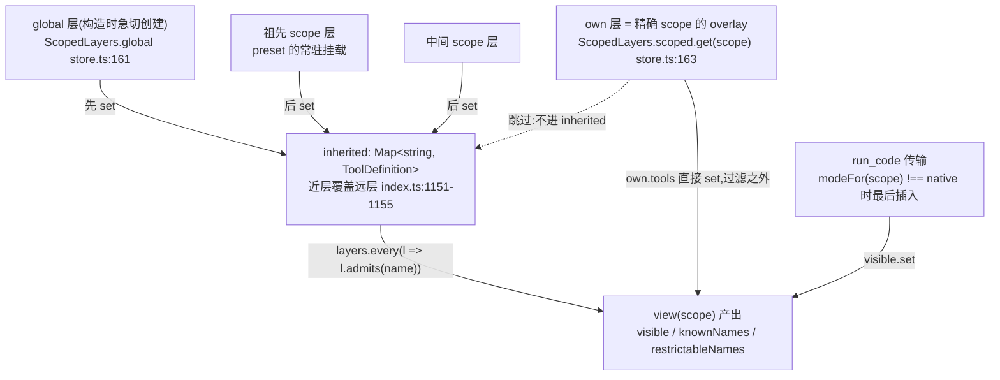
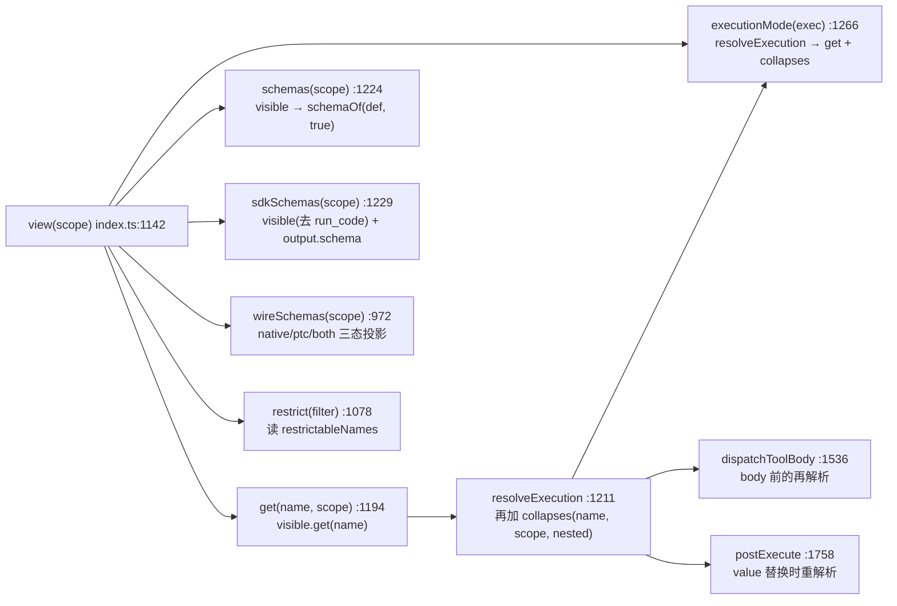

# 01 · 注册表内部:ScopedLayers 分层、遮蔽、回收与 view() 可见性解析

> 分析对象 `dbbaa4a37`。核心源码:`packages/core/scope/src/store.ts`(267 行)、`packages/core/scope/src/index.ts`(204 行)、`packages/core/tools/src/index.ts:707-1183`。
> 第五章第二节给出了四条可见性结论;本篇把它们拆到"哪一行实现、为什么这一行必须这样写、改坏了会怎样"。

---

## 一、两张存储表 + 一张分层容器

`ScopedLayers` 不认识"工具",它只认识**层**(`ScopeLayer`)。工具世界的层是 `ToolLayer`(`index.ts:707`),聚合四张表:

```typescript
// packages/core/tools/src/index.ts:707
class ToolLayer implements ScopeLayer {
  readonly tools: NamedEntries<ToolDefinition>
  readonly restrictions = new AnonymousEntries<CompiledToolRestriction>()
  readonly guards = new AnonymousEntries<ToolGuard>()
  /**
   * Presentation this scope's agent declared for itself, shadowing the
   * deployment default. One cell rather than an entry table: two answers to
   * "which form does the model see" is a contradiction, not a merge.
   */
  mode: ToolPresentationMode | undefined
```

四张表的类型选择都不是随意的:

| 表 | 类型 | 重复注册时 | 为什么 |
|---|---|---|---|
| `tools` | `NamedEntries<ToolDefinition>` | 层内同名**抛错**(`index.ts:719-721`) | 名字是查找键,两个同名工具无法共存 |
| `restrictions` | `AnonymousEntries<CompiledToolRestriction>` | 各自独立,求**交**(`index.ts:731-737`) | 限制是可叠加的策略,不是覆盖关系 |
| `guards` | `AnonymousEntries<ToolGuard>` | 各自独立,取**首个拒绝**(`index.ts:740-746`) | 守卫单调,顺序即优先级 |
| `mode` | 单格 `ToolPresentationMode \| undefined` | 第二次声明**抛错**(`index.ts:947-949`) | 注释已写明:"两个答案"是矛盾,不是合并 |

两种 entry 表的实现差异只有一处但很关键(`store.ts:30-105` / `:114-150`):

```typescript
// packages/core/scope/src/store.ts:43
insert(name: string, value: V): () => void {
  const data = this.data
  if (data.has(name)) throw this.duplicateError(name)
  data.set(name, value)
  let active = true
  return () => {
    if (!active) return          // 幂等:同一个 undo 调用两次只生效一次
    active = false
    data.delete(name)
    if (data.size === 0 && this.data === data) this.data = new Map()
  }
}
```

```typescript
// packages/core/scope/src/store.ts:122
append(value: V): () => void {
  const data = this.data
  const key = Symbol()           // 身份即 symbol:同值多次注册是多次注册
  data.set(key, value)
  ...
}
```

`data.size === 0 && this.data === data` 这一句是**迭代器代际**约定:表被清空时换一个新的 `Map`,于是此前 `keys()`/`entries()` 拿到的活迭代器不再会看到之后的新插入(注释在 `store.ts:26-28`、`:111-112`)。`this.data === data` 的二次比较是为了防"清空发生在已被暂停的迭代期间"——若表在迭代中途被重建,老的 undo 不能把新表也一起丢掉。

## 二、层的创建、遮蔽与回收

### 2.1 谁算"一个作用域"

作用域键是**不透明对象身份**(`scope/index.ts:15` 的 `ScopeKey = object`),由 `createScope()` 铸出:

```typescript
// packages/core/scope/src/index.ts:137
export function createScope(ctx: Context, key: ScopeKey, options?: CreateScopeOptions): Scope {
  if (options?.parent !== undefined) bindScopeParent(key, options.parent)
  const fiber = ctx.plugin(scope)                       // 共享 no-op 插件作为承载 fiber
  const scoped: Context = fiber.ctx.extend({ [kScope]: key })
  ...
}
```

注册走这个 `scoped` ctx,`scopeOf(ctx)`(`scope/index.ts:154`)沿 Cordis context 原型链读 `kScope` 标签。**祖先关系单独存**:`scopeParents` WeakMap(`scope/index.ts:39`),由 `bindScopeParent`(`:72`)写入且只允许一次,重链必须持有原绑定(`:78-81`),且带环检测(`:54-59`)。

这条父子链同时供应两个方向(注释在 `:32-38`):
- **注册视图向下继承**:子作用域看得见祖先的层 → `ScopedLayers.chainLayers`。
- **事件派发向上扩展**:挂在祖先上的监听器收得到后代的事件 → `scopeTarget`(`:170-185`)。

### 2.2 分层图



`chainLayers` 是整张图的骨架:

```typescript
// packages/core/scope/src/store.ts:192
chainLayers(scope: ScopeKey | undefined): L[] {
  const layers: L[] = []
  for (const key of scopeChainOf(scope).reverse()) {
    const layer = this.scoped.get(key)
    if (layer !== undefined) layers.push(layer)
  }
  return layers
}
```

`scopeChainOf` 返回**近者在前** `[key, parent, grandparent, …]`(`scope/index.ts:98-102`),`.reverse()` 后变成**远祖先在前、精确 scope 最后**——于是"按序 `set` 就给最近的作用域最后一句话"。`peek`(`store.ts:180-183`)则刻意 **chain-blind**:只读精确 scope 自己的 overlay。注释写明了理由:`restrictions` 与 `guards` 这类"这一层自己的贡献"绝不能悄悄继承祖先的。

### 2.3 effect:注册即所有权

`ScopedLayers.effect()`(`store.ts:226-266`)是唯一写入口:

```typescript
// packages/core/scope/src/store.ts:226
effect(
  ctx: Context,
  action: (layer: L) => () => void,
  options: { label: string; notify?: boolean },
): () => void {
  const scope = scopeOf(ctx)
  const notify = options.notify ?? true
  const dispose = ctx.effect(function* (this: ScopedLayers<L>) {
    let layer: L
    let created = false
    if (scope === undefined) {
      layer = this.global                                  // 无 scope → 全局层
    } else {
      const existing = this.scoped.get(scope)
      if (existing === undefined) {
        layer = this.createLayer(scope)
        this.scoped.set(scope, layer)
        created = true
      } else { layer = existing }
    }

    let undo: () => void
    try {
      undo = action(layer)
    } catch (error) {
      if (scope !== undefined && created && layer.isEmpty()) this.scoped.delete(scope)
      throw error                                          // 注册失败不留半层
    }

    yield () => {
      undo()
      if (scope !== undefined && layer.isEmpty()) this.scoped.delete(scope)   // 空层就地回收
      if (notify) this.onChange()
    }
    if (notify) this.onChange()
  }.bind(this), options.label)
  return dispose
}
```

时序要点(容易读漏的三条):

1. **读操作永不建层**。`peek`/`chainLayers` 只 `get`,没有 `set`(`store.ts:180-198`);创建只发生在 `effect()` 里。所以"某个 agent 从没注册过任何东西"不会在 `scoped` Map 里留下空壳。
2. **回收条件是"整层为空"**,由各层自己的 `isEmpty()` 定义(`ToolLayer.isEmpty()` 要求四张表全空,`index.ts:725-728`)。撤销一个工具但该层还有一条 restriction,层就留着。
3. **`notify` 只在层内容真的可能变化时发**。`guard()` 传 `notify: false`(`index.ts:1104`),因为"守卫不改变可见工具集"——不必惊动 `tools/change` 的订阅者(`index.ts:806` 构造 `ScopedLayers` 时把通知接到 `this.ctx.emit('tools/change')`)。这直接关系到 KV-Cache:多余的 `tools/change` 会让上层误判工具集变化。

`ctx.effect()` 的 generator 语义保证了"注册"与"撤销"共享同一个 fiber 生命周期:插件卸载、HMR 热替换、agent 销毁都只走 `dispose` 这一条路。返回的 `dispose` 就是 Cordis 的原件(注释 `store.ts:264`),不做二次包装。

## 三、`view()`:一次遍历,三个容器

```typescript
// packages/core/tools/src/index.ts:1142
private view(scope?: ScopeKey): ToolView {
  // Scope-chain layers, farthest ancestor first, the exact scope last.
  const layers = this.layers.chainLayers(scope)
  // Chain-blind on purpose: this is the ONE layer whose registrations the
  // scope owns rather than inherits, and it is absent until the scope
  // contributes something.
  const own = this.layers.peek(scope)
  // Inherited surface, nearest ancestor last: a nearer scope's same-name
  // entry shadows a farther one, and the global layer is the farthest.
  const inherited = new Map<string, ToolDefinition>(this.layers.global.tools.entries())
  for (const layer of layers) {
    if (layer === own) continue
    for (const [name, definition] of layer.tools.entries()) inherited.set(name, definition)
  }
  const visible = new Map<string, ToolDefinition>()
  const knownNames = new Set<string>()
  const restrictableNames = new Set<string>()
  for (const [name, definition] of inherited) {
    knownNames.add(name)
    restrictableNames.add(name)
    // Restrictions intersect across the whole chain: any scope on it may
    // mask an inherited name for everything nested inside it.
    if (layers.every(layer => layer.admits(name))) visible.set(name, definition)
  }
  // The scope's own registrations last, shadowing an inherited name and
  // outside the filter above.
  if (own !== undefined) {
    for (const [name, definition] of own.tools.entries()) {
      knownNames.add(name)
      visible.set(name, definition)
    }
  }
  // Presentation infrastructure is resolved last and outside capability
  // filtering. ...
  if (this.modeFor(scope) !== 'native') {
    visible.set(RUN_CODE_NAME, this.requireCodeTransport())
  }
  return { visible, knownNames, restrictableNames }
}
```

### 3.1 三个容器的确切含义

| 容器 | 内容 | 谁读 |
|---|---|---|
| `visible` | 继承面 ∩ 全链 restriction + own 注册 + `run_code`(mode 非 native 时) | `get()`(`:1194`)、`schemas()`(`:1224`)、`sdkSchemas()`(`:1229`)、`executionMode()`(经 `resolveExecution`) |
| `knownNames` | **过滤之前**的继承面 + own 注册名(不含 `run_code`) | `wireSchemas()`(`:977`、`:992`)→ `systemPrompt.tools` 的 `knownNames`,决定 `toolOrder` 校验的合法集合(`packages/core/system-prompt/src/index.ts:216-218`) |
| `restrictableNames` | `inherited` 的键集合 | `restrict()` 的未知名检查(`:1078-1082`) |

**必须点出的一处源码措辞与实现的偏差**:`restrictableNames` 在 JSDoc 里写作"Current global names"(`index.ts:692`),报错文本也说 "known global tools"(`:1081`),但 `inherited` 实际含**祖先 scoped 层**的注册(`:1152-1155`),不含 own。因此 `restrict()` 能命名一个祖先注册的名字——这恰恰是注释 `:1134-1138` 描述的场景:preset 把工具搬到了 agent 平面(祖先层),子 agent 的过滤器必须约束得到它。把 `restrictableNames` 收窄成"只有全局层"会让那个场景静默失效。

`own` 名**不进** `restrictableNames`:一个 scope 不能 restrict 自己注册的工具(自己的东西本来就不该被自己的过滤器裁掉)。

### 3.2 三条过滤规则与它们的实现行

1. **近层遮蔽远层** —— `inherited` 的 `set` 顺序(`:1151` 全局先,`:1152-1155` 由远及近)。因为 `chainLayers` 已是"远处祖先在前",直接顺序 `set` 即可,无需比较深度。
2. **restriction 沿链取交** —— `layers.every(layer => layer.admits(name))`(`:1164`)。注意 `layers` **包含 own**,所以"某个 scope 自己声明的 restriction 会过滤它继承来的名字"。`ToolLayer.admits()` 的语义是**合取**(`index.ts:731-737`):该层每一条 compiled restriction 都必须放行(`allow` 未含 → 拒;`deny` 含 → 拒)。多条 restriction 之间是交,链上多层之间也是交。
3. **restriction 不过滤本层自己的注册** —— `own.tools` 直接 `visible.set`(`:1168-1173`),完全跳过 `admits`。这是被踩过坑的设计(`index.ts:1127-1138` 注释):委派 runtime 把子 agent 的结构化输出工具注册进**子 agent 自己的层**,而"允许该子 agent 用哪些能力"的过滤器按定义列的是**能力**名;若豁免集合被读成"全局层"而非"不是我的",一旦 preset 把模型可见工具挪到 agent 平面,子 agent 的过滤器就会把它自己赖以作答的机件一起剥掉。

`run_code` 的插入(`:1179-1181`)是第四条规则:它**不在任何注册层里**,所以既不受 restriction 影响,也可能遮蔽不了(`register()` 无条件拒绝这个保留名,`index.ts:1044-1046`,因此这一行同时是不变式断言)。它是**按 scope 判定**的:`native` 的 agent 不该在派发表里发现别的 agent 呈现的 `run_code`。

### 3.3 view() 的调用者:四个出口共用同一次遍历



四个出口读同一个 `ToolView`,所以"展示集、可查找集、可调度集、可执行集不可能互相漂移"不是靠约定,而是靠**没有第二份派生逻辑**。三处细节:

- **`wireSchemas` 在非 native 模式下先验证 runtime 再投影**(`:984`)。顺序注释(`:979-983`)说明:若先 `schemaOf`,`run_code` 的 language-aware getter 会先抛出 flavor 表的报错,而"没有 SDK renderer"才是装配期的权威错误。三态输出的确切行为是:

  | mode | `schemas` | `knownNames` |
  |---|---|---|
  | `native` | 全部 visible | 全部 `knownNames` |
  | `ptc` | 只留 `run_code`(`:988`) | 只有 `[RUN_CODE_NAME]`(`:989`) |
  | `both` | 全部 visible | `knownNames` + `RUN_CODE_NAME`(`:992`) |

- **`schemas()` 深拷贝参数,`wireSchemas()` 不拷**(`schemaOf(def, detachParameters)`,`:1224` vs `:976`)。后者由 system-prompt 随后自己 `structuredClone`(`packages/core/system-prompt/src/index.ts:583`)。
- **`executionMode()` 每次都重跑整个 `view()`**(`:1266-1275`)。这正是调度器能在滚动池里反复"重新分类"的前提(见 [03-scheduler-and-concurrency.md](./03-scheduler-and-concurrency.md)):注册表变化立刻反映到下一次分类,无需任何缓存失效机制。

## 四、`register()`:加载期 fail loud 的四道校验

```typescript
// packages/core/tools/src/index.ts:1027
register(definition: ToolDefinition): () => void {
  const name = definition.name
  const output = (definition as Partial<ToolDefinition>).output
  if (output === undefined || typeof output !== 'object'
    || typeof output.render !== 'function'
    || (output.presentationMeta !== undefined && typeof output.presentationMeta !== 'function')) {
    throw new TypeError(`tool "${name}" must declare output { schema, render, presentationMeta? }`)
  }
  assertSupportedJsonSchema(output.schema)
  const timeoutMs = definition.timeoutMs
  if (timeoutMs !== undefined
    && (!Number.isFinite(timeoutMs) || timeoutMs <= 0)) {
    throw new TypeError(`tool "${name}" timeoutMs must be a positive finite number`)
  }
  // Reserved unconditionally: any agent may select a code mode for itself,
  // so a name free to take under the deployment default would become a
  // collision the moment a preset mounted.
  if (name === RUN_CODE_NAME) {
    throw new Error(`tool name "${RUN_CODE_NAME}" is reserved for the PTC mode presentation transport and cannot be registered or shadowed`)
  }
  return this.layers.effect(
    this.ctx,
    layer => layer.tools.insert(name, definition),
    { label: 'tools.register()' },
  )
}
```

| 校验 | 行 | 拒绝什么 | 为什么在加载期 |
|---|---|---|---|
| `output` 三件套 | `:1029-1034` | 缺 `output`、`render` 非函数、`presentationMeta` 非函数 | 没有 `output` 就没有结果合同;`render` 是唯一的值→文本投影,缺了就无法产出模型内容 |
| `assertSupportedJsonSchema(output.schema)` | `:1035` | 用了受支持子集之外的 JSON Schema 关键字 | 校验器(`json-schema.ts`)只实现这个子集,非法 schema 会让每个结果都校验失败 |
| `timeoutMs` 正有限 | `:1036-1040` | `0`、负数、`NaN`、`Infinity` | `timeoutMs` 是"声明式预算",值是 `0` 会与"未声明"混淆;超时插件读到的必须是一个可用的毫秒数 |
| `RUN_CODE_NAME` 保留 | `:1044-1046` | 名为 `run_code` 的注册 | 无条件保留:任何 agent 都可能为自己选用 code 模式,一个"当前默认下空闲"的名字会在某个 preset 挂载的瞬间变成冲突——把冲突挪到注册期 |

**未在此处校验**的三项,以及它们各自的归属:

- `isConcurrencySafe` 的类型 —— `defineTool` 在编译 DSL 时约束;`executionMode()` 对非法返回值 fail-closed(`:1272-1274`)。手写定义绕过 `defineTool` 时不会在注册期报错,而是在调度时退化为 `exclusive`。
- `presentCall` / `presentResult` —— 纯可选展示回调,失败由消费方包容(`presentResult` 的契约要求"畸形数据返回 `undefined` 而不是抛错",见 `packages/fs/tool-fs/src/read.ts:170-176`)。
- 名字是否为空 —— 无校验。空串名会在 `view()` 的 Map 里成为一个可查找的键;这是可信同进程边界的取舍(`AGENTS.md`:"Trust TypeScript at typed same-process boundaries")。

`base` 的析构发生在 `createExecution()` 而不是这里;`register()` 的最后一行把整个 `ToolDefinition` **按引用**存进表里——注册表从不拷贝定义对象,所以 `run_code` 才能用 `Object.defineProperty` 安装 language-aware getter(`ptc.ts:664-676`)。

## 五、`restrict()` 与 `presentAs()`:两个必须作用域化的写操作

### 5.1 restrict:只裁继承面

```typescript
// packages/core/tools/src/index.ts:1061（核心）
const scope = scopeOf(this.ctx)
if (scope === undefined) {
  throw new Error('tools.restrict() requires a scoped context (agent.ctx): a context-global restriction would mask every agent — deny the tool for the intended agent instead')
}
if (allow === undefined && deny === undefined) {
  throw new Error('tools.restrict({}) is a no-op: pass `allow` and/or `deny` (an empty filter is almost always a materialized-empty-config bug)')
}
const compiled: CompiledToolRestriction = {
  ...allow !== undefined ? { allow: new Set(allow) } : {},      // 注册期编译成 Set
  ...deny !== undefined ? { deny: new Set(deny) } : {},
}
if ([...allow ?? [], ...deny ?? []].includes(RUN_CODE_NAME)) {
  throw new Error(`tools.restrict() cannot name reserved PTC mode presentation transport "${RUN_CODE_NAME}"; restrict end-capability tools instead`)
}
const known = this.view(scope).restrictableNames
const unknown = [...allow ?? [], ...deny ?? []].filter(name => !known.has(name))
if (unknown.length > 0) {
  throw new Error(`tools.restrict() names unknown global tool${unknown.length > 1 ? 's' : ''} ${unknown.map(n => `"${n}"`).join(', ')}; known global tools: ${[...known].sort().join(', ') || '(none)'}`)
}
return this.layers.effect(this.ctx, layer => layer.restrictions.append(compiled), { label: 'tools.restrict()' })
```

四条拒绝各自的意图:

- **要求 scoped ctx**(`:1062-1065`):上下文全局的限制会遮住所有 agent,报错直接给出正解("deny 给那个 agent 就行")。
- **空过滤器拒绝**(`:1068-1070`):注释直指"几乎总是配置物化成空的 bug"——`allow: []` 与"没有 allow"语义天差地别(前者裁掉全部,后者不裁),静默接受等于把配置错误变成一整个不可用 agent。
- **`run_code` 不可命名**(`:1075-1077`):它根本不在注册层里,允许命名会给出"我限制了它"的假象。
- **名字必须已知**(`:1078-1082`):报错附上全部可用名字(排序后),让拼写错误一眼可见。检查用 `view(scope)`,所以它看见的是**这个 scope 的**继承面,不是别人的。

编译成 `Set` 发生在注册期(`:1071-1074`),`admits()` 因此是纯 Map/Set 查询——`view()` 在每次 `get`/`executionMode` 里都会跑,这条路径不能有解析成本。

### 5.2 presentAs:mode 的作用域版本

```typescript
// packages/core/tools/src/index.ts:938（核心）
if (scopeOf(ctx) === undefined) {
  throw new Error('tools.presentAs() requires a scoped context (agent.ctx): a context-global presentation is the `mode` config field on the tools row')
}
const dispose = ctx.effect(function* (this: ToolRuntime) {
  yield this.layers.effect(ctx, (layer) => {
    if (layer.mode !== undefined) {
      throw new Error(`tools.presentAs("${mode}") conflicts with "${layer.mode}" already declared for this scope; one composition selects one presentation`)
    }
    layer.mode = mode
    return () => { layer.mode = undefined }
  }, { label: 'tools.presentAs()' })
  // The SDK and collapse sections are per scope for the same reason the mode
  // is. Under a PTC-default deployment this shadows the global registration
  // with an identical body: one rule instead of a case analysis.
  if (mode !== 'native') {
    yield ctx.systemPrompt.section(this.collapseSection())
    yield ctx.systemPrompt.section(this.sdkSection())
  }
}.bind(this), 'tools.presentAs()')
return dispose
```

它比 `restrict()` 多两件事:一是**每 scope 只能声明一次**(`:947-949`);二是注册两个 prompt section(`:959-962`)。注释 `:955-958` 说明了为什么在"部署已经是 PTC"的情况下还要重复注册一份同内容的 scoped section:**一条规则胜过一处 case 分析**——section 体按调用作用域重新求值,重影一个内容相同的注册代价为零。

`modeFor()`(`:892-903`)是读取侧,也是"最近作用域获胜":

```typescript
// packages/core/tools/src/index.ts:892
private modeFor(scope?: ScopeKey): ToolPresentationMode {
  const layers = this.layers.chainLayers(scope)
  for (let index = layers.length - 1; index >= 0; index -= 1) {
    const mode = layers[index]?.mode
    if (mode !== undefined) return mode
  }
  return this.defaultMode
}
```

注释 `:893-896` 点出 mode 属于"链会继承的那类事实":preset 的常驻声明覆盖挂在其下的每个 agent,agent 自己的声明(若有)覆盖 preset 的。**`collapses()` 必须读 `modeFor` 而不是 `defaultMode`**(见 [05-ptc-mode.md](./05-ptc-mode.md)),否则"native 部署下被 preset 赋予 ptc 的 agent"恰好漏网。

`agent-tool-presentation` 包(`packages/core/agent-tool-presentation/src/index.ts:59`)就是这条路径的部署形态:一行 preset 配置 → 一个作用域声明。

```typescript
// packages/core/agent-tool-presentation/src/index.ts:59
export function apply(ctx: Context, config: Config): void {
  if (config.mode === 'native') {
    ctx.tools.presentAs('native')
    return
  }
  // The wait is the loud failure: an entry still pending on `codeRuntime` is
  // what `dsh-agent-presets` reports as an unusable row, naming this id.
  ctx.inject(['codeRuntime'], (runtimeCtx: Context) => {
    runtimeCtx.tools.presentAs(config.mode)
  })
}
```

`codeRuntime` **不写进 `inject`**(`:31-35` 注释):一个 `native` 行必须能在没有 runtime 的部署里挂载,所以"依赖 code runtime"这件事被推迟成 mode-相关的 `ctx.inject`,而"一直 pending"本身就是那条响亮的失败信息。

## 六、关键文件/符号索引表

| 符号 | 位置 | 职责 |
|---|---|---|
| `NamedEntries` | `packages/core/scope/src/store.ts:30` | 插入序命名表;层内重名抛错;undo 幂等 |
| `NamedEntries.insert` | `store.ts:43` | 唯一写入口;清空时换新 `Map`(迭代器代际) |
| `AnonymousEntries` | `store.ts:114` | 匿名表;`append`(`:122`)以 `Symbol()` 为键,同值多次注册独立 |
| `ScopedLayers` | `store.ts:159` | 全局层 + `Map<ScopeKey, L>` overlay 容器 |
| `ScopedLayers.global` | `store.ts:161` | 构造时急切创建(`:169`),不存在"全局层还没建"的状态 |
| `ScopedLayers.peek` | `store.ts:180` | chain-blind 读精确 scope 的 own 层,不建层 |
| `ScopedLayers.chainLayers` | `store.ts:192` | 沿 `scopeChainOf().reverse()` 取现存 overlay,远祖先在前 |
| `ScopedLayers.merge` | `store.ts:208` | 通用"全局 + 链遮蔽"合并(`system-prompt` `:569`、`commands` `:471` 在用;`ToolRuntime` 不用) |
| `ScopedLayers.effect` | `store.ts:226` | 唯一写入口:按 `scopeOf(ctx)` 选层、`ctx.effect` 所有权、空层回收、可选通知 |
| `scopeOf` | `packages/core/scope/src/index.ts:154` | 读最近的作用域标签 |
| `scopeChainOf` | `scope/index.ts:98` | 近者在前的作用域链 |
| `bindScopeParent` | `scope/index.ts:72` | 一次绑定 + 环检测,返回唯一可重链的绑定 |
| `scopeTarget` | `scope/index.ts:170` | 保留基类 filter、无标签监听器全局准入、标签监听器向上扩展 |
| `createScope` | `scope/index.ts:137` | 铸出 scoped ctx(共享 no-op 插件作承载 fiber) |
| `ToolLayer` | `packages/core/tools/src/index.ts:707` | 四张表的聚合层 |
| `ToolLayer.admits` | `index.ts:731` | 层内所有 restriction 的合取求值 |
| `ToolLayer.guardReason` | `index.ts:740` | 层内首个拒绝理由 |
| `ScopedLayers` 实例化 | `index.ts:804` | `new ScopedLayers(scope => new ToolLayer(scope), () => ctx.emit('tools/change'))` |
| `ToolView` / `ToolRuntime.view` | `index.ts:687` / `:1142` | `{ visible, knownNames, restrictableNames }`;一次遍历产出三个容器 |
| `ToolRuntime.get` / `schemas` / `sdkSchemas` / `wireSchemas` | `index.ts:1194` / `:1224` / `:1229` / `:972` | `visible.get(name)`;模型 schema 投影;PTC SDK 投影;native/ptc/both 三态 provider |
| `ToolRuntime.resolveExecution` / `executionMode` | `index.ts:1211` / `:1266` | `get` + `collapses` 的执行面解析;fail-closed 并发分类(每次都重跑 `view()`) |
| `ToolRuntime.register` / `restrict` / `presentAs` / `modeFor` / `requireCodeTransport` | `index.ts:1027` / `:1061` / `:938` / `:892` / `:914` | 四道加载期校验;作用域限制;作用域 mode 声明;链上最近的 `mode`;惰性铸造 `run_code` |
| `apply` | `packages/core/agent-tool-presentation/src/index.ts:59` | preset 行的 `presentAs` 装配,`codeRuntime` 依赖延迟到 mode 分支 |
