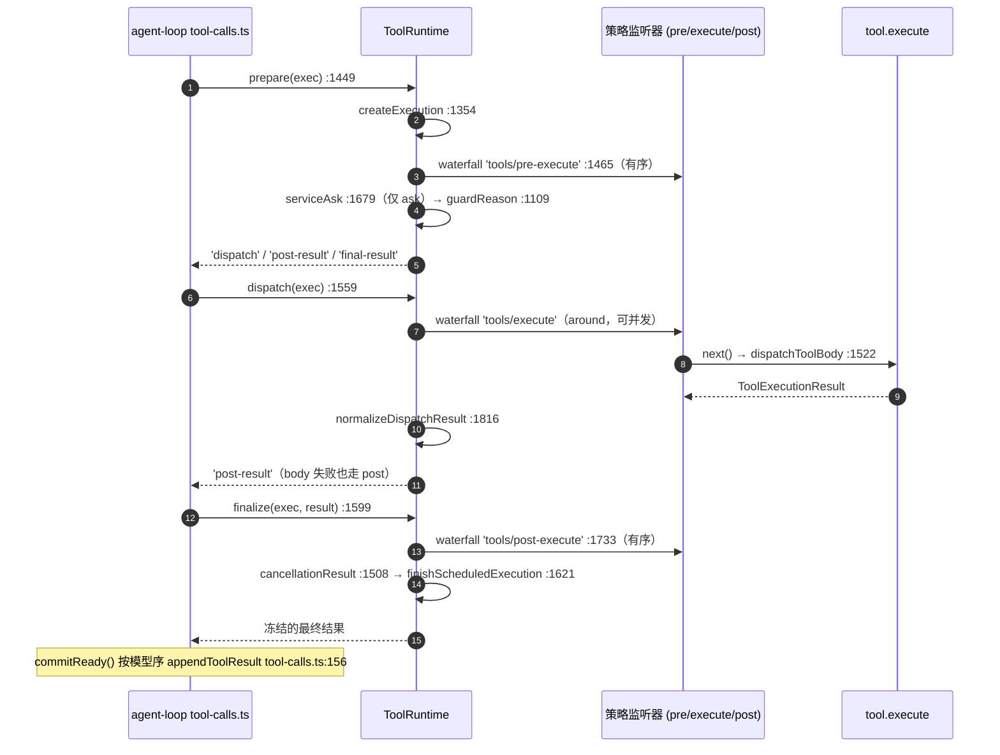

# 02 · 执行管道函数级走查:createExecution → prepare → dispatch → finalize/finish

> 分析对象 `dbbaa4a37`。覆盖 `packages/core/tools/src/index.ts:1332-1852` 与调用侧 `packages/core/agent-loop/src/tool-calls.ts:122-247`。

---

## 一、两个入口,一条实现

```typescript
// packages/core/tools/src/index.ts:1332
async execute(exec: ToolExecutionInput): Promise<ToolExecutionResult> {
  return this.prepareExecution(exec, prepared => this.completeScheduledExecution(prepared))
}
// index.ts:1336 —— 三分支串接
case 'dispatch': {
  const dispatched = await this.dispatchScheduledExecution(prepared.exec)
  return dispatched.kind === 'post-result'
    ? await this.finalizeScheduledExecution(prepared.exec, dispatched.result)
    : this.finishScheduledExecution(prepared.exec, dispatched.result)
}
case 'post-result': return await this.finalizeScheduledExecution(prepared.exec, prepared.result)
case 'final-result': return this.finishScheduledExecution(prepared.exec, prepared.result)
```

调度器入口把同一组函数**跨时间**摊开(`TOOL_RUNTIME_SCHEDULER`,`index.ts:789-794`):

```typescript
// packages/core/tools/src/index.ts:789
readonly [TOOL_RUNTIME_SCHEDULER]: ToolRuntimeScheduler = {
  prepare: exec => this.prepareScheduledExecution(exec),
  dispatch: exec => this.dispatchScheduledExecution(exec),
  finalize: (exec, result) => this.finalizeScheduledExecution(exec, result),
  finish: (exec, result) => this.finishScheduledExecution(exec, result),
}
// index.ts:1449 —— prepare 的第二参数是续延:公开 execute 传"跑完整管道",调度器传恒等
private async prepareScheduledExecution(input: ToolExecutionInput): Promise<ScheduledToolPreparation> {
  return this.prepareExecution(input, prepared => prepared)
}
```


<details><summary>Mermaid 源码</summary>



</details>

**唯一允许重叠的是 `tools/execute` 与 body**;`pre-execute`/`ask`/guard 与 `post-execute`/物化/通知都在调用方的有序槽位里执行(见 [03-scheduler-and-concurrency.md](./03-scheduler-and-concurrency.md) §6.1)。

---

## 二、`createExecution()`:身份、快照、三个 WeakMap

```typescript
// packages/core/tools/src/index.ts:1354（核心）
const deferredContexts: UserMessage[] = []
const token = createExecutionToken()
const { callId, name, agent, parent, signal } = exec          // ① 局部捕获:调用者信号留在 wrapper 之外
const base = { token, callId, rootCallId: exec.rootCallId ?? callId, name, signal,
  ...agent !== undefined ? { agent } : {}, ...parent !== undefined ? { parent } : {},
  deferContext(context) { deferredContexts.push(context) },
  concludeTurn() { concludingExecutions.add(this as unknown as ToolExecution) } }
const visible = this.get(name, agent)
const collapsed = visible !== undefined && this.collapses(name, agent, parent !== undefined)
// Capture the finalizer BEFORE argument materialization: an arguments getter
// can replace or clear the registered callback during `snapshotJsonValue`.
const capturedFinalizer = visible?.finalizeContent?.bind(visible)
const finalizerFor = () => collapsed && !signal.aborted ? undefined : capturedFinalizer
try {
  const detached = snapshotJsonValue(exec.arguments)          // ② 无损 JSON 边界
  if (detached === undefined) throw new TypeError('tool execution arguments must be losslessly JSON-serializable')
  const execution = { ...base, arguments: deepFreeze(detached) }
  this.deferredContexts.set(execution, deferredContexts)      // ③ 三个 WeakMap
  this.contentFinalizers.set(execution, finalizerFor())
  this.cancellationStates.set(execution, { callerSignal: signal, bodyInvoked: false })
  if (collapsed) {
    if (signal.aborted) return { kind: 'final-result', exec: execution, result: toolAbortedBeforeDispatchResult() }
    return { kind: 'final-result', exec: execution, result: toolErrorResult(new ToolNotFoundError(
      name, `only \`${RUN_CODE_NAME}\` is callable directly — call \`${name}\` from inside a \`${RUN_CODE_NAME}\` program instead`,
    )) }
  }
  return { kind: 'ready', exec: execution }
} catch (error: unknown) {
  // 参数快照失败:这条执行永远走不到读 cancellationStates / deferredContexts 的地方
  const execution = { ...base, arguments: undefined }
  this.contentFinalizers.set(execution, finalizerFor())
  return { kind: 'final-result', exec: execution, result: toolErrorResult(error) }
}
```

| # | 动作 | 行 | 为什么必须在这一帧 |
|---|---|---|---|
| ① | 入参捕获到局部常量 | `:1357-1362` | wrapper 会改写 `exec.signal`;**调用者信号必须在 wrapper 视野之外留一份** |
| ② | `snapshotJsonValue` + `deepFreeze` | `:1402-1406` | 参数过一次无损 JSON 边界后冻结,策略层与 body 拿到同一份不可变值 |
| ③ | 三个 WeakMap 登记 | `:1407-1412` | 延迟上下文 / 内容终结器 / 取消状态,**刻意不放公开 `exec` 对象**(`:800-803`) |
| ④ | `capturedFinalizer` | `:1398` | 合同要求"执行开始时快照",而 `arguments` 的 getter 可能在快照期间替换回调 |
| ⑤ | `visible` + `collapsed` | `:1370-1371` | `resolveExecution` 会把"可见但被呈现模式拒绝"读成 `undefined`,这里需要区分 |
| ⑥ | `token` | `:1356` | 不透明执行身份(`:1856`),也是 PTC 子派发唯一的父调用凭据 |

**`finalizerFor()` 的例外**——**被折叠的调用**只有在**已经取消**时才保留终结器:正常调用保留;折叠 + 未取消丢弃(`UNKNOWN_TOOL` 拒绝不该经过工具的内容改写);折叠 + 已取消保留(取消合同要求每个归一化结果都过一次 `finalizeContent`)。注释 `:1392-1397` 记录了更细的一层:在 `snapshotJsonValue` 中途 abort 的 getter 会让"无效参数失败"落到与取消同一条保留路径上。

**catch 分支少登记两个 WeakMap 是安全的**:它只登记 `contentFinalizers`。安全性来自**这条执行永远走不到读它们的地方**——`final-result` 由调度器直接送进 `finishScheduledExecution`(`tool-calls.ts:191` 的 `needsPost: false`),不经过取消检查也不 dispatch。`callerCancelled`(`:1503`)与 `dispatchScheduledExecution`(`:1570`)里那两条 `throw new Error('tool registry scheduler invariant violated: …')` 就是这两条不变式的断言。

**折叠判定必须在策略管道之前**(注释 `:1363-1369`):被 `ptc` 折叠的调用是**确定性失败**,放进 try 块会让 pre-execute 监听器、`ask`、guard 看见它,甚至"批准"一个只能失败的调用。真正未知的工具**保留** dispatch 阶段的 `UNKNOWN_TOOL` 路径,好让策略监听器看到每一个到达注册表的名字。唯一例外是预派发取消:折叠分支先查 `signal.aborted`(`:1419`),返回 `ABORTED_BEFORE_DISPATCH`。

---

## 三、`prepareExecution()`:有序前置门

```typescript
// packages/core/tools/src/index.ts:1453（核心）
const created = this.createExecution(input)
if (created.kind !== 'ready') return next(created)
const exec = created.exec
if (this.callerCancelled(exec)) return next({ kind: 'final-result', exec, result: toolAbortedBeforeDispatchResult() })
try {
  const gate = await this.ctx.waterfall(scopeTarget(this, exec.agent), 'tools/pre-execute', exec,
    () => Promise.resolve<PreToolDecision>({ kind: 'allow' }))
  const askResolution = gate.kind === 'ask' ? await this.serviceAsk(exec, gate) : { decision: gate, approvalCancelled: false }
  const { decision } = askResolution
  if (this.callerCancelled(exec) && askResolution.approvalCancelled) {
    return await next({ kind: 'post-result', exec, result: toolAbortedBeforeDispatchResult() })
  }
  const denialReason = decision.kind === 'allow' ? this.guardReason(exec) : decision.reason
  if (denialReason !== undefined) {
    return await next({ kind: 'post-result', exec, result: this.materializeFinalResult({
      content: [{ type: 'text', text: `Error: ${denialReason}` }], isError: true, error: { message: denialReason },
    }) })
  }
  if (this.callerCancelled(exec)) return await next({ kind: 'post-result', exec, result: toolAbortedBeforeDispatchResult() })
  return await next({ kind: 'dispatch', exec })
} catch (error: unknown) {
  return next({ kind: 'final-result', exec, result: toolErrorResult(error) })
}
```

| 顺序 | 动作 | 行 | 进入条件 | 产出 / 失败分支 |
|---|---|---|---|---|
| 1 | `createExecution` | `:1457` | 总是 | 非 `ready` → 直接 `next(...)` |
| 2 | 入口取消检查 | `:1460` | `ready` | `final-result: ABORTED_BEFORE_DISPATCH` |
| 3 | `tools/pre-execute` 瀑布 | `:1465` | 未取消 | `allow` / `deny{reason}` / `ask{reason?}`;缺省 allow |
| 4 | `serviceAsk` | `:1469` | `gate.kind === 'ask'` | 映射成 allow 或 deny,附 `approvalCancelled` |
| 5 | 审批期取消 | `:1473` | `callerCancelled && approvalCancelled` | `post-result: ABORTED_BEFORE_DISPATCH` |
| 6 | `guardReason` | `:1476` | `decision.kind === 'allow'` | 首个拒绝理由;非 allow 时直接用 `decision.reason` |
| 7 | 拒绝物化 | `:1479-1489` | `denialReason !== undefined` | `post-result`;``Error: ${reason}``,`error.message = reason`,**无 `info`** |
| 8 | 二次取消检查 | `:1490` | 未被拒绝 | `post-result: ABORTED_BEFORE_DISPATCH` |
| 9 | 放行 / 兜底 | `:1493` / `:1494` | 以上皆否 / 步骤 3-8 抛错 | `dispatch` / `final-result: toolErrorResult(error)` |

### 3.1 `post-result` vs `final-result`:阶段可见性

```typescript
// packages/core/tools/src/index.ts:424
export type ScheduledToolPreparation =
  | { kind: 'dispatch'; exec: ToolRunContext }
  | { kind: 'post-result'; exec: ToolRunContext; result: ToolExecutionResult }
  | { kind: 'final-result'; exec: ToolRunContext; result: ToolExecutionResult }
```

| 分支 | 后续 | 谁能观测到 | 本文件的产生点 |
|---|---|---|---|
| `dispatch` | around + body → 再分流 | 全部扩展点 | `:1493` |
| `post-result` | 走 `tools/post-execute` + `finalizeContent` | post-execute 监听器、`finalizeContent`、`tools/result` | 审批取消 `:1474`、策略拒绝 `:1479`、预派发取消 `:1491`、dispatch 后全部结果 `:1580` |
| `final-result` | 只走 `finishScheduledExecution`(**跳过 post-execute**) | `finalizeContent`、`tools/result` | 折叠/参数失败 `:1420/:1426/:1439`、入口取消 `:1461`、前置门抛错 `:1495`、dispatch 抛错 `:1587` |

**"拒绝也走 post-execute"是有意的**(`:172` 注释):`repeat-tool-reminder` 正是靠这条统计被拒调用的重复链(`packages/guard/repeat-tool-reminder/src/index.ts:184-187`)。管道**还没开始**的失败(参数快照、折叠、前置门抛错)不该被当成"一次执行"观测,所以走 `final-result`。

### 3.2 `ask` 是旁路而非决策源

```typescript
// packages/core/tools/src/index.ts:1679（核心）
const approval = this.ctx.get('approval')
if (approval === undefined) return { decision: { kind: 'deny', reason: ask.reason ?? `tool "${exec.name}" requires approval (not yet supported)` }, approvalCancelled: false }
if (exec.agent === undefined) return { decision: { kind: 'deny', reason: `tool "${exec.name}" requires approval, but the call has no agent to route it through` }, approvalCancelled: false }
const outcome = await approval.request({ agent: exec.agent, toolName: exec.name, callId: exec.callId,
  ...ask.reason !== undefined ? { reason: ask.reason } : {}, signal: exec.signal })
switch (outcome) {
  case 'allowed-once': return { decision: { kind: 'allow' }, approvalCancelled: false }
  case 'rejected':  return { decision: { kind: 'deny', reason: `the user rejected tool "${exec.name}"` }, approvalCancelled: false }
  case 'cancelled': return { decision: { kind: 'deny', reason: `approval for tool "${exec.name}" was cancelled` }, approvalCancelled: true }
  case 'unavailable': return { decision: { kind: 'deny', reason: `tool "${exec.name}" requires approval, but no approval channel is available` }, approvalCancelled: false }
  default: return assertNever(outcome, 'ApprovalOutcome')
}
```

**机会式消费 seam**:用 `ctx.get('approval')`(`:1683`)而非 `inject`(`ctx.approval` 属性代理是拓扑敏感的,`ctx.get` 读全局服务表)。没有审批服务、或调用没有 agent,都**降级为 deny**。**四条非放行路径各有不同文本**,注释 `:1668-1677` 写明理由是"让模型能区分人类说『不』和审批通道不存在"。**只有 `cancelled` 带 `approvalCancelled: true`**,于是它是唯一走 `:1473` 那条分支的结果;其余拒绝继续走 `:1479`。

### 3.3 guard 单调,且在审批之后

```typescript
// packages/core/tools/src/index.ts:1109
const globalReason = this.layers.global.guardReason(exec)
if (globalReason !== undefined) return globalReason
if (exec.agent === undefined) return undefined
for (const layer of this.layers.chainLayers(exec.agent)) {
  const reason = layer.guardReason(exec)
  if (reason !== undefined) return reason
}
return undefined
```

顺序是**全局层 → 作用域链(由远及近)**;层内按注册序,首个非 `undefined` 即返回(`:740-746`)。`ToolGuard` 只有 `string | undefined` 两种返回(`:704`),**没有 allow 结果**——监听器顺序无法把另一个 guard 的拒绝翻回允许。这就是"单调"的确切含义,也是 guard 能放在一个可任意排序的瀑布**之后**而不失强度的原因。`guard()` 注册特意不发变更通知(`:1104`,`notify: false`),因为守卫不改变可见工具集。

---

## 四、dispatch:around 包装与 body

```typescript
// packages/core/tools/src/index.ts:1559（核心）
const result = await this.ctx.waterfall(scopeTarget(this, exec.agent), 'tools/execute', mutableExec,
  () => this.dispatchToolBody(mutableExec))
const normalized = this.normalizeDispatchResult(exec, result)
const deferredContexts = this.deferredContexts.get(exec)
if (deferredContexts === undefined) throw new Error('tool registry scheduler invariant violated: unprepared execution')
const resultWithDeferredContexts = deferredContexts.length === 0 ? normalized : this.markCanonical(exec, {
  ...normalized,
  additionalContexts: [...deferredContexts, ...normalized.additionalContexts ?? []],   // body 的上下文在前
})
return { kind: 'post-result',
  result: this.callerCancelled(exec) && !resultWithDeferredContexts.isError
    ? this.cancellationResult(exec, resultWithDeferredContexts) : resultWithDeferredContexts }
// catch → { kind: 'final-result', result: toolErrorResult(error) }
```

四处值得单列:

1. **`tools/execute` 是唯一能改写信号的阶段**(契约 `:145-154`),而 `dispatchToolBody` 会在调用 body 前把调用者信号**重新 fuse 回去**(`:1527`)。
2. **延迟上下文前置**:`ToolRunContext.deferContext` 的 JSDoc(`:398-404`)写明"按调用顺序发出",`:1575-1578` 的拼接顺序就是它的实现。
3. **成功路径恒返回 `post-result`**,所以 **body 抛错也仍进入 post-execute**——`:158-159` 原文:"thrown tools still reach this waterfall as errors"。
4. **catch 分会丢掉 `deferredContexts`**(`:1587` 直接返回 `toolErrorResult`)。这是一条真实的损失面:一个 wrapper 在 body 已 `deferContext` 之后抛错,那些上下文不回流。当前 wrapper 不抛错,所以没有触发点。

```typescript
// packages/core/tools/src/index.ts:1816 —— normalizeDispatchResult:wrapper 造的结果也要过输出合同
if (this.canonicalResults.get(result) === exec.token) return result        // 快路径:本次执行自己铸的
if (result.isError) return this.markCanonical(exec, {                       // 失败结果原样保留
  isError: true, error: result.error, content: result.content,
  ...result.meta !== undefined ? { meta: result.meta } : {},
  ...result.additionalContexts !== undefined ? { additionalContexts: result.additionalContexts } : {} })
const tool = this.resolveExecution(exec.name, exec.agent, exec.parent !== undefined)
if (tool === undefined) throw new ToolNotFoundError(exec.name)
const normalized = this.createSuccessResult(exec, tool, result.value)       // 成功结果的“值”必须重过合同
return this.markCanonical(exec, { ...normalized, ...result.additionalContexts !== undefined ? { additionalContexts: result.additionalContexts } : {} })
```

`canonicalResults`(`WeakMap<result, token>`,`:1774`)记录"这个结果对象是哪次执行铸造的"。失败结果**原样保留** `error`/`content`/`meta`(wrapper 可以为超时、限流自造错误);成功结果必须重新过 `output.schema` 与 `render`。这就是"wrapper 可以造结果"被限制在**值层面**的实现——投影权仍在工具手里。`timeout-policy` 的 `TOOL_TIMEOUT` 正落在失败臂上。`:1827` 又做了一次 `resolveExecution`,与 `dispatchToolBody:1536` 是两次独立调用,之间发生的注册表变化由此生效。

```typescript
// packages/core/tools/src/index.ts:1522 —— dispatchToolBody:body 的唯一调用点
const state = this.cancellationStates.get(exec)
if (state === undefined) throw new Error('tool registry scheduler invariant violated: missing cancellation state')
const wrapperSignal = exec.signal
const fused = fuseToolSignals(state.callerSignal, wrapperSignal)      // 调用者信号始终参与
const signal = fused.signal
if (isAborted(signal)) { fused.dispose(); return toolAbortedBeforeDispatchResult() }   // bodyInvoked 仍为 false
exec.signal = signal
try {
  const tool = this.resolveExecution(exec.name, exec.agent, exec.parent !== undefined)
  if (!tool) throw new ToolNotFoundError(exec.name)
  state.bodyInvoked = true                                           // ABORTED / ABORTED_BEFORE_DISPATCH 的唯一判据
  const returned = await tool.execute(exec.arguments, exec)
  const result = this.createSuccessResult(exec, tool, returned)
  return isAborted(signal) ? toolAbortedResult(result) : result       // 成功但已 abort → 结果被取代
} catch (error: unknown) { return toolErrorResult(error) }
finally { fused.dispose(); exec.signal = wrapperSignal }              // 摘监听器;还原本地信号供 post-execute 观察
```

`isAborted()` 是**函数而非内联属性读**(`:1870-1873`),注释写明理由:跨 `await` 的真实状态变化不该被控制流分析当成同步不可变而窄化掉。`createSuccessResult` 抛出的 `ToolOutputError` 被这一层 catch 接住 → `isError` 结果,**不中止整个 step**;但 `bodyInvoked` 已是 `true`,后续若同时发生取消,码是 `ABORTED`。

---

## 五、`finalize` 与 `finish`

```typescript
// packages/core/tools/src/index.ts:1599
const postResult = await this.postExecute(exec, result)
return this.finishScheduledExecution(exec,
  this.callerCancelled(exec) && !postResult.isError ? this.cancellationResult(exec, postResult) : postResult)
// catch → this.finishScheduledExecution(exec, toolErrorResult(error))
```

取消复核的三个约束:只在 **post-execute 全部落定之后**;只替换 **非错误**结果;替换时带 `prior` 以保留 `additionalContexts`(`:1508-1515` → `:1909-1920`)。所以"一个已经以错误结束的调用不会被改写成另一个错误"——错误更具体者胜出。

```typescript
// packages/core/tools/src/index.ts:1621 —— 三层结构,最外层不设 try(notifyResult 自己不抛)
try { materializedResult = this.materializeFinalResult(result) }
catch (error) { materializedResult = this.materializeFinalResult(toolErrorResult(error)) }
try { finalResult = this.materializeFinalResult(this.applyFinalContent(exec, materializedResult)) }
catch (error) { finalResult = this.materializeFinalResult(toolErrorResult(error)) }
this.notifyResult(exec, finalResult)
return finalResult
```

| 层 | 做什么 | 抛错时 |
|---|---|---|
| 1 | `materializeFinalResult(result)` —— 结果必须是无损 JSON | 用 `toolErrorResult(error)` **重新物化一次** |
| 2 | `applyFinalContent` + 再物化 —— `finalizeContent` 只能改 `content` | 同上,丢弃被改写的那份 |
| 3 | `notifyResult` —— 冻 `exec`、发 `tools/result` | 监听器异常被逐条捕获(`:1658-1665`),只记 warn |

"物化两次"不是冗余:第一次把 `finalizeContent` 的**输入**变成冻结快照(合同要求它看到"materialization 之前的完整归一化结果"),第二次才是权威提交。`applyFinalContent`(`:1639`)只有三行:读 WeakMap、调用、`content === undefined ? result : { ...result, content }`——**不能返回值**。终结器存在 WeakMap 而非 `exec` 字段上,所以工具无法在管道中途替换它。

### 5.1 `postExecute()`:三态决策

```typescript
// packages/core/tools/src/index.ts:1732（核心）
const decision = await this.ctx.waterfall(scopeTarget(this, exec.agent), 'tools/post-execute', exec, result,
  () => Promise.resolve<PostToolDecision>({ kind: 'accept' }))
const decisionContexts = decision.additionalContexts ?? []
if (decision.kind === 'block') {
  return this.markCanonical(exec, { content: decision.feedback, isError: true,
    error: { message: failureMessageFromContent(decision.feedback) },
    ...decisionContexts.length > 0 ? { additionalContexts: decisionContexts } : {} })
}
if (Object.hasOwn(decision, 'content') && Object.hasOwn(decision, 'value')) {
  throw new TypeError('tools/post-execute accept decision cannot replace both value and content')
}
const additionalContexts = [...result.additionalContexts ?? [], ...decisionContexts]
if (Object.hasOwn(decision, 'value')) {
  if (result.isError) throw new TypeError('tools/post-execute cannot replace the value of a failed result')
  const tool = this.resolveExecution(exec.name, exec.agent, exec.parent !== undefined)
  if (tool === undefined) throw new ToolNotFoundError(exec.name)
  const replaced = this.createSuccessResult(exec, tool, decision.value)      // 值必须重过 output 合同
  return this.markCanonical(exec, { ...replaced, ...additionalContexts.length > 0 ? { additionalContexts } : {} })
}
return this.markCanonical(exec, { ...result,
  ...decision.content !== undefined ? { content: decision.content } : {},
  ...additionalContexts.length > 0 ? { additionalContexts } : {} })
```

| 决策 | 行 | 产出 | 被显式拒绝的组合 |
|---|---|---|---|
| `block{feedback}` | `:1738-1746` | `isError: true`,`content = feedback`,`error.message = failureMessageFromContent(feedback)` | — |
| `accept{value}` | `:1754-1765` | 重跑 `createSuccessResult` | 替换失败结果的值(`:1755`) |
| `accept{content?}` | `:1766-1770` | 原结果 + 覆盖 `content` | 同时带 `content` 与 `value`(`:1747`) |

**`Object.hasOwn` 而不是 `!== undefined`**(`:1747`、`:1754`):两个 `accept` 臂互斥,"给了 `undefined`"是类型错误,该抛。**失败文本由反馈派生**(`failureMessageFromContent`,`:618-623`):文本块拼接,非文本块写成 `[<type> content]`,全空回落 `'tool result blocked by post-execute policy'`,所以 `error.message` 永远非空。**决定自带的上下文排在 body 的之后**(`:1750-1753`),顺序即"谁的上下文先到模型"。`postExecute` 里任何抛错都被 `finalizeScheduledExecution` 的 catch 接住,一个行为不端的监听器只能毁掉自己那次调用的结果。

### 5.2 `notifyResult()`:只读、无通道

```typescript
// packages/core/tools/src/index.ts:1647（核心）
Object.freeze(exec)                                    // 冻结发生在派发之前
const callbacks = this.ctx.events.dispatch('emit', [scopeTarget(this, exec.agent), 'tools/result', exec, result])
for (const callback of callbacks) {
  try { void Promise.resolve(callback(exec, result)).catch(reportFailure) }
  catch (error: unknown) { reportFailure(error) }      // 只记一条 warn
}
```

同步抛错与 rejected promise **都只记一条 warn**;`void Promise.resolve(...).catch(...)` 保证 rejection 不会变成 unhandled。**没有变更通道**:监听器无法改 `result`,也无法让这次调用失败。签名 `(exec, result) => undefined`(`:189`)把这条约定写进类型。

---

## 六、`createSuccessResult()`:输出合同的四道强制

```typescript
// packages/core/tools/src/index.ts:1783（核心）
const detached = snapshotToolValue(tool.name, candidate)                            // 1 无损 JSON
const violations = validateJsonSchemaValue(tool.output.schema, detached, 'value')  // 2 满足 output.schema
if (violations.length > 0) throw new ToolOutputError(tool.name, violations)
const value = deepFreeze(detached)                                                  // 3 冻结
try { rendered = tool.output.render(exec.arguments, value) }                        // 4 render 投影
catch (error: unknown) { throw projectionError(tool.name, 'render', error) }
const content = snapshotProjection(tool.name, 'render', rendered)                   //   投影也必须无损
let meta: JsonValue | undefined
if (exec.parent === undefined && tool.output.presentationMeta !== undefined) {       // 5 只在顶层
  try { projected = tool.output.presentationMeta(exec.arguments, value) }
  catch (error: unknown) { throw projectionError(tool.name, 'presentationMeta', error) }
  meta = snapshotProjection(tool.name, 'presentationMeta', projected)
}
const concludesTurn = this.concludingExecutions.has(exec)                           // 6 由 exec.concludeTurn() 写入
return this.markCanonical(exec, this.materializeFinalResult({                       // 7 已物化 + 标 canonical
  isError: false, value, content, ...meta !== undefined ? { meta } : {},
  ...concludesTurn ? { concludesTurn: true as const } : {} }) as ToolExecutionSuccess)
```

| 强制 | violations 文本 |
|---|---|
| 无损 JSON | `value is not lossless JSON`(`:540`) |
| 满足 `output.schema` | 来自 `validateJsonSchemaValue` |
| `render` 抛错 | `output.render failed: <msg>`(`:519`) |
| 投影非无损 | `output.render returned non-lossless JSON`(`:527`) |

四条都归到 `ToolOutputError`(`code: 'INVALID_TOOL_OUTPUT'`)。`exec.parent === undefined` 把 PTC 子派发排除在 `meta` 之外(子调用的卡片由 Client 从 `tool/ptc-dispatch` 的 `content` 派生,见 [05-ptc-mode.md](./05-ptc-mode.md));`packages/fs/tool-fs-search/tests/tools.spec.ts:1156` 就是这条规则的验收用例。`bodyInvoked` 与 `concludeTurn()` 都以"注册表自己铸的对象"为 WeakMap/WeakSet 键,外部无法伪造。

---

## 七、`materializeFinalResult()` 与六类结果

```typescript
// packages/core/tools/src/index.ts:1837
const presentation = { content: result.content,
  ...result.meta !== undefined ? { meta: result.meta } : {},
  ...result.additionalContexts !== undefined ? { additionalContexts: result.additionalContexts } : {} }
if (result.isError) return materializePresentation({ isError: true as const, error: result.error, ...presentation })
const detached = materializePresentation({ isError: false as const, ...presentation,
  ...result.concludesTurn === true ? { concludesTurn: true as const } : {} })
return deepFreeze({ ...detached, value: result.value })
```

调用点六个:`:1483`(策略拒绝)、`:1624`/`:1626`(finish 层 1)、`:1630`/`:1632`(finish 层 2)、`:1806`(成功结果)。规则:**只有四个字段进持久化投影**(`content`、`meta`、`additionalContexts`,成功再加 `concludesTurn`);`value` **不参与快照**(JSDoc:`deliberately omitted from durable events`),以引用附加在冻结外壳上;**失败臂完全没有 `value` 键**,由类型 `value?: never`(`:566`)与结构共同保证;`materializePresentation`(`:626-632`)要求无损 JSON 并 `deepFreeze`,失败抛 `TypeError`,由 finish 的层 1/2 接住。

| # | 类别 | 产生点 | `content[0].text` | `error.info` |
|---|---|---|---|---|
| 1 | **未知工具 / PTC 折叠拒绝** | `ToolNotFoundError`(`:487`);抛出点 `:1429`、`:1537`、`:1759`、`:1828` | `Error: unknown tool "N"`,折叠时附路线提示 | `{ name:'ToolNotFoundError', code:'UNKNOWN_TOOL' }` |
| 2 | **输出合同违规** | `ToolOutputError`(`:506`);抛出点 `:540`、`:519`、`:527`、`:1786`、`:1792`、`:1801` | `Error: tool "N" returned invalid output: …` | `{ name:'ToolOutputError', code:'INVALID_TOOL_OUTPUT' }` |
| 3 | **body 抛出的任意值** | `:1545` catch → `toolErrorResult`(`:1860`) | `Error: <errorMessage(error)>` | 仅当 `error instanceof HarnessError` |
| 4 | **策略拒绝**(deny / ask 非放行 / guard) | `:1479-1489` | `Error: <denialReason>` | **无** |
| 5 | **post-execute block** | `:1738-1746` | 反馈块原样 | **无** |
| 6 | **取消** | `:1909` / `:1923` | `Error: tool call aborted` / `… before dispatch` | `{ name:'AbortError', code:'ABORTED' \| 'ABORTED_BEFORE_DISPATCH' }` |

三条贯穿规则:**类别 1/2/6 带结构化 `info`**,因为注册表自己知道出错在哪;类别 3 只在错误本身是 `HarnessError` 子类时才带(`errorInfo`,`:635-641`)——"抛出方拥有自己的分类";类别 4/5 的理由是人类文本,注册表不假装能给它分类。**类别 6 保留 `prior.additionalContexts`**(`:1910`、`:1924`)——取消不吞掉已经产生的上下文。所有类别最终都过 `materializeFinalResult`,形态统一且整体冻结。`errorMessage()`(`:601-615`)是唯一字符串化入口,带兜底 `'<unprintable thrown value>'`。

---

## 八、关键文件/符号索引表

| 符号 | 位置 | 职责 |
|---|---|---|
| `ToolRuntime.execute` / `completeScheduledExecution` / `TOOL_RUNTIME_SCHEDULER` | `index.ts:1332` / `:1336` / `:459`(接口 `:444`) | 公开入口、三分支串接、四段接口 |
| `ScheduledToolPreparation` / `ScheduledToolDispatch` | `index.ts:424` / `:434` | 阶段可见性编码 |
| `createExecution` / `createExecutionToken` | `index.ts:1354` / `:1856` | 身份、参数快照、三个 WeakMap、折叠判定 |
| `prepareExecution` / `prepareScheduledExecution` | `index.ts:1453` / `:1449` | 有序前置门;续延参数 |
| `callerCancelled` / `cancellationResult` | `index.ts:1500` / `:1508` | 原始调用者信号读;按 `bodyInvoked` 二选一 |
| `serviceAsk` / `guardReason` | `index.ts:1679` / `:1109` | `ask` → allow/deny,四条不同文本;全局层 → 作用域链的首个拒绝 |
| `dispatchScheduledExecution` / `dispatchToolBody` | `index.ts:1559` / `:1522` | around 瀑布 + 上下文合并 + 取消复核;body 唯一调用点 |
| `normalizeDispatchResult` / `canonicalResults` / `markCanonical` | `index.ts:1816` / `:1774` / `:1777` | wrapper 结果的归属判定与合同重校验 |
| `finalizeScheduledExecution` / `finishScheduledExecution` | `index.ts:1599` / `:1621` | post-execute + 取消复核;三层 try 物化 |
| `applyFinalContent` / `postExecute` / `failureMessageFromContent` | `index.ts:1639` / `:1732` / `:618` | 只覆盖 `content`;三态决策;反馈→`error.message` |
| `notifyResult` / `createSuccessResult` | `index.ts:1647` / `:1783` | `freeze(exec)` + emit `tools/result`,失败包容;输出合同四道强制 + 顶层 `presentationMeta` |
| `materializeFinalResult` / `materializePresentation` / `snapshotToolValue` / `snapshotProjection` | `index.ts:1837` / `:626` / `:537` / `:523` | 唯一提交物化;无损 JSON + `deepFreeze`;快照与错误归类 |
| `toolErrorResult` / `toolAbortedResult` / `toolAbortedBeforeDispatchResult` | `index.ts:1860` / `:1909` / `:1923` | 任意抛出值 → 结构化失败结果;两个规范取消码 |
| `errorMessage` / `errorInfo` | `index.ts:601` / `:635` | 唯一的字符串化与结构化信息提取入口 |
