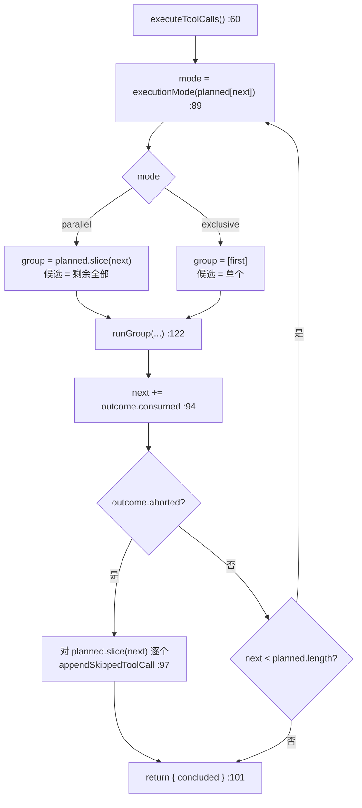
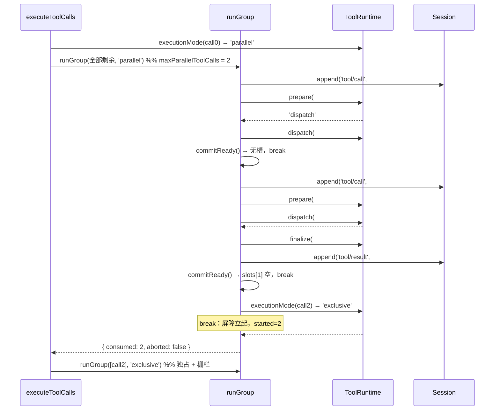

# 03 · agent-loop 侧调度器:分组、滚动池、模型序提交与并发时序

> 分析对象 `dbbaa4a37`。核心源码:`packages/core/agent-loop/src/tool-calls.ts`(290 行,调度器全部实现)、`packages/core/tools/src/index.ts:1266`(分类器)、`packages/core/agent-loop/src/constants.ts`(默认并发上限)、`packages/core/agent-loop/src/agent.ts:486-492`(调用方与回流)。
> 第五章第五节给了 `fillPool` 的一段摘录;本篇覆盖三个函数的完整状态机、每一次 `await` 之后的语义,以及四段式接口在并发下的时序约束。

---

## 一、三层结构

调度器不是一个循环,而是三个嵌套的层:第 1 层 `executionMode()` 决定**单个调用**能不能与兄弟重叠;第 2 层 `runGroup()` 决定**池的容量**与**提交顺序**;第 3 层 `executeToolCalls()` 决定**组之间的屏障**。

```text
executeToolCalls()                                   tool-calls.ts:60
  按「首个未提交调用的 executionMode」切出 group,交给 runGroup,
  累加 consumed,冒泡 concluded / aborted
  └─ runGroup()                                      tool-calls.ts:122
       一个 group 的生命周期:滚动池(可并发)+ 提交游标(严格模型序)
       ├─ startCall(i)   :165   有序:append('tool/call') → await prepare → 分流
       ├─ fillPool()     :199   补池:startCall → commitReady,循环到上限
       ├─ commitReady()  :147   提交:slot.needsPost ? finalize : finish → append('tool/result')
       └─ 主循环          :221   race → 删槽 → commitReady → 复查 abort → fillPool
  └─ executionMode()                                 index.ts:1266  分类,只在注册表侧决定
```



---

## 二、组外:分类与切分

```typescript
// packages/core/agent-loop/src/tool-calls.ts:60（核心）
const agent = ctx.agents.requireInitiator()
const { session } = agent
// Inputs are distinct because tools/execute wrappers may replace `exec.signal`.
const planned: PlannedCall[] = toolCalls.map(block => ({ block,
  exec: { callId: block.id, name: block.name, arguments: parseArguments(block.arguments), agent, signal } }))
let next = 0
let concluded = false
while (next < planned.length) {
  // Commit before classifying again so registry changes affect unstarted calls.
  const first = planned[next]!
  const mode = ctx.tools.executionMode(first.exec).kind
  const group = mode === 'parallel' ? planned.slice(next) : [first]
  const outcome = await runGroup(ctx, turn, step, group, mode, signal, acceptContext)
  next += outcome.consumed
  concluded ||= outcome.concluded
  if (outcome.aborted) {
    for (const call of planned.slice(next)) appendSkippedToolCall(session, turn, step, call.block)
    return { concluded }
  }
}
return { concluded }
```

### 2.1 每个调用一个独立的 `exec` 对象

`:71` 的注释点出了 `map` 的必要性:一个 `tools/execute` wrapper 会**原地改写 `exec.signal`**(`index.ts:1534`、`timeout-policy:66`),如果所有调用共享一个 `exec`,第一个 wrapper 的信号替换会泄漏给兄弟。`map` 为每个 block 造一个新对象,它们只共享同一个 `signal` 引用和一个 `agent`。

### 2.2 `parseArguments`:容错但不掩盖错误

```typescript
// packages/core/agent-loop/src/tool-calls.ts:105
function parseArguments(raw: string): unknown {
  try { return raw ? JSON.parse(raw) : {} }
  catch { return raw }
}
```

| 输入 | 结果 | 理由 |
|---|---|---|
| `''`(空串) | `{}` | 无参数工具(如 `job_list`)的模型输出常是空串;映射成 `{}` 才能过校验 |
| 合法 JSON | 解析值 | — |
| 非法 JSON | **原文返回** | 错误由工具自己的 schema 校验产出,不由调度器伪造。工具看到 `arguments` 是字符串,`required` 字段找不到,于是报出准确的参数错误 |

第三条让"模型吐了截断的 JSON"变成一条普通的 `ToolArgsError`,走完整管道(含 post-execute),而不是在调度层变成一个无上下文的失败。

### 2.3 `consumed` 的两种取值

`runGroup` 的 `GroupOutcome.consumed`(`:34-39`)有两个语义分支,外层循环完全依赖它:

| 情形 | `consumed` | 后果 |
|---|---|---|
| 正常完成 | `started`(`:246`) | exclusive 组恒为 1;parallel 组是**实际启动数**——若被重分类截断,`started < group.length`,`next` 只推进到屏障处,外层重新用 `executionMode` 决定下一组 |
| 取消 | `group.length`(`:242`) | `next` 直接跳过整组,随后 `outcome.aborted` 触发对剩余调用的合成,函数返回 |

`concluded ||= outcome.concluded`(`:95`)让"任一组里任一提交结果标了 `concludesTurn`"冒泡到 `agent.ts:492`,由它决定本轮 step 结束。

---

## 三、组内状态机:`runGroup()`

```typescript
// packages/core/agent-loop/src/tool-calls.ts:122（状态声明）
const { session } = ctx.agents.requireInitiator()
const { maxParallelToolCalls } = ctx.agentLoop.config
const slots: (Slot | undefined)[] = group.map(() => undefined)
// Started slots retain their `tool/call` seq so the result can cite it.
const callSeqs: Array<SessionSeq | undefined> = group.map(() => undefined)
let nextToStart = 0        // 下一个待启动的组内下标
let committed = 0          // 已提交的连续前缀长度（模型序游标）
let started = 0            // 已调用过 startCall 的个数（含只拿到 post/final-result 的）
let aborted: boolean = signal.aborted     // 进入时已取消的组一个都不启动
let concluded = false
let schedulerFailure: { error: unknown } | undefined
const throwSchedulerFailure = (): void => { if (schedulerFailure !== undefined) throw schedulerFailure.error }
const inFlight = new Map<number, Promise<number>>()   // 键 = 组内下标，值 = 该下标的 promise 解析结果
// … commitReady :147 / startCall :165 / fillPool :199
```

### 3.1 六个游标

| 变量 | 行 | 含义 |
|---|---|---|
| `nextToStart` | `:136` | 下一个待启动的组内下标 |
| `committed` | `:137` | 已提交的**连续**前缀长度(模型序游标) |
| `started` | `:138` | 已调用过 `startCall` 的个数(含只拿到 `post-result`/`final-result` 的) |
| `aborted` | `:139` | 初始值就是 `signal.aborted` —— 进入时已取消的组一个都不启动 |
| `concluded` | `:140` | 组内是否出现过 `concludesTurn` |
| `slots` / `callSeqs` | `:133` / `:135` | 按组内下标存"已落定待提交"的槽与它引用的 `tool/call` seq |

`slots` 是数组而非队列,因为提交顺序由**下标**而非落定顺序决定。`callSeqs[i]` 在 `startCall` 里写入,是为了让 `tool/result` 能通过 `sourceEventSeqs: [callSeq]` 精确引用它那一条 `tool/call`(`:289`)。

### 3.2 `commitReady()`:只推进连续前缀

```typescript
// packages/core/agent-loop/src/tool-calls.ts:147
while (committed < group.length) {
  const slot = slots[committed]
  if (slot === undefined) break                      // 只推进连续前缀
  const call = group[committed]
  const result = slot.needsPost
    ? await ctx.tools[TOOL_RUNTIME_SCHEDULER].finalize(slot.exec, slot.result)
    : ctx.tools[TOOL_RUNTIME_SCHEDULER].finish(slot.exec, slot.result)
  appendToolResult(session, turn, step, call!.block, result, callSeqs[committed]!)
  for (const context of result.additionalContexts ?? []) acceptContext(context)
  concluded ||= result.concludesTurn === true
  committed++
}
```

四条性质:

1. **`while` + `break`**:遇到第一个空槽就停。第 2 个调用先完成也不会先落日志——`slots[1]` 被填了但 `slots[0]` 还是 `undefined`,`committed` 就卡在 0。
2. **`needsPost` 决定走哪一段**:`finalize`(async,含 post-execute)还是 `finish`(sync,跳过 post-execute)。这个布尔由 `startCall` 从 `ScheduledToolPreparation.kind` / `ScheduledToolDispatch.kind` 换算而来。
3. **`await finalize` 在这里是串行的**:两次循环迭代之间必然 `await`,所以 post-execute 监听器不会互相重叠(见 §六)。
4. **上下文与 `concluded` 都在提交点处理**(`:157-158`)。`additionalContexts` 通过调用方给的 `acceptContext` 立刻 splice 进 `next-step` inbox;`concludesTurn` 冒泡到 `GroupOutcome`。

### 3.3 `startCall()`:有序阶段 + 分流

```typescript
// packages/core/agent-loop/src/tool-calls.ts:165
const call = group[index]!
callSeqs[index] = appendToolCall(session, turn, step, call.block)   // ① tool/call 先落，再 prepare
started++                                                          // ② 语义是"进入管道"，不是"跑过 body"
const prepared = await ctx.tools[TOOL_RUNTIME_SCHEDULER].prepare(call.exec)   // ③ 有序点
throwSchedulerFailure()
switch (prepared.kind) {
  case 'dispatch': {
    const promise = ctx.tools[TOOL_RUNTIME_SCHEDULER].dispatch(prepared.exec).then(
      (outcome) => { slots[index] = { exec: prepared.exec, result: outcome.result, needsPost: outcome.kind === 'post-result' }; return index },
      (error: unknown) => { schedulerFailure ??= { error }; return index },     // ④ 失败就地吞掉，promise 永不 reject
    )
    inFlight.set(index, promise)
    break
  }
  case 'post-result':  slots[index] = { exec: prepared.exec, result: prepared.result, needsPost: true }; break
  case 'final-result': slots[index] = { exec: prepared.exec, result: prepared.result, needsPost: false }; break
  default: assertNever(prepared, 'tool-call scheduler prepare result')
}
```

六个要点:

1. **`tool/call` 事件先落,再 prepare**(`:168`)。所以被拒绝、被取消、甚至参数快照失败的调用都有一条 `tool/call`——因为模型确实发出了这个调用,日志必须记它。`callSeqs[index]` 的注释(`:134`)写明用途:"Started slots retain their `tool/call` seq so the result can cite it."
2. **`started++` 在 prepare 之前**(`:169`)。语义是"这个调用已经进入了管道",不是"body 已经跑过"。取消合成时用 `group.slice(started)` 正是靠这个定义(`:241`)。
3. **`await prepare` 是串行点**。`fillPool` 每次都 `await startCall(...)`,所以第 N+1 个调用的 pre-execute 瀑布一定在第 N 个的 pre-execute 全部落定之后才开始。
4. **`dispatch` 的 rejection 被就地吞掉并记录**(`:179-182`)。两个回调都 `return index`,所以 `inFlight` 里的 promise **永不 reject**;`Promise.race` 因此不会抛,失败通过 `throwSchedulerFailure()` 在五个检查点(`:171`、`:208`、`:210`、`:224`、`:226`)显式浮出。这个设计让"某个 dispatch 炸了"和"某个 dispatch 成功了"在池循环里是同一件事,直到真正需要处理失败时才区分。
5. **`needsPost` 的来源**:
   - `dispatch` 分支:看 `ScheduledToolDispatch.kind`。dispatch **成功路径恒为** `post-result`(`index.ts:1581`),只有它自己的 catch 才产 `final-result`(`:1587`)。
   - `prepare` 的 `post-result`:拒绝/取消 → `needsPost: true`。
   - `prepare` 的 `final-result`:折叠/参数失败/前置门抛错 → `needsPost: false`。
6. **`slots[index]` 在 `.then` 回调里写入**,而 `Promise.race` 拿到的是**这个 `.then` 的返回值**,所以 race 的 continuation 一定晚于槽位写入——主循环不需要额外同步就能保证"race 拿到的下标,其槽位已经填好"。

### 3.4 `fillPool()`:滚动补池 + 惰性重分类

```typescript
// packages/core/agent-loop/src/tool-calls.ts:199
while (!aborted && nextToStart < group.length && inFlight.size < maxParallelToolCalls) {
  // Re-read later modes after ordered commits so registry changes can create a barrier.
  const nextCall = group[nextToStart]!
  if (nextToStart > 0 && mode === 'parallel'
    && ctx.tools.executionMode(nextCall.exec).kind !== 'parallel') break
  await startCall(nextToStart)      // 启动一个（有序）
  nextToStart++
  throwSchedulerFailure()
  await commitReady()               // 立刻尝试提交一批（有序）
  throwSchedulerFailure()
  // Abort may arrive while pre-execute awaits.
  if (signal.aborted) aborted = true
}
```

三条件与两个动作:

| 条件 | 行 | 作用 |
|---|---|---|
| `!aborted` | `:200` | 取消后不再启动新的 |
| `nextToStart < group.length` | `:200` | 组内还有待启动 |
| `inFlight.size < maxParallelToolCalls` | `:200` | 池未满(默认 10,`constants.ts:5`;可配,`index.ts:314`) |

| 动作 | 行 | 作用 |
|---|---|---|
| 重分类检查 | `:204-205` | `nextToStart > 0`(组首不复查,模式已由它决定)且组模式是 `parallel` 时,重读 `executionMode`;不再 parallel 就 `break`,把屏障留给外层循环下一组 |
| `await startCall` → `await commitReady` | `:206-209` | **启动一个,立刻尝试提交一批**。这是"只有 dispatch/body 并发"的实现:pre-execute 与 post-execute 交替串行 |

重分类的注释("Re-read later modes after ordered commits so registry changes can create a barrier")解释了两件事:时机是"有序提交之后"——因为提交点正是注册表可能被改变的时机(`tools/change` 的订阅者、工具自己注册新工具、agent 卸载);效果是"注册表变化可以立起屏障"。

**barrier 是怎么落到下一轮的**:`break` 退出 `fillPool`,`runGroup` 的 `while (inFlight.size > 0)` 把池排空并提交,**然后** `return { consumed: started, ... }`。外层 `next += started` 落在那个被重分类为 exclusive 的调用**之前**,下一轮外层循环重新 `executionMode` 分类,于是它作为新组(单元素)独占执行。整个过程不需要任何"屏障队列"结构。

### 3.5 主循环:race → 提交 → 复查 → 补池

```typescript
// packages/core/agent-loop/src/tool-calls.ts:216
// Ordered pre-execute may await; only dispatch/body overlaps. A scheduler
// failure stops new dispatches and reaches the turn boundary after every
// already-started dispatch settles.
try {
  await fillPool()
  while (inFlight.size > 0) {
    const settledIndex = await Promise.race(inFlight.values())
    inFlight.delete(settledIndex)
    throwSchedulerFailure()
    await commitReady()
    throwSchedulerFailure()
    // Abort may arrive while a tool or ordered commit awaits.
    if (signal.aborted) aborted = true
    await fillPool()
  }
} catch (error: unknown) {
  schedulerFailure ??= { error }
  await Promise.allSettled(inFlight.values())
  throw schedulerFailure.error
}
```

**循环不变式**:离开 `while` 时 `inFlight.size === 0`。数组槽位可能还有未提交的,但那些都对应 `committed` 之后的空位——不可能,因为每个进过 inFlight 的下标都会被 commit;`committed !== started` 的检查(`:245`)就是这条不变式的断言。

**abort 的两个检查点**(`:212`、`:229`)注释都写了理由:"Abort may arrive while pre-execute awaits" / "Abort may arrive while a tool or ordered commit awaits"。两个位置都在 `await` 之后,且都在 `commitReady()` **之后**——所以取消到来时,已经跑完管道的调用会先落日志,再进入"不再启动新的"状态。

### 3.6 组内并发的时间线

一个 4 调用 parallel 组、`maxParallelToolCalls = 2` 的近似轨迹(`P` = prepare,`D` = dispatch/body,`C` = commit):

```text
startCall#0  P0──────────┐
                    D0───────────┐
commitReady              (无槽可提交)
startCall#1  ────────P1──────┐   │
                        D1───┼───┼──┐
commitReady                  │   │  │
  ├─ slots[0] 已填 → finalize#0 ═══╪══╡  ← 跑 post-execute
  └─ slots[1] 未填 → break       │  │
```

两条准确的说法:**任意两个 `P` 之间、任意两个 `C` 之间都不重叠**(全在 `fillPool`/主循环这条单线程 await 链上);**`D` 与 `P`/`C` 可以重叠**(`D` 是唯一被丢进 `inFlight` 的 promise)。ASCII 只能示意——真实执行中 `P`/`C` 与任何 `D` 都可能交错。

---

## 四、取消收尾:合成结果与 replay 合法性

```typescript
// packages/core/agent-loop/src/tool-calls.ts:238
if (aborted) {
  // Started calls and accepted context settle first; every remaining model
  // call then receives an ordered synthetic result before the turn aborts.
  for (const call of group.slice(started)) appendSkippedToolCall(session, turn, step, call.block)
  return { consumed: group.length, aborted: true, concluded }
}
if (committed !== started) throw new Error('tool-call scheduler: uncommitted settled calls')
return { consumed: started, aborted: false, concluded }
```

```typescript
// packages/core/agent-loop/src/tool-calls.ts:250
function appendSkippedToolCall(session, turn, step, block): void {
  const callSeq = appendToolCall(session, turn, step, block)
  appendToolResult(session, turn, step, block, {
    content: [{ type: 'text', text: 'Error: tool call aborted before dispatch' }],
    isError: true,
    error: { message: 'tool call aborted before dispatch',
      info: { name: 'AbortError', code: TOOL_ABORTED_BEFORE_DISPATCH } },
  }, callSeq)
}
```

### 4.1 为什么必须合成

会话日志是**唯一权威**(仓库根约定的"Model-visible ⟺ logged")。取消发生时,`assistant/message`(含全部 N 个 `tool-call` 块)已经 durable 地落盘(`agent.ts:476`)。如果只有部分调用有结果:`deriveMessages()` 会产出"发了 N 个调用、回来 M 个结果"的消息序列;replay 该会话时"每个 `tool/call` 恰有一个 `tool/result`"的不变量被破坏;客户端 `ToolCallTree` 会把没有结果的调用永远渲染成 running。合成修复全部三条。注意它是**成对**追加的:`appendToolCall` + `appendToolResult`(`:251-259`),第二条用 `sourceEventSeqs: [callSeq]` 引用第一条(`:289`)。

### 4.2 合成结果与注册表结果的一致性

`tool-calls.ts:17` 从 `@deepseek-ai/dsh-tools` 导入 `TOOL_ABORTED_BEFORE_DISPATCH` 这个**常量**,而不是写字符串字面量。于是调度器合成的 `error.info.code` 与注册表 `toolAbortedBeforeDispatchResult()`(`index.ts:1923-1934`)产出的完全一致;模型可见文本也逐字节相同(`'Error: tool call aborted before dispatch'`,两边分别在 `tool-calls.ts:253` 与 `index.ts:1926`)。

**两个独立生产者、一套词汇**——这正是 `packages/core/agent-loop/src/tool-calls.ts` 顶部注释(`:8-10`)所谓 "Abort records synthetic error results for skipped calls so replay stays valid" 的含义。

### 4.3 `aborted` 的初始值

`let aborted: boolean = signal.aborted`(`:139`)。进入 `runGroup` 时信号已中止的话:`fillPool` 第一个条件为假 → 立即返回;主循环条件为假 → 跳过;`aborted` 为真 → `group.slice(0)`(**全部**)被合成;返回 `consumed: group.length`。于是"step 中途被取消,而这一批调用还没开始任何一个"这条路径不需要任何特殊分支——它与其他取消路径共用同一段收尾代码。

---

## 五、调度器内部失败:不伪造结果

```typescript
// packages/core/agent-loop/src/tool-calls.ts:142
const throwSchedulerFailure = (): void => {
  if (schedulerFailure !== undefined) throw schedulerFailure.error
}
```

```typescript
// packages/core/agent-loop/src/tool-calls.ts:232
} catch (error: unknown) {
  schedulerFailure ??= { error }
  await Promise.allSettled(inFlight.values())
  throw schedulerFailure.error
}
```

| | 取消(`aborted`) | 调度器内部失败(`schedulerFailure`) |
|---|---|---|
| 触发源 | `signal.aborted` | `dispatch` 的 promise reject(即 `TOOL_RUNTIME_SCHEDULER.dispatch` 抛错) |
| 对已启动调用 | 排空 → **提交其结果** | `await Promise.allSettled(inFlight.values())` 排空,**不提交** |
| 对未启动调用 | 逐个 `appendSkippedToolCall` | **不动** |
| 已落的 `tool/call` | 各配一条合成 `tool/result` | **原样保留**,交给 turn 边界的错误处理(`agent.ts:322-335`) |
| 函数结果 | `GroupOutcome{aborted: true}` | **抛出**第一个失败 |

差异的理由:取消是**正常的产品结果**(用户按了停止),会话必须保持可 replay,所以补全;调度器失败是**缺陷信号**,伪造结果会把"调度器坏了"伪装成"工具失败了"。`tool-calls.ts:9-10` 的注释把这条对照写在模块头:"A terminal scheduler failure preserves already-recorded `tool/call` events without fabricating results."

`??=`(`:180`、`:233`)保证**第一个**失败被保留;后续失败不覆盖它。

---

## 六、`TOOL_RUNTIME_SCHEDULER` 四段接口的时序约束

```typescript
// packages/core/tools/src/index.ts:444
export interface ToolRuntimeScheduler {
  /** Materialize input, run the ordered pre-execute/guard gate, and decide what stage follows. */
  prepare(exec: ToolExecutionInput): Promise<ScheduledToolPreparation>
  /** Run only the around-dispatch/body stage. */
  dispatch(exec: ToolRunContext): Promise<ScheduledToolDispatch>
  /** Run post-execute and definition-owned content finalization, then materialize and notify. */
  finalize(exec: ToolRunContext, result: ToolExecutionResult): Promise<ToolExecutionResult>
  /** Run definition-owned content finalization, then materialize and notify without post-execute. */
  finish(exec: ToolRunContext, result: ToolExecutionResult): ToolExecutionResult
}
```

四段的**唯一**时序约束是:对同一次调用 `prepare → dispatch → (finalize | finish)` 顺序执行;`prepare` 不再需要 `dispatch` 时,直接用 `post-result`/`final-result` 短路。除此之外没有任何跨调用约束——那些约束全在调度器里。

### 6.1 并发下的可重叠矩阵

| 阶段 | 实现行 | 可否与「同组其他调用的同一阶段」重叠 | 可否与其他阶段重叠 |
|---|---|---|---|
| `prepare`(pre-execute 瀑布 / `serviceAsk` / `guardReason`) | `startCall:170` | **否**(`fillPool` 逐个 `await`) | **是**:与已在跑的 `dispatch` 重叠 |
| `dispatch`(`tools/execute` + `dispatchToolBody`) | `startCall:174` | **是**,上限 `maxParallelToolCalls` | **是** |
| `finalize`(post-execute + `finishScheduledExecution`) | `commitReady:153` | **否**(循环内 `await`) | **是**:与 `dispatch` 重叠 |
| `finish`(无 post-execute) | `commitReady:154` | **否**(同步函数,天然独占) | 同上 |
| `session.append('tool/call')` | `appendToolCall:168` | **否** | 在 `prepare` 之前 |
| `session.append('tool/result')` | `appendToolResult:156` | **否**,且严格模型序 | 在 `finalize`/`finish` 之后 |

三条推论:

1. **策略监听器看到的调用顺序是确定的**。`tools/pre-execute`、`tools/post-execute` 的监听器可以安全地维护"第几个调用"这类状态,因为有序阶段从不相交(`tool-calls.ts:216-218` 注释:"Ordered pre-execute may await; only dispatch/body overlaps")。
2. **`tools/execute` wrapper 是唯一需要线程安全意识的扩展点**。`timeout-policy` 会原地写 `exec.signal`——因为每个调用有独立 `exec`(§2.1)且 wrapper 在 `finally` 里还原(`timeout-policy:78`),这不会串味。
3. **`isConcurrencySafe` 的义务由此确定**。`index.ts:248-261` 的 JSDoc 要求"不得改动父级持有的状态,共享状态必须容忍并发派发;recorder 竞态只有在可交换或 fail-closed 时才被允许"。这句话在时序上的确切含义就是:并行阶段只有 `dispatch`,它跨越的正是 `await tool.execute(...)`(`index.ts:1539`)。

### 6.2 `exclusive` 的屏障语义

`exclusive` 不是"串行执行",而是**两件事同时成立**:①**独占地执行**——`group = [first]`,没有任何兄弟与之并发;②**排序栅栏**——`runGroup` 返回前必然 `while (inFlight.size > 0)` 排空且 `committed === started`,所以外层 `executeToolCalls` 的下一轮分类不可能与它重叠。② 的实现就是主循环退出条件本身:下一组的 `prepare` 开始时,上一组**连 post-execute 和日志追加都已完成**。

PTC 侧刻意复刻了这条时序,包括"屏障覆盖到 commit":`ptc.ts:405-407` 的注释写明 "The barrier covers post-execute: later starts wait for the exclusive call's full pipeline, as under the native loop."(详见 [05-ptc-mode.md](./05-ptc-mode.md))。

### 6.3 一个端到端的时序图



---

## 七、关键文件/符号索引表

| 符号 | 位置 | 职责 |
|---|---|---|
| `executeToolCalls` | `packages/core/agent-loop/src/tool-calls.ts:60` | 分组循环;`next`/`concluded`;取消后对剩余调用合成 |
| `PlannedCall` / `Slot` / `GroupOutcome` | `tool-calls.ts:21` / `:27` / `:34` | 每个调用一个独立 `exec`;`{exec,result,needsPost}`;`{consumed,aborted,concluded}` |
| `parseArguments` | `tool-calls.ts:105` | 空串→`{}`;非法 JSON 保留原文 |
| `runGroup` | `tool-calls.ts:122` | 一个组的完整生命周期与六个游标 |
| `commitReady` | `tool-calls.ts:147` | 只推进连续模型序前缀;`needsPost` 选 `finalize`/`finish` |
| `startCall` | `tool-calls.ts:165` | append `tool/call` → `await prepare` → 分流 dispatch/post-result/final-result |
| `fillPool` / 主循环 | `tool-calls.ts:199` / `:221` | 三条件滚动补池、惰性重分类;`Promise.race` → 提交 → 复查 abort → 补池 |
| catch / `throwSchedulerFailure` | `tool-calls.ts:142` / `:232` | 失败不伪造结果,排空后抛第一个错误 |
| `appendSkippedToolCall` / `appendToolCall` / `appendToolResult` | `tool-calls.ts:250` / `:263` / `:269` | 取消合成;`sourceEventSeqs: [callSeq]`;持久化 `error.info` 与 `meta` |
| `DEFAULT_MAX_PARALLEL_TOOL_CALLS` / `maxParallelToolCalls` 配置 | `packages/core/agent-loop/src/constants.ts:5` / `src/index.ts:314`、`:396` | `10`;正整数校验(`:191-195`) |
| `ToolRuntime.executionMode` | `packages/core/tools/src/index.ts:1266` | fail-closed 分类;每次重跑 `view()` |
| `TOOL_RUNTIME_SCHEDULER` / `ScheduledToolPreparation` / `ScheduledToolDispatch` | `index.ts:459`(接口 `:444`)/ `:424` / `:434` | 四段接口与阶段可见性编码 |
| `step()` 中的调用与回流 / `acceptContext` 闭包 | `packages/core/agent-loop/src/agent.ts:486-492` / `:490` | `filter(tool-call)` → `executeToolCalls` → `concluded`;`inbox.splice('next-step', …)` |
