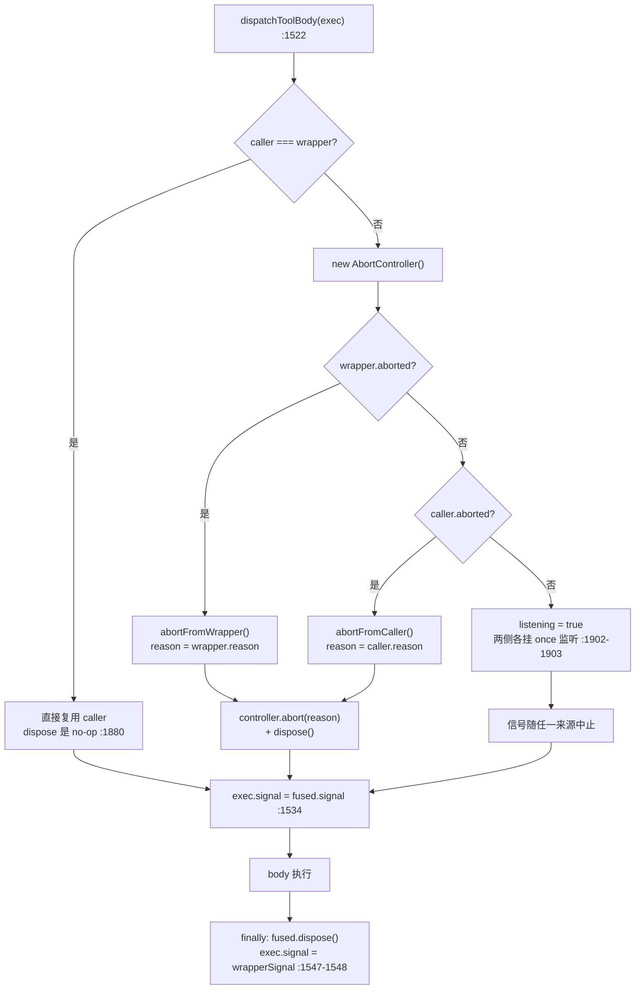

# 04 · 取消与超时:双信号融合、两个规范码与协作式超时

> 分析对象 `dbbaa4a37`。核心源码:`packages/core/tools/src/index.ts:1500-1549`、`:1870-1934`、`:756-765`、`:800-803`;超时插件 `packages/guard/timeout-policy/src/index.ts`(81 行);共享超时算术 `packages/util/timeout/src/index.ts`(190 行);调度器侧 `packages/core/agent-loop/src/tool-calls.ts:199-260`。
> 第五章第七节给了结论;本篇给出信号对象的生命周期、每一个取消检查点的进入条件,以及"模型看到的到底是哪一条错误"的完整判定链。

---

## 一、三个信号,三层所有权

一次工具调用最多涉及三个 `AbortSignal`,它们的所有者互不相同:

| 信号 | 所有者 | 生命周期 | 谁能替换它 |
|---|---|---|---|
| **调用者信号**(`callerSignal`) | step 的 `phase.abort`(`agent.ts:243`),经 `executeToolCalls(signal)` 传下来 | 整个 step | **没有人**。它被单独存在 `cancellationStates` WeakMap 里(`index.ts:1409-1412`) |
| **wrapper 信号**(`exec.signal`) | 当前 `tools/execute` 监听器 | 只在该监听器的委托期内 | `tools/execute` 瀑布里任意 wrapper(`index.ts:145-154` 契约) |
| **融合信号**(fused) | `dispatchToolBody` 内的 `AbortController` | 单次 dispatch | — |

```typescript
// packages/core/tools/src/index.ts:755
/** Caller cancellation and dispatch state kept outside the around-wrapper view. */
interface ToolCancellationState {
  readonly callerSignal: AbortSignal
  bodyInvoked: boolean
}
```

```typescript
// packages/core/tools/src/index.ts:800
/** Original caller cancellation, kept outside the wrapper-mutable execution object. */
private cancellationStates = new WeakMap<ToolRunContext, ToolCancellationState>()
```

`exec.signal` 之所以必须可变,是因为 `timeout-policy` 这类 wrapper 需要"给 body 一个更早到期的信号";而 `callerSignal` 必须不可变,否则一个 wrapper 换掉信号就等于**关掉了用户的取消按钮**。把调用者信号放在 wrapper 视野之外的 WeakMap 里,是这两条需求的唯一交点。

---

## 二、`fuseToolSignals()`:dispatch 作用域的信号中继

```typescript
// packages/core/tools/src/index.ts:1875
/**
 * Fuse caller and wrapper cancellation without nesting `AbortSignal.any`.
 * Keeping the relay dispatch-scoped also removes listeners when work settles.
 */
function fuseToolSignals(caller: AbortSignal, wrapper: AbortSignal): FusedToolSignal {
  if (caller === wrapper) return { signal: caller, dispose() {} }        // 同对象零开销

  const controller = new AbortController()
  let listening = false
  const dispose = (): void => {
    if (!listening) return                                               // 幂等，以 listening 为守卫
    listening = false
    caller.removeEventListener('abort', abortFromCaller)
    wrapper.removeEventListener('abort', abortFromWrapper)
  }
  const abortFrom = (source: AbortSignal): void => {
    const reason: unknown = source.reason
    controller.abort(reason)
    dispose()
  }
  const abortFromCaller = (): void => { abortFrom(caller) }
  const abortFromWrapper = (): void => { abortFrom(wrapper) }

  if (wrapper.aborted) abortFromWrapper()          // 预中止时 wrapper 优先
  else if (caller.aborted) abortFromCaller()
  else {
    listening = true
    caller.addEventListener('abort', abortFromCaller, { once: true })
    wrapper.addEventListener('abort', abortFromWrapper, { once: true })
  }
  return { signal: controller.signal, dispose }
}
```

```typescript
// packages/core/tools/src/index.ts:761
/** One dispatch-scoped fused signal plus listener cleanup after the body settles. */
interface FusedToolSignal {
  readonly signal: AbortSignal
  dispose(): void
}
```


<details><summary>Mermaid 源码</summary>



</details>

### 2.1 四条实现细节

1. **同一对象时零开销**(`:1880`)。没有任何 wrapper 参与时(最常见的路径),`caller === wrapper`,直接复用调用者信号,不建 controller、不挂监听器。`dispose` 是空函数。
2. **预先中止的检查顺序是 wrapper 优先**(`:1898-1899`)。两个信号都已中止时,`reason` 取自 wrapper。这是有意的:如果 wrapper 已经中止,它的 reason 才携带 wrapper 自己的分类(例如 `TimeoutReason`),而调用者的取消理由对这次 dispatch 已经没有信息量。
3. **`dispose()` 幂等且以 `listening` 为守卫**(`:1884-1889`)。监听器以 `{ once: true }` 挂载,所以中止时浏览器/Node 自己会摘掉;`dispose` 里的 `removeEventListener` 处理的是"未中止就正常落定"的情况——这才是 `finally` 调用它的真正目的。
4. **不嵌套 `AbortSignal.any`**(注释 `:1875-1878`)。`AbortSignal.any` 的返回信号会把上游信号永久保留在它的 source 列表里;而一个 step 内可能有数百次工具调用,每次 dispatch 都持有一串祖先信号会形成不可回收的信号链。dispatch 作用域的中继在 `finally` 里把监听器摘干净。

### 2.2 `finally` 里的还原

```typescript
// packages/core/tools/src/index.ts:1546
} finally {
  fused.dispose()
  exec.signal = wrapperSignal
}
```

`exec.signal` 被还原成 **wrapper 信号**(不是调用者信号)。理由是让下游看到"上游是谁":

- `tools/post-execute` 监听器读 `exec.signal` 时看到的是 wrapper 的信号,不是某个 wrapper 已经中止的派生信号——`timeout-policy:62-65` 的注释是同一条约定在插件侧的表达。
- 但**注册表自己不看 `exec.signal`**:`callerCancelled()` 永远读 WeakMap 里的 `callerSignal`(`index.ts:1500-1505`)。所以还原不影响取消判定。

`isAborted()` 被写成函数而不是内联属性读(`:1870-1873`),注释点明原因:跨 `await` 的真实状态变化不该被控制流分析当成同步不可变而窄化掉。

---

## 三、两个规范码

```typescript
// packages/core/tools/src/index.ts:461
/** Canonical error code for cancellation after a tool body was invoked. */
export const TOOL_ABORTED = 'ABORTED'

/** Canonical error code for cancellation before a tool body was invoked. */
export const TOOL_ABORTED_BEFORE_DISPATCH = 'ABORTED_BEFORE_DISPATCH'
```

### 3.1 唯一判据:`bodyInvoked`

```typescript
// packages/core/tools/src/index.ts:1507
/** Canonical cancellation outcome selected by whether the tool body started. */
private cancellationResult(exec: ToolRunContext, prior?: ToolExecutionResult): ToolExecutionResult {
  const state = this.cancellationStates.get(exec)
  /* v8 ignore next -- only registry-minted executions reach the staged scheduler methods */
  if (state === undefined) throw new Error('tool registry scheduler invariant violated: missing cancellation state')
  return state.bodyInvoked
    ? toolAbortedResult(prior)
    : toolAbortedBeforeDispatchResult(prior)
}
```

`bodyInvoked` 被写为 `true` 的位置**只有一个**:

```typescript
// packages/core/tools/src/index.ts:1536
const tool = this.resolveExecution(exec.name, exec.agent, exec.parent !== undefined)
if (!tool) throw new ToolNotFoundError(exec.name)
state.bodyInvoked = true
const returned = await tool.execute(exec.arguments, exec)
```

这一行的位置是刻意的:`resolveExecution` **之后**(工具确实存在)、`tool.execute` **之前**(即将调用)。所以:

- 未知工具 / 被折叠的名字 → `bodyInvoked` 仍为 `false`;
- 参数快照失败 → 根本没有 `cancellationStates`;
- **body 一抛出就抛出的工具** → 已是 `true`。

### 3.2 两个结果的全部差异

| | `toolAbortedResult`(`:1909`) | `toolAbortedBeforeDispatchResult`(`:1923`) |
|---|---|---|
| 文本 | `Error: tool call aborted` | `Error: tool call aborted before dispatch` |
| `error.message` | `tool call aborted` | `tool call aborted before dispatch` |
| `error.info` | `{ name: 'AbortError', code: 'ABORTED' }` | `{ name: 'AbortError', code: 'ABORTED_BEFORE_DISPATCH' }` |
| `prior.additionalContexts` | 保留(`:1910`) | 保留(`:1924`) |
| 判定点 | `cancellationResult` 的 `bodyInvoked === true` 分支 | `bodyInvoked === false` 分支 |
| 语义 | body 已经跑过,结果被取消取代 | body **从未**被调用 |

两者都把 `prior?.additionalContexts` 带出来。这不只是"少丢点信息":PTC 里子调用把图像经 `exec.deferContext()` 摆渡给外层(`ptc.ts:561-566`),外层 `run_code` 随后被取消时,那些图像必须仍能到达模型——否则"程序已经把图取回来了,只是外层超时"会静默丢掉有效载荷。

`info.name: 'AbortError'` 是稳定标签,不对应任何 JS 错误类名;它在三处独立产出(`index.ts:1916`、`:1930`、`tool-calls.ts:257`),值必须一致。

### 3.3 取消检查点全表

| # | 位置 | 行 | 进入条件 | 产出 |
|---|---|---|---|---|
| 0 | `createExecution` 折叠分支 | `:1419` | 名字被 `ptc` 折叠 **且** 信号已中止 | `final-result: ABORTED_BEFORE_DISPATCH` |
| 1 | `prepareExecution` 入口 | `:1460` | `callerSignal.aborted` | `final-result: ABORTED_BEFORE_DISPATCH` |
| 2 | 审批返回后 | `:1473` | 已取消 **且** `approvalCancelled` | `post-result: ABORTED_BEFORE_DISPATCH` |
| 3 | deny 判定前 | `:1490` | 未被拒绝且已取消 | `post-result: ABORTED_BEFORE_DISPATCH` |
| 4 | body 之前 | `:1530` | fuse 后的信号已中止 | `ABORTED_BEFORE_DISPATCH`,`bodyInvoked` 仍为 false |
| 5 | body 成功之后 | `:1541` | `isAborted(signal)`,且 body 返回了成功结果 | `ABORTED`(带 `prior`) |
| 6 | dispatch 返回前 | `:1582` | `callerCancelled` **且** 结果非错误 | `cancellationResult(exec, result)` |
| 7 | finalize 返回前 | `:1604` | `callerCancelled` **且** post-execute 结果非错误 | `cancellationResult(exec, postResult)` |
| 8 | 调度器 `fillPool` 内 | `tool-calls.ts:212` | 每次 `await startCall`/`commitReady` 之后 | `aborted = true`,停止补池 |
| 9 | 调度器主循环内 | `tool-calls.ts:229` | 每次 `await commitReady`/`Promise.race` 之后 | 同上 |
| 10 | 调度器组收尾 | `tool-calls.ts:238-242` | `aborted` | 对 `group.slice(started)` 合成结果 |

检查点 2 有个不显眼的耦合:它只在 `approvalCancelled` 为真时触发(`index.ts:1473`)。一个 pre-execute 监听器返回 `ask`、而调用在审批期间被取消、但审批服务自己报告 `rejected` 时,取消不会在这里被识别——**检查点 3**(`:1490`)在 deny 判定之后兜住它,但结果是 deny 而不是取消。这是"用户拒绝了"与"用户取消了整个 step"之间的语义区分。

检查点 6 与 7 都带 `!result.isError` 守卫:**取消从不改写一个已经失败的调用**。管道里更具体的失败(拒绝、输出合同违规、body 抛错、`TOOL_TIMEOUT`)优先于"被取消了"这条泛化信息。

---

## 四、body quiescence:取消不放弃 promise

```typescript
// packages/core/tools/src/index.ts:217
/**
 * Run one accepted call and return only its canonical lossless-JSON value.
 * Async work must observe or forward `exec.signal` and settle only after its
 * owned work reaches quiescence. The registry preserves caller cancellation
 * through around-dispatch signal replacement and does not abandon this
 * promise, but it cannot hard-kill same-process code.
 * ...
 */
execute(args: unknown, exec: ToolRunContext): Promise<unknown>
```

这段话是**契约**,不是实现描述。实现上的确切行为:

```text
dispatchToolBody:
  await tool.execute(...)        ← 注册表在这里等,不 race、不 Promise.race、不丢引用
  if (isAborted(signal)) result = toolAbortedResult(result)
  finally { fused.dispose(); exec.signal = wrapperSignal }
```

因此:

- **取消的语义是"不再启动新的 + 等老的落定"**,不是"打断正在跑的"。一个不观察 `exec.signal` 的 body 会跑到底,它的返回值被替换成 `ABORTED`,但它占用的时间与资源不会被回收。JSDoc 的 "cannot hard-kill same-process code" 就是这条限制的原文。
- **信号是通知,不是机制**(`packages/util/timeout/src/index.ts:3-4` 的模块注释同义:"The library only notifies through abort signals; each capability still owns the mechanism that stops its work")。真正能停下的东西是子进程、worker、网络请求——它们各自把 `exec.signal` 转成自己的终止手段。
- **工具声明的 `timeoutMs` 因此附带一条义务**(`index.ts:240-247`):"Declaring it asserts this tool forwards `exec.signal` to a cooperative implementation that can reach quiescence when the signal aborts." 声明超时预算 = 承诺可被协作式停止。

`async` 门(pre-execute 监听器、`serviceAsk`)同理:`index.ts:136-139` 写明 "Async gates must observe `exec.signal`; the registry rechecks cancellation after they settle but never abandons their promise."

### 4.1 PTC 侧的同一条语义

`run_code` 把三个信号串起来:

```typescript
// packages/core/tools/src/ptc.ts:337
const runController = new AbortController()
const onOuterAbort = (): void => { runController.abort(exec.signal.reason) }
exec.signal.addEventListener('abort', onOuterAbort, { once: true })
```

```typescript
// packages/core/tools/src/ptc.ts:628
} finally {
  // Abort sub-dispatches and drain every in-flight dispatch before
  // closing the turn (queued-unstarted ones are abandoned unlogged).
  runController.abort('run_code settled')
  await drainDispatches()
}
```

`runController` 是**运行作用域**的信号:它跟着外层信号中止,也在运行**因任何原因**落定时中止(`abort('run_code settled')`)。于是:

- 已经在飞的子派发被中止(`binding` 传给子调用的 `signal` 就是它,`ptc.ts:477`);
- 还在队列里的未启动条目被 `abandon()` 丢弃,**且不落任何日志**(`ptc.ts:530-532`;`tool/ptc-dispatch-start` 只在真正 `start()` 时追加,`ptc.ts:534`);
- `drainDispatches()`(`ptc.ts:448-456`)先 `await drive()` 让有序 lane 跑到 quiescence,再等 `logWork` 排空——保证每个 settle 事件都落在打开的 turn 内。

`binding` 里的两处 `runOver()` 检查(`ptc.ts:464`、`:591`)是给程序的反馈:一次在派发前("not dispatched"),一次在结果回来之后("result discarded")。两者都抛普通 `Error`,由 code runtime 包装成 `ToolCallError`。

---

## 五、调度器级取消:合成结果

`fillPool` 的循环条件第一个就是 `!aborted`(`tool-calls.ts:200`),`aborted` 在每个 `await` 之后重读(`:212`、`:229`)。一旦中止:

```typescript
// packages/core/agent-loop/src/tool-calls.ts:238
if (aborted) {
  // Started calls and accepted context settle first; every remaining model
  // call then receives an ordered synthetic result before the turn aborts.
  for (const call of group.slice(started)) appendSkippedToolCall(session, turn, step, call.block)
  return { consumed: group.length, aborted: true, concluded }
}
```

**已经启动的调用先落定、再补合成**:`.slice(started)` 而不是 `.slice(nextToStart)`,所以那些"prepare 被取消打断"的调用(它们已计入 `started`)拿到的仍是注册表产出的 `ABORTED_BEFORE_DISPATCH`(走检查点 1 或 3),而不是调度器的合成副本。两条路径产出的字节完全一致——因为它们引用同一个常量与同一段文本(见 [03-scheduler-and-concurrency.md](./03-scheduler-and-concurrency.md) §4.2)。

**为什么必须补**:`assistant/message`(含 N 个 `tool-call` 块)已经 durable 落盘(`agent.ts:476`),"每个 `tool/call` 恰有一个 `tool/result`"是 replay 的合法性前提;缺一条,replay 就不合法。

---

## 六、协作式超时:挂在守卫层的 wrapper

超时**不是**注册表的职责。`ToolRuntime` 只声明式地保存 `timeoutMs`,从不设闸:

| 层 | 角色 |
|---|---|
| `ToolDefinition.timeoutMs`(`index.ts:247`) | 声明:一个正有限毫秒数,**永不进模型视野**(`schemaOf` 白名单只有 name/description/parameters) |
| `register()`(`index.ts:1036-1040`) | 加载期校验:非正、非有限即拒绝 |
| `@deepseek-ai/dsh-tool-call-timeout-policy`(`packages/guard/timeout-policy`) | 执行:读声明、装死线、替换结果 |

```typescript
// packages/guard/timeout-policy/src/index.ts:55
export function apply(ctx: Context): void {
  ctx.on('tools/execute', async (exec, next): Promise<ToolExecutionResult> => {
    const timeoutMs = ctx.tools.get(exec.name, exec.agent)?.timeoutMs
    if (timeoutMs === undefined) return next()          // 未声明预算:不上闸,原样委托

    using d = deadline(exec.signal, timeoutMs, TOOL_TIMEOUT)
    // Swap the derived deadline onto exec for dispatch, then restore the
    // caller's own signal so post-execute listeners never see this plugin's
    // (possibly already-aborted) timeout signal.
    const upstream = exec.signal
    exec.signal = d.signal
    try {
      const result = await next()
      // If OUR timer fired (scoped by code — a nested outer deadline reads as
      // undefined here), the tool saw the abort and reached quiescence; replace
      // whatever it returned with the structured TOOL_TIMEOUT the model sees.
      if (timeoutOf(d.signal, TOOL_TIMEOUT) !== undefined) return toolTimeoutResult(timeoutMs)
      return result
    } finally { exec.signal = upstream }
  })
}
```

### 6.1 为什么是 `tools/execute` 而不是 guard

插件名带 `guard/` 前缀,但接的是 **`tools/execute` 瀑布**(`:56`)——因为只有 around 阶段能合法改写 `exec.signal`(`index.ts:145-154`)。`ctx.tools.guard()` 是单调的、同步的、只能返回拒绝理由或 `undefined`(`index.ts:704`),它无法"给 body 一个更早到期的信号"。**"守卫层"描述的是策略强度,不是事件名**。

`ctx.tools.get(exec.name, exec.agent)?.timeoutMs`(`:57`)用的是**呈现无关**的 `get`,不是 `resolveExecution`。这在 PTC 模式下是必须的:一次子派发(`parent` 已设)与一次模型直呼走的是同一个定义,超时策略对两者一致;而 `get` 在两种 mode 下都返回同一个定义。

### 6.2 `deadline()` 的实现

```typescript
// packages/util/timeout/src/index.ts:91
export function deadline(upstream: AbortSignal | undefined, timeoutMs: number, code: string): Deadline {
  if (timeoutMs <= 0) {                     // 内部 no-timer 哨兵:后台工作
    return { signal: upstream ?? new AbortController().signal, [Symbol.dispose]() {} }
  }
  assertTimerDelay(timeoutMs, 'deadline timeoutMs')      // 正、有限、≤ MAX_TIMER_DELAY_MS
  const timer = new AbortController()
  const id = setTimeout(() => { timer.abort(new TimeoutReason(code, timeoutMs)) }, timeoutMs)
  return {
    // AbortSignal.any adopts the reason of whichever source aborts FIRST, so a
    // race resolves to a single cause: timeoutOf() reads TimeoutReason only
    // when the timeout won, and upstream-wins leaves an ordinary abort reason.
    signal: upstream !== undefined ? AbortSignal.any([upstream, timer.signal]) : timer.signal,
    [Symbol.dispose]() { clearTimeout(id) },
  }
}
// packages/util/timeout/src/index.ts:12 —— TimeoutReason 携带 capability 自己的 code
export class TimeoutReason extends Error {
  override name = 'TimeoutReason'
  constructor(readonly code: string, readonly timeoutMs: number) { super(`${code} after ${timeoutMs}ms`) }
}
// packages/util/timeout/src/index.ts:184 —— 按 code 区分"我的超时"与"上游取消/外层超时"
export function timeoutOf(x: AbortSignal | { reason?: unknown }, code?: string): TimeoutReason | undefined {
  const reason: unknown = x.reason
  if (!(reason instanceof TimeoutReason)) return undefined
  return code === undefined || reason.code === code ? reason : undefined
}
```

四层设计:

1. **`TimeoutReason` 携带 capability 自己的 `code`**(`:19`)。`timeout-policy` 的 `TOOL_TIMEOUT`(`:25`)与共享库的 `code` 参数是**同一个值**,注释 `timeout-policy:18-24` 说明了原因:它既是内部 `deadline` 的分类码,也是替换结果上 `error.info.code`。一个 code 只有一处定义。
2. **`AbortSignal.any` 采用先中止者的 reason**(`:107-110` 注释)。于是 `timeoutOf(d.signal, TOOL_TIMEOUT)` 只在**超时赢了**的时候命中;上游取消赢了的话 reason 是普通的中止理由,`timeoutOf` 返回 `undefined`,wrapper 于是把结果原样交给注册表——此时调用者信号也已是 aborted,注册表在检查点 6/7 产出 `ABORTED*`。**两条路径互斥,不会出现"超时"和"用户取消"同时被报告。**
3. **`code` 的作用域防止嵌套误判**(`:181-183`):另一个 `tools/execute` wrapper 的外层死线先炸时,它的 `TimeoutReason` 带的是别的 code,`timeoutOf(d.signal, TOOL_TIMEOUT)` 读到 `undefined`,于是被当成"普通上游取消"——这正是期望的行为。
4. **`using` 保证清定时器**(`timeout-policy:61`):`Deadline[Symbol.dispose]` 是 `clearTimeout(id)`(`:111`),`using` 在作用域退出时调用,所以 `finally { exec.signal = upstream }` 与 `dispose` 的次序无需手写。

### 6.3 超时结果与"为什么它不会被取消改写"

```typescript
// packages/guard/timeout-policy/src/index.ts:41
function toolTimeoutResult(timeoutMs: number): ToolExecutionResult {
  const message = `tool call timed out after ${timeoutMs}ms`
  return {
    content: [{ type: 'text', text: `Error: ${message}` }],
    isError: true,
    error: { message, info: { name: 'ToolTimeoutError', code: TOOL_TIMEOUT } },
  }
}
```

它经过的完整判定链:

```text
body 收到 d.signal,被中止 → 工具自己观察信号、到达 quiescence、返回它自己的取消结果
  ↓ wrapper 检查 timeoutOf(d.signal, TOOL_TIMEOUT) ≠ undefined
  → 返回 toolTimeoutResult(timeoutMs)          （成功路径被替换）
  ↓ normalizeDispatchResult(index.ts:1816)
  → canonicalResults 未命中 → isError 分支 → 原样保留 error/content,重新标 canonical
  → 于是它进入后续管道的身份变成"注册表认可的失败结果"
  ↓ dispatchScheduledExecution 返回前（检查点 6,index.ts:1582）
  → callerCancelled(exec) 为假（调用者没取消）→ 不改写
  ↓ postExecute（:1732）
  → 默认 accept → 保留 TOOL_TIMEOUT
  ↓ finishScheduledExecution
  → materializeFinalResult → tools/result
```

**用户在超时同时按了停止呢?** 调用者信号 aborted → 检查点 6 条件为真,但守卫是 `!resultWithDeferredContexts.isError` —— 结果已是错误,**不改写**。所以模型看到的仍是 `TOOL_TIMEOUT`。这是"错误更具体者胜出"在代码里的确切形式:`ABORTED` 只在结果**本来会成功**时才取代它。

---

## 七、模型侧看到的结果差异

| 场景 | `content[0].text` | `error.info` | 谁能区分 |
|---|---|---|---|
| 调用者取消,**body 已跑** | `Error: tool call aborted` | `{ name:'AbortError', code:'ABORTED' }` | 模型只能读文本;插件读 `info.code` |
| 调用者取消,**body 未跑** | `Error: tool call aborted before dispatch` | `{ name:'AbortError', code:'ABORTED_BEFORE_DISPATCH' }` | 同上 |
| 调度器合成的未启动调用 | `Error: tool call aborted before dispatch` | 同上(同一个常量) | 与上一行**无差别**——这是有意的 |
| 本插件超时 | `Error: tool call timed out after <ms>ms` | `{ name:'ToolTimeoutError', code:'TOOL_TIMEOUT' }` | 文本已足够;`code` 供重试/沙箱插件路由 |
| 外层 wrapper 超时赢 | 由外层插件决定;本插件读到 `undefined` 后原样委托 | — | 嵌套死线不误报 |
| pre-execute / guard 拒绝 | `Error: <denialReason>` | **无 `info`** | 拒绝理由是人类文本 |
| PTC 程序内子调用失败 | `ToolCallError`,`toolName` 标识失败工具(`ptc.ts:624`) | — | 子调用**永不回到模型上下文**(`tool/ptc-dispatch` 是仅日志事件),只有外层 `run_code` 的渲染文本进历史 |

三条对模型设计有直接影响的结论:

1. **模型永远看不到 `info`**。模型内容里只有 `Error: <message>` 文本(`toolErrorResult`,`index.ts:1860-1868`),`error.info` 走的是**持久化事件字段**(`tool-calls.ts:285` 的 `...result.error?.info`)与插件路由。这是一条严格的分离:分类是给代码看的,文本是给模型看的。
2. **"取消"与"拒绝"用不同的措辞**。取消说 "tool call aborted",拒绝说具体理由。两者都是 `isError: true`,都**不结束 turn**(只有 `concludesTurn` 或 LLM 停止才结束),所以模型下一 step 仍能自我纠正。
3. **PTC 内部失败的信息被刻意收窄**(`ptc.ts:594-598` 注释):"The worker turns a binding rejection into ToolCallError and adds only the binding name. Native content and internal error metadata stay outside the program-facing failure contract." 程序拿到 `toolName` + 人类可读 `message`,拿不到原生 `content` 与 `info`。

---

## 八、关键文件/符号索引表

| 符号 | 位置 | 职责 |
|---|---|---|
| `ToolCancellationState` / `cancellationStates` / `callerCancelled` / `cancellationResult` | `index.ts:756` / `:801` / `:1500` / `:1508` | `{ callerSignal, bodyInvoked }` 的载体(在 wrapper 视野之外的 WeakMap 里);读原始调用者信号;按 `bodyInvoked` 二选一 |
| `bodyInvoked = true` | `index.ts:1538` | 唯一写入点,在 `resolveExecution` 之后、`execute` 之前 |
| `FusedToolSignal` / `fuseToolSignals` / `isAborted` | `index.ts:762` / `:1879` / `:1870` | dispatch 作用域信号中继;同对象零开销;预中止时 wrapper 优先;函数形式的属性读避免控制流窄化 |
| `dispatchToolBody` | `index.ts:1522` | fuse → body → `finally` 还原 |
| `TOOL_ABORTED` / `TOOL_ABORTED_BEFORE_DISPATCH` | `index.ts:462` / `:465` | 两个规范码 |
| `toolAbortedResult` / `toolAbortedBeforeDispatchResult` | `index.ts:1909` / `:1923` | 保留 `prior.additionalContexts` |
| `serviceAsk` 的 `approvalCancelled` / `execute` 的取消契约 / `timeoutMs` 义务 | `index.ts:1711` / `:217-222` / `:240-247` | 只有 `cancelled` 一条带它;"does not abandon this promise, but it cannot hard-kill same-process code";声明超时 = 承诺协作式可达 quiescence |
| `TOOL_TIMEOUT` / `toolTimeoutResult` / `apply` | `packages/guard/timeout-policy/src/index.ts:25` / `:41` / `:55` | 既是内部 deadline code 也是结果 `info.code`;替换结果;`tools/execute` wrapper 全流程 |
| `TimeoutReason` / `deadline` / `timeoutOf` / `MAX_TIMER_DELAY_MS` | `packages/util/timeout/src/index.ts:12` / `:91` / `:184` / `:25` | 携带 capability code;`AbortSignal.any` + `Symbol.dispose`;按 code 区分超时与取消;`2147483647` |
| `runController` / `onOuterAbort` | `packages/core/tools/src/ptc.ts:337-339` | 运行作用域信号,跟随外层并随运行落定中止 |
| `drainDispatches` | `ptc.ts:448` | `await drive()` + 排空 `logWork` |
| `runOver()` 两处检查 | `ptc.ts:464`、`:591` | 程序侧 "not dispatched" / "result discarded" |
| `aborted` 与合成 | `packages/core/agent-loop/src/tool-calls.ts:200-243` | 停止补池 → 排空已启动 → 对 `slice(started)` 合成 |
| `appendSkippedToolCall` | `tool-calls.ts:250` | 成对补 `tool/call` + `tool/result`,复用 `TOOL_ABORTED_BEFORE_DISPATCH` 常量 |
