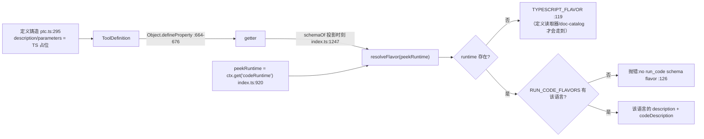

# 05 · PTC(`run_code`)模式:契约、SDK 投影、调度 lane、背压与折叠

> 分析对象 `dbbaa4a37`。核心源码:`packages/core/tools/src/ptc.ts`(678 行)、`ts-types.ts:297`、`py-types.ts:763`、`types.ts`、`index.ts:847-993`(prompt 侧)与 `index.ts:1298-1434`(折叠判定)。代码块均为**核心截取**。

---

## 一、定位:传输不在注册层里

```text
ToolRuntime.view(scope)                       index.ts:1179
  if (this.modeFor(scope) !== 'native')
    → visible.set(RUN_CODE_NAME, this.requireCodeTransport())
requireCodeTransport()                        index.ts:914
  this.ptcTransport ??= createRunCodeTool(this, { requireRuntime, peekRuntime, maxParallel, shapeDispatchLog })
```

```typescript
// packages/core/tools/src/index.ts:905 —— 见 :905-913 的完整理由
private requireCodeTransport(): ToolDefinition {
  this.ptcTransport ??= createRunCodeTool(this, {
    requireRuntime: () => this.requireCodeRuntime(this.defaultMode),
    // The language-aware description/parameters getters read the runtime
    // without demanding one, so a native-default process can still project
    // the transport for an agent that chose code.
    peekRuntime: () => this.ctx.get('codeRuntime'),
    maxParallel: this.maxParallelSubCalls,
    shapeDispatchLog: dispatch => this.shapeDispatchLog(dispatch),
  })
  return this.ptcTransport
}
```
三条设计后果:**per-agent restriction 不能移除它**(`view()` 的过滤循环只遍历 `inherited`,它是在循环之后 `set` 的);**scoped 注册不能遮蔽它**(`register()` 无条件拒绝这个名字,`index.ts:1044-1046`);**惰性铸造**(`??=`)—— 哪个 agent 跑 PTC 在服务构造时还不知道,而传输除了闭包之外无状态。四个 capability 以闭包形式注入(`RunCodeBridgeOptions`)就是 `requireRuntime` idiom:**只有拥有者能铸出的操作留在私有闭包里**。

---

## 二、`createRunCodeTool()`:模型契约

```typescript
// packages/core/tools/src/ptc.ts:293（截取:契约与输出声明）
export function createRunCodeTool(registry: ToolRuntime, options: RunCodeBridgeOptions): ToolDefinition {
  const { requireRuntime, peekRuntime, maxParallel, shapeDispatchLog } = options
  const definition = defineTool({
    name: RUN_CODE_NAME,
    description: TYPESCRIPT_FLAVOR.description,      // 占位，后面被 getter 替换
    parameters: {
      code: { type: 'string', required: true, description: TYPESCRIPT_FLAVOR.codeDescription },
      description: { type: 'string', required: true, description: RUN_CODE_DESCRIPTION_PARAM_DESCRIPTION },
    },
    output: {
      schema: {
        type: 'object', additionalProperties: false,
        properties: { logs: { type: 'array', required: true, items: { type: 'string' } }, result: { type: 'json' } },
      },
      render: (_args, value) => {
        const rendered = value.result === undefined ? '' : renderValue(value.result)
        const parts = [value.logs.join('\n'), rendered].filter(part => part.length > 0)
        return [{ type: 'text', text: parts.length > 0 ? parts.join('\n') : '(run_code completed with no output)' }]
      },
    },
    // … execute :327-647 / presentCall :650
  })
```

| 项 | 值 | 说明 |
|---|---|---|
| `name` | `'run_code'`(`ptc.ts:20`) | `RUN_CODE_NAME` 常量,`index.ts` 与 `ptc.ts` 共用一个定义 |
| `code` | `string`,required | **程序体**,是一个 async 函数的 BODY |
| `description` | `string`,required | UI 标签契约,语言无关(`ptc.ts:93-96`),示例文本写明 "5-10 words (shown in the UI)" |
| `output.schema` | `{ logs: string[]; result?: json }` | `additionalProperties: false`;`result` 是 `type: 'json'`(作者专用的任意 JSON) |
| `output.render` | `logs.join('\n')` + 渲染后的 `result` | 两者都空时输出 `(run_code completed with no output)` |

参数**校验**仍以静态 spec 为准(`defineTool` 闭包持有它);注释 `ptc.ts:297-302` 说明理由:校验是语言无关的(一个必需的字符串 `code`),而**描述与参数说明**会被 getter 替换。

### 2.1 语言 flavor 延迟解析

```typescript
// packages/core/tools/src/ptc.ts:660
// Resolve the language flavor lazily, at the moment the registry projects the
// schema (`schemaOf` destructures `description`/`parameters`). The definition
// is minted once at registration, before a runtime is known; deferring here
// is the least invasive point that still emits the loaded runtime's language.
Object.defineProperty(definition, 'description', { enumerable: true, get: () => resolveFlavor(peekRuntime).description })
Object.defineProperty(definition, 'parameters', {
  enumerable: true,
  get: () => parameterSchemaSpecToJsonSchema({   // 用 defineTool 同一个 spec→schema 投影重编译
    code: { type: 'string', required: true, description: resolveFlavor(peekRuntime).codeDescription },
    description: { type: 'string', required: true, description: RUN_CODE_DESCRIPTION_PARAM_DESCRIPTION },
  }) as unknown as Record<string, unknown>,
})
```



用的是 `Object.hasOwn`(`ptc.ts:124`)而不是 `RUN_CODE_FLAVORS[lang] !== undefined`:注释 `:121-122` 说明,一个叫 `toString`/`constructor` 的语言会解析到 `Object.prototype` 的继承成员。同一个防护在 `index.ts:1014` 的 `SDK_RENDERERS` 上重复出现。两张表的键集都被 `satisfies Record<CodeSdkLanguage, …>` 钉住(`ptc.ts:82-85`、`index.ts:53-56`),`CodeSdkLanguage = 'typescript' | 'python'`(`ptc.ts:79`),所以新增语言漏改一张表是 **typecheck 失败**,而不是等运行时报告。

### 2.2 `presentCall` 有,`presentResult` 故意没有

```typescript
// packages/core/tools/src/ptc.ts:648
presentCall: args => ({ card: 'generic', title: args.description, kind: 'execute', rawInput: args.code }),
// Deliberately no presentResult: the generic card fallback keeps this
// title and reads durable result content without duplicating a large raw
// result into the host view payload.
```

`title` 是模型写的 `description`(bash 的 `description` 先例),程序本身走 `rawInput`。没有 `presentResult` 的理由写在注释里:通用卡回落会保留这个 title 并直接读持久化结果内容,不必把一份可能很大的原始结果再复制进 host 视图载荷。
---

## 三、SDK 投影:两个渲染器

```typescript
// packages/core/tools/src/index.ts:53
const SDK_RENDERERS: Record<string, (schemas: ToolSdkSchema[]) => string> = {
  typescript: renderToolsSdk,
  python: renderToolsSdkPy,
} satisfies Record<CodeSdkLanguage, (schemas: ToolSdkSchema[]) => string>
```

投影的输入由 `sdkSchemas(scope)`(`index.ts:1229`)产出:取 `view(scope).visible`,**排除 `run_code` 自己**(程序不需要一个调用自己的绑定),每个定义过 `schemaOf(definition, true)` 并附上 `output` schema 的无损快照。关键在于 **SDK 签名包含输出类型**——`ToolSdkSchema`(`ts-types.ts:13-16`)是 `ToolSchema & { output: JsonSchemaNode }`,程序拿到的是 `Promise<ToolOutputMap[K]>` 而不是 `unknown`,这是"值 / 投影分离"在类型层的体现。

| 性质 | TS(`ts-types.ts:297`) | Python(`py-types.ts:763`) |
|---|---|---|
| 排序 | 按名字典序(`:298`) | 按名字典序(`:764`) |
| 确定性 | "an unchanged tool set produces byte-identical text across assemblies"(`:288-292`) | 同一契约 |
| 绑定形态 | `declare const tools: { [K in ToolName]: (args: ToolArgsMap[K]) => Promise<ToolOutputMap[K]> }`(`:313`) | `class Tools` + `async def <name>(self, args: …) -> …`(`:786-787`) |
| 失败类型 | `declare class ToolCallError extends Error { readonly name: "ToolCallError"; readonly toolName: ToolName }`(`:312`) | 对应的 Python 异常声明 |
| 异常键名 | `renderKey`(`:22-24`):合法标识符裸写,否则 `JSON.stringify` | `isBareIdentifier` + `RESERVED` 过滤(`:776`) |

字节确定性不是审美要求:SDK 正文进 system prompt,而 KV-Cache 的前缀复用依赖"工具集不变则文本不变"。字典序是这里唯一可用的稳定序。TS 渲染器还有一个**条件性示例**(`renderBashExample`,`ts-types.ts:271-283`):只有当当前 `bash` 参数 schema 确实接受示例字面量(`command: 'pwd'` 与 `description`)时才渲染那段 `run_code({ code: "return await tools.bash({…})" })`——**提示里的示例本身也是被校验过的**。Python 渲染器有一条不同寻常的注释(`py-types.ts:777-783`):docstring 必须是方法的**第一条语句**,所以它排在 `async def` **之后**;理由很直接——"under `mode: 'ptc'` this SDK is the model's only description of what a tool does"。

---

## 四、一个谓词,两个使用点

```typescript
// packages/core/tools/src/index.ts:1298
/**
 * Whether the `ptc` mode collapse denies a model-direct call: only the
 * reserved `run_code` transport may be named. Nested sub-dispatches (a
 * `parent` token set) bypass the collapse. One home for the
 * security-relevant predicate, shared by {@link resolveExecution} and
 * {@link createExecution} so the two can never drift apart.
 *
 * Resolved through {@link modeFor}, NOT `defaultMode`: an agent given `ptc`
 * by an agent preset under a native deployment is the composition
 * `dsh-agent-tool-presentation` exists for, and reading the deployment default would
 * leave exactly that agent uncollapsed — announcing one surface while
 * executing another, which is the bypass this collapse closes.
 */
private collapses(name: string, scope: ScopeKey | undefined, nested: boolean): boolean {
  return !nested && this.modeFor(scope) === 'ptc' && name !== RUN_CODE_NAME
}
```

| 使用点 | 行 | 问的问题 | 差别 |
|---|---|---|---|
| `resolveExecution` | `:1214` | "这个名字**能不能执行**?" | 先 `get`;未知与折叠都返回 `undefined` |
| `createExecution` | `:1371` | "这是一次**折叠拒绝**还是一次**真未知**?" | 先要求 `visible !== undefined`,才能把"可见但被呈现模式拒绝"从"根本不存在"里分出来 |

第二个使用点是第一个的**判别器**:`resolveExecution` 只需要一个布尔,而 `createExecution` 需要区分三条路径。注释 `:1363-1369` 解释了为什么这个区分值得单独做:

> A collapsed call is deterministically denied, so it terminates BEFORE the extensible policy pipeline: pre-execute listeners, approval `ask`, and guards must never observe — or worse, approve — a call that can only fail. An unknown tool keeps the historical dispatch-stage `UNKNOWN_TOOL` path so policy listeners still see every name that reaches the registry.

### 4.1 `nested` 的唯一来源

`resolveExecution(name, scope, nested)` 与 `executionMode` 的 `nested` 都写作 `exec.parent !== undefined`;而 `exec.parent` 在整个仓库里只有一个写入点:`ptc.ts:470-478` 构造子调用 `input` 时的 `parent: exec.token`(`:476`),其余字段是 `callId: subCallId`、`rootCallId: exec.rootCallId`、`name`、`arguments: normalized.dispatched`、可选的 `agent`、以及 `signal: runController.signal`。

所以"**同一个工具名,模型直接调用被拒,从程序里调用放行**"这条规则的判据就是一个布尔,而这个布尔只能由 `run_code` 的 bridge 铸出——`ToolExecutionToken` 是不透明的 symbol 品牌(`index.ts:300`),外部无法伪造。读 `modeFor` 而非 `defaultMode` 的理由:读部署默认会让"native 部署下被 preset 赋予 ptc 的 agent"恰好漏网——**宣告一种形态却执行另一种**,正是 collapse 要关掉的旁路。

### 4.2 提示词与执行器共用同一条规则

```typescript
// packages/core/tools/src/index.ts:847
private collapseSection() {
  return {
    name: 'tools:ptc-only',
    order: this.ctx.systemPrompt.getSectionOrder('PTC_ONLY'),
    // The SAME predicate the executor denies by, so the prompt cannot state
    // a rule the registry does not enforce (see `collapses`).
    text: context => this.modeFor(context.scope) === 'ptc' ? PTC_ONLY_INSTRUCTION : '',
  }
}
// index.ts:51
const PTC_ONLY_INSTRUCTION = `\`${RUN_CODE_NAME}\` is the only tool you can call directly — a tool call naming any other tool fails. Reach every tool the SDK declares below from inside the program.`
```

两侧共用的是 `modeFor(scope) === 'ptc'` 这个条件:提示侧用它决定**是否陈述规则**,执行侧(`collapses`)再加上 `name !== RUN_CODE_NAME` 决定**是否拒绝这个名字**。`both` 渲染空串(`:844`:"native calls do execute there, so the rule is false")。文本本身的设计意图写在 `index.ts:46-50`:"Names the consequence (the call fails) and the route (inside the program), because a rule the model can only discover by being denied is one it corrects too late." 注释在 `:842` 另指出顺序:规则排在各工具的 guidance section **之前**。

### 4.3 "模型直呼被拒"返回的是可纠正错误

```typescript
// packages/core/tools/src/index.ts:487 —— 见 :487-503 的 reachableFrom JSDoc
export class ToolNotFoundError extends HarnessError {
  constructor(toolName: string, reachableFrom?: string) {
    super(reachableFrom === undefined ? `unknown tool "${toolName}"` : `unknown tool "${toolName}": ${reachableFrom}`, 'UNKNOWN_TOOL')
    this.name = 'ToolNotFoundError'
  }
}
// index.ts:1426 —— 折叠分支带上第二参数（“可达路线”）
result: toolErrorResult(new ToolNotFoundError(
  name, `only \`${RUN_CODE_NAME}\` is callable directly — call \`${name}\` from inside a \`${RUN_CODE_NAME}\` program instead`,
))
```

模型看到的是 `Error: unknown tool "grep": only \`run_code\` is callable directly — call \`grep\` from inside a \`run_code\` program instead`。注释 `:1422-1425` 说明为什么值得多带这一句:"Without it the model reads a bare `unknown tool` for a tool the prompt just declared and concludes the deployment is broken rather than correcting itself."

它仍走 `final-result`(`:1427`),即**不经过 post-execute**——策略监听器不该观测一个只能失败的调用。唯一例外是预派发取消:同一分支先查 `signal.aborted`(`:1419`),返回 `ABORTED_BEFORE_DISPATCH`。

---

## 五、子派发调度:单条有序 lane

```typescript
// packages/core/tools/src/ptc.ts:357 —— PendingDispatch 的五个阶段与两个标志
interface PendingDispatch {
  start(): Promise<void>          // 有序:append 开始事件 → await prepare → 把 body 丢进 flight
  classify(): 'parallel' | 'exclusive'
  abandon(): void
  commit(): Promise<void>         // 有序:post-execute + 上下文转发 + settle 事件，按提交序
  flight: Promise<void>           // 已启动的 around/body；start() 之前是 resolved 占位
  settled: boolean                // 提交游标等它翻面
  mode?: 'parallel' | 'exclusive' // 起步时的分类；exclusive 把屏障持有到 commit 结束
}
// packages/core/tools/src/ptc.ts:371 —— 四张结构 + 独占屏障标志
const pendingQueue: PendingDispatch[] = []   // 提交顺序队列(shift 取头)，binding 里 push
const inFlight = new Set<Promise<void>>()    // 已启动的 body promise，容量检查用它
const logWork = new Set<Promise<void>>()     // settle 事件的旁路任务，背压与收尾排空用它
const commitQueue: PendingDispatch[] = []    // 提交游标队列；开始前就 push，settled 未翻不提交
let exclusiveActive = false
```

```typescript
// packages/core/tools/src/ptc.ts:392 —— drive() 状态机（折叠掉收尾样板；英文注释见 :396-443）
const drive = (): Promise<void> => {
  if (driving) return driverRun                    // 单实例：并发调用拿到同一份 driverRun
  driving = true
  driverRun = (async () => {
    try {
      for (;;) {
        // wake promise 先建后查状态，避免检查与 await 之间到达的 settle/提交丢失
        const signal = new Promise<void>((resolve) => { wake = resolve })
        const commitHead = commitQueue[0]
        if (commitHead?.settled) {                 // ① 先提交队首（有序）
          commitQueue.shift()
          await commitHead.commit()                // 屏障覆盖 post-execute
          if (commitHead.mode === 'exclusive') exclusiveActive = false
          continue
        }
        const head = pendingQueue[0]
        if (head === undefined) {
          if (commitQueue.length === 0 && inFlight.size === 0) return    // quiescence
          await signal; continue
        }
        if (runController.signal.aborted) { pendingQueue.shift(); head.abandon(); continue }
        const mode = head.classify()               // ② 起步时重分类（注册表变化 → fail-closed 独占）
        const capacity = !exclusiveActive
          && (mode === 'exclusive' ? inFlight.size === 0 : inFlight.size < maxParallel)
        if (!capacity) { await signal; continue }  // ③ 无容量：等一次唤醒
        if (mode === 'exclusive') exclusiveActive = true
        head.mode = mode
        pendingQueue.shift()
        commitQueue.push(head)                     // ④ 先入提交位再 start：提交游标看到的是提交顺序
        await head.start()
        const flight: Promise<void> = head.flight.finally(() => { inFlight.delete(flight); wakeup() })
        inFlight.add(flight)
      }
    } finally { driving = false; wake = undefined }
  })()
  return driverRun
}
```

（原实现的 ①②③④ 分散在 `:401` / `:411-416` / `:419-421` / `:424-433`;`wakeup()` 在 settle 与提交时被调用。）

三个不显眼但关键的点:**先入 `commitQueue` 再 `start()`**(`:424-428`)——提交游标天然按提交顺序排列;若先 `await start()` 再 push,`shift` 与 `push` 之间的 await 窗口会让后续提交插队,而 `settled` 保证"入队早"不等于"提交早"。**`capacity` 的两个条件**(`:419-420`)——`!exclusiveActive` 让独占从开始到提交完成都持有屏障;独占要求池**完全空**,并行只要求未满。**`abandon()` 不落日志**(`:530-532`)——它只 reject 程序的 promise,而 `tool/ptc-dispatch-start` 在 `start()` 里才追加(`:534`),所以"排队中被放弃"的调用在日志里完全不存在。

**有序阶段都在 lane 里**:`await head.start()` 出现在 lane(`:428`),而 `start()` 内部 `await scheduler.prepare(input)`(`:544`)。所以**第 N+1 个子调用的 pre-execute 一定在第 N 个的 pre-execute 落定之后才开始**——与原生 `fillPool` 的 `await startCall` 完全同构。

与原生调度器的逐阶段对照(左 = `tool-calls.ts`,右 = `ptc.ts`):开始事件 `appendToolCall:168` ↔ `tool/ptc-dispatch-start:534`、`prepare` `startCall:170` ↔ `start():544`、`dispatch` `startCall:174` ↔ `start():546`(唯一可重叠,上限 `maxParallel`)、`finalize`/`finish` `commitReady:153-154` ↔ `commit():558-560`、上下文回流 `acceptContext:157` ↔ `exec.deferContext():562-568`。**前两组与后两组都在 lane 内**,不可重叠。

唯一的**有意差异**:原生把 `tool/result` 的追加放在提交序列里(必须,因为它是提交本身),PTC 把 `tool/ptc-dispatch` 的追加放到 lane **之外**的 `logWork`(`settle():509`),让日志内容监听器不能拖慢程序。

---

## 六、`binding()`:程序看到的调用契约

```typescript
// packages/core/tools/src/ptc.ts:463（核心；英文注释见 :588-596）
const binding = (name: string): CodeBindingFunction => async (rawArgs: unknown): Promise<JsonValue> => {
  if (runOver()) throw new Error(`run_code run is over (…); ${name} not dispatched`)
  const normalized = jsonNormalizeArgs(rawArgs)
  const n = ++dispatches
  const subCallId = brandString<ToolCallId>(`${String(exec.callId)}:ptc:${n}`)
  const input = { /* :470-478，见 §4.1 */ }
  type DispatchOutcome = { isError: true; message: string } | { isError: false; value: JsonValue }
  const outcome = await new Promise<DispatchOutcome>((resolve, reject) => { /* :481-587，见 §5 */ })
  // A budget expiry or outer cancel that occurs while this call was in flight
  // already aborted the dispatch; stop the program now rather than hand it a
  // result from a run that is over.
  if (runOver()) throw new Error(`run_code run is over (…); ${name} result discarded`)
  if (outcome.isError) throw new Error(outcome.message)   // 失败只有 message，没有 content / info / meta
  return outcome.value                                    // 成功只有规范 JSON 值
}
```

**参数的两个兄弟快照**(`jsonNormalizeArgs`,`ptc.ts:145-166`):先 `snapshotJsonValue` 得 `dispatched`,再对它快照一次得 `logged`。两次快照产出**字节相同但是两个对象**。注释在 `settle()` 里点明用途(`ptc.ts:514-516`):"The SIBLING parse of the dispatched value: byte-identical JSON, but a separate object — a tool mutating its args cannot desync this record from what it actually received."

**程序侧的错误收窄**:`DispatchOutcome` 只有两态——失败带 `message`、成功带 `value`。成功时程序拿到的是规范 JSON 值(已经不是 `ToolExecutionResult`,没有 `content`/`meta`);失败时 `throw new Error(outcome.message)` 由 code runtime 包装成 `ToolCallError`,只额外加 `toolName`。原生 `content` 块、`error.info`、`meta` **全部不出现在程序面对的失败契约里**——SDK 指令写得很明确("A FAILED tool call rejects with `ToolCallError`, whose `toolName` identifies the failed tool and whose `message` is human-readable",`ts-types.ts:257`)。

**`runOver()` 的两道检查**(`:464`、`:591`)产出两条不同文本:`… ; <name> not dispatched` 与 `… ; <name> result discarded`。第二条是关键:**即使子调用成功回来了,运行已结束也不把值交给程序**(注释 `:588-590`)。它是函数而非属性读(`:458-461`),理由与 `index.ts:1870` 的 `isAborted` 相同:跨 await 的真实状态变化不该被控制流窄化。

**绑定表是 null-prototype 的**(`:601-605` 的注释):`const functions = Object.create(null)` + 对 `registry.schemas(exec.agent)` 的每个名字(跳过 `run_code`)`Object.defineProperty(functions, name, { enumerable: true, value: binding(name) })`。两件事同时成立:**绑定集与 SDK 声明集同源**(两者都从 `view(agent)` 派生,所以"prompt 承诺能调的"与"程序真能调的"是同一个集合减去 `run_code`);**`__proto__` 是个普通键**(普通对象赋值会命中原型 setter 从而静默丢掉那个绑定,而 `create(null)` + `defineProperty` 让它成为普通自有属性,与 worker 侧命名空间的构造方式一致)。

---

## 七、`settle()`、dispatch log 与背压

```typescript
// packages/core/tools/src/ptc.ts:486（核心；:488-495 的完整注释见源码）
const settle = (result: ToolExecutionResult): void => {
  // The program gets its value NOW: the log-content listener must never delay
  // the binding or occupy a dispatch slot. …
  resolve(result.isError ? { isError: true, message: result.error.message }
    : { isError: false, value: result.value })          // ← 第一条语句
  const agent = exec.agent
  if (agent === undefined) return                       // 无 agent 则两个事件都不落
  const task: Promise<void> = (async () => {
    const logged = await shapeDispatchLog({ exec, agent, subCallId, name, isError: result.isError, content: result.content })
    agent.session.append('tool/ptc-dispatch', {
      rootCallId: exec.rootCallId, parentCallId: exec.callId, subCallId, name,
      arguments: normalized.logged,                     // 兄弟解析:工具改自己的 args 也无法让日志脱节
      isError: result.isError, content: logged,
    })
  })().finally(() => { logWork.delete(task) })
  logWork.add(task)
}
```

`jsonNormalizeArgs`(`ptc.ts:145-166`)先 `snapshotJsonValue` 得 `dispatched`,再对它快照一次得 `logged`。两次快照产出**字节相同但是两个对象**,`:514-516` 的注释点明用途:"The SIBLING parse of the dispatched value: byte-identical JSON, but a separate object — a tool mutating its args cannot desync this record from what it actually received."

**顺序即设计**:`resolve(...)` 在**第一条语句**。程序立刻拿到值,慢的日志后端不占用派发槽位;但事件追加仍发生在 `run_code` 打开的 turn 内——因为收尾会排空 `logWork`(§8)。`shapeDispatchLog` 是 contained 的(`index.ts:1286-1296`):监听器抛错时记一条 warn 并回落 `dispatch.content`,所以这条 promise 链不会 reject。

```typescript
// packages/core/tools/src/index.ts:1277 —— 见 :1277-1285 的契约说明
private async shapeDispatchLog(dispatch: PtcDispatchLog): Promise<ContentBlock[]> {
  try {
    return await this.ctx.waterfall(scopeTarget(this, dispatch.agent), 'tools/ptc-dispatch-log', dispatch,
      () => Promise.resolve(dispatch.content))
  } catch (error: unknown) {
    this.ctx.logger.warn(`tools: ptc-dispatch-log listener failed for ${dispatch.name}: ${errorMessage(error)}; logging the original settled content`)
    return dispatch.content
  }
}
```

契约(`index.ts:1277-1285`):contained —— 监听器抛错时记一条 warn 并回落 `dispatch.content`,所以这条 promise 链不会 reject。`PtcDispatchLog`(`index.ts:350-363`)携带 `exec`(外层执行,给出 session 所有者与作用域路由)、`agent`、`subCallId`、`name`、`isError`、`content`。`tools/ptc-dispatch-log` 事件声明里的要点(`:168-181`):**只影响日志副本**;程序已拿到完整值,模型两边都看不到;抛错的监听器被包容。

| 事件 | 追加时机 | 语义 |
|---|---|---|
| `tool/ptc-dispatch-start`(`types.ts:40`) | `start()` 内(`ptc.ts:534`) | 真正开始;排队中被放弃的调用不落日志 |
| `tool/ptc-dispatch`(`types.ts:56`) | `settle()` 的旁路任务(`ptc.ts:509`) | 落定,携带完整 `content` + `isError`,与原生 `tool/result` 同一套词汇 |

两者都被 `deriveMessages()` 忽略——**子调用永不回到模型上下文**(`types.ts:36-38`、`:50-51`),但持久化与 UI 拿到每一次调用;时间差就是两事件的 `time` 字段。客户端把这一对折成递归子调用树(`packages/client/ui-chat/src/client/model/tool-call-tree.ts:57-102`),见 [06-presentation-and-ui.md](./06-presentation-and-ui.md)。

```typescript
// packages/core/tools/src/ptc.ts:555 —— commit():有序提交 + 转发 + 背压（`:577-582` 的完整注释见源码）
const result = parked.kind === 'post-result'
  ? await scheduler.finalize(parked.exec, parked.result)
  : scheduler.finish(parked.exec, parked.result)
if (!result.isError && result.content.some(block => block.type === 'image')) {
  exec.deferContext(createUserMessage({ content: result.content, source: { kind: 'plugin', plugin: 'tools-ptc' } }))
}
for (const context of result.additionalContexts ?? []) exec.deferContext(context)
// Only a successful nested result can carry the terminal marker
// (ToolExecutionFailure types it never), so a policy-converted failure cannot
// stop the turn through a recovering program.
if (result.concludesTurn) exec.concludeTurn()
settle(result)
// Backpressure: each log task retains a full result while a slow backend stores
// it, so the pool cap bounds their count. Beyond the cap the ordered lane waits,
// so later sub-calls cannot start and pending I/O/memory cannot grow without bound.
while (logWork.size > maxParallel) await Promise.race(logWork)
```

**背压的位置很重要**:它挂在 `commit()` 的**最后**,也就是 lane 内、`settle()` 之后。于是每个旁路任务持有一份完整结果,`logWork` 的大小就是内存上限;上限是 `maxParallel`(即 `maxParallelSubCalls`,默认 10,`index.ts:768-774` 校验为正整数);超限时**有序 lane 停下**,后续子调用无法启动。它**不会**延迟任何程序已经拿到的值,因为 `settle()` 已经先 `resolve` 了。`inFlight.size < maxParallel` 与 `logWork.size > maxParallel` 用同一个上限覆盖两类资源:**并发 body 数**与**待追加日志数**。

图像走**外层** `exec.deferContext` 而不是子结果:子调用永不进模型上下文,所以图像必须被摆渡到 `run_code` 外层结果之后。`concludesTurn` 只有成功结果能转发——`ToolExecutionFailure` 的类型里 `concludesTurn?: never`(`index.ts:569`),所以被策略改写成失败的结果不可能通过一个"恢复了"的程序停掉整个 turn。

---

## 八、收尾:三件事的确切顺序

```typescript
// packages/core/tools/src/ptc.ts:616（核心；三件事的顺序就是设计）
try {
  try {
    result = await runtime.run({
      program: args.code,
      bindings: [{ global: 'tools', functions, errorClass: { name: 'ToolCallError', memberNameProperty: 'toolName' } }],
      signal: runController.signal,
    })
  } finally {
    // Abort sub-dispatches and drain every in-flight dispatch before
    // closing the turn (queued-unstarted ones are abandoned unlogged).
    runController.abort('run_code settled')     // ① 先中止
    await drainDispatches()                     // ② 再排空 lane 与 logWork
  }
  if (result.error) {
    const logsText = result.logs.length > 0 ? `\nCaptured output:\n${result.logs.join('\n')}` : ''
    throw new CodeRunFailedError(`code run failed (${result.error.kind}): ${result.error.message}${logsText}`)
  }
  return { logs: result.logs, ...result.value !== undefined ? { result: result.value } : {} }   // ③ 然后才返回
} finally { exec.signal.removeEventListener('abort', onOuterAbort) }
```

`drainDispatches`(`ptc.ts:447-456`)= `await drive()`(放弃排队未启动项、等在飞池、排空有序提交 lane,含返回时正在进行的那次 `commit()`)+ `while (logWork.size > 0) await Promise.allSettled([...logWork])`(每个 settle 事件都落在打开的 turn 内)。

顺序是刻意的三步:①**`runController.abort('run_code settled')`** —— 在飞的子派发被中止(它们的 `signal` 就是这个 controller,`ptc.ts:477`),排队未启动的条目被 `abandon()` 丢弃且**不落日志**;②**`await drainDispatches()`** —— 让 lane 跑到 quiescence(包括程序返回时正在进行的 `commit()`),再等 `logWork` 全部落定;③**然后才返回**。所以"子调用事件的时间戳落在父调用区间内"这条关系是**构造性**成立的,不依赖时间戳比较。`runController`(`ptc.ts:337-339`)是**运行作用域**的信号:`onOuterAbort` 跟随外层中止,`finally` 里 `abort('run_code settled')` 让运行**因任何原因**落定时也中止它。第三层 `finally` 只做一件事:摘掉 `onOuterAbort` 监听器(`:645`)——与 `dispatchToolBody` 的 `finally` 摘 fuse 监听器(`index.ts:1547`)是同一个纪律:**注册表按 dispatch 挂的监听器,必须在 dispatch 结束时摘掉**。

`result.error` 时抛 `CodeRunFailedError`(`ptc.ts:138`,`code: 'CODE_RUN_FAILED'`),模型看到 `Error: code run failed (<kind>): <message>`,后面条件性跟 `Captured output:` 与捕获的行。`CODE_RUN_FAILED` 让重试/沙箱/replay 代码能把它与工具自身的错误区分开。`logs` 是**唯一**进模型视野的程序输出(`render` 里 `value.logs.join('\n')`);`renderJsonValue`(`ptc.ts:184-251`)是迭代式渲染器,带 `MAX_JSON_INDENT_CHARS = 10` 的缩进上限(`:176`),让深层子树的格式化保持对规范 JSON 大小线性。

---

## 九、关键文件/符号索引表

| 符号 | 位置 | 职责 |
|---|---|---|
| `RUN_CODE_NAME` / `CodeSdkLanguage` / `RunCodeFlavor` / `TYPESCRIPT_FLAVOR` / `PYTHON_FLAVOR` / `RUN_CODE_FLAVORS` / `resolveFlavor` | `ptc.ts:20` / `:79` / `:30` / `:43` / `:59` / `:82` / `:112` | 保留名;钉住 flavor 与 renderer 两张表的键集;语言的 `description` + `codeDescription` 单一来源;无 runtime → TS,未知语言 → 抛错(`Object.hasOwn` 守护) |
| `RUN_CODE_DESCRIPTION_PARAM_DESCRIPTION` / `CodeRunFailedError` / `jsonNormalizeArgs` | `ptc.ts:93` / `:138` / `:150` | 语言无关的参数说明;`code: 'CODE_RUN_FAILED'`;两次快照 → `{ dispatched, logged }` |
| `renderJsonValue` / `renderValue` / `RunCodeOutput` / `RunCodeBridgeOptions` | `ptc.ts:184` / `:254` / `:259` / `:266` | 迭代式 JSON 渲染,缩进有界(`JSON_INDENT:169`、`MAX_JSON_INDENT_CHARS:176`);`{ logs, result? }`;四个 capability 闭包 |
| `createRunCodeTool` / 语言 getter | `ptc.ts:293` / `:664-676` | 契约铸造;`Object.defineProperty` 延迟解析 |
| `PendingDispatch` / 四张结构 / `exclusiveActive` | `ptc.ts:357` / `:371-374` / `:376` | 单条子派发的五个阶段与两个标志;`pendingQueue`/`commitQueue`/`inFlight`/`logWork`;独占屏障标志(覆盖到 commit) |
| `drive` / `drainDispatches` | `ptc.ts:392` / `:447` | 单条有序 lane 的状态机;`await drive()` + 排空 `logWork` |
| `runOver` / `binding` / `settle` / `commit` | `ptc.ts:461` / `:463` / `:486` / `:555` | 函数形式 abort 读;程序侧契约;先 resolve 再排日志;有序提交 + 背压 |
| `functions`(null-prototype 绑定表) / `runController` / `onOuterAbort` | `ptc.ts:606` / `:337-339` | `__proto__` 安全的绑定命名空间;运行作用域信号,跟随外层并随运行落定中止 |
| `runtime.run` 调用 / 收尾三步 / `presentCall`(无 `presentResult`) | `ptc.ts:619` / `:628-634` / `:650` | `errorClass: { name: 'ToolCallError', memberNameProperty: 'toolName' }`;abort → drain → 关闭本轮;通用卡 + title |
| `requireCodeTransport` / `view()` 插入 / `collapses` | `index.ts:914` / `:1179` / `:1314` | 惰性铸造;非 native 时插入;折叠谓词的唯一家 |
| `resolveExecution` / `createExecution` 的 `collapsed` / `ToolNotFoundError` / 折叠拒绝结果 | `index.ts:1211` / `:1371` / `:487` / `:1426-1433` | 两个使用点(能不能执行 / 折叠 vs 未知);`reachableFrom`;路线提示 |
| `PTC_ONLY_INSTRUCTION` / `collapseSection` / `sdkSection` / `SDK_RENDERERS` | `index.ts:51` / `:847` / `:867` / `:53` | 提示侧规则文本;两个按调用作用域求值的 section;语言→渲染器 |
| `requireCodeRuntime` / `sdkSchemas` / `shapeDispatchLog` / `PtcDispatchLog` / `resolveMaxParallelSubCalls` | `index.ts:1009` / `:1229` / `:1286` / `:350` / `:768` | 使用期读取;`visible` 减 `run_code`;contained 的日志瀑布调用器;默认 10 |
| `PtcDispatchStartEventData` / `PtcDispatchEventData` / `renderToolsSdk` / `renderToolsSdkPy` / `ToolCallTree.apply` | `types.ts:11` / `:20`、`ts-types.ts:297`、`py-types.ts:763`、`tool-call-tree.ts:57` | 两个仅日志事件;TS/Python 渲染器;客户端把两个 PTC 事件折成递归子调用树 |
