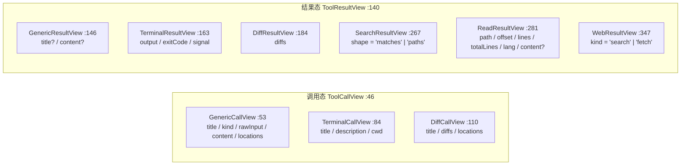
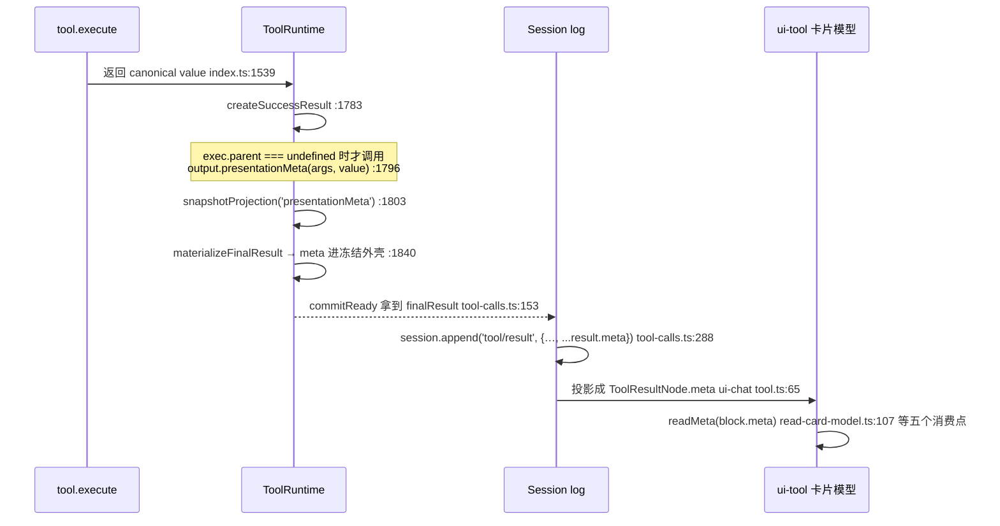

# 06 · 展示层:Host presenter 的纯函数约束与 Web 卡片的真实派生链

> 分析对象 `dbbaa4a37`。核心源码:[`packages/core/tools/src/presentation.ts`](https://github.com/deepseek-ai/deepseek-harness/blob/dbbaa4a37fb9098aba814c97d2956f7b2f105f46/packages/core/tools/src/presentation.ts)(389 行)、[`index.ts:203-295`](https://github.com/deepseek-ai/deepseek-harness/blob/dbbaa4a37fb9098aba814c97d2956f7b2f105f46/packages/core/tools/src/index.ts#L203-L295) + [`:1783-1813`](https://github.com/deepseek-ai/deepseek-harness/blob/dbbaa4a37fb9098aba814c97d2956f7b2f105f46/packages/core/tools/src/index.ts#L1783-L1813);Web 侧:`packages/client/ui-tool/`、[`packages/client/ui-chat/src/client/conversation-nodes/tool.ts`](https://github.com/deepseek-ai/deepseek-harness/blob/dbbaa4a37fb9098aba814c97d2956f7b2f105f46/packages/client/ui-chat/src/client/conversation-nodes/tool.ts)、[`packages/client/ui-conversation/src/client/contract/records.ts`](https://github.com/deepseek-ai/deepseek-harness/blob/dbbaa4a37fb9098aba814c97d2956f7b2f105f46/packages/client/ui-conversation/src/client/contract/records.ts);工具侧真实投影器样例:[`packages/fs/tool-fs/src/read.ts`](https://github.com/deepseek-ai/deepseek-harness/blob/dbbaa4a37fb9098aba814c97d2956f7b2f105f46/packages/fs/tool-fs/src/read.ts)、[`packages/web/tool-web/src/search.ts`](https://github.com/deepseek-ai/deepseek-harness/blob/dbbaa4a37fb9098aba814c97d2956f7b2f105f46/packages/web/tool-web/src/search.ts)、[`packages/fs/tool-fs-search/src/presentation.ts`](https://github.com/deepseek-ai/deepseek-harness/blob/dbbaa4a37fb9098aba814c97d2956f7b2f105f46/packages/fs/tool-fs-search/src/presentation.ts)。

---

## 一、先说结论:展示是**两套**独立机制

```text
路径 A:Host presenter(ToolDefinition.presentCall / presentResult)
  输入:args(post) + ToolResult{content, isError, meta}(post)
  产物:ToolCallView / ToolResultView —— provider-neutral 的 render intent
  消费者:Host 本地消费方。当前**没有内置消费者**(packages/core/tools/README.md:89 明文)

路径 B:Web 卡片(Client 侧派生)
  输入:tool/call 事件的原始 argsRaw + tool/result 事件的内容与持久化 meta
  产物:React 卡片
  消费者:packages/client/ui-tool 的 keyed slot 注册者
```

```typescript
// packages/core/tools/README.md:89
A tool can retain pure `presentCall()` and `presentResult()` methods for Host-local consumers. The built-in Web Client does not consume those values. It selects a renderer through `tool.call.toolview` and derives card props from raw call arguments, result content, failure state, and persisted metadata. The [Client-derived presentation decision](https://github.com/deepseek-ai/deepseek-harness/blob/dbbaa4a37fb9098aba814c97d2956f7b2f105f46/.agents/notes/implemented/architecture/2026-08-23-client-derived-tool-presentation.md) owns this transport split.
```

[`packages/client/AGENTS.md`](https://github.com/deepseek-ai/deepseek-harness/blob/dbbaa4a37fb9098aba814c97d2956f7b2f105f46/packages/client/AGENTS.md) 的分层红线也有同一句部署约束:"Tool cards derive in the Client from raw call/event material and persisted result metadata. Unknown or malformed tool data falls back to the generic form." **为什么拆成两套**:路径 A 的输入里有 `ToolResult`(一个已归一化、冻结、含 `meta` 的对象),它只存在于 Host 进程;路径 B 的输入是**会话日志事件**,它要能被重放——只有完全由日志决定的派生链,才能保证"刷新页面看到的卡片"与"当时看到的卡片"一致。反过来,路径 A 的条件是"纯函数",所以它**只能依赖 args**(见 §三)。

---

## 二、[`presentation.ts`](https://github.com/deepseek-ai/deepseek-harness/blob/dbbaa4a37fb9098aba814c97d2956f7b2f105f46/packages/client/ui-commands/src/client/presentation.ts):render intent 词表

```typescript
// packages/core/tools/src/presentation.ts:10
/**
 * Category of a tool call, used by a UI to pick an icon or treatment. The
 * provider-neutral vocabulary lets tools describe themselves without depending
 * on a particular client; `other` is the default.
 */
export type ToolCallKind = 'read' | 'edit' | 'delete' | 'move' | 'search' | 'execute' | 'fetch' | 'other'
```


<details><summary>Mermaid 源码</summary>



</details>

辅助结构:`FileLocation`(`:23`)、`FileDiff`(`:34`)、`ReadFileLine`(`:127`)、`SearchLineMatch`(`:193`)、`SearchFileMatches`(`:201`)、`WebSource`(`:319`)。

### 2.1 词表的四条设计规则

1. **`card` 是判别式,不是自由字段**。注释在 `SearchResultView` 上把这条讲透了(`:210-215`):search 内部用 `shape` 而不是 `kind` 区分两个变体,恰是为了不与 `GenericCallView.kind`(一个 `ToolCallKind`,负责挑图标)撞名——"The discriminant is `shape`, not `kind`, so it never collides with the `ToolCallKind` `kind` an icon-picking bridge reads off a call view."
2. **调用态与结果态不同构**。`read` / `grep` / `web_search` 的**调用态**都是 `GenericCallView`(带 `kind: 'read' | 'search'`),只有**结果态**才有结构化卡片。理由在 `ReadResultView` 的 JSDoc(`:269-280`):"the pending state has no matches or paths to show — the structured shape exists only after `execute`."
3. **能力降级写在类型里**。`TerminalResultView` 的注释(`:157-162`)写明"an incapable UI gets a fenced ```` ```console ```` fallback the **BRIDGE** derives from `output` (the tool does not double-encode it)"。`ReadResultView.content?`(`:303-307`)与 `GenericResultView.content?`(`:150-154`)同理:视图可选地**自带一份降级内容**,但不强迫工具为它重复渲染。`WebResultView` 则明确**不带** `content` 副本(`:330-345`),一个没有 web 能力的 UI 直接回落读原始 `tool/result` 内容。
4. **`FileDiff.oldText` 可以是 `null`**,两种成因(`:28-33`):新建文件(没有可 diff 的对象)与**覆盖写**——后者是纯函数约束的直接后果:`presentCall(args)` 只能看见参数,看不见磁盘。要拿到带上下文的 diff 必须等 `execute` 之后由 `presentResult` 从 `meta` 里取。

---

## 三、Host presenter 的纯函数约束

约束写在 `ToolDefinition` 的方法 JSDoc 里,因为这是**注册表对定义的要求**:

```typescript
// packages/core/tools/src/index.ts:262
/**
 * Optional: how to present the PENDING state of one call in a UI, derived from
 * the call's `args` (parsed arguments, `unknown` — the tool validates/narrows
 * its own input). … Pure and side-effect-free: a UI may
 * call it during live streaming AND a session-log replay, so it must depend
 * only on `args`.
 */
presentCall?(args: unknown): ToolCallView | undefined
/**
 * Optional: how to present the COMPLETED state, given the same `args` and the
 * durable result projection (`content`, failure state, and optional `meta`). …
 * Pure and side-effect-free for the same replay reason.
 */
presentResult?(args: unknown, result: ToolResult): ToolResultView | undefined
```

| 规则 | 由什么保证 | 反例会被谁抓到 |
|---|---|---|
| `presentCall` 只依赖 `args` | 签名里根本没有别的输入 | [`packages/fs/tool-fs/tests/tools.spec.ts:597-599`](https://github.com/deepseek-ai/deepseek-harness/blob/dbbaa4a37fb9098aba814c97d2956f7b2f105f46/packages/fs/tool-fs/tests/tools.spec.ts#L597-L599) 用"replay 时的原始 logged args"直接调用它 |
| 参数非法时返回 `undefined` 而不抛 | "纯且无副作用"的必然要求;`args` 类型是 `unknown` | [`packages/shell/tool-bash/tests/tools.spec.ts:1064-1068`](https://github.com/deepseek-ai/deepseek-harness/blob/dbbaa4a37fb9098aba814c97d2956f7b2f105f46/packages/shell/tool-bash/tests/tools.spec.ts#L1064-L1068):缺 `description` 返回 `undefined` |
| `presentResult` 对畸形 `meta` 返回 `undefined`(或整体降级) | 回放可能读到过期/手改日志 | [`packages/fs/tool-fs/tests/tools.spec.ts:680-694`](https://github.com/deepseek-ai/deepseek-harness/blob/dbbaa4a37fb9098aba814c97d2956f7b2f105f46/packages/fs/tool-fs/tests/tools.spec.ts#L680-L694)、[`packages/fs/tool-fs-search/tests/tools.spec.ts:1180`](https://github.com/deepseek-ai/deepseek-harness/blob/dbbaa4a37fb9098aba814c97d2956f7b2f105f46/packages/fs/tool-fs-search/tests/tools.spec.ts#L1180) |

结果态的输入 `ToolResult`([`index.ts:282-295`](https://github.com/deepseek-ai/deepseek-harness/blob/dbbaa4a37fb9098aba814c97d2956f7b2f105f46/packages/core/tools/src/index.ts#L282-L295))只有三个字段:

```typescript
export interface ToolResult {
  content: ContentBlock[]          // 最终模型可见内容(失败时是渲染后的错误文本)
  isError: boolean
  /**
   * The tool-private presentation payload projected by its output declaration.
   * It is persisted verbatim on `tool/result` for Host presenters and Client
   * renderers to narrow independently. Absent when the tool declared no
   * projector or the call was nested under a composite transport.
   */
  meta?: JsonValue
}
```

注释里的两句话是两个不同的消费者:"for Host presenters"(路径 A)**和** "for Client renderers"(路径 B)。`meta` 是为这两条路径共同存在的唯一通道。

---

## 四、`presentationMeta` 的持久化路径


<details><summary>Mermaid 源码</summary>



</details>

### 4.1 产生:只在顶层

```typescript
// packages/core/tools/src/index.ts:1795
let meta: JsonValue | undefined
if (exec.parent === undefined && tool.output.presentationMeta !== undefined) {
  let projected: JsonValue
  try { projected = tool.output.presentationMeta(exec.arguments, value) }
  catch (error: unknown) { throw projectionError(tool.name, 'presentationMeta', error) }
  meta = snapshotProjection(tool.name, 'presentationMeta', projected)
}
```

`exec.parent === undefined` 的判据就是"这是模型直呼的根调用,不是 `run_code` 的子派发"(见 [05-ptc-mode.md](./05-ptc-mode.md) §4.1)。客户端对此有显式处理:[`packages/client/ui-tool/src/client/tool/models/image-card-model.ts:36-38`](https://github.com/deepseek-ai/deepseek-harness/blob/dbbaa4a37fb9098aba814c97d2956f7b2f105f46/packages/client/ui-tool/src/client/tool/models/image-card-model.ts#L36-L38) 的注释写着"Root calls persist it; a nested call (a `read_image` dispatched from inside `run_code`) settles without `meta`, so the card falls back to the call's own `file_path` argument for the label."

返回值过两道关:`snapshotProjection`(`:523-534`)要求无损 JSON,失败抛 `ToolOutputError`(`output.presentationMeta returned non-lossless JSON`,`:527`);`materializeFinalResult`(`:1840`)把它放进 `presentation` 对象整体 `deepFreeze`。投影器自身抛错则变成 `output.presentationMeta failed: <msg>`(`projectionError`,`:518-520`)。三条失败路径都归到 `INVALID_TOOL_OUTPUT`,与 `render` 完全对称。**投影器只在成功结果上运行**——失败分支(`toolErrorResult`,`:1860-1868`)从不调用它,所以工具不能靠 `meta` 给失败卡片传结构化数据。

### 4.2 落盘:唯一的一行

```typescript
// packages/core/agent-loop/src/tool-calls.ts:282
session.append('tool/result', {
  turn, step,
  message,
  ...result.error?.info ? { error: result.error.info } : {},
  // The tool's private presentation payload (e.g. a result-time diff),
  // persisted so a UI bridge reproduces the card on replay.
  ...result.meta !== undefined ? { meta: result.meta } : {},
}, { surfaceOp: 'append', sourceEventSeqs: [callSeq] })
```

注释把目的说尽了:"persisted so a UI bridge reproduces the card on replay." `error.info` 与 `meta` **并列**在这一行,两者都是"不进模型内容、但进日志"的字段,与 `content`(模型可见)形成三分类:

| 字段 | 进模型上下文 | 进会话日志 | 谁能读 |
|---|---|---|---|
| `content` | **是**(`deriveMessages()`) | 是 | 模型、模型侧投影、UI |
| `error.info` | 否 | 是 | 插件、replay、UI(错误标签) |
| `meta` | 否 | 是 | Host presenter、Client 卡片模型 |

### 4.3 客户端:从事件到节点

```typescript
// packages/client/ui-chat/src/client/conversation-nodes/tool.ts:52（核心）
function rootResult(match: ConversationMatch, previous?: RunningToolCall): ToolResultNode | undefined {
  if (match.event.type !== 'tool/result') return undefined
  const result = match.event.data.message.content[0]
  return {
    kind: 'tool-result', seq: match.event.seq, time: match.event.time,
    callId: String(match.event.data.message.source.callId),
    call: previous === undefined ? null : { name: previous.name, argsRaw: previous.argsRaw },
    callTime: previous?.time ?? null,
    content: result.content,
    isError: result.isError === true,
    ...match.event.data.error === undefined ? {} : { error: match.event.data.error },
    meta: match.event.data.meta,
    subCalls: [],
  }
}
```

`meta` 在 `ToolResultNode` 上的类型是 `unknown`([`records.ts:170`](https://github.com/deepseek-ai/deepseek-harness/blob/dbbaa4a37fb9098aba814c97d2956f7b2f105f46/packages/client/ui-conversation/src/client/contract/records.ts#L170))。**`unknown` 而不是 `JsonValue` 是刻意的**:回放可能读到旧版本或手改过的日志,每个字段都必须在窄化时才被信任。[`image-card-model.ts:77-79`](https://github.com/deepseek-ai/deepseek-harness/blob/dbbaa4a37fb9098aba814c97d2956f7b2f105f46/packages/client/ui-tool/src/client/tool/models/image-card-model.ts#L77-L79) 的注释是这条纪律的原文:"Every field arrives unvalidated on replay (an obsolete or hand-edited log reaches here), so any mismatch declines."

### 4.4 五个真实的 Client 消费点

| 卡片模型 | 行 | 读的字段 |
|---|---|---|
| [`read-card-model.ts`](https://github.com/deepseek-ai/deepseek-harness/blob/dbbaa4a37fb9098aba814c97d2956f7b2f105f46/packages/client/ui-tool/src/client/tool/models/read-card-model.ts) | [`:107`](https://github.com/deepseek-ai/deepseek-harness/blob/dbbaa4a37fb9098aba814c97d2956f7b2f105f46/packages/client/ui-tool/src/client/tool/models/read-card-model.ts#L107) | `readMeta(block.meta)` → `path` / `offset` / `lines` / `totalLines` / `lang` |
| [`search-card-model.ts`](https://github.com/deepseek-ai/deepseek-harness/blob/dbbaa4a37fb9098aba814c97d2956f7b2f105f46/packages/client/ui-tool/src/client/tool/models/search-card-model.ts) | [`:86-99`](https://github.com/deepseek-ai/deepseek-harness/blob/dbbaa4a37fb9098aba814c97d2956f7b2f105f46/packages/client/ui-tool/src/client/tool/models/search-card-model.ts#L86-L99) | 形状检查 → `paths` / 分组匹配 / `truncated` / `total` |
| [`diff-card-model.ts`](https://github.com/deepseek-ai/deepseek-harness/blob/dbbaa4a37fb9098aba814c97d2956f7b2f105f46/packages/client/ui-tool/src/client/tool/models/diff-card-model.ts) | [`:115`](https://github.com/deepseek-ai/deepseek-harness/blob/dbbaa4a37fb9098aba814c97d2956f7b2f105f46/packages/client/ui-tool/src/client/tool/models/diff-card-model.ts#L115) | `appliedDiffs(block.meta)` → 已应用的上下文 hunk |
| [`web-card-model.ts`](https://github.com/deepseek-ai/deepseek-harness/blob/dbbaa4a37fb9098aba814c97d2956f7b2f105f46/packages/client/ui-tool/src/client/tool/models/web-card-model.ts) | [`:61-62`](https://github.com/deepseek-ai/deepseek-harness/blob/dbbaa4a37fb9098aba814c97d2956f7b2f105f46/packages/client/ui-tool/src/client/tool/models/web-card-model.ts#L61-L62) | `sources` / `answer` / `url` / `statusCode` / `truncated` |
| [`image-card-model.ts`](https://github.com/deepseek-ai/deepseek-harness/blob/dbbaa4a37fb9098aba814c97d2956f7b2f105f46/packages/client/ui-tool/src/client/tool/models/image-card-model.ts) | [`:224`](https://github.com/deepseek-ai/deepseek-harness/blob/dbbaa4a37fb9098aba814c97d2956f7b2f105f46/packages/client/ui-tool/src/client/tool/models/image-card-model.ts#L224) | `imageMeta(block.meta)?.path`(**只有路径**;附件引用刻意从 `content` 读,理由见 [`:40-45`](https://github.com/deepseek-ai/deepseek-harness/blob/dbbaa4a37fb9098aba814c97d2956f7b2f105f46/packages/client/ui-tool/src/client/tool/models/image-card-model.ts#L40-L45)) |

这五个模型是"Host 侧 `presentResult` 曾经承担的工作"在 Client 的对应实现。以 `read` 为例,两侧用同一份数据、不同代码:

```typescript
// packages/fs/tool-fs/src/read.ts:124 —— Host 侧投影（产生 meta）
presentationMeta: (_args, value) => {
  const lang = langFromPath(value.path)
  return { path: value.path, offset: value.offset,
    lines: value.lines.map(({ number, text }) => ({ number, text })),
    totalLines: value.totalLines, ...lang === undefined ? {} : { lang } }
}
```

```typescript
// packages/fs/tool-fs/src/read.ts:173 —— Host 侧 presenter（消费 meta；注释见 :166-172）
presentResult(_args, result: ToolResult): ReadResultView | undefined {
  if (result.isError) return undefined
  const meta = readMetaFromMeta(result.meta)
  if (meta === undefined) return undefined
  const only = result.content.length === 1 ? result.content[0] : undefined
  const text = only?.type === 'text' ? only.text : undefined
  if (text === undefined) return undefined
  const body = /^<path>[^\n]*<\/path>\n<type>file<\/type>\n<content>\n([\s\S]*)\n<\/content>$/u.exec(text)?.[1]
  if (body === undefined) return undefined
  return { card: 'read', path: meta.path, offset: meta.offset, lines: meta.lines,
    totalLines: meta.totalLines, ...meta.lang === undefined ? {} : { lang: meta.lang },
    content: [{ type: 'text', text: body }] }
}
```

四次 `return undefined` 是"纯函数 + 防御性窄化"的样板:**任何一环对不上就整体放弃**,交给通用卡。它从不抛错,因为回放时读到过期日志是正常情况,不是异常。

---

## 五、Web 卡片的派生链

### 5.1 分发:一个 keyed slot

```typescript
// packages/client/ui-tool/src/client/contract/slots.ts:11
/**
 * Keyed atomic Tool call view, dispatched by the wire Tool name. Register
 * with `key: '<tool name>'` to own how one tool's calls render inside a
 * turn — the key domain is open (any wire tool name, including a tool your
 * own package registered), so there is no compile-time key set to pick
 * from and a typo simply never renders.
 *
 * A key the shipped composition already covers is replaced, not shared;
 * an unclaimed key falls back to the generic tool row, so registering is
 * additive for your own tool and a takeover for a shipped one. …
 */
'tool.call.toolview': { kind: 'keyed'; scope: 'session'; owner: ToolCallOwnerProps }
```

```typescript
// packages/client/ui-tool/src/client/apply.ts:33
ctx.slots.inject('conversation.chat.node', () => ctx.slots.register({
  name: 'conversation.chat.node', key: 'tool-call', locale: NS,
  children: { 'tool.call.toolview': { kind: 'keyed', scope: 'session' } },
  inject: toolInject,
}, ToolCallTree))
```

`children` 是**声明 + 授权**([`packages/client/AGENTS.md`](https://github.com/deepseek-ai/deepseek-harness/blob/dbbaa4a37fb9098aba814c97d2956f7b2f105f46/packages/client/AGENTS.md) 第 2 条):`ToolCallTree` 渲染的 slot 必须在这里声明,而声明冲突在加载期就失败——所以"谁在渲染工具卡"在装配期就是确定的。注册者是各自业务的包,一个 `key` 一个工具名:

```typescript
// packages/client/ui-tool/src/client/tool/toolviews/search-row.tsx:43
export const searchToolview = {
  name: 'search-toolview', inject: ['slots'],
  apply(ctx: Context): void {
    ctx.slots.inject('tool.call.toolview', function* () {
      yield ctx.slots.register({ name: 'tool.call.toolview', key: 'grep', locale: NS }, SearchRow)
      yield ctx.slots.register({ name: 'tool.call.toolview', key: 'glob', locale: NS }, SearchRow)
    })
  },
}
```

[`apply.ts:43-50`](https://github.com/deepseek-ai/deepseek-harness/blob/dbbaa4a37fb9098aba814c97d2956f7b2f105f46/packages/client/ui-chat/src/client/apply.ts#L43-L50) 挂载八个内置 toolview 插件、覆盖十个工具名(`bash` / `read` / `read_image` / `edit`+`write` / `grep`+`glob` / `web_search`+`web_fetch` / `todo_write` / `ask_user_question`);[`packages/client/ui-skill/src/client/index.ts:72`](https://github.com/deepseek-ai/deepseek-harness/blob/dbbaa4a37fb9098aba814c97d2956f7b2f105f46/packages/client/ui-skill/src/client/index.ts#L72) 与 [`packages/extensions/ui-cordis/src/client/index.ts:118`](https://github.com/deepseek-ai/deepseek-harness/blob/dbbaa4a37fb9098aba814c97d2956f7b2f105f46/packages/extensions/ui-cordis/src/client/index.ts#L118) 注册各自工具的 key;[`packages/client/ui-deliverables/src/client/index.ts:61`](https://github.com/deepseek-ai/deepseek-harness/blob/dbbaa4a37fb9098aba814c97d2956f7b2f105f46/packages/client/ui-deliverables/src/client/index.ts#L61) 用 `key: 'present'` 接管一个非工具来源的行。用 `ctx.slots.inject(...)` 而不是直接 `register` 的理由([`packages/client/AGENTS.md`](https://github.com/deepseek-ai/deepseek-harness/blob/dbbaa4a37fb9098aba814c97d2956f7b2f105f46/packages/client/AGENTS.md) 第 4 条):它等待真实声明出现、在声明消失时移除贡献、重声明后重跑,并随调用者的 plugin fiber 一起退出;`function*` 形式用于"多个注册必须原子安装与回滚"的场合。

### 5.2 渲染:root + 递归子调用 + 通用回落

```typescript
// packages/client/ui-tool/src/client/tool/ToolCallTree.tsx:33
return (
  <div className={css.callRow} data-chat-anchor-key={`call:${callId}`} data-chat-call-id={callId}>
    {renderSlot('tool.call.toolview', owner, {
      entryKey: toolName,
      fallback: <GenericToolCard {...owner} t={t} />,
    })}
    {children}
  </div>
)
```

四个要点:**`entryKey: toolName`**(`:40`)—— 分发键就是**线上工具名**,名字拼错不会编译失败,只是永远不渲染(slot 的 JSDoc 已声明这个代价);**`fallback` 是 `GenericToolCard`**(`:41`)—— 未注册的 key 落到通用卡,所以**工具不需要注册也能被渲染**,这是"工具插件与 UI 插件独立演进"的前提;**递归**—— `ToolCallBranch`(`:48-86`)对 `block.subCalls` 逐个再走同一个组件,所以 PTC 子派发用的是**完全相同的分发路径**,一个业务包注册 `key: 'grep'` 就同时覆盖原生 `grep` 与 `run_code` 里的 `grep`;**owner props 是"turn 已经知道的一切"**(`ToolCallOwnerProps`,[`slots.ts:55-81`](https://github.com/deepseek-ai/deepseek-harness/blob/dbbaa4a37fb9098aba814c97d2956f7b2f105f46/packages/client/ui-approval/src/client/contract/slots.ts#L55-L81):`callId` / `toolName` / `block` / `cwd` / `home` / `openFile` / `loadImage` / `inspect`),**没有 `ctx`,没有服务对象,没有 hook 制造权**。

### 5.3 派生:纯模型函数

```typescript
// packages/client/ui-tool/src/client/tool/models/tool-call-model.ts:220（核心）
export function toolRowModel(toolName: string, block: ToolCallBlock, cwd?: string, home?: string): ToolRowModel {
  const variant = classifyTool(toolName)                    // 纯工具名查表 TOOL_VARIANTS :41-68
  const done = 'kind' in block                              // RunningToolCall 还是 ToolResultNode
  const argsRaw = (done ? block.call?.argsRaw : block.argsRaw) ?? ''
  const state: ToolRowState = !done ? 'running'
    : block.error?.code === 'interrupted' ? 'stopped' : block.isError ? 'error' : 'ok'
  const base = argsRaw === '' ? block.callId
    : abbreviateHomePath(relativizeToCwd(deriveSummary(variant, argsRaw), cwd), home)
  const toolTitleKey = TOOL_TITLE_KEYS[toolName]
  const summary = variant === 'others' && toolName !== '' && toolTitleKey === undefined
    ? `${toolName} · ${base}` : base
  const output = done ? (resultText(block) || null) : null
  const errorSummary = state === 'error' && output !== null ? firstLine(output) : null
  const bodyRaw = argsRaw === '' ? null : argsRaw
  return { variant, titleKey: toolTitleKey ?? VARIANT_TITLE_KEYS[variant], summary,
    filePath: deriveFilePath(variant, argsRaw), bodyRaw, output, errorSummary, state }
}
```

三个"输入来自哪一侧"的划分与 §一 的两套机制一一对应:`variant`/`titleKey` 来自**纯工具名查表**(`:221`、`:230`、`:244`);`summary`/`filePath`/`bodyRaw` 来自**`tool/call` 的原始参数**(`:223`、`:229`、`:241`、`:246`);`state`/`output`/`errorSummary` 来自**`tool/result` 的内容、`isError`、`error.code`**(`:224-226`、`:239-240`)。结构化卡片用同一份 `block` 另开一个模型函数(§4.4 的五个),`meta` 就在那里被读。

`resultText()`(`:117-127`)是内容扁平化:文本块原样,其他块 `JSON.stringify(block, null, 2)`;内容为空但 `error` 存在时回落成 `"<name>: <code>"`——于是 `ABORTED` / `TOOL_TIMEOUT` / `interrupted` 在这条路径上都能显示。`formatToolBody()`(`:199-210`)有一条按 variant 的特化:code 行的展开体**是程序本身**而不是包着它的 `{ code, description }` 信封。

### 5.4 状态与"已停止"

`:225` 的 `'stopped'` 第三态对应"用户按了停止,这个调用被冻结"——由 Client 的会话投影合成 `{ name: 'Interrupted', code: 'interrupted' }`(`ui-chat/.../tool.ts:201`)。它与 Host 侧的 `ABORTED` **不是同一个来源**:

| 显示 | 来源 | 触发 |
|---|---|---|
| `stopped` | Client 合成的 interruption 节点 | 调用还在 running 时 turn/step 关闭 |
| `error: tool call aborted` | 注册表 / 调度器的 `ABORTED*` 结果 | 调用真的跑完并被取消取代 |

两者互补:前者是"日志里连结果都没有",后者是"有结果,内容是取消"。

### 5.5 PTC 子调用树的折叠

```typescript
// packages/client/ui-chat/src/client/model/tool-call-tree.ts:57（核心）
apply(event: SessionEvent): boolean {
  if (event.type === 'tool/ptc-dispatch-start') {
    const data = event.data
    const running: RunningToolCall = {
      callId: data.subCallId, parentCallId: data.parentCallId, name: data.name,
      argsRaw: JSON.stringify(data.arguments), turn: 0, step: 0,
      time: event.time, subCalls: [],
    }
    const siblings = this.childrenByParent.get(data.parentCallId) ?? []
    if (!this.acceptEdge(data.parentCallId, data.subCallId)) return true
    this.childrenByParent.set(data.parentCallId, [...siblings, running])
    this.revision++
    return true
  }
  if (event.type !== 'tool/ptc-dispatch') return false
  // … 用 subCallId 就地替换 running 为 settled（:76-101）
}
```

两个 PTC 事件是**仅日志**的(见 [05-ptc-mode.md](./05-ptc-mode.md) §7),但它们带着完整的 `content` + `isError`,所以客户端能用与原生 `tool/result` **同一套词汇**渲染子调用。`acceptEdge`(`:163-183`)做环检测与深度上限(`MAX_TOOL_CALL_TREE_DEPTH = 256`,`:14`),注释说明动机:"a malformed wire/history edge is consumed without hiding the rest of the session."

[`packages/client/ui-tool/README.md:12`](https://github.com/deepseek-ai/deepseek-harness/blob/dbbaa4a37fb9098aba814c97d2956f7b2f105f46/packages/client/ui-tool/README.md#L12) 概括了职责边界:"Business UI packages register only their wire Tool names and atomic views — they do not pair Session events, rebuild the transcript, or own root/subcall topology, because the Runtime remains authoritative for call/result pairing, lifecycle, and recursive `subCalls` projection."

---

## 六、Host presenter 到底还有没有消费者

全仓检索的结论很明确:**只有工具定义声明 `presentCall`/`presentResult`,没有一处产品代码调用它们**。它们出现在每个工具的 `defineTool({...})` 里(约 20 个包)、[`packages/core/tools/src/index.ts`](https://github.com/deepseek-ai/deepseek-harness/blob/dbbaa4a37fb9098aba814c97d2956f7b2f105f46/packages/core/tools/src/index.ts) 的类型定义与 [`testing.ts`](https://github.com/deepseek-ai/deepseek-harness/blob/dbbaa4a37fb9098aba814c97d2956f7b2f105f46/packages/core/tools/src/testing.ts) 夹具、[`packages/extensions/tool-cordis/src/api-catalog.ts`](https://github.com/deepseek-ai/deepseek-harness/blob/dbbaa4a37fb9098aba814c97d2956f7b2f105f46/packages/extensions/tool-cordis/src/api-catalog.ts)(生成的服务目录把类型签名当文档)、各包的 `tests/`,以及 [`scripts/gen-doc-graphs.ts`](https://github.com/deepseek-ai/deepseek-harness/blob/dbbaa4a37fb9098aba814c97d2956f7b2f105f46/scripts/gen-doc-graphs.ts)。

所以这条路径当前的定位是**为 Host 本地消费方保留的接口**,而不是 Web 的实现路径。这条取舍被写成了一条仓库级约定:

> **Design each tool's UI presentation up front.** Host presenters stay pure; Web cards derive from raw events and persisted result metadata。
> —— `deepseek-harness/AGENTS.md`

对工具作者的实际含义:**同一个界面要写两份代码**。一份是 `presentCall`/`presentResult`(纯函数,返回 provider-neutral 词表);一份是 `output.presentationMeta`(产生结构化数据)+ Client 侧卡片模型(消费它)。看起来重复,但两者的**输入面不同**:前者只在 Host 进程有 `ToolResult` 对象,后者只有日志事件。把后者写成前者的传声筒,就等于把"Host 对象"当成 replay 的输入——那正是拆分要避免的事情。

### 6.1 `agent-tool-presentation` 不是卡片包

名字容易误导:[`packages/core/agent-tool-presentation/src/index.ts`](https://github.com/deepseek-ai/deepseek-harness/blob/dbbaa4a37fb9098aba814c97d2956f7b2f105f46/packages/core/agent-tool-presentation/src/index.ts) **不涉及任何展示代码**。它是 agent 平面的**呈现模式选择器**:

```typescript
// packages/core/agent-tool-presentation/src/index.ts:54
/**
 * Declare the tool presentation for every agent this composition covers.
 * @param ctx - the mounting composition's scope context (a preset's standing scope).
 */
export function apply(ctx: Context, config: Config): void {
  if (config.mode === 'native') { ctx.tools.presentAs('native'); return }
  ctx.inject(['codeRuntime'], (runtimeCtx: Context) => { runtimeCtx.tools.presentAs(config.mode) })
}
```

这里的 "presentation" 指 `native` / `ptc` / `both`——**模型看到哪种形态的工具面**,与 UI 卡片无关。它薄封装了 `ctx.tools.presentAs()`(见 [01-registry-and-visibility.md](./01-registry-and-visibility.md) §5.2);存在的理由是让 preset 能声明"这个组合里的 agent 跑 PTC",而注册表本身必须留在 host 平面(模块头注释 [`:3-17`](https://github.com/deepseek-ai/deepseek-harness/blob/dbbaa4a37fb9098aba814c97d2956f7b2f105f46/packages/core/agent-tool-presentation/src/index.ts#L3-L17):调度器、API 代理、每个工具插件都是它的消费者,它搬不进 preset)。

---

## 七、同一次调用在三个观测面上的差异

| 观测面 | 数据来源 | 内容块 | 失败信息 | 结构化展示数据 | 用途 |
|---|---|---|---|---|---|
| **模型** | `deriveMessages()` 从 `tool/result.message` 派生 | `content`(渲染后的文本) | 只有 `Error: <message>` 文本 | **无** | 决策与自我纠正 |
| **Host presenter** | `presentCall(args)` / `presentResult(args, ToolResult)` | `ToolResult.content` 原样 | `ToolResult.isError` | `ToolResult.meta` | Host 本地 UI / CLI(当前无内置消费者) |
| **Web 卡片** | `tool/call.argsRaw` + `tool/result.{content, isError, error, meta}` | `ToolResultNode.content`(扁平化作 `output`) | `error.code` → `state: 'error' \| 'stopped'` | `ToolResultNode.meta`(窄化后) | 浏览器渲染 |

三面共用的**唯一**真源是会话日志:`tool/call` + `tool/result` 两个事件。模型面由 `deriveMessages()` 从事件派生,Web 面由 `ToolCallTree` 从事件派生,Host presenter 面由进程内的 `ToolResult` 提供——但它也要求"纯函数 + 只依赖 args 与这个投影",从而在语义上等价于"从日志可重建"。一条推论:**任何只对 Web 面可见的信息,都必须先落进 `tool/result` 事件**(`content`、`error.info`、`meta` 三者之一)。

---

## 八、关键文件/符号索引表

| 符号 | 位置 | 职责 |
|---|---|---|
| `ToolCallKind` / `FileLocation` / `FileDiff` / `ReadFileLine` | [`presentation.ts:15`](https://github.com/deepseek-ai/deepseek-harness/blob/dbbaa4a37fb9098aba814c97d2956f7b2f105f46/packages/client/ui-commands/src/client/presentation.ts#L15) / [`:23`](https://github.com/deepseek-ai/deepseek-harness/blob/dbbaa4a37fb9098aba814c97d2956f7b2f105f46/packages/client/ui-commands/src/client/presentation.ts#L23) / [`:34`](https://github.com/deepseek-ai/deepseek-harness/blob/dbbaa4a37fb9098aba814c97d2956f7b2f105f46/packages/client/ui-commands/src/client/presentation.ts#L34) / `:127` | 图标词汇;跟随定位;单文件变更(`oldText` 可为 `null`);行数据 |
| `ToolCallView`(三臂) / `ToolResultView`(六臂) | [`presentation.ts:46`](https://github.com/deepseek-ai/deepseek-harness/blob/dbbaa4a37fb9098aba814c97d2956f7b2f105f46/packages/client/ui-commands/src/client/presentation.ts#L46) / `:140` | `card` 判别式联合 |
| `GenericCallView` / `TerminalCallView` / `DiffCallView` | [`presentation.ts:53`](https://github.com/deepseek-ai/deepseek-harness/blob/dbbaa4a37fb9098aba814c97d2956f7b2f105f46/packages/client/ui-commands/src/client/presentation.ts#L53) / [`:84`](https://github.com/deepseek-ai/deepseek-harness/blob/dbbaa4a37fb9098aba814c97d2956f7b2f105f46/packages/client/ui-commands/src/client/presentation.ts#L84) / `:110` | 调用态各臂 |
| `GenericResultView` / `TerminalResultView` / `DiffResultView` | `presentation.ts:146` / `:163` / `:184` | 通用 / 终端 / diff 结果 |
| `SearchMatchesResultView` / `SearchPathsResultView` / `SearchResultView` | `presentation.ts:216` / `:238` / `:267` | `shape` 两个变体;`truncated`/`total` 信号 |
| `ReadResultView` / `WebSource` / `WebResultView` | `presentation.ts:281` / `:319` / `:347` | 行号化代码视图(带降级 `content?`);检索源;检索结果(无 `content` 副本) |
| `ToolOutputDefinition.presentationMeta` / `ToolResult` | [`index.ts:210`](https://github.com/deepseek-ai/deepseek-harness/blob/dbbaa4a37fb9098aba814c97d2956f7b2f105f46/packages/core/tools/src/index.ts#L210) / [`:282`](https://github.com/deepseek-ai/deepseek-harness/blob/dbbaa4a37fb9098aba814c97d2956f7b2f105f46/packages/core/tools/src/index.ts#L282) | 顶层调用的可重放展示投影;presenter 的结果态输入 |
| `presentCall` / `presentResult` 契约 | [`index.ts:262-279`](https://github.com/deepseek-ai/deepseek-harness/blob/dbbaa4a37fb9098aba814c97d2956f7b2f105f46/packages/core/tools/src/index.ts#L262-L279) | 纯函数、无副作用、畸形输入返回 `undefined` |
| 顶层判定 / `snapshotProjection` / `projectionError` / `materializeFinalResult` | [`index.ts:1796`](https://github.com/deepseek-ai/deepseek-harness/blob/dbbaa4a37fb9098aba814c97d2956f7b2f105f46/packages/core/tools/src/index.ts#L1796) / [`:523`](https://github.com/deepseek-ai/deepseek-harness/blob/dbbaa4a37fb9098aba814c97d2956f7b2f105f46/packages/core/tools/src/index.ts#L523) / [`:518`](https://github.com/deepseek-ai/deepseek-harness/blob/dbbaa4a37fb9098aba814c97d2956f7b2f105f46/packages/core/tools/src/index.ts#L518) / [`:1837`](https://github.com/deepseek-ai/deepseek-harness/blob/dbbaa4a37fb9098aba814c97d2956f7b2f105f46/packages/core/tools/src/index.ts#L1837) | `exec.parent === undefined` 才计算 `meta`;无损快照与错误归类;`meta` 进冻结外壳([`:1840`](https://github.com/deepseek-ai/deepseek-harness/blob/dbbaa4a37fb9098aba814c97d2956f7b2f105f46/packages/core/tools/src/index.ts#L1840)) |
| `appendToolResult` 的 `meta`(唯一落点) / `session.append('tool/result', …)` | [`packages/core/agent-loop/src/tool-calls.ts:288`](https://github.com/deepseek-ai/deepseek-harness/blob/dbbaa4a37fb9098aba814c97d2956f7b2f105f46/packages/core/agent-loop/src/tool-calls.ts#L288) / [`:282`](https://github.com/deepseek-ai/deepseek-harness/blob/dbbaa4a37fb9098aba814c97d2956f7b2f105f46/packages/core/agent-loop/src/tool-calls.ts#L282) | 持久化 `meta`;`surfaceOp: 'append'` + `sourceEventSeqs: [callSeq]` |
| `rootResult` / `ToolResultNode` / `RunningToolCall` / `ToolCallBlock` | [`packages/client/ui-chat/src/client/conversation-nodes/tool.ts:52`](https://github.com/deepseek-ai/deepseek-harness/blob/dbbaa4a37fb9098aba814c97d2956f7b2f105f46/packages/client/ui-chat/src/client/conversation-nodes/tool.ts#L52) / [`packages/client/ui-conversation/src/client/contract/records.ts:155`](https://github.com/deepseek-ai/deepseek-harness/blob/dbbaa4a37fb9098aba814c97d2956f7b2f105f46/packages/client/ui-conversation/src/client/contract/records.ts#L155) / [`:265`](https://github.com/deepseek-ai/deepseek-harness/blob/dbbaa4a37fb9098aba814c97d2956f7b2f105f46/packages/client/ui-conversation/src/client/contract/records.ts#L265) / [`:280`](https://github.com/deepseek-ai/deepseek-harness/blob/dbbaa4a37fb9098aba814c97d2956f7b2f105f46/packages/client/ui-conversation/src/client/contract/records.ts#L280) | 事件 → 节点(`meta` 在 [`tool.ts:65`](https://github.com/deepseek-ai/deepseek-harness/blob/dbbaa4a37fb9098aba814c97d2956f7b2f105f46/packages/client/ui-chat/src/client/conversation-nodes/tool.ts#L65));`meta?: unknown`([`records.ts:170`](https://github.com/deepseek-ai/deepseek-harness/blob/dbbaa4a37fb9098aba814c97d2956f7b2f105f46/packages/client/ui-conversation/src/client/contract/records.ts#L170));三者联合 |
| `tool.call.toolview` slot 声明 / `ToolCallOwnerProps` | [`packages/client/ui-tool/src/client/contract/slots.ts:26`](https://github.com/deepseek-ai/deepseek-harness/blob/dbbaa4a37fb9098aba814c97d2956f7b2f105f46/packages/client/ui-tool/src/client/contract/slots.ts#L26) / [`:55`](https://github.com/deepseek-ai/deepseek-harness/blob/dbbaa4a37fb9098aba814c97d2956f7b2f105f46/packages/client/ui-tool/src/client/contract/slots.ts#L55) | keyed、session scope;组件能拿到的全部数据与回调 |
| `apply`(children 声明 + 挂载) / `ToolCallTree` / `ToolCallBranch` | [`packages/client/ui-tool/src/client/apply.ts:27`](https://github.com/deepseek-ai/deepseek-harness/blob/dbbaa4a37fb9098aba814c97d2956f7b2f105f46/packages/client/ui-tool/src/client/apply.ts#L27) / `:94` / [`:48`](https://github.com/deepseek-ai/deepseek-harness/blob/dbbaa4a37fb9098aba814c97d2956f7b2f105f46/packages/client/ui-tool/src/client/apply.ts#L48) | [`:38`](https://github.com/deepseek-ai/deepseek-harness/blob/dbbaa4a37fb9098aba814c97d2956f7b2f105f46/packages/client/ui-tool/src/client/apply.ts#L38) 声明 slot,[`:43-50`](https://github.com/deepseek-ai/deepseek-harness/blob/dbbaa4a37fb9098aba814c97d2956f7b2f105f46/packages/client/ui-tool/src/client/apply.ts#L43-L50) 挂八个 toolview;递归渲染 root 与子调用 |
| `renderSlot(..., { entryKey, fallback })` | [`ToolCallTree.tsx:39`](https://github.com/deepseek-ai/deepseek-harness/blob/dbbaa4a37fb9098aba814c97d2956f7b2f105f46/packages/client/ui-tool/src/client/tool/ToolCallTree.tsx#L39) | 按工具名分发;未注册回落 `GenericToolCard`([`:41`](https://github.com/deepseek-ai/deepseek-harness/blob/dbbaa4a37fb9098aba814c97d2956f7b2f105f46/packages/client/ui-tool/src/client/tool/ToolCallTree.tsx#L41)) |
| `toolRowModel` / `classifyTool` / `TOOL_VARIANTS` / `resultText` / `formatToolBody` | [`tool-call-model.ts:220`](https://github.com/deepseek-ai/deepseek-harness/blob/dbbaa4a37fb9098aba814c97d2956f7b2f105f46/packages/client/ui-tool/src/client/tool/models/tool-call-model.ts#L220) / [`:86`](https://github.com/deepseek-ai/deepseek-harness/blob/dbbaa4a37fb9098aba814c97d2956f7b2f105f46/packages/client/ui-tool/src/client/tool/models/tool-call-model.ts#L86) / [`:41`](https://github.com/deepseek-ai/deepseek-harness/blob/dbbaa4a37fb9098aba814c97d2956f7b2f105f46/packages/client/ui-tool/src/client/tool/models/tool-call-model.ts#L41) / [`:117`](https://github.com/deepseek-ai/deepseek-harness/blob/dbbaa4a37fb9098aba814c97d2956f7b2f105f46/packages/client/ui-tool/src/client/tool/models/tool-call-model.ts#L117) / [`:199`](https://github.com/deepseek-ai/deepseek-harness/blob/dbbaa4a37fb9098aba814c97d2956f7b2f105f46/packages/client/ui-tool/src/client/tool/models/tool-call-model.ts#L199) | 通用行唯一派生入口;工具名→变体;内容扁平化;code 行展开体是程序本身 |
| 五个读 `meta` 的卡片模型 | [`read-card-model.ts:107`](https://github.com/deepseek-ai/deepseek-harness/blob/dbbaa4a37fb9098aba814c97d2956f7b2f105f46/packages/client/ui-tool/src/client/tool/models/read-card-model.ts#L107)、[`search-card-model.ts:86`](https://github.com/deepseek-ai/deepseek-harness/blob/dbbaa4a37fb9098aba814c97d2956f7b2f105f46/packages/client/ui-tool/src/client/tool/models/search-card-model.ts#L86)、[`diff-card-model.ts:115`](https://github.com/deepseek-ai/deepseek-harness/blob/dbbaa4a37fb9098aba814c97d2956f7b2f105f46/packages/client/ui-tool/src/client/tool/models/diff-card-model.ts#L115)、[`web-card-model.ts:61`](https://github.com/deepseek-ai/deepseek-harness/blob/dbbaa4a37fb9098aba814c97d2956f7b2f105f46/packages/client/ui-tool/src/client/tool/models/web-card-model.ts#L61)、[`image-card-model.ts:224`](https://github.com/deepseek-ai/deepseek-harness/blob/dbbaa4a37fb9098aba814c97d2956f7b2f105f46/packages/client/ui-tool/src/client/tool/models/image-card-model.ts#L224) | 分别消费行窗口 / 分组匹配 / 已应用 hunk / 引用列表 / 图片路径 |
| `ToolCallTree.apply` / `acceptEdge` / `MAX_TOOL_CALL_TREE_DEPTH` | [`packages/client/ui-chat/src/client/model/tool-call-tree.ts:57`](https://github.com/deepseek-ai/deepseek-harness/blob/dbbaa4a37fb9098aba814c97d2956f7b2f105f46/packages/client/ui-chat/src/client/model/tool-call-tree.ts#L57) / [`:163`](https://github.com/deepseek-ai/deepseek-harness/blob/dbbaa4a37fb9098aba814c97d2956f7b2f105f46/packages/client/ui-chat/src/client/model/tool-call-tree.ts#L163) / [`:14`](https://github.com/deepseek-ai/deepseek-harness/blob/dbbaa4a37fb9098aba814c97d2956f7b2f105f46/packages/client/ui-chat/src/client/model/tool-call-tree.ts#L14) | 两个仅日志事件 → 递归子调用树;环检测与深度上限 256 |
| `presentationMeta`(read) / `presentResult`(read) | [`packages/fs/tool-fs/src/read.ts:124`](https://github.com/deepseek-ai/deepseek-harness/blob/dbbaa4a37fb9098aba814c97d2956f7b2f105f46/packages/fs/tool-fs/src/read.ts#L124) / [`:173`](https://github.com/deepseek-ai/deepseek-harness/blob/dbbaa4a37fb9098aba814c97d2956f7b2f105f46/packages/fs/tool-fs/src/read.ts#L173) | 行窗口投影;四次防御性 `return undefined` |
| `presentationMeta`(grep / glob) / `searchMetaFromValue` | [`packages/fs/tool-fs-search/src/grep.ts:319`](https://github.com/deepseek-ai/deepseek-harness/blob/dbbaa4a37fb9098aba814c97d2956f7b2f105f46/packages/fs/tool-fs-search/src/grep.ts#L319)、[`glob.ts:338`](https://github.com/deepseek-ai/deepseek-harness/blob/dbbaa4a37fb9098aba814c97d2956f7b2f105f46/packages/fs/tool-fs-search/src/glob.ts#L338) / [`packages/web/tool-web/src/search.ts:360`](https://github.com/deepseek-ai/deepseek-harness/blob/dbbaa4a37fb9098aba814c97d2956f7b2f105f46/packages/web/tool-web/src/search.ts#L360) | 分组匹配与路径列表;检索源投影 |
| `apply`(agent 面 mode) | [`packages/core/agent-tool-presentation/src/index.ts:59`](https://github.com/deepseek-ai/deepseek-harness/blob/dbbaa4a37fb9098aba814c97d2956f7b2f105f46/packages/core/agent-tool-presentation/src/index.ts#L59) | 与 UI 无关;`presentAs` 的 preset 封装 |
