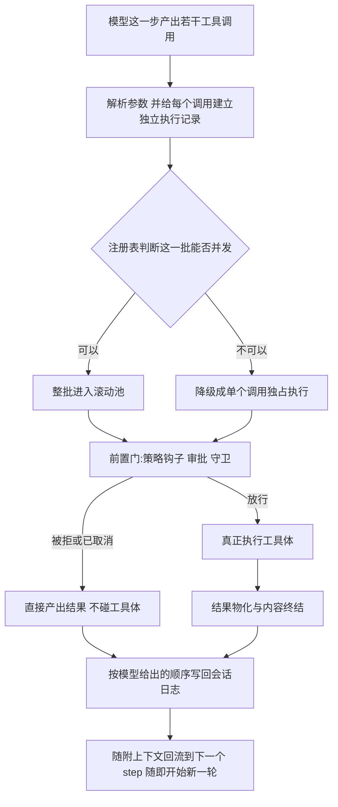
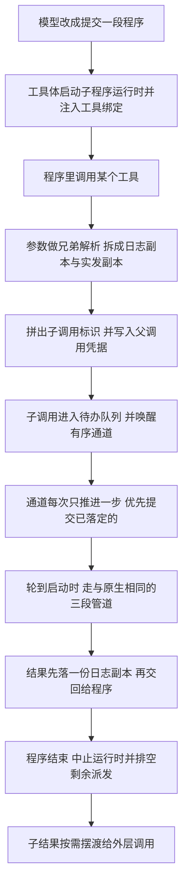

# Tool Call 模块 · 函数级深度展开

> 分析对象:[deepseek-ai/deepseek-harness](https://github.com/deepseek-ai/deepseek-harness) @ `dbbaa4a37`

---

## 篇目索引

| 文件 | 主题 | 核心源码 | 一句话 |
|---|---|---|---|
| [01-registry-and-visibility.md](./01-registry-and-visibility.md) | 注册表内部:分层、遮蔽、回收、可见性 | [`packages/core/scope/src/store.ts`](https://github.com/deepseek-ai/deepseek-harness/blob/dbbaa4a37fb9098aba814c97d2956f7b2f105f46/packages/core/scope/src/store.ts)、[`packages/core/tools/src/index.ts`](https://github.com/deepseek-ai/deepseek-harness/blob/dbbaa4a37fb9098aba814c97d2956f7b2f105f46/packages/core/tools/src/index.ts) | `ScopedLayers` 提供"全局层 + 每作用域 overlay"的插入序存储;`view()` 用一次遍历同时产出 `visible`/`knownNames`/`restrictableNames`,喂给 `get`/`schemas`/`executionMode`/`resolveExecution`,四者结构上不可能漂移 |
| [02-execution-pipeline.md](./02-execution-pipeline.md) | 四段式管道的函数级走查 | [`packages/core/tools/src/index.ts:1354-1852`](https://github.com/deepseek-ai/deepseek-harness/blob/dbbaa4a37fb9098aba814c97d2956f7b2f105f46/packages/core/tools/src/index.ts#L1354-L1852) | `createExecution` 定型身份与三个 WeakMap;`prepareExecution` 跑有序前置门;`dispatchScheduledExecution` 包 around 并调 body;`finishScheduledExecution` 三层 try 保证任何失败都降级成结构化错误 |
| [03-scheduler-and-concurrency.md](./03-scheduler-and-concurrency.md) | agent-loop 侧调度器与并发时序 | [`packages/core/agent-loop/src/tool-calls.ts`](https://github.com/deepseek-ai/deepseek-harness/blob/dbbaa4a37fb9098aba814c97d2956f7b2f105f46/packages/core/agent-loop/src/tool-calls.ts)、`index.ts:1266` | 分组由首个未提交调用的 `executionMode` 决定;`fillPool` 滚动补池并在每次 `await` 后重读 abort;`commitReady` 只推进连续槽位,提交严格模型序 |
| [04-cancellation-and-timeout.md](./04-cancellation-and-timeout.md) | 取消、双码语义与协作式超时 | `index.ts:1500-1549,1879-1934`、[`packages/guard/timeout-policy/src/index.ts`](https://github.com/deepseek-ai/deepseek-harness/blob/dbbaa4a37fb9098aba814c97d2956f7b2f105f46/packages/guard/timeout-policy/src/index.ts)、[`packages/util/timeout/src/index.ts`](https://github.com/deepseek-ai/deepseek-harness/blob/dbbaa4a37fb9098aba814c97d2956f7b2f105f46/packages/util/timeout/src/index.ts) | 注册表把调用者信号 fuse 回 wrapper 的替换信号,取消从不放弃 promise;`ABORTED` 与 `ABORTED_BEFORE_DISPATCH` 只由 `bodyInvoked` 一个布尔区分 |
| [05-ptc-mode.md](./05-ptc-mode.md) | `run_code` 模式:契约、SDK、lane、背压 | [`packages/core/tools/src/ptc.ts`](https://github.com/deepseek-ai/deepseek-harness/blob/dbbaa4a37fb9098aba814c97d2956f7b2f105f46/packages/core/tools/src/ptc.ts)、[`ts-types.ts`](https://github.com/deepseek-ai/deepseek-harness/blob/dbbaa4a37fb9098aba814c97d2956f7b2f105f46/packages/core/tools/src/ts-types.ts)、[`py-types.ts`](https://github.com/deepseek-ai/deepseek-harness/blob/dbbaa4a37fb9098aba814c97d2956f7b2f105f46/packages/core/tools/src/py-types.ts) | 子派发走单条有序 lane + 有界并发池,复刻原生时序;`collapse` 谓词一处定义两处使用,"模型直呼被拒"返回带路线提示的可纠正错误 |
| [06-presentation-and-ui.md](./06-presentation-and-ui.md) | 展示层与 Web 卡片派生 | [`packages/core/tools/src/presentation.ts`](https://github.com/deepseek-ai/deepseek-harness/blob/dbbaa4a37fb9098aba814c97d2956f7b2f105f46/packages/core/tools/src/presentation.ts)、`packages/client/ui-tool/`、`packages/client/ui-chat/`、`packages/web/tool-web/` | Host presenter 是纯函数且**不是** Web 卡片的来源;卡片由 Client 从 `tool/call` 参数、`tool/result` 内容与持久化 `meta` 自己派生 |

推荐阅读顺序:01 → 02 → 03 → 04(主线),05、06 为两条独立支线。

---

## 一次工具调用的完整函数级调用栈

以**原生模式**下一次模型工具调用为例。

先看这棵树的两个基点——栈的入口,以及它下面那一层调度器接口:

```typescript
// packages/core/agent-loop/src/tool-calls.ts:60-67
export async function executeToolCalls(
  ctx: Context,
  turn: number,
  step: number,
  toolCalls: ToolCallBlock[],
  signal: AbortSignal,
  acceptContext: (context: UserMessage) => void,
): Promise<{ concluded: boolean }> {
```

```typescript
// packages/core/tools/src/index.ts:444-453
export interface ToolRuntimeScheduler {
  /** Materialize input, run the ordered pre-execute/guard gate, and decide what stage follows. */
  prepare(exec: ToolExecutionInput): Promise<ScheduledToolPreparation>
  /** Run only the around-dispatch/body stage. */
  dispatch(exec: ToolRunContext): Promise<ScheduledToolDispatch>
  /** Run post-execute and definition-owned content finalization, then materialize and notify. */
  finalize(exec: ToolRunContext, result: ToolExecutionResult): Promise<ToolExecutionResult>
  /** Run definition-owned content finalization, then materialize and notify without post-execute. */
  finish(exec: ToolRunContext, result: ToolExecutionResult): ToolExecutionResult
}
```

### 这一趟调用是怎么走完的

一次工具调用从模型交出参数到结果写回日志,中间只有四个动作:模型给出若干工具调用,注册表判断这一批能不能并发,前置门(策略钩子、审批、守卫三道有序的检查)逐个放行或拦下,执行结果再按模型给出的顺序写回会话日志。之所以要拆成这么多层,是因为三种约束互相打架:策略钩子、审批和日志必须严格有序,只有真正干活的工具体可以并发,于是调度器把一次调用切成"准备 — 执行 — 收尾"三段,可并发的只剩中间那段。失败也按层次分别处理:前置门拒绝或参数不合法直接产出错误结果,工具体抛错被降级成结构化错误;取消与调度器自身故障则走两条完全不同的路——取消要补齐合成结果以保证会话可以重放,调度器故障反而保留现场,把错误抛到本轮 step 的边界。

下面这张图只画主干,不写函数名:顺着箭头走一遍,就能知道每一层为什么存在。


<details><summary>Mermaid 源码</summary>



</details>

函数级细节见下表,第三列给出折叠调用树里每个跳点的出处。

| 阶段 | 做了什么 | 关键调用(文件:行) |
|---|---|---|
| 检出调用并进入调度器 | `step()` 把 assistant 消息内容过滤出 `tool-call` 块;调度器向上下文索取发起本次调用的 agent 与其会话,并为每个块建一份独立 `exec`(它们只共享同一个 signal 引用与同一个 agent,因为 `tools/execute` wrapper 会原地改写 `exec.signal`) | `agent.ts:307`、`agent.ts:486`、[`tool-calls.ts:60`](https://github.com/deepseek-ai/deepseek-harness/blob/dbbaa4a37fb9098aba814c97d2956f7b2f105f46/packages/core/agent-loop/src/tool-calls.ts#L60)、[`tool-calls.ts:68`](https://github.com/deepseek-ai/deepseek-harness/blob/dbbaa4a37fb9098aba814c97d2956f7b2f105f46/packages/core/agent-loop/src/tool-calls.ts#L68)、[`tool-calls.ts:71`](https://github.com/deepseek-ai/deepseek-harness/blob/dbbaa4a37fb9098aba814c97d2956f7b2f105f46/packages/core/agent-loop/src/tool-calls.ts#L71)、[`tool-calls.ts:72`](https://github.com/deepseek-ai/deepseek-harness/blob/dbbaa4a37fb9098aba814c97d2956f7b2f105f46/packages/core/agent-loop/src/tool-calls.ts#L72) |
| 参数解析容错 | 空串映射成 `{}`;合法 JSON 取解析值;解析抛错则保留原文,把报错权交给工具自己的 schema 校验 | [`tool-calls.ts:105`](https://github.com/deepseek-ai/deepseek-harness/blob/dbbaa4a37fb9098aba814c97d2956f7b2f105f46/packages/core/agent-loop/src/tool-calls.ts#L105)、[`tool-calls.ts:107`](https://github.com/deepseek-ai/deepseek-harness/blob/dbbaa4a37fb9098aba814c97d2956f7b2f105f46/packages/core/agent-loop/src/tool-calls.ts#L107)、[`tool-calls.ts:109`](https://github.com/deepseek-ai/deepseek-harness/blob/dbbaa4a37fb9098aba814c97d2956f7b2f105f46/packages/core/agent-loop/src/tool-calls.ts#L109) |
| 按并发模式分组 | 取首个未提交调用问注册表能否并发,据此决定整批进池还是单个独占;组实际消费了几个调用由 `GroupOutcome.consumed` 回报给外层循环 | [`tool-calls.ts:85`](https://github.com/deepseek-ai/deepseek-harness/blob/dbbaa4a37fb9098aba814c97d2956f7b2f105f46/packages/core/agent-loop/src/tool-calls.ts#L85)、[`tool-calls.ts:90`](https://github.com/deepseek-ai/deepseek-harness/blob/dbbaa4a37fb9098aba814c97d2956f7b2f105f46/packages/core/agent-loop/src/tool-calls.ts#L90)、`index.ts:1266` |
| 解析要执行的定义 | `resolveExecution` 结合作用域与"是否嵌套子派发"这两个条件取出定义,`get` 是它只按名字查的简版 | `index.ts:1211`、`index.ts:1194` |
| 可见性快照 | `view` 一次遍历同时算出可见集合、已知名字集合与可限制名字集合,后面所有读操作共用这一份结果 | `index.ts:1142` |
| 层链顺序与继承面 | 层链按远祖到近祖排列,本层单独取;继承面先铺全局层再按远到近叠各祖先层,后写覆盖先写,于是近层遮蔽远层 | `store.ts:192`、`store.ts:180`、`index.ts:1151` |
| 限制沿链取交 | 链上每一层都放行,这个名字才留在可见集里,所以任何一层都能为它内嵌的所有作用域屏蔽一个继承名 | `index.ts:1164` |
| 本层注册不受限制过滤 | 本层自己注册的工具直接进可见集,以免把子 agent 赖以作答的机件一起剥掉 | `index.ts:1168` |
| PTC 传输注入 | 当前作用域的模式不是 native 时,把 `run_code` 补进可见集 | `index.ts:1179` |
| 折叠判定 | 判断这次调用是否属于"只能从程序里调用"的一类,`nested` 就是子派发凭据 | `index.ts:1314` |
| 启动与补池 | 池在上限内反复启动下一个调用:先落 `tool/call` 事件,再等前置门,最后按前置结果分流 | [`tool-calls.ts:199`](https://github.com/deepseek-ai/deepseek-harness/blob/dbbaa4a37fb9098aba814c97d2956f7b2f105f46/packages/core/agent-loop/src/tool-calls.ts#L199)、[`tool-calls.ts:165`](https://github.com/deepseek-ai/deepseek-harness/blob/dbbaa4a37fb9098aba814c97d2956f7b2f105f46/packages/core/agent-loop/src/tool-calls.ts#L165)、[`tool-calls.ts:263`](https://github.com/deepseek-ai/deepseek-harness/blob/dbbaa4a37fb9098aba814c97d2956f7b2f105f46/packages/core/agent-loop/src/tool-calls.ts#L263) |
| 前置门入口 | 四段接口的 `prepare` 一节,负责定型执行身份、跑有序策略门、算出这一阶段该去哪里 | [`index.ts:790`](https://github.com/deepseek-ai/deepseek-harness/blob/dbbaa4a37fb9098aba814c97d2956f7b2f105f46/packages/core/agent-loop/src/index.ts#L790)、`index.ts:1449`、`index.ts:1453` |
| 定型执行身份 | 一次定下不透明的执行身份、冻结的参数快照,并把延迟上下文、内容终结器、取消状态三个表以执行对象为键登记好 | `index.ts:1354`、`index.ts:1370`、`index.ts:1402`、`index.ts:1406`、`index.ts:1407`、`index.ts:1408`、`index.ts:1409` |
| 有序策略门 | 先查调用者是否已取消,再跑 `tools/pre-execute` 瀑布;`ask` 交给审批服务;拒绝理由用守卫取;全部通过才返回"去执行" | `index.ts:1460`、`index.ts:1465`、`index.ts:1469`、`index.ts:1679`、`index.ts:1109`、`index.ts:1493` |
| 阶段分流 | 前置结果有三种:去执行;记为待后置(拒绝与取消走这条);记为无需后置(折叠与参数失败走这条) | [`index.ts:791`](https://github.com/deepseek-ai/deepseek-harness/blob/dbbaa4a37fb9098aba814c97d2956f7b2f105f46/packages/core/agent-loop/src/index.ts#L791)、[`tool-calls.ts:172`](https://github.com/deepseek-ai/deepseek-harness/blob/dbbaa4a37fb9098aba814c97d2956f7b2f105f46/packages/core/agent-loop/src/tool-calls.ts#L172)、[`tool-calls.ts:188`](https://github.com/deepseek-ai/deepseek-harness/blob/dbbaa4a37fb9098aba814c97d2956f7b2f105f46/packages/core/agent-loop/src/tool-calls.ts#L188)、[`tool-calls.ts:191`](https://github.com/deepseek-ai/deepseek-harness/blob/dbbaa4a37fb9098aba814c97d2956f7b2f105f46/packages/core/agent-loop/src/tool-calls.ts#L191) |
| 执行阶段 | `tools/execute` 瀑布包住工具体:融合调用者与 wrapper 两路信号,再查取消、重新解析一次定义、置"已调用 body"标志,然后调用工具体 | `index.ts:1559`、`index.ts:1563`、`index.ts:1522`、`index.ts:1879`、`index.ts:1530`、`index.ts:1536`、`index.ts:1538`、`index.ts:1539` |
| 成功结果物化 | 快照、按输出声明校验、冻结、投影出模型内容;只有顶层调用才算展示元信息 | `index.ts:1783`、[`index.ts:537`](https://github.com/deepseek-ai/deepseek-harness/blob/dbbaa4a37fb9098aba814c97d2956f7b2f105f46/packages/core/agent-loop/src/index.ts#L537)、`index.ts:1785`、`index.ts:1787`、`index.ts:1790`、`index.ts:1794`、`index.ts:1796` |
| 还原信号与结果归一化 | `finally` 里拆掉信号融合并把执行对象上的信号换回 wrapper 信号;不是本次执行铸造的结果要重新过一遍输出合同;延迟上下文并入结果 | `index.ts:1547`、`index.ts:1816`、`index.ts:1571` |
| 按模型序提交 | 主循环等任一调用落定,提交游标只推进连续前缀;待后置的走 `finalize`,无需后置的走 `finish` | [`tool-calls.ts:221`](https://github.com/deepseek-ai/deepseek-harness/blob/dbbaa4a37fb9098aba814c97d2956f7b2f105f46/packages/core/agent-loop/src/tool-calls.ts#L221)、[`tool-calls.ts:147`](https://github.com/deepseek-ai/deepseek-harness/blob/dbbaa4a37fb9098aba814c97d2956f7b2f105f46/packages/core/agent-loop/src/tool-calls.ts#L147)、[`index.ts:792`](https://github.com/deepseek-ai/deepseek-harness/blob/dbbaa4a37fb9098aba814c97d2956f7b2f105f46/packages/core/agent-loop/src/index.ts#L792)、[`index.ts:793`](https://github.com/deepseek-ai/deepseek-harness/blob/dbbaa4a37fb9098aba814c97d2956f7b2f105f46/packages/core/agent-loop/src/index.ts#L793) |
| 后置与内容终结 | `finalize` 先跑 post-execute,再按取消状态替换成功结果;`finish` 两次物化中间夹一次内容终结,最后冻结执行对象并派发结果通知 | `index.ts:1599`、`index.ts:1732`、`index.ts:1604`、`index.ts:1508`、`index.ts:1621`、`index.ts:1837`、`index.ts:1639`、`index.ts:1630`、`index.ts:1647` |
| 落日志与收尾 | 追加 `tool/result` 并用事件序号精确引用它那条 `tool/call`;结果里的随附上下文逐条交给调用方回调;组回报已消费数与是否结束本轮,由 `step()` 决定本轮是否收工 | [`tool-calls.ts:269`](https://github.com/deepseek-ai/deepseek-harness/blob/dbbaa4a37fb9098aba814c97d2956f7b2f105f46/packages/core/agent-loop/src/tool-calls.ts#L269)、[`tool-calls.ts:157`](https://github.com/deepseek-ai/deepseek-harness/blob/dbbaa4a37fb9098aba814c97d2956f7b2f105f46/packages/core/agent-loop/src/tool-calls.ts#L157)、[`tool-calls.ts:246`](https://github.com/deepseek-ai/deepseek-harness/blob/dbbaa4a37fb9098aba814c97d2956f7b2f105f46/packages/core/agent-loop/src/tool-calls.ts#L246)、[`agent.ts:492`](https://github.com/deepseek-ai/deepseek-harness/blob/dbbaa4a37fb9098aba814c97d2956f7b2f105f46/packages/core/agent-loop/src/agent.ts#L492) |

<details><summary>完整调用树</summary>

```text
ReactLoopAgent.step()                                        agent.ts:307 → :486
├─ message.content.filter(block => block.type === 'tool-call')          agent.ts:486
└─ executeToolCalls(loopCtx, turn, step, toolCalls, signal, acceptor)   tool-calls.ts:60
   ├─ ctx.agents.requireInitiator()                                     tool-calls.ts:68
   ├─ toolCalls.map(...) → PlannedCall[]                                tool-calls.ts:72
   │  └─ parseArguments(raw)                                            tool-calls.ts:105
   │     ├─ raw === ''            → {}                                  tool-calls.ts:107
   │     ├─ JSON.parse 成功        → 解析值                              tool-calls.ts:107
   │     └─ JSON.parse 抛错        → 保留原文(交给工具 schema 报错)     tool-calls.ts:109
   └─ while (next < planned.length)                                     tool-calls.ts:85
      ├─ ctx.tools.executionMode(first.exec).kind                       index.ts:1266
      │  └─ resolveExecution(name, agent, parent !== undefined)         index.ts:1211
      │     ├─ get(name, scope)                                         index.ts:1194
      │     │  └─ view(scope)                                           index.ts:1142
      │     │     ├─ layers.chainLayers(scope)  远处祖先在前             store.ts:192
      │     │     ├─ layers.peek(scope)         本层,chain-blind        store.ts:180
      │     │     ├─ inherited = global.tools + 各祖先层(跳过 own)      index.ts:1151
      │     │     ├─ layers.every(l => l.admits(name)) → visible        index.ts:1164
      │     │     ├─ own.tools → visible(过滤之外)                      index.ts:1168
      │     │     └─ modeFor(scope) !== 'native' → visible.set(run_code) index.ts:1179
      │     └─ collapses(name, scope, nested)                           index.ts:1314
      ├─ group = parallel ? planned.slice(next) : [first]               tool-calls.ts:90
      └─ runGroup(ctx, turn, step, group, mode, signal, acceptContext)  tool-calls.ts:122
         ├─ fillPool()                                                  tool-calls.ts:199
         │  └─ startCall(i)                                             tool-calls.ts:165
         │     ├─ appendToolCall → session.append('tool/call', …)       tool-calls.ts:263
         │     └─ ctx.tools[TOOL_RUNTIME_SCHEDULER].prepare(exec)       index.ts:790
         │        └─ prepareScheduledExecution                          index.ts:1449
         │           └─ prepareExecution(input, next)                   index.ts:1453
         │              ├─ createExecution(input)                       index.ts:1354
         │              │  ├─ get(name, agent) + collapses(...)         index.ts:1370
         │              │  ├─ snapshotJsonValue(exec.arguments)         index.ts:1402
         │              │  ├─ deepFreeze(detached)                      index.ts:1406
         │              │  ├─ deferredContexts.set(execution, [])       index.ts:1407
         │              │  ├─ contentFinalizers.set(execution, f)       index.ts:1408
         │              │  └─ cancellationStates.set(execution, …)      index.ts:1409
         │              ├─ callerCancelled(exec)                        index.ts:1460
         │              ├─ ctx.waterfall(scopeTarget(this, agent),
         │              │     'tools/pre-execute', exec, → allow)       index.ts:1465
         │              ├─ gate.kind === 'ask' → serviceAsk(exec, gate) index.ts:1469 / :1679
         │              ├─ guardReason(exec)                            index.ts:1109
         │              └─ return { kind: 'dispatch', exec }            index.ts:1493
         │     └─ switch (prepared.kind)                                tool-calls.ts:172
         │        ├─ 'dispatch'    → dispatch(prepared.exec)            index.ts:791
         │        ├─ 'post-result' → slot{needsPost: true}              tool-calls.ts:188
         │        └─ 'final-result'→ slot{needsPost: false}             tool-calls.ts:191
         ├─ dispatch(prepared.exec)                                     index.ts:791
         │  └─ dispatchScheduledExecution(exec)                         index.ts:1559
         │     ├─ ctx.waterfall(…, 'tools/execute', mutableExec,
         │     │     () => dispatchToolBody(mutableExec))               index.ts:1563
         │     │  └─ dispatchToolBody(exec)                             index.ts:1522
         │     │     ├─ fuseToolSignals(callerSignal, exec.signal)      index.ts:1879
         │     │     ├─ isAborted(signal) → ABORTED_BEFORE_DISPATCH     index.ts:1530
         │     │     ├─ resolveExecution(...) 再解析一次                 index.ts:1536
         │     │     ├─ state.bodyInvoked = true                        index.ts:1538
         │     │     ├─ await tool.execute(exec.arguments, exec)        index.ts:1539 ← 工具体
         │     │     ├─ createSuccessResult(exec, tool, returned)       index.ts:1783
         │     │     │  ├─ snapshotToolValue                            index.ts:537
         │     │     │  ├─ validateJsonSchemaValue(output.schema, …)    index.ts:1785
         │     │     │  ├─ deepFreeze(value)                            index.ts:1787
         │     │     │  ├─ tool.output.render(args, value)              index.ts:1790
         │     │     │  ├─ snapshotProjection(…, 'render', …)           index.ts:1794
         │     │     │  └─ parent === undefined → presentationMeta      index.ts:1796
         │     │     └─ finally: fused.dispose(); exec.signal = wrapper index.ts:1547
         │     ├─ normalizeDispatchResult(exec, result)                 index.ts:1816
         │     └─ deferredContexts → additionalContexts(前置)           index.ts:1571
         ├─ while (inFlight.size > 0)                                   tool-calls.ts:221
         │  └─ commitReady()                                            tool-calls.ts:147
         │     ├─ slot.needsPost
         │     │  ├─ true  → finalize(exec, result)                     index.ts:792
         │     │  │  └─ finalizeScheduledExecution                      index.ts:1599
         │     │  │     ├─ postExecute(exec, result)                    index.ts:1732
         │     │  │     ├─ callerCancelled → cancellationResult         index.ts:1604 / :1508
         │     │  │     └─ finishScheduledExecution(exec, result)       index.ts:1621
         │     │  └─ false → finish(exec, result)                       index.ts:793
         │     │     └─ finishScheduledExecution                        index.ts:1621
         │     │        ├─ materializeFinalResult(result)               index.ts:1837
         │     │        ├─ applyFinalContent(exec, …) → finalizeContent index.ts:1639
         │     │        ├─ materializeFinalResult(…)  第二次             index.ts:1630
         │     │        └─ notifyResult: Object.freeze(exec)
         │     │              + emit 'tools/result'                     index.ts:1647
         │     ├─ appendToolResult → session.append('tool/result', …,
         │     │        { surfaceOp: 'append', sourceEventSeqs: [callSeq] })  tool-calls.ts:269
         │     └─ result.additionalContexts → acceptContext(每一条)     tool-calls.ts:157
         └─ 返回 { consumed, aborted, concluded }                       tool-calls.ts:246
└─ concluded ? { kind: 'completed' } : null                             agent.ts:492
```

</details>

`acceptContext` 就是 [`agent.ts:490`](https://github.com/deepseek-ai/deepseek-harness/blob/dbbaa4a37fb9098aba814c97d2956f7b2f105f46/packages/core/agent-loop/src/agent.ts#L490) 传入的闭包,把上下文 `splice` 进 `inbox.nextStep` 尾部;它在**下一个 step 边界**随 `preClaim` 一起投给模型([`agent.ts:244-255`](https://github.com/deepseek-ai/deepseek-harness/blob/dbbaa4a37fb9098aba814c97d2956f7b2f105f46/packages/core/agent-loop/src/agent.ts#L244-L255))。工具结果本身则走 `tool/result` 会话事件,由 `deriveMessages()` 变成消息序列的权威副本——两条通道互不替代。

上面那棵树里 `get(name, scope)` 取到的那个对象,其类型就是:

```typescript
// packages/core/tools/src/index.ts:214-280(节选)
export interface ToolDefinition extends ToolSchema {
  readonly output: ToolOutputDefinition
  // ...(略)
  execute(args: unknown, exec: ToolRunContext): Promise<unknown>
  // ...(略)
  finalizeContent?(exec: Readonly<ToolExecution>, result: Readonly<ToolExecutionResult>): ContentBlock[] | undefined
  // ...(略):presentCall 与各成员的长 JSDoc
  timeoutMs?: number
  isConcurrencySafe?(args: unknown): boolean
  presentResult?(args: unknown, result: ToolResult): ToolResultView | undefined
}
```

`execute` 返回的是**规范化 JSON 值**而不是内容块:`ContentBlock[]` 由 `output.render` 在 `createSuccessResult` 里投影出来(`index.ts:1790`),这正是 `finalizeContent` 能在最后一米重写内容的余地。

### PTC 模式下的分叉

`mode === 'ptc'` 时同一张图在 `dispatchToolBody` 处换成 `run_code` 工具体,再由它自己开一条有序 lane:

换成 PTC 之后,模型不再直接点名工具,而是提交一段程序,由程序去调用工具。`run_code` 的工具体会把程序交给子运行时,运行时把每个可调工具包装成绑定函数喂给程序,于是程序里写 `await tools.grep(...)` 时走的正是这条桥。桥出去的每个子调用都要重新排一次队,进的是 `run_code` 自己开的一条有序通道——原文叫 lane,指的是"同一时刻只推进一步"的调度队列,这样嵌套调用看到的时序和原生循环一致:准备与提交严格按顺序,只有真正执行的那一段可以并发。程序跑完的收尾顺序是先中止运行控制器、再等所有已经发出的子派发落定(原文称这个状态为 quiescence,即"池与队列都空了"),保证每个子调用的日志都落在本轮 turn 之内。


<details><summary>Mermaid 源码</summary>



</details>

| 阶段 | 做了什么 | 关键调用(文件:行) |
|---|---|---|
| 工具体入口 | `run_code` 的 body 本身就是 PTC 的入口,它先启动运行时再把工具绑定注入进去 | [`ptc.ts:327`](https://github.com/deepseek-ai/deepseek-harness/blob/dbbaa4a37fb9098aba814c97d2956f7b2f105f46/packages/core/tools/src/ptc.ts#L327)、[`ptc.ts:619`](https://github.com/deepseek-ai/deepseek-harness/blob/dbbaa4a37fb9098aba814c97d2956f7b2f105f46/packages/core/tools/src/ptc.ts#L619) |
| 程序内调用 | 程序里的工具调用落到绑定函数上,由它接管成一次子派发 | [`ptc.ts:463`](https://github.com/deepseek-ai/deepseek-harness/blob/dbbaa4a37fb9098aba814c97d2956f7b2f105f46/packages/core/tools/src/ptc.ts#L463) |
| 参数兄弟解析 | 同一份字节拆成实发值与日志值两个对象,工具即使改写自己的参数,日志也不会与实际收到的值脱节 | [`ptc.ts:150`](https://github.com/deepseek-ai/deepseek-harness/blob/dbbaa4a37fb9098aba814c97d2956f7b2f105f46/packages/core/tools/src/ptc.ts#L150)、[`ptc.ts:467`](https://github.com/deepseek-ai/deepseek-harness/blob/dbbaa4a37fb9098aba814c97d2956f7b2f105f46/packages/core/tools/src/ptc.ts#L467) |
| 子调用标识 | 用父调用的标识拼出子调用的编号 | [`ptc.ts:469`](https://github.com/deepseek-ai/deepseek-harness/blob/dbbaa4a37fb9098aba814c97d2956f7b2f105f46/packages/core/tools/src/ptc.ts#L469) |
| 折叠豁免 | 把父调用凭据写进子调用的输入,这是折叠规则唯一的豁免凭据 | [`ptc.ts:476`](https://github.com/deepseek-ai/deepseek-harness/blob/dbbaa4a37fb9098aba814c97d2956f7b2f105f46/packages/core/tools/src/ptc.ts#L476) |
| 入队与唤醒 | 子调用进待办队列并唤醒有序通道,实际推进交给通道循环 | [`ptc.ts:524`](https://github.com/deepseek-ai/deepseek-harness/blob/dbbaa4a37fb9098aba814c97d2956f7b2f105f46/packages/core/tools/src/ptc.ts#L524)、[`ptc.ts:585`](https://github.com/deepseek-ai/deepseek-harness/blob/dbbaa4a37fb9098aba814c97d2956f7b2f105f46/packages/core/tools/src/ptc.ts#L585) |
| 通道推进 | 队首已落定就先提交,提交用的是与原生相同的收尾两段 | [`ptc.ts:392`](https://github.com/deepseek-ai/deepseek-harness/blob/dbbaa4a37fb9098aba814c97d2956f7b2f105f46/packages/core/tools/src/ptc.ts#L392)、[`ptc.ts:401`](https://github.com/deepseek-ai/deepseek-harness/blob/dbbaa4a37fb9098aba814c97d2956f7b2f105f46/packages/core/tools/src/ptc.ts#L401) |
| 容量判定 | 队首按当前并发模式与在飞数量判断能否启动,独占调用要求池先空 | [`ptc.ts:410`](https://github.com/deepseek-ai/deepseek-harness/blob/dbbaa4a37fb9098aba814c97d2956f7b2f105f46/packages/core/tools/src/ptc.ts#L410) 至 [`ptc.ts:421`](https://github.com/deepseek-ai/deepseek-harness/blob/dbbaa4a37fb9098aba814c97d2956f7b2f105f46/packages/core/tools/src/ptc.ts#L421) |
| 启动子派发 | 落开始事件并跑前置门,只有执行段落进池并发 | [`ptc.ts:533`](https://github.com/deepseek-ai/deepseek-harness/blob/dbbaa4a37fb9098aba814c97d2956f7b2f105f46/packages/core/tools/src/ptc.ts#L533) |
| 静默返回 | 队列与池都空即 quiescence,通道循环返回 | [`ptc.ts:437`](https://github.com/deepseek-ai/deepseek-harness/blob/dbbaa4a37fb9098aba814c97d2956f7b2f105f46/packages/core/tools/src/ptc.ts#L437) |
| 收尾排空 | 先中止运行控制器,再等所有子派发落定,然后才关闭本轮 | [`ptc.ts:632`](https://github.com/deepseek-ai/deepseek-harness/blob/dbbaa4a37fb9098aba814c97d2956f7b2f105f46/packages/core/tools/src/ptc.ts#L632)、[`ptc.ts:633`](https://github.com/deepseek-ai/deepseek-harness/blob/dbbaa4a37fb9098aba814c97d2956f7b2f105f46/packages/core/tools/src/ptc.ts#L633) |

<details><summary>完整调用树</summary>

```text
tool.execute = run_code body                              ptc.ts:327
├─ runtime.run({ program: args.code, bindings: [tools] }) ptc.ts:619
│  └─ 程序内 await tools.grep(...) → binding(name)        ptc.ts:463
│     ├─ jsonNormalizeArgs(rawArgs) → {dispatched, logged} ptc.ts:150 / :467
│     ├─ subCallId = `<parent>:ptc:<n>`                    ptc.ts:469
│     ├─ input.parent = exec.token  ← 折叠的唯一豁免凭据    ptc.ts:476
│     └─ pendingQueue.push(…); wakeup(); void drive()      ptc.ts:524 / :585
│        └─ drive() 有序 lane                              ptc.ts:392
│           ├─ commitQueue[0].settled → await commit()     ptc.ts:401
│           ├─ pendingQueue[0] → classify() → capacity     ptc.ts:410-421
│           │  └─ await start(): append(start) + prepare   ptc.ts:533
│           └─ 全空 → quiescence 返回                       ptc.ts:437
└─ finally: runController.abort('run_code settled')
     → await drainDispatches()                            ptc.ts:632-633
```

</details>

详见 [05-ptc-mode.md](./05-ptc-mode.md)。

### 四段在 `ToolRuntime` 上的真实签名

调用树里 `prepare` / `dispatch` / `finalize` 三个节点的方法签名(均为节选):

```typescript
// packages/core/tools/src/index.ts:1453-1459
  private async prepareExecution<T>(
    input: ToolExecutionInput,
    next: (prepared: ScheduledToolPreparation) => T | PromiseLike<T>,
  ): Promise<T> {
    const created = this.createExecution(input)
    if (created.kind !== 'ready') return next(created)
    const exec = created.exec
```

```typescript
// packages/core/tools/src/index.ts:1559-1564
  private async dispatchScheduledExecution(exec: ToolRunContext): Promise<ScheduledToolDispatch> {
    try {
      const mutableExec = exec as MutableToolRunContext
      const carrier = scopeTarget(this, exec.agent)
      const result = await this.ctx.waterfall(
        carrier, 'tools/execute', mutableExec,
```

```typescript
// packages/core/tools/src/index.ts:1599-1607
  private async finalizeScheduledExecution(exec: ToolRunContext, result: ToolExecutionResult): Promise<ToolExecutionResult> {
    try {
      const postResult = await this.postExecute(exec, result)
      return this.finishScheduledExecution(
        exec,
        this.callerCancelled(exec) && !postResult.isError
          ? this.cancellationResult(exec, postResult)
          : postResult,
      )
```

三段都只有一条 `try`,失败一律交给 `finishScheduledExecution`(`:1621`,同步、自身还有两层 `try`)降级成结构化错误——这就是"任何失败都不会逃出管道"的落点。

---

## 关键文件总表

| 文件 | 行数 | 本模块用到的核心符号 |
|---|---|---|
| [`packages/core/tools/src/index.ts`](https://github.com/deepseek-ai/deepseek-harness/blob/dbbaa4a37fb9098aba814c97d2956f7b2f105f46/packages/core/tools/src/index.ts) | 1936 | `ToolRuntime`([`:780`](https://github.com/deepseek-ai/deepseek-harness/blob/dbbaa4a37fb9098aba814c97d2956f7b2f105f46/packages/core/tools/src/index.ts#L780))、`view`([`:1142`](https://github.com/deepseek-ai/deepseek-harness/blob/dbbaa4a37fb9098aba814c97d2956f7b2f105f46/packages/core/tools/src/index.ts#L1142))、`register`([`:1027`](https://github.com/deepseek-ai/deepseek-harness/blob/dbbaa4a37fb9098aba814c97d2956f7b2f105f46/packages/core/tools/src/index.ts#L1027))、`restrict`([`:1061`](https://github.com/deepseek-ai/deepseek-harness/blob/dbbaa4a37fb9098aba814c97d2956f7b2f105f46/packages/core/tools/src/index.ts#L1061))、`collapses`([`:1314`](https://github.com/deepseek-ai/deepseek-harness/blob/dbbaa4a37fb9098aba814c97d2956f7b2f105f46/packages/core/tools/src/index.ts#L1314))、`prepareExecution`([`:1453`](https://github.com/deepseek-ai/deepseek-harness/blob/dbbaa4a37fb9098aba814c97d2956f7b2f105f46/packages/core/tools/src/index.ts#L1453))、`dispatchToolBody`([`:1522`](https://github.com/deepseek-ai/deepseek-harness/blob/dbbaa4a37fb9098aba814c97d2956f7b2f105f46/packages/core/tools/src/index.ts#L1522))、`postExecute`([`:1732`](https://github.com/deepseek-ai/deepseek-harness/blob/dbbaa4a37fb9098aba814c97d2956f7b2f105f46/packages/core/tools/src/index.ts#L1732))、`createSuccessResult`([`:1783`](https://github.com/deepseek-ai/deepseek-harness/blob/dbbaa4a37fb9098aba814c97d2956f7b2f105f46/packages/core/tools/src/index.ts#L1783))、`materializeFinalResult`([`:1837`](https://github.com/deepseek-ai/deepseek-harness/blob/dbbaa4a37fb9098aba814c97d2956f7b2f105f46/packages/core/tools/src/index.ts#L1837))、`fuseToolSignals`([`:1879`](https://github.com/deepseek-ai/deepseek-harness/blob/dbbaa4a37fb9098aba814c97d2956f7b2f105f46/packages/core/tools/src/index.ts#L1879)) |
| [`packages/core/tools/src/ptc.ts`](https://github.com/deepseek-ai/deepseek-harness/blob/dbbaa4a37fb9098aba814c97d2956f7b2f105f46/packages/core/tools/src/ptc.ts) | 678 | `createRunCodeTool`([`:293`](https://github.com/deepseek-ai/deepseek-harness/blob/dbbaa4a37fb9098aba814c97d2956f7b2f105f46/packages/core/tools/src/ptc.ts#L293))、`drive`([`:392`](https://github.com/deepseek-ai/deepseek-harness/blob/dbbaa4a37fb9098aba814c97d2956f7b2f105f46/packages/core/tools/src/ptc.ts#L392))、`binding`([`:463`](https://github.com/deepseek-ai/deepseek-harness/blob/dbbaa4a37fb9098aba814c97d2956f7b2f105f46/packages/core/tools/src/ptc.ts#L463))、`settle`([`:486`](https://github.com/deepseek-ai/deepseek-harness/blob/dbbaa4a37fb9098aba814c97d2956f7b2f105f46/packages/core/tools/src/ptc.ts#L486))、`drainDispatches`([`:448`](https://github.com/deepseek-ai/deepseek-harness/blob/dbbaa4a37fb9098aba814c97d2956f7b2f105f46/packages/core/tools/src/ptc.ts#L448))、`resolveFlavor`([`:112`](https://github.com/deepseek-ai/deepseek-harness/blob/dbbaa4a37fb9098aba814c97d2956f7b2f105f46/packages/core/tools/src/ptc.ts#L112)) |
| [`packages/core/tools/src/presentation.ts`](https://github.com/deepseek-ai/deepseek-harness/blob/dbbaa4a37fb9098aba814c97d2956f7b2f105f46/packages/core/tools/src/presentation.ts) | 389 | `ToolCallView`([`:46`](https://github.com/deepseek-ai/deepseek-harness/blob/dbbaa4a37fb9098aba814c97d2956f7b2f105f46/packages/core/tools/src/presentation.ts#L46))、`ToolResultView`([`:140`](https://github.com/deepseek-ai/deepseek-harness/blob/dbbaa4a37fb9098aba814c97d2956f7b2f105f46/packages/core/tools/src/presentation.ts#L140))、`ReadResultView`([`:281`](https://github.com/deepseek-ai/deepseek-harness/blob/dbbaa4a37fb9098aba814c97d2956f7b2f105f46/packages/core/tools/src/presentation.ts#L281))、`WebResultView`([`:347`](https://github.com/deepseek-ai/deepseek-harness/blob/dbbaa4a37fb9098aba814c97d2956f7b2f105f46/packages/core/tools/src/presentation.ts#L347)) |
| [`packages/core/tools/src/types.ts`](https://github.com/deepseek-ai/deepseek-harness/blob/dbbaa4a37fb9098aba814c97d2956f7b2f105f46/packages/core/tools/src/types.ts) | 58 | `tool/ptc-dispatch-start`([`:40`](https://github.com/deepseek-ai/deepseek-harness/blob/dbbaa4a37fb9098aba814c97d2956f7b2f105f46/packages/core/tools/src/types.ts#L40))、`tool/ptc-dispatch`([`:56`](https://github.com/deepseek-ai/deepseek-harness/blob/dbbaa4a37fb9098aba814c97d2956f7b2f105f46/packages/core/tools/src/types.ts#L56)) |
| [`packages/core/scope/src/store.ts`](https://github.com/deepseek-ai/deepseek-harness/blob/dbbaa4a37fb9098aba814c97d2956f7b2f105f46/packages/core/scope/src/store.ts) | 267 | `NamedEntries`([`:30`](https://github.com/deepseek-ai/deepseek-harness/blob/dbbaa4a37fb9098aba814c97d2956f7b2f105f46/packages/core/scope/src/store.ts#L30))、`AnonymousEntries`([`:114`](https://github.com/deepseek-ai/deepseek-harness/blob/dbbaa4a37fb9098aba814c97d2956f7b2f105f46/packages/core/scope/src/store.ts#L114))、`ScopedLayers`([`:159`](https://github.com/deepseek-ai/deepseek-harness/blob/dbbaa4a37fb9098aba814c97d2956f7b2f105f46/packages/core/scope/src/store.ts#L159))、`effect`([`:226`](https://github.com/deepseek-ai/deepseek-harness/blob/dbbaa4a37fb9098aba814c97d2956f7b2f105f46/packages/core/scope/src/store.ts#L226)) |
| [`packages/core/scope/src/index.ts`](https://github.com/deepseek-ai/deepseek-harness/blob/dbbaa4a37fb9098aba814c97d2956f7b2f105f46/packages/core/scope/src/index.ts) | 204 | `scopeOf`([`:154`](https://github.com/deepseek-ai/deepseek-harness/blob/dbbaa4a37fb9098aba814c97d2956f7b2f105f46/packages/core/scope/src/index.ts#L154))、`scopeChainOf`([`:98`](https://github.com/deepseek-ai/deepseek-harness/blob/dbbaa4a37fb9098aba814c97d2956f7b2f105f46/packages/core/scope/src/index.ts#L98))、`scopeTarget`([`:170`](https://github.com/deepseek-ai/deepseek-harness/blob/dbbaa4a37fb9098aba814c97d2956f7b2f105f46/packages/core/scope/src/index.ts#L170))、`bindScopeParent`([`:72`](https://github.com/deepseek-ai/deepseek-harness/blob/dbbaa4a37fb9098aba814c97d2956f7b2f105f46/packages/core/scope/src/index.ts#L72)) |
| [`packages/core/agent-loop/src/tool-calls.ts`](https://github.com/deepseek-ai/deepseek-harness/blob/dbbaa4a37fb9098aba814c97d2956f7b2f105f46/packages/core/agent-loop/src/tool-calls.ts) | 290 | `executeToolCalls`([`:60`](https://github.com/deepseek-ai/deepseek-harness/blob/dbbaa4a37fb9098aba814c97d2956f7b2f105f46/packages/core/agent-loop/src/tool-calls.ts#L60))、`runGroup`([`:122`](https://github.com/deepseek-ai/deepseek-harness/blob/dbbaa4a37fb9098aba814c97d2956f7b2f105f46/packages/core/agent-loop/src/tool-calls.ts#L122))、`commitReady`([`:147`](https://github.com/deepseek-ai/deepseek-harness/blob/dbbaa4a37fb9098aba814c97d2956f7b2f105f46/packages/core/agent-loop/src/tool-calls.ts#L147))、`startCall`([`:165`](https://github.com/deepseek-ai/deepseek-harness/blob/dbbaa4a37fb9098aba814c97d2956f7b2f105f46/packages/core/agent-loop/src/tool-calls.ts#L165))、`fillPool`([`:199`](https://github.com/deepseek-ai/deepseek-harness/blob/dbbaa4a37fb9098aba814c97d2956f7b2f105f46/packages/core/agent-loop/src/tool-calls.ts#L199))、`appendSkippedToolCall`([`:250`](https://github.com/deepseek-ai/deepseek-harness/blob/dbbaa4a37fb9098aba814c97d2956f7b2f105f46/packages/core/agent-loop/src/tool-calls.ts#L250)) |
| [`packages/core/agent-loop/src/constants.ts`](https://github.com/deepseek-ai/deepseek-harness/blob/dbbaa4a37fb9098aba814c97d2956f7b2f105f46/packages/core/agent-loop/src/constants.ts) | 6 | `DEFAULT_MAX_PARALLEL_TOOL_CALLS = 10`([`:5`](https://github.com/deepseek-ai/deepseek-harness/blob/dbbaa4a37fb9098aba814c97d2956f7b2f105f46/packages/core/agent-loop/src/constants.ts#L5)) |
| [`packages/guard/timeout-policy/src/index.ts`](https://github.com/deepseek-ai/deepseek-harness/blob/dbbaa4a37fb9098aba814c97d2956f7b2f105f46/packages/guard/timeout-policy/src/index.ts) | 81 | `apply`([`:55`](https://github.com/deepseek-ai/deepseek-harness/blob/dbbaa4a37fb9098aba814c97d2956f7b2f105f46/packages/guard/timeout-policy/src/index.ts#L55))、`TOOL_TIMEOUT`([`:25`](https://github.com/deepseek-ai/deepseek-harness/blob/dbbaa4a37fb9098aba814c97d2956f7b2f105f46/packages/guard/timeout-policy/src/index.ts#L25))、`toolTimeoutResult`([`:41`](https://github.com/deepseek-ai/deepseek-harness/blob/dbbaa4a37fb9098aba814c97d2956f7b2f105f46/packages/guard/timeout-policy/src/index.ts#L41)) |
| [`packages/util/timeout/src/index.ts`](https://github.com/deepseek-ai/deepseek-harness/blob/dbbaa4a37fb9098aba814c97d2956f7b2f105f46/packages/util/timeout/src/index.ts) | 190 | `TimeoutReason`([`:12`](https://github.com/deepseek-ai/deepseek-harness/blob/dbbaa4a37fb9098aba814c97d2956f7b2f105f46/packages/util/timeout/src/index.ts#L12))、`deadline`([`:91`](https://github.com/deepseek-ai/deepseek-harness/blob/dbbaa4a37fb9098aba814c97d2956f7b2f105f46/packages/util/timeout/src/index.ts#L91))、`timeoutOf`([`:184`](https://github.com/deepseek-ai/deepseek-harness/blob/dbbaa4a37fb9098aba814c97d2956f7b2f105f46/packages/util/timeout/src/index.ts#L184)) |
| [`packages/core/agent-tool-presentation/src/index.ts`](https://github.com/deepseek-ai/deepseek-harness/blob/dbbaa4a37fb9098aba814c97d2956f7b2f105f46/packages/core/agent-tool-presentation/src/index.ts) | 72 | `apply`([`:59`](https://github.com/deepseek-ai/deepseek-harness/blob/dbbaa4a37fb9098aba814c97d2956f7b2f105f46/packages/core/agent-tool-presentation/src/index.ts#L59))——agent 面 `presentAs` 选择器 |
